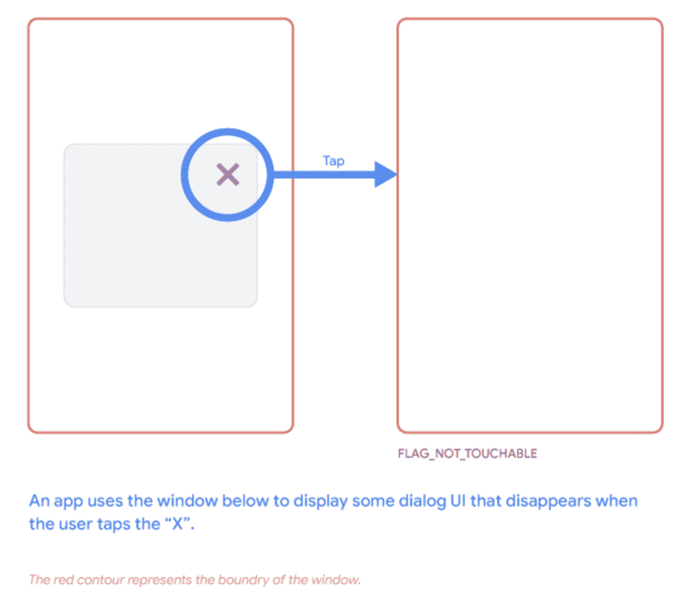
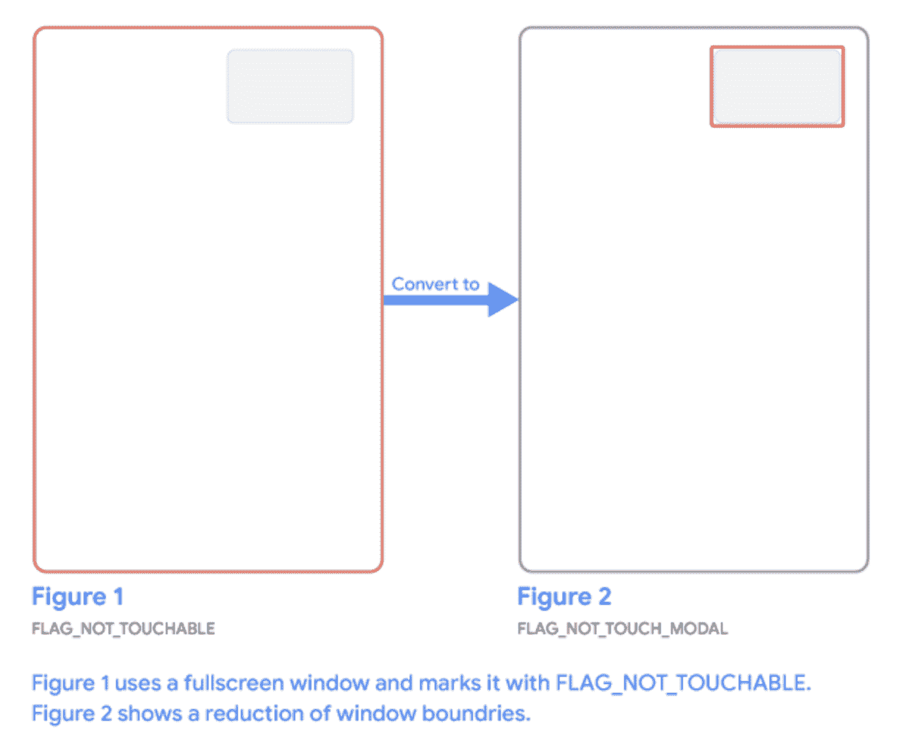
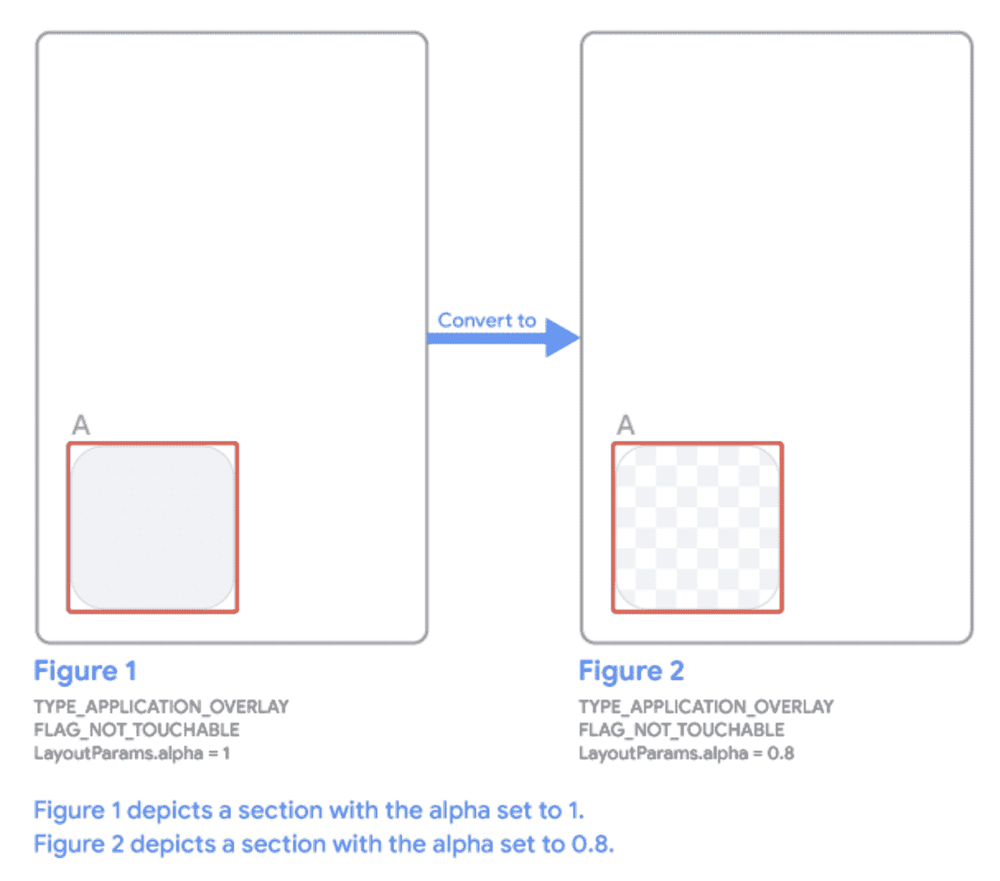

# Android 中的不可信触摸事件

> 原文：<https://medium.com/androiddevelopers/untrusted-touch-events-2c0e0b9c374c?source=collection_archive---------4----------------------->

在 Android 12 中，我们正在进行更改，以增强应用程序和平台的安全性，为我们的用户提供更安全的体验。在这篇文章之后，看看我们其他的关于安全和隐私的[博客文章](https://medium.com/androiddevelopers/tagged/android-privacy)。

触摸输入是 Android 中与应用程序交互的主要方式。Android 12 包括额外的措施，以确保触摸事件正确地传递到预期的应用程序，以确保直观和安全的 UX。具体来说，Android 12 防止触摸事件被传递到应用程序，如果这些触摸通过不同应用程序的窗口。这种行为变化适用于 Android 12 上运行的所有应用程序，无论“targetSdkVersion”如何。这有助于确保用户可以看到他们正在交互的内容。请继续阅读，了解替代方案，看看您的应用程序是否会受到影响，以及如何测试它。

# 尽可能使用特殊用途的 API

在检查您的用例是否受到影响之前，最好评估一下您的应用程序是否可以利用 Android 中的以下 API 之一。这些易于使用的 API 使您不必担心这些限制，因为它们部分由系统控制，因此是可信的。请考虑以下情况:

*   [气泡](https://developer.android.com/guide/topics/ui/bubbles):气泡漂浮在其他应用程序内容的顶部，跟随用户到任何地方，并且可以扩展以显示应用程序的功能和信息。
*   [画中画](https://developer.android.com/guide/topics/ui/picture-in-picture) (PIP):当用户在应用程序之间导航或浏览主屏幕上的内容时，PIP 允许应用程序在一个小窗口中显示内容，该窗口被钉在屏幕的一角。用户可以拖动画中画窗口，并可以点击它来扩大或关闭。
*   [通知](https://developer.android.com/guide/topics/ui/notifiers/notifications):通知是向用户提供提醒、来自其他人的消息或来自你的应用程序的其他及时信息的标准方式，同时最大限度地减少对设备使用的干扰。用户可以轻按通知来打开您的应用程序，或者直接从通知中采取操作。
*   [Snackbars](https://developer.android.com/reference/com/google/android/material/snackbar/Snackbar) 和[祝酒词](https://developer.android.com/guide/topics/ui/notifiers/toasts):如果你需要在你的应用程序中短时间显示一条消息，看看 [Snackbars](https://developer.android.com/reference/com/google/android/material/snackbar/Snackbar) 。如果你需要在你的应用程序处于后台时显示这条消息，看看[祝酒词](https://developer.android.com/guide/topics/ui/notifiers/toasts)是否适合你的用例。

如果您的用例符合这些 API 之一，那么强烈建议您使用它们。它们不仅更容易使用，更安全，而且用户已经熟悉了其中的大部分。

# 这对我有影响吗？

如果你的应用程序不能利用上面的 API 之一，并让触摸事件通过它的窗口，那么在 Android 12 上，它们可能不会像预期的那样通过底层。

示例包括但不限于以下内容:

*   使用`[FLAG_NOT_TOUCHABLE](https://developer.android.com/reference/android/view/WindowManager.LayoutParams#FLAG_NOT_TOUCHABLE)`的`[TYPE_APPLICATION_OVERLAY](https://developer.android.com/reference/android/view/WindowManager.LayoutParams?hl=zh-TW#TYPE_APPLICATION_OVERLAY)`类型的窗口。
*   使用`[FLAG_NOT_TOUCHABLE](https://developer.android.com/reference/android/view/WindowManager.LayoutParams#FLAG_NOT_TOUCHABLE)`的活动窗口。

如果您正在使用`[FLAG_NOT_TOUCHABLE](https://developer.android.com/reference/android/view/WindowManager.LayoutParams#FLAG_NOT_TOUCHABLE)`，您很可能会受到影响，除非您的用例属于以下豁免之一:

*   **应用程序内的互动**。覆盖图仅出现在您的应用程序上方。
*   **可信 windows** 。这些窗口包括(但不限于)[辅助窗口](https://developer.android.com/reference/android/view/WindowManager.LayoutParams?hl=zh-TW#TYPE_ACCESSIBILITY_OVERLAY)、[输入法编辑器(IME)窗口](https://developer.android.com/reference/android/view/WindowManager.LayoutParams?hl=zh-TW#TYPE_INPUT_METHOD)和[助手窗口](https://developer.android.com/reference/android/service/voice/VoiceInteractionSession)。
*   **隐形窗户**。窗口的根视图是[消失](https://developer.android.com/reference/android/view/View#GONE)或[不可见](https://developer.android.com/reference/android/view/View#INVISIBLE)。
*   **完全透明的窗户**。窗口的 [alpha](https://developer.android.com/reference/android/view/WindowManager.LayoutParams#alpha) 属性为 0.0。
*   **足够半透明的 TYPE_APPLICATION_OVERLAY 窗口**。窗口的类型为`[TYPE_APPLICATION_OVERLAY](https://developer.android.com/reference/android/view/WindowManager.LayoutParams#TYPE_APPLICATION_OVERLAY)`，其 [alpha](https://developer.android.com/reference/android/view/WindowManager.LayoutParams#alpha) 属性等于或小于`[InputManager.getMaximumObscuringOpacityForTouch()](https://developer.android.com/reference/android/hardware/input/InputManager#getMaximumObscuringOpacityForTouch())`。从开发人员预览版 3 开始，该值目前为 0.8，但在最终发布之前可能会有所变化。在这种类型的多个重叠窗口的情况下，使用它们的[组合不透明度](https://developer.android.com/reference/android/view/WindowManager.LayoutParams#combined-obscuring-opacity)。

如果您的用例不在上面的列表中，触摸将被阻止。如果这对你的用例有效，考虑移除`FLAG_NOT_TOUCHABLE`来移除让触摸通过的意图。如果你需要让触摸通过，你必须调整你的代码来适应上面的一个豁免。下一节将介绍必须改变的常见模式的示例:

# 具有透明背景且没有用户界面的窗口

在透明背景的窗口中显示一些 UI 的应用程序可以在某些时候在视图级别隐藏它们的 UI，同时添加`FLAG_NOT_TOUCHABLE`以便用户可以与后面的内容进行交互。

如上图所示，如果应用程序只是隐藏了用户界面，要么通过删除子视图，要么改变它们的可见性，并添加了`FLAG_NOT_TOUCHABLE`以便用户可以与后面的内容进行交互，这将不再适用于 Android 12(注意与之前提到的豁免的不同——这里我们改变的是内部视图，而不是窗口)，因为对后面其他应用程序的触摸将被阻止。在这种情况下，很容易解决这个问题；您可以:

*   使用`[WindowManager.removeView()](https://developer.android.com/reference/android/view/ViewManager#removeView(android.view.View))`移除窗口，传递根视图。
*   用根视图上的`[View.GONE](https://developer.android.com/reference/android/view/View#GONE)`或`[View.INVISIBLE](https://developer.android.com/reference/android/view/View#INVISIBLE)`调用`[View.setVisibility()](https://developer.android.com/reference/android/view/View#setVisibility(int))`使窗口不可见。
*   通过`[LayoutParams.alpha](https://developer.android.com/reference/android/view/WindowManager.LayoutParams#alpha)`设置窗口的不透明度为 0.0。

每当您需要再次显示该 UI 时，您只需反转上面的操作。

# 不必要的大窗户

应用程序可能希望显示一些小的 UI，同时仍然允许用户与窗口后面的内容进行交互。以前，一个应用程序可以通过简单地使用全屏窗口并用`FLAG_NOT_TOUCHABLE`标记它来实现，如图 1 所示:

请注意，在以前的操作系统版本中，通过实际 UI 元素的触摸在这种情况下会传递到后面的窗口。在这种情况下，第一个建议是查看一下 [Toast](https://developer.android.com/guide/topics/ui/notifiers/toasts) API，看看它是否符合您的目的。如果没有，这里的解决方案也很简单，如右图所示:您只需将窗口边界缩小到实际的 UI 并使用`[FLAG_NOT_TOUCH_MODAL](https://developer.android.com/reference/android/view/WindowManager.LayoutParams#FLAG_NOT_TOUCH_MODAL)`，此时您可能还想删除`FLAG_NOT_TOUCHABLE`。

现在你 UI 外的触摸会直接到后面的窗口，不会被遮挡。

# 半透明的窗户

如果你使用的是一个`TYPE_APPLICATION_OVERLAY`窗口，并且在显示内容时绝对需要让触摸通过它，你必须降低不透明度，这样用户才能合理地看到他们在窗口后面触摸的东西。

你必须在**窗口级别降低不透明度，**仅仅改变视图的不透明度是不起作用的。您可以使用`[LayoutParams.alpha](https://developer.android.com/reference/android/view/WindowManager.LayoutParams#alpha)`将不透明度降低到低于或等于`[InputManager.getMaximumObscuringOpacityForTouch()](https://developer.android.com/reference/android/hardware/input/InputManager#getMaximumObscuringOpacityForTouch())`的值，如右图所示。该值目前为 0.8，但在 Android 12 最终发布之前可能会有所变化。

现在，假设你的应用程序没有多个相互重叠的窗口，触摸将通过后面的窗口。关于重叠窗口的更多细节，请看 `[FLAG_NOT_TOUCHABLE](https://developer.android.com/reference/android/view/WindowManager.LayoutParams#FLAG_NOT_TOUCHABLE)`的[文档。](https://developer.android.com/reference/android/view/WindowManager.LayoutParams#FLAG_NOT_TOUCHABLE)

# 无障碍服务

作为一个连接的辅助功能服务，可以创建类型为`[TYPE_ACCESSIBILITY_OVERLAY](https://developer.android.com/reference/android/view/WindowManager.LayoutParams#TYPE_ACCESSIBILITY_OVERLAY)`的窗口，这些窗口是可信的，因此不受前面描述的限制。为了创建这样的窗口，只需使用您的`[AccessibilityService](https://developer.android.com/reference/android/accessibilityservice/AccessibilityService)`的上下文通过`[getSystemService()](http://getsystemservice)`获得一个`[WindowManager](https://developer.android.com/reference/android/view/WindowManager)`来创建所述窗口。

# 如何测试你的应用是否受到影响

如果触摸动作被系统阻止，您将在[日志目录](https://developer.android.com/studio/command-line/logcat?hl=zh-TW)中看到以下消息:由于被 PACKAGE_NAME 遮挡，触摸不可信。

# 后续步骤

如果您想了解更多关于[不可信触摸事件](https://developer.android.com/about/versions/12/behavior-changes-all?hl=zh-TW#untrusted-touch-events)及其[异常](https://developer.android.com/about/versions/12/behavior-changes-all?hl=zh-TW#untrusted-touch-events-exceptions)的信息，请查阅文档。

编码快乐！