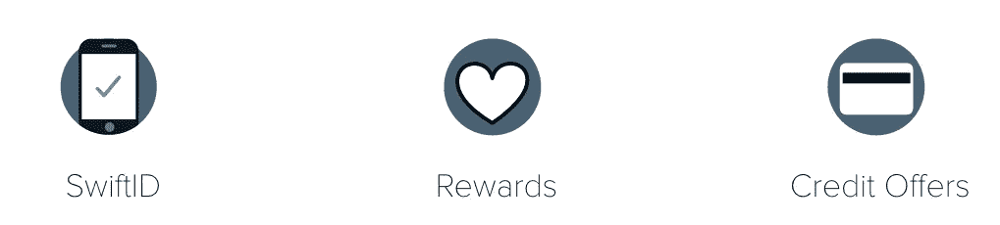

# 倾听——共同打造更好的产品

> 原文：<https://medium.com/capital-one-tech/upcoming-webinar-how-to-build-better-products-together-4796dc575274?source=collection_archive---------5----------------------->

正如我经常对我的团队提到的，DevExchange 的成功在于创造了一种激励共同创造的文化，并培养了一种平台思维。更具体地说，我的意思是，强大的平台思维使消费者能够随时随地访问数据，同时为创业公司和创新者创造一个与大型金融机构(如 Capital One)共同创造的空间。它还允许我们创造一些经验，这些经验是我们单靠内部资源无法开发的。这就是成为 DevExchange 基础的概念。

2016 年 3 月我们在 SXSW 开始 DevExchange 的时候。大多数 API 平台都有类似“开发者平台”的名字无聊！我们将我们的命名为 DevExchange，因为我们希望参与的每个人都明白，我们的平台和开发人员体验是围绕各种意义上的“交换”概念构建的——思想、信息和开源代码的交换。

但是，DevExchange 不仅仅是交换和沟通，它还涉及共同创造，或共同建设让消费者生活更轻松、世界更美好的事物。在 DevExchange 上，我们鼓励我们的合作伙伴、分支机构和初创公司一起创建应用程序和数字体验。在过去的一年中，我们开发了一些令人惊叹的东西，如[银行账户启动器](https://developer.capitalone.com/products/bank-account-starter/homepage/)，这是一个 API，允许代销商让他们的客户能够开立一个无费用、无最低限额或无附加条件的储蓄账户，而所有这些都无需离开代销商网站。我们也对[信用优惠](https://developer.capitalone.com/products/credit-offers/homepage/) API 感到非常兴奋，它返回 60 张以下的 Capital One 信用卡的个性化列表，所有这些都基于一些个人信息。此外，还有更多的东西等待着你，我知道你会对此感到兴奋。

那么，2017 年[交易所](http://www.developer.capitalone.com/)的前景如何？我们有一个很长的增强列表，但让我分享一些您将在平台上看到的亮点，如联合开发环境、早期采用者预览计划、专业服务的额外帮助以及联合合作伙伴营销。我们还计划在 Capital One 内部开展一些额外的共同创造项目，以便我们的开发人员能够为我们的 API 卓越中心和 DevExchange Inside 做出贡献，DevExchange Inside 是一个内部门户网站，我们的工程师可以在这里就 API 设计和文档功能进行协作。甚至会有一个社区区域，开发者可以在那里提交想法，提出问题，并为我们将在 SXSW 上宣布的合作音乐平台做出贡献。

很高兴与 David 和我们的网上研讨会观众讨论这些话题。如果您没有机会观看我们的网上研讨会，或者您只是想再体验一次— [**请查看活动页面，您可以在这里登录观看网上研讨会的录像。**](https://event.on24.com/eventRegistration/EventLobbyServlet?target=reg20.jsp&referrer=&eventid=1366654&sessionid=1&key=AC5E41A95B30868E6B9B2CB25CB9B9B4&regTag=&sourcepage=register)

秃头怪胎

