# 动态更新从主数据库到备用数据库的 Oracle 集成云连接

> 原文：<https://medium.com/oracledevs/update-oracle-integration-cloud-connection-from-primary-to-standby-database-dynamically-515626f983c5?source=collection_archive---------1----------------------->


# 介绍

在 Oracle Data Guard 架构中，手动切换或自动故障转移到备用实例是一项简单的活动，但是更改应用程序实例中的端点(如 Oracle integration cloud connection)需要手动操作。

假设我们在区域 1 中有一个 Oracle 集成云(OIC)实例，它连接到同一区域中的一个自治事务处理实例。已经配置了 Data guard，并在区域二中提供了一个备用数据库。如果发生任何未计划的(或计划的)故障转移或从主实例到备用实例的切换，应用程序仍然指向区域一中的 ATP 实例。在这种情况下，OIC 管理员应该在 OIC 的 ATP 连接器的区域二中手动上传 ATP 例程的 ATP wallet 文件。

但是，在午夜自动故障转移的情况下，管理员将在收到 OIC 中大量失败的集成后得到通知。

在本文中，我将解释如何在故障转移或切换完成后，在 OIC 中自动更新 ATP 连接。

我将使用一些云的原生特性，如 OCI 事件和函数来实现这个解决方案。

# 体系结构

下面是实施该解决方案的建议架构。

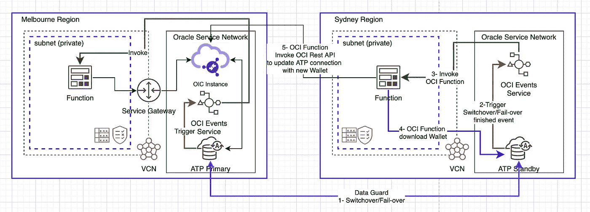

在这个架构中，我在墨尔本地区有一个 OIC 实例，在墨尔本地区有一个主 ATP(自主事务处理)实例，在悉尼地区有一个备用 ATP 实例。

流程如下:

1.  手动触发数据库切换/故障转移。
2.  切换/故障转移完成后，ATP 将触发 OCI 事件服务中的事件。
3.  OCI 事件服务将调用 OCI 函数。
4.  OCI 功能将从新的主要例程中下载 ATP Wallet 文件。
5.  OCI 函数调用 OIC rest API 在数据库连接中加载 ATP wallet。

# 履行

我不打算讨论实施步骤的细节，因为我假设您有使用 OCI 和 Oracle 集成云的经验。

以下是实施步骤的高级列表:

## 墨尔本地区的伊斯兰会议组织实例

激活您的 OCI 租赁后，您只需导航到开发人员服务并提供一个新的 OIC 实例(或者，如果您的租赁中已经有一个实例，您可以使用现有的 OIC 实例)。

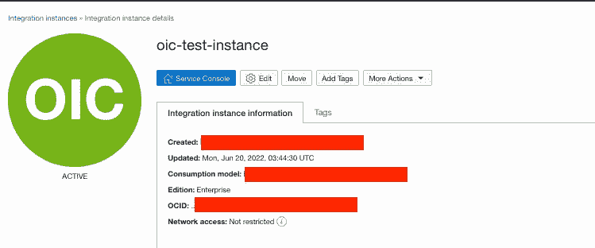

## 供应 ATP 实例

在墨尔本地区供应 ATP 实例(具有最低规格)。为了简单起见，我提供了公共实例，但是如果您愿意，也可以使用私有实例。

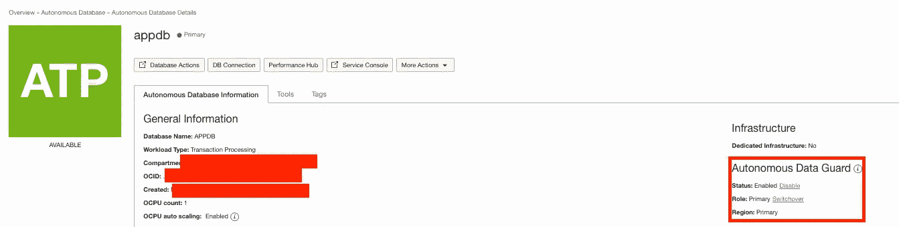

## 创建数据保护

在供应主实例之后，我将在悉尼地区创建一个数据防护(备用实例)。

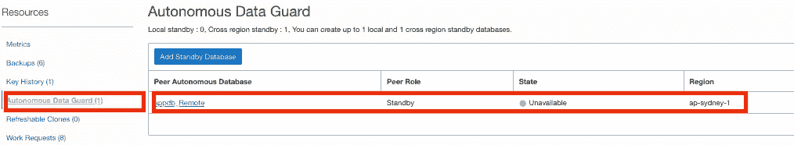

## 在 OIC 中创建 ATP 连接和简单集成

现在，我将在 ATP 主实例中创建一个样本表(包含一些样本数据)来测试我的集成，并且我将使用 ATP 适配器在 OIC 中创建一个到 ATP 主实例的连接。

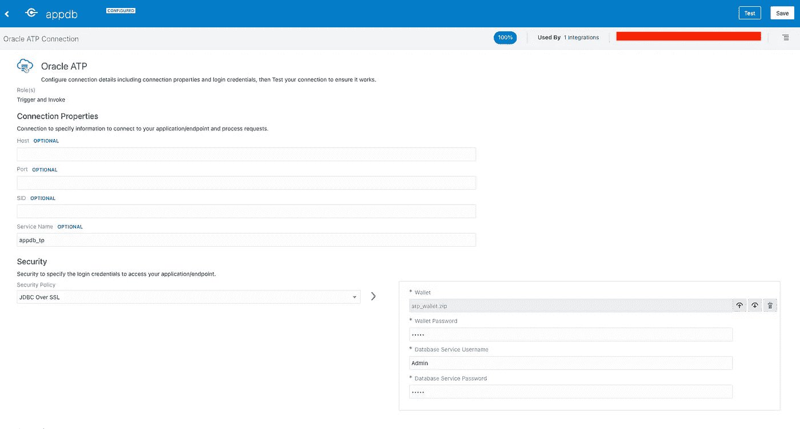

**注意**:我们应该在主实例和备用实例中使用相同的钱包密码。

最后，我将创建一个示例集成，由简单的 Rest 连接触发，并在 ATP 实例中执行查询(通过 ATP 连接)来检索数据。

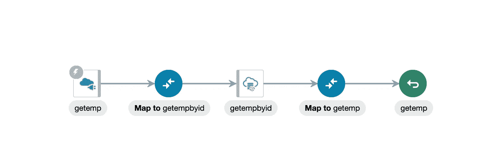

我将测试集成，以确保一切按预期工作…

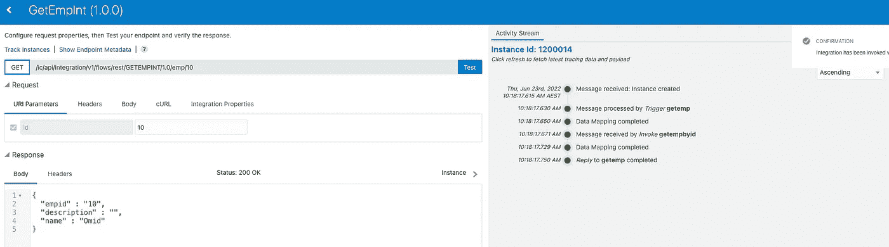

## 手动触发切换到备用实例

现在，为了测试该流程，我将在备用实例中手动触发切换。

您只需要导航到备用实例并触发切换或故障转移。

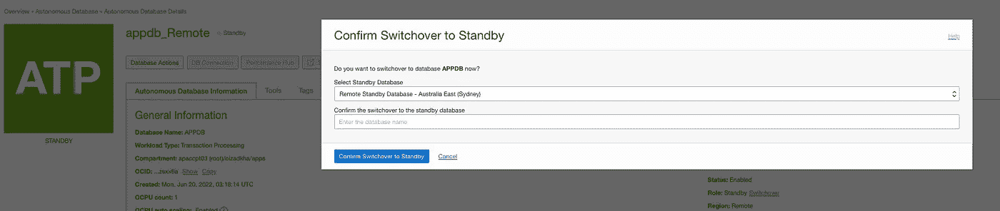

几分钟后，您将看到数据库角色将发生变化，并且您可以在 OIC ATP 连接中看到更新。

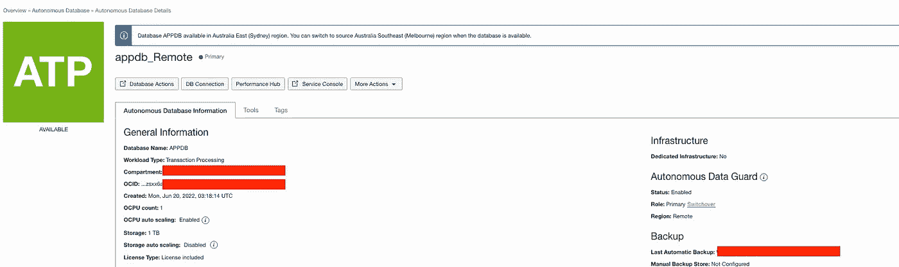

现在，我将更详细地解释如何实现 OCI 事件和函数。

首先，我们需要在两个地区(悉尼和墨尔本)创建一个应用程序，并使用以下命令在该应用程序中创建和部署 OCI 函数。

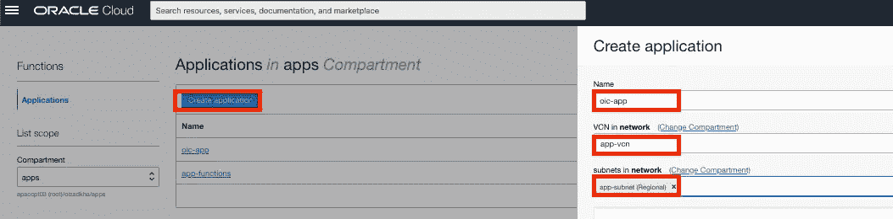

要执行该命令，您可以使用云 shell 或在您的本地机器上配置 OCI CLI(您也应该为悉尼地区重复相同的命令)。

```
fn use context ap-melbourne-1fn update context oracle.compartment-id <Compartment OCID>fn update context registry mel.ocir.io/<Tenancy Namespace>/[repo-name-prefix]docker login -u '[<Tenancy Namespace>/](mailto:apaccpt03/oracleidentitycloudservice/omid.izadkhasti@oracle.com)<Username>' mel.ocir.io
#You should create Auth Token for your OCI user and use it as docker login passwordfn init --runtime python db-switchover-fn #you can use any language that you like. java, node.js, ..cd db-switchover-fn
```

在 Oracle Container Registry (OCIR)中部署函数之前，您应该使用以下代码更新函数代码(func.py ):

并使用以下行更新 requirements.txt 文件:

```
fdk>=0.1.46
oci>=2.21.2
requests
```

最后，使用以下命令部署该功能:

```
fn -v deploy --app oic-app
```

要在事件流程之外测试函数，您可以创建以下事件负载并执行以下命令进行测试:

该功能接受一些参数作为配置，您需要在 OCI 控制台的功能配置中进行设置。

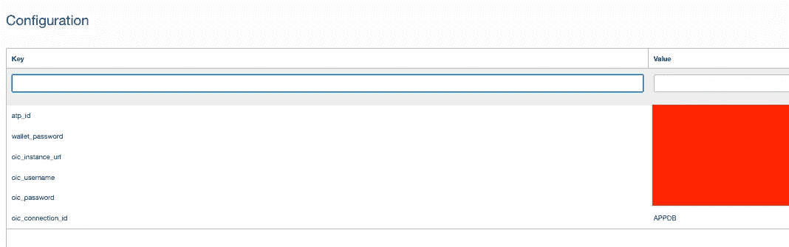

最后，在调用该函数之前，确保在 OCI IAM 中为此函数创建一个动态组，如下所示:

```
ALL {resource.type = 'fnfunc', resource.compartment.id =  'ocid1.compartment.oc1..xxxxx'}
```

此外，为此动态组创建一个策略，以允许从 ATP 实例下载 wallet。

```
cat event.json | fn invoke oic-app db-switchover-fn
```

最后一步是在两个区域中创建事件规则，如下所示:

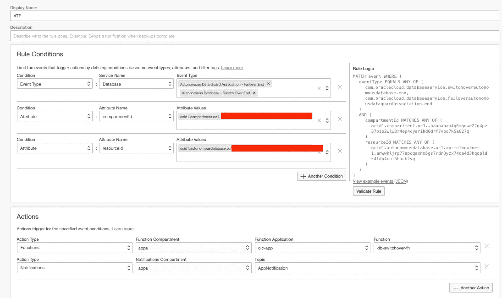

在此事件规则中，事件类型为“自治数据保护关联—故障转移结束”和“自治数据保护关联—切换结束”。

此外，我们还有另外两个属性“隔离专区标识”和“资源标识”,只为选定的 ATP 例程引发此事件。

最后，在动作部分，我们使用了上一步开发的 OCI 函数。

全部完成！

这是修复动态故障转移问题的快速解决方案。您可以对该实现进行大量改进，例如使用 terraform 来提供基础设施，并将函数的凭证(OIC 和 Wallet 凭证)放入 OCI 秘密中，将秘密 OCID 传递给函数，函数在运行时检索凭证，或者使用 OAuth 代替基本认证来执行 OIC rest API，等等。

我希望这篇文章能帮助你得到一些实现你的解决方案的想法。

## 参考

OCI 事件:[https://docs . Oracle . com/en-us/iaas/Content/Events/Concepts/Events overview . htm](https://docs.oracle.com/en-us/iaas/Content/Events/Concepts/eventsoverview.htm)

OCI 函数:[https://docs . Oracle . com/en-us/iaas/Content/Functions/home . htm](https://docs.oracle.com/en-us/iaas/Content/Functions/home.htm)

OIC Rest API:[https://docs . Oracle . com/en/cloud/PAAs/integration-cloud/Rest-API/op-IC-API-integration-v1-connections-id-post . html](https://docs.oracle.com/en/cloud/paas/integration-cloud/rest-api/op-ic-api-integration-v1-connections-id-post.html)

https://docs.oracle.com/en-us/iaas/tools/python/2.72.0/ OCI 蟒蛇 JDK:

让我们在我们的[面向开发者的公共 Slack】上讨论一下吧。](https://bit.ly/devrel_slack)

此外，[如果您还没有注册，请注册我们的免费等级](https://signup.cloud.oracle.com/?language=en&sourceType=:ex:tb:::::&SC=:ex:tb:::::&pcode=)来尝试一些东西。