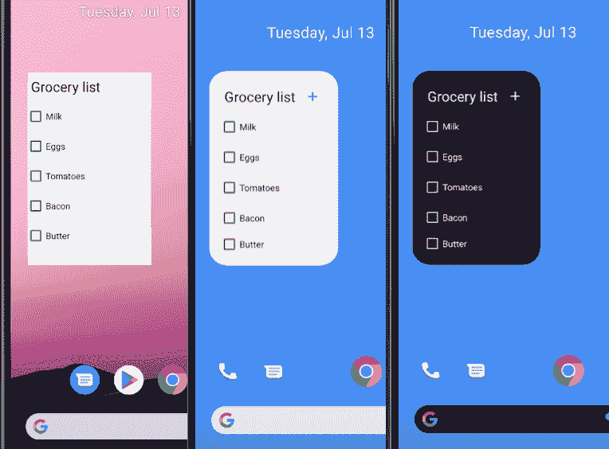
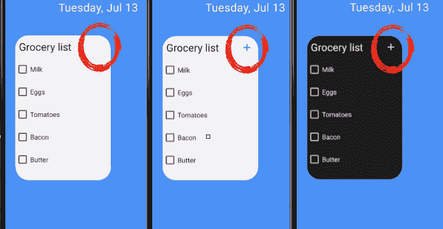
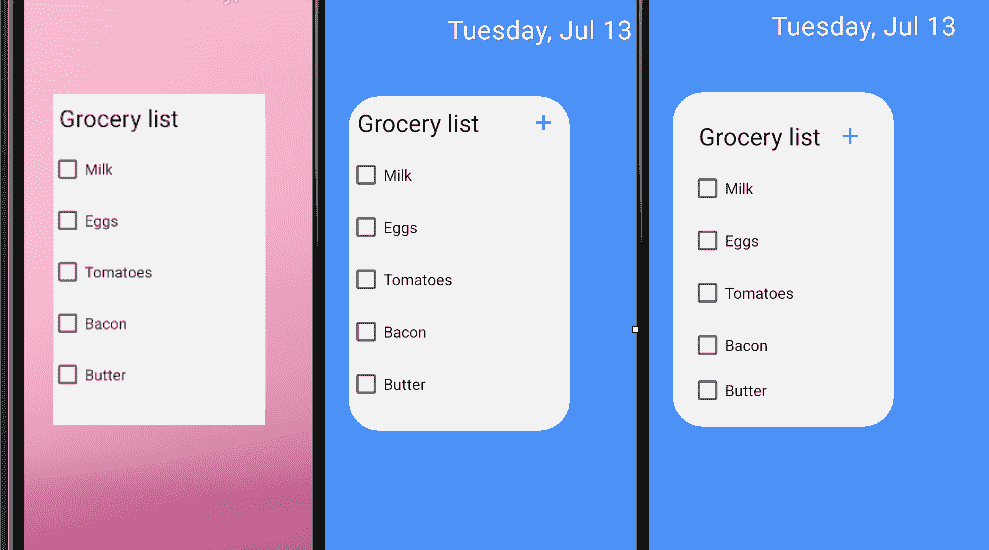
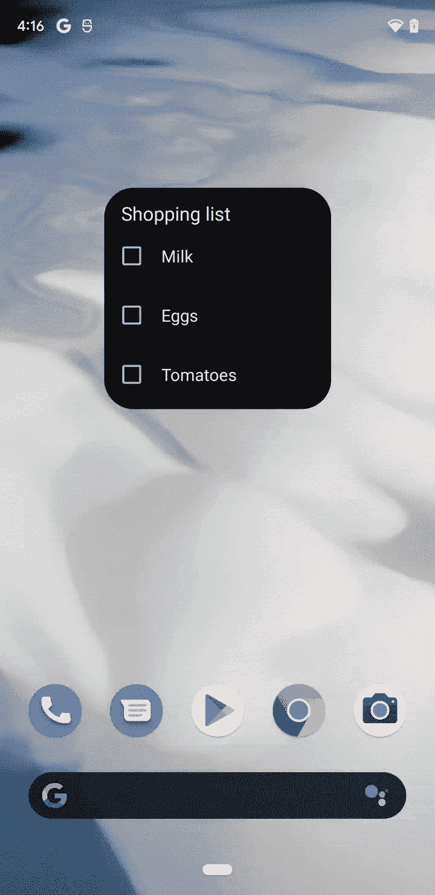
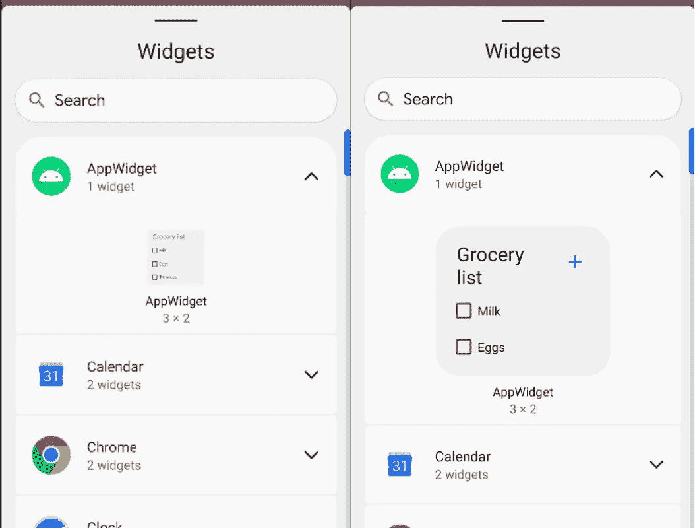
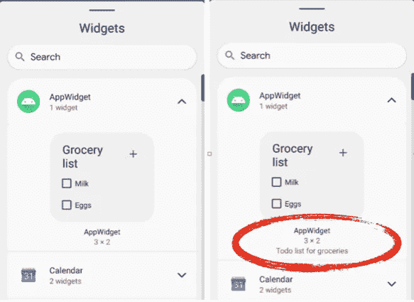

# 为 Android 12 更新您的 widget

> 原文：<https://medium.com/androiddevelopers/updating-your-widget-for-android-12-92e7de87424c?source=collection_archive---------1----------------------->


长期以来，微件一直是 Android 核心体验的一部分，许多应用程序有效地使用微件来增加用户参与度。用户喜欢小工具，因为它能够在不启动应用程序的情况下使用应用程序功能，并定制他们设备的主屏幕。

Android 12 对现有的 widget APIs 进行了更新，并修改了 widget 的设计，以符合“ [Material You](https://material.io/blog/announcing-material-you) ”设计语言。这些变化允许您构建更好看的小部件，这些小部件使用设备主题颜色和圆角，同时增强搜索和放置小部件的可发现性和视觉效果。



Before changes (Android 11) vs. after changes with light and dark theme (Android 12)

在这个迷你系列文章中，我们将看看如何为 Android 12 更新您的小部件。在这一部分，我们将看到一些简单的变化，这将使您的小工具在运行 Android 12 的设备上看起来很棒，同时也提供了在旧版本 Android 上的一致体验。在第二部分中，我们将看看新的 API，它们将使您的小部件更加个性化，响应更快，并提供更多的交互性。

# 视觉变化

毫无疑问，风格和设计的变化是用户最容易看到的。更新视觉元素，如颜色和圆角半径，可立即呈现更清新的外观。要开始实施这些更改，我们建议创建一个自定义主题。

## 添加动态颜色

[Material You](https://www.youtube.com/watch?v=rLKtIGY2Mgc) 旨在提供更加个性化的用户体验。在 Android 12 中，动态颜色可以让您的小部件与其他小部件和系统更加一致。小部件可以使用系统的默认主题`Theme.DeviceDefault.DayNight`，并在小部件的 UI 元素上使用主题颜色属性。

为此，您需要为低于 31 的版本从父级`DeviceDefault`创建一个自定义主题。

```
[*values/themes.xml*](https://github.com/android/user-interface-samples/blob/main/AppWidget/app/src/main/res/values/themes.xml)<!-- Copyright 2019 Google LLC.
SPDX-License-Identifier: Apache-2.0 --><style name="Theme.AppWidget.AppWidgetContainer" 
    parent="@android:style/Theme.DeviceDefault" />
```

对于版本 31，使用父主题`DeviceDefault.DayNight`创建一个自定义主题。

```
[*values-v31/themes.xml*](https://github.com/android/user-interface-samples/blob/main/AppWidget/app/src/main/res/values-v31/themes.xml)<!-- Copyright 2019 Google LLC.
SPDX-License-Identifier: Apache-2.0 --><style name="Theme.AppWidget.AppWidgetContainer"  
    parent="@android:style/Theme.DeviceDefault.DayNight" />
```

> 或者，如果你的应用程序使用材料组件，你可以使用`Theme.MaterialComponents.DayNight`而不是`Theme.DeviceDefault`作为基本主题。

要让您的小部件动态采用系统颜色，请将该主题分配给您的小部件，并在其他视图上使用主题颜色属性。

```
[*layout/widget_checkbox_list_title_region.xml*](https://github.com/android/user-interface-samples/blob/main/AppWidget/app/src/main/res/layout/widget_checkbox_list_title_region.xml)<!-- Copyright 2019 Google LLC.
SPDX-License-Identifier: Apache-2.0 -->...
<TextView android:id="@+id/checkbox_list_title"
    android:layout_width="0dp"
    android:layout_height="wrap_content"     
    android:layout_gravity="center_vertical" 
    android:layout_marginStart="8dp" 
    android:layout_weight="1" 
    android:text="@string/grocery_list" 
    android:textColor="**?android:attr/textColorPrimary**" /><ImageButton
    android:layout_width="@dimen/widget_element_min_length"
    android:layout_height="@dimen/widget_element_min_length"
    android:background="?android:attr/selectableItemBackground"
    android:clickable="true"
    android:contentDescription="@string/add_button_grocery_list_content_description"
    android:src="@drawable/ic_add_24"
    android:tint="**?android:attr/colorAccent**" />**...**
```



Static colors vs. dynamic colors in light/dark theme

## 圆角

从 Android 12 开始，圆角自动应用于小部件。这意味着小部件的内容可能会被应用的角遮罩剪掉。为了避免这种情况，并为其他小部件和系统提供更一致的外观和用户体验，您可以使用`[system_app_widget_background_radius](https://developer.android.com/reference/android/R.dimen#system_app_widget_background_radius)`为小部件的轮廓添加圆角，使用`[system_app_widget_inner_radius](https://developer.android.com/reference/android/R.dimen#system_app_widget_inner_radius)`为小部件内的视图添加圆角。这个值应该比`system_app_widget_background_radius`小 8dp。

在这样做的时候，请记住，如果您的小部件在其角落附近有内容，这些内容可能会被裁剪。要解决这个问题，您需要添加足够的填充，以避免小部件的内容与圆角发生冲突。

```
[*values/attrs.xml*](https://github.com/android/user-interface-samples/blob/main/AppWidget/app/src/main/res/values/attrs.xml)<!-- Copyright 2019 Google LLC.
SPDX-License-Identifier: Apache-2.0 --><declare-styleable name="AppWidgetAttrs">
    <attr name="**appWidgetPadding**" format="dimension" />    
    <attr name="**appWidgetInnerRadius**" format="dimension" />
    <attr name="**appWidgetRadius**" format="dimension" />
</declare-styleable>[*values/themes.xml*](https://github.com/android/user-interface-samples/blob/main/AppWidget/app/src/main/res/values/themes.xml)<!-- Copyright 2019 Google LLC.
SPDX-License-Identifier: Apache-2.0 --><style name="Theme.AppWidget.AppWidgetContainerParent" 
    parent="@android:style/Theme.DeviceDefault"> <!-- Radius of the outer bound of widgets to make the rounded   
        corners -->
    <item name="**appWidgetRadius**">**16dp**</item>
    <!-- Radius of the inner view's bound of widgets to make the rounded corners. It needs to be 8dp or less than the value of appWidgetRadius -->
    <item name="**appWidgetInnerRadius**">**8dp**</item>
</style><style name="Theme.AppWidget.AppWidgetContainer" 
    parent="Theme.AppWidget.AppWidgetContainerParent"> <!-- Apply padding to avoid the content of the widget colliding with the rounded corners -->
    <item name="**appWidgetPadding**">**16dp**</item>
</style>[*values-v31/themes.xml*](https://github.com/android/user-interface-samples/blob/main/AppWidget/app/src/main/res/values-v31/themes.xml)<!-- Copyright 2019 Google LLC.
SPDX-License-Identifier: Apache-2.0 --><style name="Theme.AppWidget.AppWidgetContainerParent" 
    parent="@android:style/Theme.DeviceDefault.DayNight"> 
    <item name="**appWidgetRadius**">
        @android:dimen/**system_app_widget_background_radius**</item>      
    <item name="**appWidgetInnerRadius**">
        @android:dimen/**system_app_widget_inner_radius**</item>
</style>[*values/styles.xml*](https://github.com/android/user-interface-samples/blob/main/AppWidget/app/src/main/res/values/styles.xml)<!-- Copyright 2019 Google LLC.
SPDX-License-Identifier: Apache-2.0 --><style name="Widget.AppWidget.AppWidget.Container" 
    parent="android:Widget">
    <item name="android:id">@android:id/background</item>
    <item name="android:background">
        ?android:attr/colorBackground</item>
</style>
```

> 如果你的`minTargetSDK`低于版本 21，你需要提供版本 21 的样式，因为 drawables 中使用的`android:attr/colorBackground` 需要 API 等级 21。

现在您已经创建了一个主题，您可以在小部件的布局上设置样式。

```
[*layout/widget_grocery_list.xml*](https://github.com/android/user-interface-samples/blob/main/AppWidget/app/src/main/res/layout/widget_grocery_list.xml)<!-- Copyright 2019 Google LLC.
SPDX-License-Identifier: Apache-2.0 --><LinearLayout
    **style="@style/Widget.AppWidget.AppWidget.Container"**>
    ...
</LinearLayout>
```



Before vs. automatic corner masking vs. rounded corners and applied padding

## 过渡

当一个应用程序从一个小部件启动时，Android 12 提供了改进的过渡。这种过渡由系统自动处理，不会在旧版本的 Android 上显示。要实现这一点，您需要在小部件布局的根元素上指定一个`id`，并将其值设置为`android:id/background`。

```
<LinearLayout
    **android:id="@android:id/background"**>
    ...
</LinearLayout>
```



Transition in slow motion

如果您的小部件使用[广播蹦床](https://developer.android.com/about/versions/12/behavior-changes-12?hl=ca#notification-trampolines)，这意味着您的小部件在用户点击时创建一个`PendingIntent`来启动来自广播接收器或服务的活动，则该动画将不会被使用。

# 新的小部件选择器改进

## 试映

Android 12 有一个新的改进的小工具选择器。新的小部件选择器使用 XML 布局来动态创建小部件的缩放预览，而不是使用静态的可绘制资源。

如果您的小部件不包含动态元素，如`ListView`或`GridView`，您可以简单地使用小部件的布局进行预览。

要做到这一点，您需要将默认值直接设置为原始布局。

```
<!-- Copyright 2019 Google LLC.
SPDX-License-Identifier: Apache-2.0 --><TextView
    style="@style/Widget.AppWidget.Checkbox"
    android:layout_width="match_parent"
    android:layout_height="wrap_content"
    android:text="**@string/widget_title_preview**" /><TextView
    style="@style/Widget.AppWidget.Checkbox"
    android:layout_width="match_parent"
    android:layout_height="wrap_content"
    android:text="**@string/widget_subject_preview**" />
```

在布局上设置默认值可能会导致在应用真实值之前显示假占位符值的轻微延迟。为了防止这种情况，您也可以为预览创建一个单独的布局文件，并应用自定义预览主题。

```
<!-- Copyright 2019 Google LLC.
SPDX-License-Identifier: Apache-2.0 --><resources>
    <!-- Declare attributes -->
    <attr name="**widgetTitlePreview**" format="string" />
    <attr name="**widgetSubjectPreview**" format="string" /> <!-- Declare styles -->
    <style name="Theme.MyApp.Widget" 
        parent="@style/Theme.DeviceDefault.DayNight.AppWidget">
        <item name="**widgetTitlePreview**"></item>
        <item name="**widgetSubjectPreview**"></item>
    </style> <style name="**Theme.MyApp.Widget.Preview**">
        <item name="**widgetTitlePreview**">Preview Title</item>
        <item name="**widgetSubjectPreview**">Preview Subject</item>
    </style>
</resources>
```

一旦有了预览主题，您就可以将它应用到布局中的预览项目。

```
*layout/my_widget_preview.xml* <!-- Copyright 2019 Google LLC.
SPDX-License-Identifier: Apache-2.0 --><LinearLayout ...>
    <include layout="@layout/widget_header"
         android:theme=”**@style/Theme.MyApp.Widget.Preview**” /></LinearLayout>*layout/my_widget_actual.xml*<LinearLayout ...>
    <include layout="@layout/widget_header"
        android:theme=”**@style/Theme.MyApp.Widget**” />
</LinearLayout>
```

最后，您需要设置小部件的布局，以指定为`appwidget-provider`的`previewLayout`属性。

```
[xml/*app_widget_info_checkbox_list.xml*](https://github.com/android/user-interface-samples/blob/main/AppWidget/app/src/main/res/xml/app_widget_info_checkbox_list.xml)<!-- Copyright 2019 Google LLC.
SPDX-License-Identifier: Apache-2.0 --><appwidget-provider
    **android:previewLayout="@layout/widget_grocery_list"** ... 
/>
```



Static preview vs. scaled preview

对于显示在`ListView`、`GridView`或`Stack`中的多个项目，无法直接在布局上设置默认值。在这种情况下，您可以为小部件预览创建另一个布局，并在该布局中设置多个硬编码项目。

这样做时，最好不要复制整个布局，而是使用`<include>`标签来重用使用默认值的布局部分。您可以将这个新布局设置为`appwidget-provider`的`previewLayout`属性。

## 描述

您还可以设置`description`属性来提供要在小部件选择器中显示的描述。虽然这是可选的，但是提供描述可以帮助用户更好地理解您的小部件可以做什么。

```
*app_widget_info_checkbox_list.xml*<!-- Copyright 2019 Google LLC.
SPDX-License-Identifier: Apache-2.0 --><appwidget-provider
   **android:description**="**@string/app_widget_grocery_list_description**"
   ... 
/>
```



Widget description

# 摘要

这并不太难，是吗？在这篇文章中，你看到了如何更新你的小部件的设计，并在小部件选择器中提供更好的用户体验。开始为 Android 12 更新你的小工具，这些都是非常容易的，你的用户会立即注意到视觉上的不同。

但是，这还不是全部。在下一篇文章中，我们将看看新的 API，它们将使您的小部件更加个性化，响应更快，并提供更多的交互性。