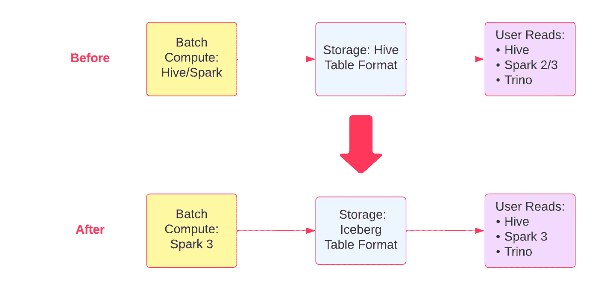
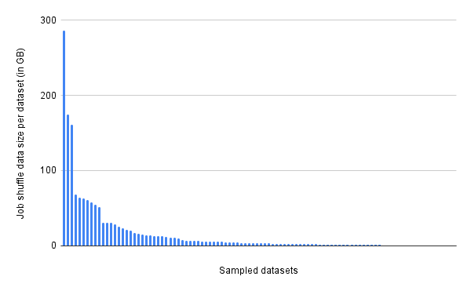
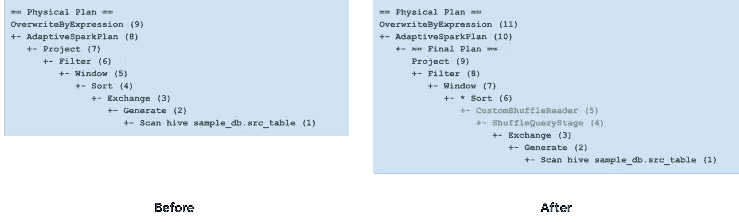
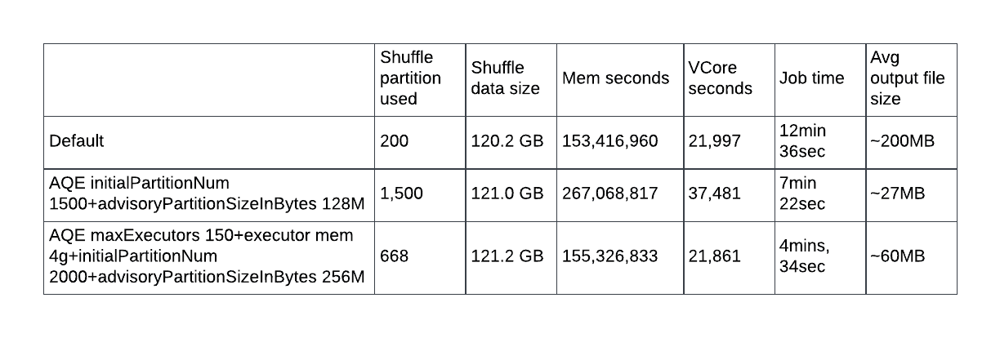
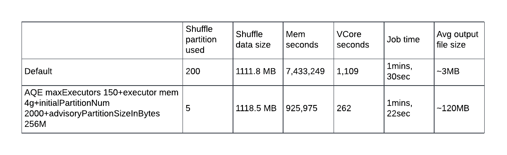
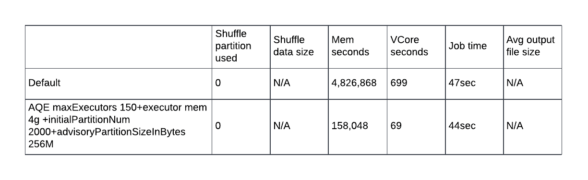
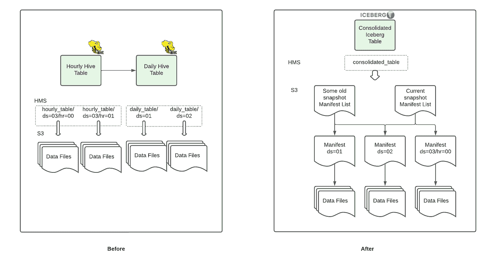
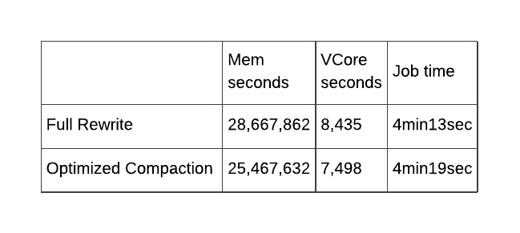
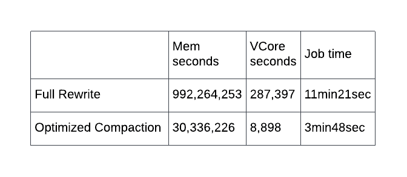

# 升级 Airbnb 的数据仓库基础设施

> 原文：<https://medium.com/airbnb-engineering/upgrading-data-warehouse-infrastructure-at-airbnb-a4e18f09b6d5?source=collection_archive---------0----------------------->

本博客旨在介绍 Airbnb 将数据仓库基础设施升级到 Spark 和 Iceberg 的经验。

由:[罗尼·朱](https://www.linkedin.com/in/huirong-ronnie-zhu-97b0a980/)，[埃德加·罗德里格斯](https://www.linkedin.com/in/edgarrd/)，[杰森·徐](https://www.linkedin.com/in/qiang-jason-xu-7101b025/)，[古斯塔沃·托雷斯](https://www.linkedin.com/in/gustavo-torres-torres/)，[克里姆·奥克泰](https://www.linkedin.com/in/kerimoktay)，[徐张](https://www.linkedin.com/in/zhangxu325/)

# 介绍

在这篇博客中，我们将介绍我们将数据仓库基础设施升级到 Spark 3 和 Iceberg 的动机。我们将简要描述 Airbnb 数据仓库基础设施的现状和面临的挑战。然后，我们将分享我们从升级一个关键生产工作负载中获得的经验:事件数据摄取。最后，我们将分享结果和经验教训。

# 语境

Airbnb 的数据仓库(DW)存储之前从传统的 [HDFS 集群](/airbnb-engineering/data-infrastructure-at-airbnb-8adfb34f169c)迁移到 S3，以提供更好的稳定性和可扩展性。虽然我们的团队一直在不断提高在 S3 处理数据的工作负载的可靠性和稳定性，但这些工作负载及其所依赖的基础架构的某些特征带来了用户经常遇到的可扩展性和工作效率限制。

## 挑战

## Hive Metastore

随着分区数量的增加，Hive 后端 DBMS 的负载已经成为一个瓶颈，分区操作的负载也是如此(例如，查询数千个分区以获得一个月的数据)。作为一种变通方法，我们通常添加一个每日聚合阶段，并为不同时间粒度(例如每小时和每天)的查询保留两个表。为了节省存储空间，我们将当天的 Hive 表限制为短期保留(三天)，而将每日表保留更长时间(几年)。

## 蜂巢/S3 互动

Hive 最初不是为对象存储而设计的。相反，在实现重命名和文件列表等功能时，围绕 HDFS 做了许多假设。因此，当我们从 HDFS 迁移到 S3 时，需要一定的保证来确保数据集在写入后列表操作中是一致的。我们定制了 Hive 写入 S3 的方式，首先写入 HDFS 临时集群，然后通过优化的 distcp 进程将数据移动到 S3，该进程在提交阶段写入唯一的位置，将文件列表信息存储在单独的存储中以便快速访问。这一过程在过去两年中表现良好，但它需要额外的群集资源来运行。

## 图式进化

在 Airbnb，我们使用三个计算引擎来访问我们数据仓库中的数据:Spark、Trino 和 Hive。由于每个计算引擎处理模式更改的方式不同，对表模式的更改几乎总是会导致数据质量问题，或者需要工程师执行代价高昂的重写。

## 分割

Hive 表由固定列分区，分区列不能轻易更改。如果需要对数据集进行重新分区，必须创建一个新表并重新加载整个数据集。

# 新数据堆栈

这些挑战促使我们将我们的数据仓库基础设施升级到基于 Iceberg 和 Spark 3 的新堆栈，这解决了这些问题，并提供了可用性改进。

## 冰山

Apache Iceberg 是一种表格格式，旨在解决传统的基于文件系统的数据仓库存储格式(如 Hive)的一些缺点。Iceberg 旨在为大型分析表提供高性能读取，具有可序列化隔离、基于快照的时间旅行和可预测的模式演变等特性。一些重要的冰山特征有助于应对前面提到的一些挑战:

*   分区信息不存储在配置单元 metastore 中，因此消除了 metastore 的大量负载。
*   Iceberg 表不需要 S3 列表，这消除了写后列表一致性要求，从而消除了对额外 discp 作业的需要，并完全避免了列表操作的延迟。
*   在 [Iceberg spec](https://iceberg.apache.org/spec/#schema-evolution) 中定义了一致的表模式，这保证了跨计算引擎的一致行为，避免了更改列时的意外行为。

## 火花 3

[Apache Spark](https://spark.apache.org/) 已经成为过去 10 年大数据处理事实上的标准。Spark 3 是 2020 年发布的一个新的主要版本，它有一长串的功能——新功能、错误修复和性能改进。这里我们重点介绍自适应查询执行(AQE );你可以在[数据博客](https://databricks.com/blog/2020/06/18/introducing-apache-spark-3-0-now-available-in-databricks-runtime-7-0.html)上找到更多信息。

AQE 是一种查询优化技术，它使用运行时统计信息来优化 Spark 查询执行计划。这解决了 Spark 基于成本的优化的最大难题之一——在查询开始之前收集的不准确的统计数据通常会导致次优的查询计划。随着查询的运行，AQE 将找出数据特征并改进查询计划，从而提高查询性能。

Spark 3 也是冰山采用的先决条件。使用 Spark SQL 的 Iceberg 表读写支持只在 Spark 3 上可用。

下图显示了我们所做的更改:

***Figure 1.*** *Evolution of data compute and storage tech stack*

# 生产案例研究—数据摄取

在 Airbnb，基于 Hive 的数据摄取框架每天处理超过 350 亿条 Kafka 事件消息和 1，000 多个表格，并将从千字节到万亿字节的数据集放入每小时和每天的分区中。不同规模的数据集的数量和覆盖范围以及时间粒度要求使该框架成为从我们的 Spark+Iceberg 技术堆栈中受益的良好候选。

# 火花 3

迁移到前面提到的 Spark+Iceberg 计算技术堆栈的第一步是将我们的 Hive 查询迁移到 Spark。这带来了新的挑战:火花调谐。与依赖于数据量统计的 Hive 不同，Spark 使用预设的洗牌分区值来确定任务分割大小。因此，在 Spark 上调优事件数据摄取框架时，选择适当数量的混洗分区成为一大挑战。不同事件的数据量变化很大，并且一个事件的数据大小也随着时间而变化。图 2 显示了处理 100 个不同类型事件的样本的 Spark 作业的 shuffle 数据大小的高方差。

**Figure 2.** High variance of raw data size of 100 randomly sampled events; each bar represents a single dataset

对于摄取框架中的所有事件，没有固定数量的混洗分区能够很好地工作；如果我们为所有的摄取作业选择一个固定的数字，那么这个数字对于某些作业来说可能太大，而对于另一些作业来说又太小，这两种情况都会导致低性能。当我们探索不同的解决方案来调整 shuffle 分区参数时，我们发现自适应查询执行可能是一个完美的解决方案。

## AQE 如何提供帮助？

在 Spark 3.0 中，AQE 框架附带了几个关键特性，包括动态切换连接策略和动态优化偏斜连接。然而，对于我们的用例来说，最重要的新特性是动态合并混洗分区，这可以确保每个 Spark 任务操作的数据量大致相同。它通过在运行时将相邻的小分区合并成更大的分区来实现这一点。由于混洗数据可以在作业的不同阶段动态增长或收缩，AQE 通过在作业的整个生命周期内进行合并，不断地重新优化每个分区的大小。这带来了巨大的性能提升。

AQE 很好地处理了我们的数据摄取框架中的所有情况，包括尖峰事件和新事件的边缘情况。需要注意的是，嵌套列的展平和文件存储格式的压缩(在我们的例子中，是 GZIP 拼花)可能会为小任务分割生成相当小的输出文件。为了确保输出文件足够大，能够被有效地访问，我们可以相应地增加 AQE 建议洗牌分区的大小。

## AQE 调音体验

让我们通过一个例子来更好地理解 AQE 及其调优体验。假设我们运行示例查询来加载一个数据集。该查询有一个 Map 阶段用于扁平化事件，另一个 Reduce 阶段用于处理重复数据删除。在采用 AQE 并在 Spark 中运行作业后，我们可以看到两个突出显示的步骤被添加到物理计划中。

**Figure 3.** Change of physical plan of the example Spark job

现在让我们仔细看看我们的调优阶段。如表 1 所示，我们经历了几次参数设置的迭代。根据我们的经验，如果实际使用的 shuffle 分区等于我们设置的初始分区号，我们应该增加初始分区号，以便更多地拆分初始任务，并将它们合并。如果平均输出文件太小，我们可以增加建议分区的大小来生成更大的随机分区，从而生成更大的输出文件。通过检查每个任务的混洗数据，我们还可以减少执行器的内存和执行器的最大数量。

我们还在不同大小的数据集上试验了调整后的作业参数，如表 2 和表 3 所示。从结果中，我们可以看到，调整后，AQE 在从零字节大小到 TB 大小的数据集上表现良好，同时使用了一组作业参数。

**Table 1.** Tuning AQE using example medium-size dataset

**Table 2.** Job stats of example small-size dataset

**Table 3.** Job stats of example empty-size dataset

从我们的结果来看，很明显，AQE 可以在 Reduce 阶段将洗牌拆分大小调整到非常接近我们预定义的值，从而生成我们期望的目标文件大小的输出。此外，由于每次洗牌拆分都接近预定义的值，我们还可以从默认值降低执行器内存，以确保有效的资源分配。作为该框架的一个额外的巨大优势，我们不需要做任何特殊的处理来装载新的数据集。

# Iceberg —分区规格和压缩

## 冰山有什么帮助？

在我们的数据摄取框架中，我们发现我们可以利用 Iceberg 的灵活性来定义多个分区规范，以便随着时间的推移合并摄取的数据。写在分区 Iceberg 表中的每个数据文件都属于一个分区，但是我们可以随时控制分区值的粒度。摄取的表以每小时的粒度(ds/hr)写入新数据，每天的自动化过程在每天的分区(ds)上压缩文件，而不会丢失每小时的粒度，该粒度稍后可以作为残差过滤器应用于查询。

我们的压缩过程足够智能，可以确定是否需要重写数据来达到最佳文件大小，否则只需重写元数据，将已经存在的数据文件分配给每日分区。这简化了接收事件数据的过程，并在同一表格中为用户提供了数据的统一视图。另一个好处是，我们通过这种方法在整个过程中实现了成本节约。

如下图所示，在整合的 Iceberg 表中，我们在一天结束时将分区规范从 ds/hr 切换到 ds。此外，现在用户查询更容易编写，并且能够访问具有完整历史记录的更新数据。仅保留一份数据拷贝还有助于提高计算和存储效率，并确保数据一致性。

**Figure 4.** Change of table storage format for table consolidation

## 表格合并体验

将每小时和每天的数据整合到一个 Iceberg 表中需要改变写入和读取路径。对于写入路径，为了减轻前面提到的由小文件引起的问题，我们在分区规范切换期间强制运行压缩。表 4 和表 5 比较了智能压缩作业的统计数据和完全重写与每日分区相关的所有数据文件的成本。对于一些大型表，我们通过利用 Iceberg 的能力避免压缩期间的数据复制，节省了 90%以上的资源。

**Table 4.** Compaction job comparison of example small-size dataset

**Table 5.** Compaction job comparison of example large-size dataset

对于读取路径，由于大多数数据消费者使用 Airflow 的分区传感器，我们更新了分区感测的实现。具体来说，我们实现了一个信号系统来检测 Iceberg 表中的空分区，而不是像以前那样在 Hive metastore 中将每个 Hive 分区作为一个实际行来查找。

# 结果

对比之前的 TEZ 和 Hive 堆栈，我们发现，在我们的数据摄取框架中，Spark 3 和 Iceberg 节省了 50%以上的计算资源，减少了 40%的作业运行时间。从可用性的角度来看，我们通过利用 Iceberg 的原生模式和分区进化功能，使消费存储数据变得更加简单和快速。

# 结论

在这篇文章中，我们分享了我们对 Airbnb 的数据计算和存储技术堆栈进行的升级。我们希望读者喜欢了解我们的事件数据摄取框架如何受益于自适应查询执行和 Iceberg，并希望他们考虑将类似的技术堆栈更改应用于涉及不同大小和时间粒度的数据集的用例。

如果你对这类工作感兴趣，请点击此处查看我们的空缺职位！

# 感谢

特别感谢布鲁斯·金、、亚当·科洛斯基和卢经纬一直以来的指导和支持！

也非常感谢 Mark Giangreco，Surashree Kulkarni 和 Shylaja Ramachandra 为帖子提供编辑和很好的建议！

[1]一个警告是，Spark AQE 有一个处理空输入的错误( [SPARK-35239](https://issues.apache.org/jira/browse/SPARK-35239) )，3.2 中提供了修复程序。因此，为了在较低的 Spark 版本中充分利用 AQE，我们需要反向移植[修复 1](https://github.com/apache/spark/pull/32362) 和[修复 2](https://github.com/apache/spark/pull/31994) 。