# 从 Dojo 升级到 React

> 原文：<https://medium.com/mendix/upgrading-from-dojo-to-react-cfc6f9a17f66?source=collection_archive---------2----------------------->

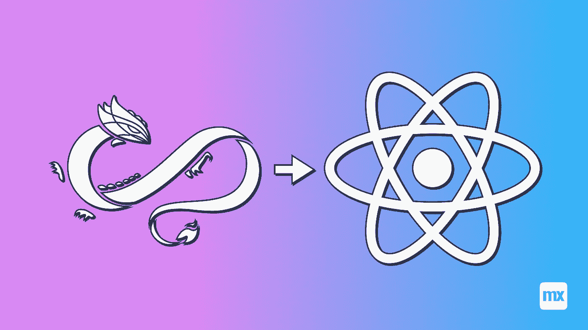

在过去的 7 年里，我为许多客户构建了许多 Mendix 应用程序。我获得的一个专业知识是使用 Google Maps 或 ArcGIS 扩展 Mendix 平台的 GIS 功能。对于这两个平台，我已经在 Mendix Marketplace 上发布了几个组件，就像我写这篇博客的那个，[谷歌地图多边形](https://marketplace.mendix.com/link/component/117109)。

这些更复杂的小部件都构建在 Mendix Dojo JavaScript 框架之上。我使用 Dojo 框架的时间和我构建 Mendix 应用程序的时间一样长，所以转向 React 对我来说是件新鲜事。

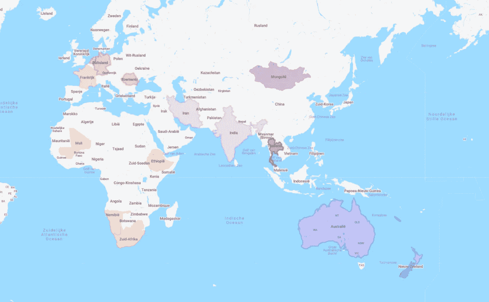

M endix 正在将他们的主要 JavaScript 前端框架从 Dojo 迁移到 React，主要是因为 React 框架更面向未来。然而，这确实意味着，如果 Dojo 框架的使用真的被淘汰，那么目前在 Dojo 框架中构建的所有小部件最终都将停止工作。因此，最终所有这些小部件都需要有一个对应的 React。

在这篇博客中，我想分享我从 Dojo 迁移到 React 的心得，希望它能帮助其他开发者完成升级市场内容的任务。下面逐一介绍主要要点:

*   选择正确的反应库！
*   让 React 做渲染！
*   充分利用可插拔小部件 API
*   为频繁使用的对象创建组件
*   仔细选择每个组件的存储状态

# **1。选择正确的 React 库**

一旦通过 Mendix 窗口小部件样板文件设置好了窗口小部件，正如在其他博客中解释的那样，比如 [this](/mendix/building-a-pluggable-widget-url-image-viewer-6fd423858137) one，首先需要做的是导入正确的 React 库。接下来导入正确的节点模块，还需要加载类型。选择正确的库是关键。在我的例子中，我想与谷歌地图 API 集成。我很快发现已经有很多 React 库了。在研究了三个最重要的问题后:

*   React 谷歌地图
*   谷歌地图反应
*   **谷歌地图反应**

我选择了最后一个，实际上甚至是它的扩展[https://www.npmjs.com/package/@react-google-maps/api](https://www.npmjs.com/package/@react-google-maps/api)

选择该库有三个原因:

1.  该库实际上支持多边形作为 React 组件，而 React Google Map 却不支持
2.  该库维护得相当好，见 GitHub 上的活动状态
3.  Mendix 也为新的地图小部件选择了这个库

[https://bit.ly/MXW21](https://bit.ly/MXW21)

# **2。让 React 做渲染！**

起初，我选择了另一个库，Google Map React，因为这是第一个内置了 Mendix Maps widget 的库。在添加了模块和第一个组件之后，我发现多边形组件并没有用 React 库完全实现，这是我通过正确阅读 React 库的文档应该知道的:

> google-map-react 是一个基于一小部分 Google Maps API 编写的组件。它允许您在 Google 地图上呈现任何 React 组件。

特别是“小集”这个部分非常重要，导致我浪费了很多时间。我试图自己创建一个多边形对象作为 React 组件，我做到了，但是我还必须添加 InfoWindow 对象。信息窗口是一个实际的弹出窗口，可以在单击地图本身或地图上的对象时显示。因为对于小部件，我需要添加一个可以触发动作的按钮(显示页面/运行微流等)，所以我需要一个更复杂的 HTML 来显示在信息窗口中。我尝试了几种方法通过 React 库 [ReactDOMServer](https://reactjs.org/docs/react-dom-server.html) 将 HTML(本身不是 React 组件)添加到 infowindow 中，但是所有的努力都失败了，这让我有点沮丧，因为在 React 中将 HTML 添加到组件构建中是多么困难。在阅读了其他开发人员关于“Stack Overflow”和其他网站的讨论后，我得出了一个结论，除非所有其他选择都失败，否则我不应该尝试使用 ReactDOMServer。因此，我切换到另一个支持多边形和信息窗口作为实际 React 组件的库。

# 3.充分利用可插拔小部件 API

我发现使用新的可插拔小部件 API 有四个巨大的好处，所以如果可能的话就换一个吧！当在为 Dojo 框架编写的旧客户端 API 中编写小部件时，前三个功能通常会占用大量开发时间，并且不容易构建。

1.  支持所有类型的数据源
2.  支持所有类型的操作
3.  可编辑性/可见性可以继承
4.  将 widget 设置分组在一起

## 1.支持所有类型的数据源

通过在小部件的 XML 中添加 datasource 类型的元素

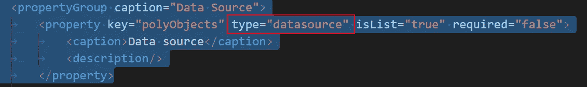

Widget XML: type=”datasource”

开发人员可以在小部件设置中选择所有不同类型的数据源:

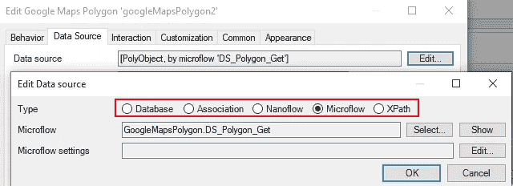

New API supports all data sources out-of-the-box

**2。支持所有类型的动作**

另一个标准需求是能够从小部件内部触发动作。例如，在谷歌地图的多边形部件中，应该可以通过点击多边形或折线来触发微流。有了新的可插拔小部件 API，现在这变得非常容易。只需在小部件 XML 中添加一个 type="action ":

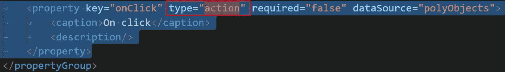

Widget XML:Type=”action”

因此开发人员可以在小部件设置中选择任何支持的操作:

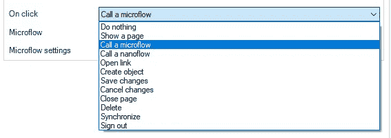

New API exposes all actions out-of-the-box

在 JavaScript 中，只需要一条语句就可以触发这个动作:

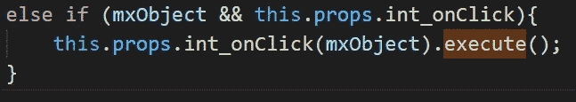

**3。可编辑性/可见性可以被继承**

新的可插拔小部件 API 公开了新的系统属性，也可用于其他 Mendix 默认小部件:

*   能见度
*   可编辑性

再次通过小部件 XML 中新提供的设置来添加它们:

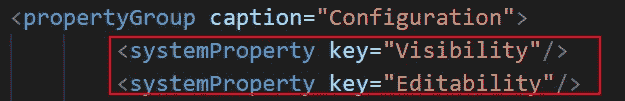

Widget XML system properties

**4。将小工具设置组合在一起**

现在可以在小部件 XML 内的现有 propertyGroup 中添加额外的嵌套 property group。第一个属性组将在小部件设置中生成一个选项卡，嵌套的属性组将在特定的选项卡中添加一个 groupbox，这对可读性非常有用:

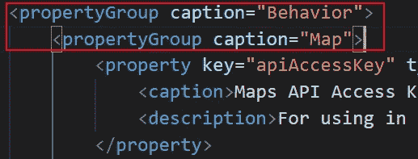

Wdget XML: Nested property groups

以上设置将导致以下小部件设置:

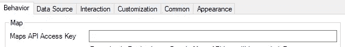

Studio Pro: nested property groups

**4。为频繁使用的对象创建组件**

显而易见，在基于 React 构建更复杂的小部件时，最佳实践是从最常用的对象中创建组件。对于谷歌地图的多边形部件，我为多边形、折线、标记和信息窗口对象创建了单独的组件。

在 Dojo 框架中，这也已经是一种最佳实践，将特定的函数分组到单独的 JavaScript 文件中，但是当使用 Visual Studio 代码和带有 import 语句的新 React 框架时，这要比在 Dojo 框架中容易得多。这就是为什么我有时会发现自己将所有 JS 代码放在 Dojo 框架的一个文件中…

**5。仔细选择每个组件状态中存储的内容**

当您的主 React 组件需要支持多个子组件时，在我的例子中是多边形、折线和信息窗口，正确选择在每个组件的状态中存储什么是关键。例如:当单击多边形或折线并显示该对象的信息时，InfoWindow 组件应该是可见的。因此，我希望并且实际上期待 React 库将按照以下顺序为组件提供父子关系:

*地图>多边形/折线>信息窗口*

遗憾的是，图书馆在地图上有一个直接的子信息窗口，所以:

*地图>多边形/折线/信息窗口*

因此，确保在单击多边形或折线时显示信息窗口应该通过地图组件本身来处理..

为了实现这一点，我添加了一些东西:

*   向地图组件的状态添加了设置:showingInfoWindow
*   向地图组件的状态添加一个对象:infoWindowObj，包含名称、位置和相应的 Mendix 对象(需要通过 InfoWindow 触发一个动作)
*   在首次渲染地图组件时，将 showingInfoWindow 设置为 false
*   在地图组件的渲染中，如果 showingInfoWindow 设置为 true，则仅在该位置显示信息窗口
*   在 Map 组件中添加了一个通用处理程序，用于单击子多边形和折线对象，该处理程序将 showingInfoWindow 设置为 true，并更新 InfoWindow 的名称、位置和关联的 Mendix 对象。
*   在 InfoWindow 组件上添加一个处理程序，以便在关闭 InfoWindow 时将 showingInfoWindow 设置回 false。

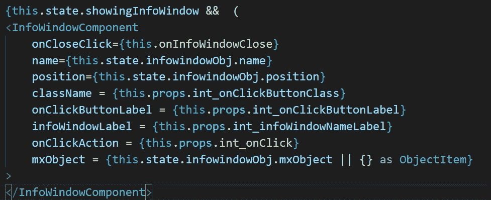

因为我们正在改变父对象的状态，所以每次点击一个对象或者关闭一个信息窗口时，渲染功能都会被触发。为了确保不是所有的对象(包括数据源的启动)都被重新加载，您应该跟踪这些对象是否已经被显示。这可以在多边形/折线 shouldComponentUpdate 函数中完成，以防止对象在所有数据(道具)都相同的情况下重新渲染。

# **结论**

尽管我对 JavaScript 和 Dojo 框架的理解已经很高了，但重新编写这个复杂的小部件还是花了不少时间。我在投资错误的 React 库和创建 InfoWindow 不是多边形/折线的子对象上浪费了一些时间。我对最终结果非常满意，因为它运行得很好，现在支持 Mendix 提供的开箱即用的所有数据源和操作。我希望这篇博客能让其他开发人员更多地了解从 Dojo 迁移到 React 的利与弊。

# 最终结果

T 今天，我向 Mendix 市场发布了基于 React 的谷歌地图多边形小部件的新版本。你可以在这里下载。也可以在 GitHub 上随意查看代码！

## 阅读更多

 [## Mendix World 2021 |召集您的应用开发团队 2021 年 9 月 7 日至 9 日

### 好像你需要说服…在一个全球制造商社区，他们想通过探索什么来相互学习…

bit.ly](https://bit.ly/MXW21)  [## 曲目|门迪克斯世界 2021

### 在今年 Mendix World 开幕之前，手工制作您的议程。浏览专为您量身定制的 8 个专题讲座中的 85 个以上专题讲座…

www.mendix.com](https://www.mendix.com/mendix-world/tracks/) 

*来自发布者-*

*如果你喜欢这篇文章，你可以在我们的* [*媒体页面*](https://medium.com/mendix) *或我们自己的* [*社区博客网站*](https://developers.mendix.com/community-blog/) *找到更多类似的内容。*

*对于希望入门的创客，您可以注册一个* [*免费账户*](https://signup.mendix.com/link/signup/?source=direct) *，并通过我们的* [*学院*](https://academy.mendix.com/link/home) *获得即时学习。*

*有兴趣加入我们的社区吗？你可以加入我们的* [*懈怠社区频道*](https://join.slack.com/t/mendixcommunity/shared_invite/zt-hwhwkcxu-~59ywyjqHlUHXmrw5heqpQ) *或者想更多参与的人，看看加入我们的* [*遇见 ups*](https://developers.mendix.com/meetups/#meetupsNearYou) *。*