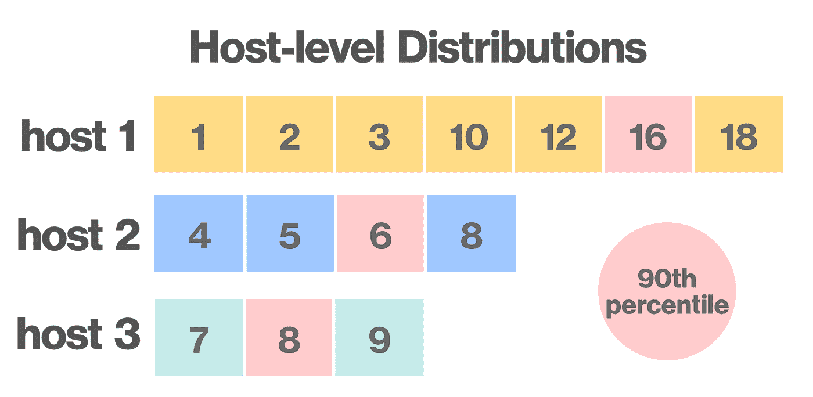
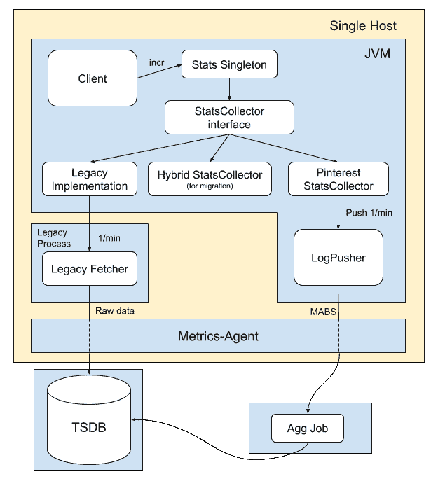
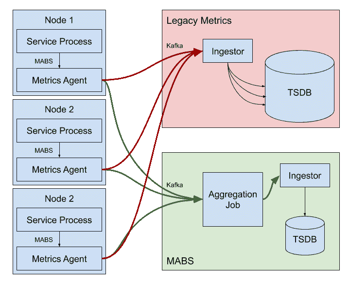
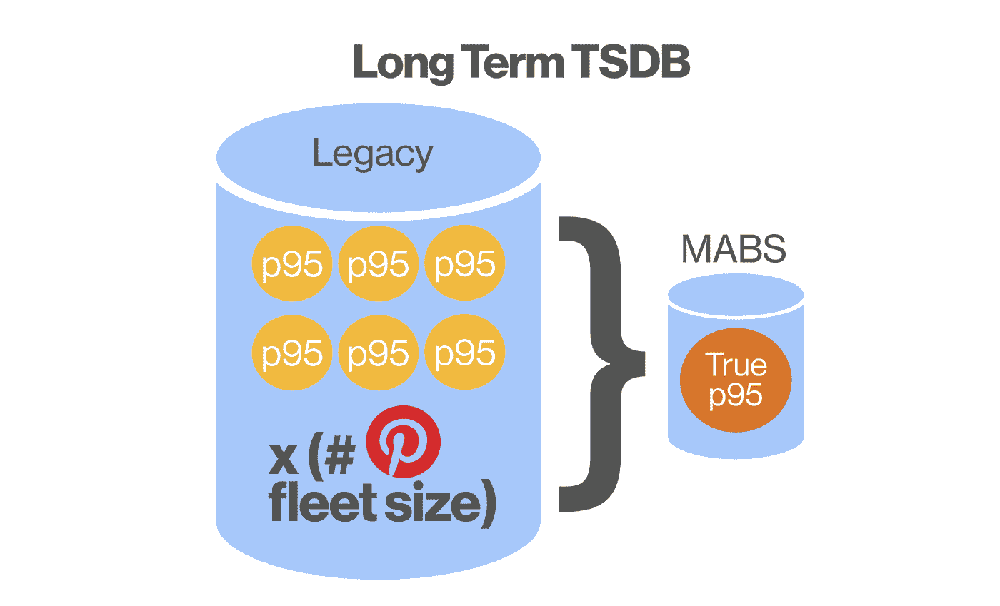
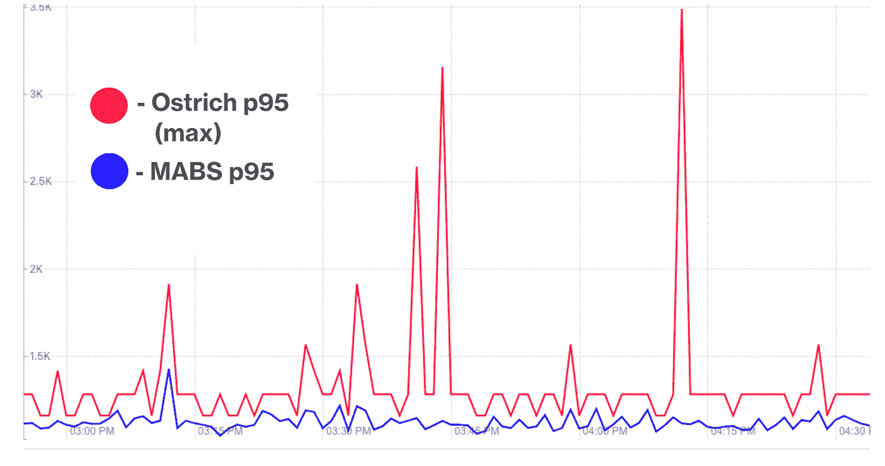

# 升级 Pinterest 运营指标

> 原文：<https://medium.com/pinterest-engineering/upgrading-pinterest-operational-metrics-8718d058079a?source=collection_archive---------5----------------------->

Jonathan Fung |软件工程师实习生，能见度
Colin Probasco |软件工程师，能见度

最近，Pinterest 达到了一个重要的里程碑:[全球 3 亿](https://newsroom.pinterest.com/en/300million)月活跃用户。为了通过我们庞大的内容语料库可靠地服务于这一用户群，Pinterest 的工程团队维护着数千项紧密协作的服务。每个服务都会发出对健康监控和警报系统至关重要的指标。可见性团队负责维护支持指标收集、报告、处理和显示的系统。

# 为什么要升级？

到目前为止，Pinterest 一直使用 Twitter 的[鸵鸟](https://github.com/twitter/ostrich)库从 Java 服务中收集指标。由于鸵鸟最近的贬值，它已经成为我们技术债务的来源，迫使我们使用旧版本的[欺骗](https://twitter.github.io/finagle/)。最重要的是，它阻碍了我们实现准确的服务级别指标聚合，因为鸵鸟只公开直方图分布的摘要。考虑以下由三台机器组成的机群的示例。每台主机报告其响应时间延迟的第 90 个百分位数(粉红色-16、6 和 8)。不可能从三个采样数据点中恢复出真正的 90%分布(12)。

Three distributions from three hosts, each reporting one p90

The true p90 across all three hosts cannot be recovered from the sampled p90s

这提出了多个问题:

*   运营指标按节点标记，因此要存储的指标数量随着 Pinterest 的指标用例线性增长。这导致指标存储需求逐年大幅增长。
*   我们目前平均分布中的百分位数来估计真实的百分位数。这并不一定能准确代表真实的百分比指标，关键警报可能取决于这些服务生成的指标。不正确的百分比度量可能导致假阳性，甚至更糟，假阴性。

对此的解决方案有两个:

1.  我们必须摒弃当前收集指标的方式，创建一个内部指标收集器和报告器，以便我们能够控制内部实现。直方图指标将得到 T-Digest 的支持:一种紧凑、可串行化、精确的直方图数据结构，最重要的是，它是可合并的。
2.  必须创建与语言无关的指标聚合管道，以提供服务级别的聚合支持。如果需要按节点度量，还必须有一个选择加入选项，以便在短时间内保留节点级别的度量。

这两个项目将对 Pinterest 的度量系统进行更多的控制。由于消除了不必要的按节点度量，度量存储需求将大幅降低，并且由于在查询中提取的数据更少，查询性能将得到提高。最后，Pinterest 将提供准确的服务水平百分比指标。

# Pinterest 统计收集器

为了反对鸵鸟，我们构建了 Pinterest StatsCollector，这是一个 Java 度量收集器和报告库。StatsCollector 需要能够以线程安全的方式收集三种类型的指标(计数器、计量器和直方图),并每分钟将它们推过聚合管道，以将它们持久存储在时序数据库(TSDB)中。在开发过程中，我们针对 CPU 性能和 API 与传统系统的兼容性进行了优化，以简化迁移步骤。

概括地说，该库由以下部分组成:

1.  **StatsCollector:** 创建计数器、计量器和直方图的界面。
2.  **Stats:** 围绕单个 StatsCollector 的瘦静态单例类包装器。每个 JVM 一个。用户调用此对象。
3.  **度量:**计数器、直方图和量表的线程安全实现
4.  **LogPusher:** 我们使用基于推送的模型来衡量指标。这个类将指标从 StatsCollector 推送到 *metrics-agent* ，这是一个运行在每台 Pinterest 机器上的 sidecar，负责对指标进行后处理，并将它们转发到适当的目的地。
5.  **ThreadLocalStats:** 一个方便的接口，用于线程本地的批量度量。提供性能优势。

Metrics flow diagram

## API 决策

在设计 StatsCollector 和 Stats 接口时，我们广泛地分析了我们的 Java 代码库，以找到现有的度量代码模式。发现了一些关键的用例以及性能瓶颈，我们设计了我们的库来缓解这些问题。这里，我们详细介绍一些应用程序级和用户级的优化。

## 优化 1:缓存同步哈希表查找

首先，我们修改了向 StatsCollector 报告指标的流程。举例来说，考虑递增计数器。前面的方法涉及直接在 Stats singleton 上调用 *incr* 。因此，在每次 incr 调用期间，只有一次同步的 hashmap 查找来访问度量名称到计数器的映射，这在执行高每秒查询数(QPS)函数时会导致性能问题。因为对于每个 JVM，从度量名称到计数器只有一个映射，所以所有同步的查找都是在一个 hashmap 上执行的，并且因为锁定需要从用户模式到内核模式的昂贵的进程级切换，所以会发生锁抖动。

为了优化，我们转向了一种新的 API，它可以有效地“缓存”同步查找。用户现在维护一个对 Stats singleton 分配的计数器对象的引用，所有度量操作都在该对象上执行。

## 优化 2:线程本地统计

然而，当谈到指标的动态命名时，我们的第一个优化失败了。考虑一个用例，其中用户必须在批处理操作中增加动态命名的计数器，例如处理许多事件的循环。前面提到的方法不会带来性能上的好处，因为每次函数调用都需要同步的 hashmap 查找。

为了使这种情况具有性能，我们可以从 hashmap 查找和度量增量中删除所有同步。我们构建了线程本地 Stats，这是 StatsCollector 及其内部指标的线程本地版本，它不具有任何锁定行为。线程本地统计数据实际上充当了一个存储桶，以批处理方式存储指标，直到用户将线程本地统计数据刷新回 StatsCollector。因为线程本地统计是线程本地的，所以在任何度量操作期间都没有同步，优化了从用户模式切换到内核模式所需的资源。

## 优化 3:仪表 API 设计

与用于测量事件发生率的计数器相反，计量器可以被认为是监控某个值的功能。仪表的经典示例是监视列表大小的函数。在一个量规被初始化之后，当 LogPusher 推送度量时，它的值将被轮询并每分钟报告一次。

初始化 Gauge 的传统方法是内嵌一个 Java 类型的匿名类 *Supplier* ，或者 Scala *Function0* 。这些可以被认为是输出一个双精度值的无参数 lambdas。这对于用户来说是麻烦的，并且不是高性能的，增加了被监控程序的内存占用。对被监视对象的引用必须在匿名内联类中维护，这可以防止 JVM 将该对象标记为适合垃圾收集，因为只有当对该对象的所有引用都丢失时，该对象才会被垃圾收集。这不是我们想要的行为，因为监控系统不应该影响客户端的性能。

为了优化，我们从[千分尺](http://micrometer.io/)库中借鉴了灵感，并将 Java [WeakReference](https://docs.oracle.com/javase/8/docs/api/java/lang/ref/WeakReference.html) 对象引入到我们的量规中。对对象的弱引用不能防止垃圾回收。维护仪表所监控对象的强引用是库用户的责任。当用户完成监视并删除强引用时，JVM 垃圾收集器就被允许收集该对象。通过这一改进，我们监控系统中的仪表对用户完全透明，并且不会占用额外的内存。

# 按服务汇总指标(MABS)

随着指标流经我们内部的 Pinterest StatsCollector，我们现在可以对如何处理指标进行更多的控制。这允许我们开发语言无关的 MABS 管道，为服务提供一种聚合度量的方式。完成的管道将允许服务中的所有节点通过 MABS 报告它们的指标，这将汇总按节点的指标并为每个指标生成一个数据点。我们还允许用户选择按节点存储指标。

从高层次来看，MABS 由以下人员组成:

1.  **Metrics-Agent:**Pinterest sidecar 必须接受新的命令语句，并在转发到适当的 Kafka 主题之前执行必要的处理。
2.  **Kafka 主题:** Kafka 被用作 MABS 组件之间的流缓冲区。
3.  **Spark 聚合器:**一个持续运行的任务，用于聚合度量。
4.  **入口:**将数据推送到存储系统的服务。
5.  **时间序列数据库:**Pinterest 的存储&缓存团队维护着[悟空](/pinterest-engineering/goku-building-a-scalable-and-high-performant-time-series-database-system-a8ff5758a181)，我们的内部 TSDB。Goku 支持多个存储层，非常适合我们的短期 *by_node* 指标。

Before and After MABS pipeline

# 使用

服务通过 TCP 连接向本地度量代理发送明文 MABS 命令来与度量代理通信。计数器和仪表分别以整数和双精度形式通过网络发送。直方图作为支持 T-Digest 的 Base64 编码序列化发送。可选的 *by_node=True* 命令标记将标记主机级指标，以便短期保留。

输入后，Metrics-Agent 执行适当的后处理，并将度量转发给适当的 Kafka 主题。Kafka 主题将指标缓冲到一个 Spark 聚合作业中，Spark 聚合作业的输出被发送到一个 Ingestor，后者将数据点写入悟空 TSDB。

# 影响

Pinterest StatsCollector 和 MABS 为我们的指标管道带来了巨大的好处。通过将服务迁移到 MABS 管道，我们能够垂直汇总整个服务的指标。这大大减少了需要存储在 TSDBs 中的数据量。

Only the true p95 is stored, rather than one p95 for every fleet machine.

通过将 MABS 部署到内部 Pinterest 指标中，我们能够移除指标中多余的主机标签。由此带来的指标维度的减少在指标存储 *方面产生了高达 **99%的节省。***

除了存储容量和运营成本的降低，MABS 最终让 Pinterest 获得了精确的直方图指标。百分比指标对于监控服务的健康非常重要。有了准确的指标，可以减少误报和漏报。下图是通过 MABS 改进的延迟测量的真实示例。红线是报告直方图指标的传统方式，由 max 函数汇总，而蓝线是通过 MABS 报告的真实指标。MABS 指标不那么参差不齐，提供了更准确的真实情况，最重要的是，不会错误地触发警报。

MABS pipeline does not have false spikes

# 结论

度量在任何软件公司中都扮演着重要的角色。如果没有一种可靠的方法来报告和显示指标，软件工程师将会盲目——想象一下驾驶一架没有任何速度、航向或高度仪表的飞机！MABS 是使我们的指标体系更具可扩展性、稳健性和准确性的下一步。我们的基础设施目前支持一种产品，该产品每月激励超过 3 亿 Pinners 过上他们热爱的生活。随着 Pinterest 迈向下一个 3 亿 Pinners，Visibility 团队将不断努力构建和改进基础设施，为 Pinners 提供无缝、鼓舞人心的浏览体验。

在 Pinterest 实习一个夏天是一次不可思议的经历。在短短的三个月里，学习、责任和乐趣都变得异常丰富。实习生有机会参与真实的、有影响力的项目(比如 MABS！)提供了无限的发展机会和接触多种技术的宝贵机会。如果你是读这个的大学生，肯定考虑申请。如有任何问题，请随时联系 [me](https://jonfung.me) ！

**致谢**

*Colin Probasco，感谢他在项目期间的指导和支持。感谢可视性团队的 Brian Overstreet、Naoman Abbas、朱未、Peter Kim、Humsheen Geo 和 Dai Ngyuen。感谢 James Fish、存储&缓存团队和日志团队在设计评审期间提供的意见。感谢林义杰帮助开发工具。*