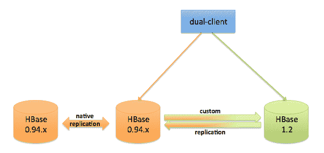

# 将 Pinterest 从 0.94 升级到 HBase 1.2

> 原文：<https://medium.com/pinterest-engineering/upgrading-pinterest-to-hbase-1-2-from-0-94-e6e34c157783?source=collection_archive---------4----------------------->

张天英| Pinterest 技术主管，存储和缓存

HBase 是 Pinterest 几项关键服务的支柱。它以 10M+ QPS 的速度提供超过 10pb 的数据。大部分流量来自要求低延迟的实时在线请求，因此集群的高性能和高可用性至关重要。为了充分利用 HBase 并确保 Pinners 的最佳体验，我们将分支机构从 0.94.26 升级到 1.2 版。然而，我们发现升级过程至少需要几个小时。由于我们无法在每次升级 HBase 集群时关闭 Pinterest，因此我们构建了一个系统来支持零宕机的升级和回滚。

## 历史

在升级之前，我们运行的是基于 HBase 0.94.26 的私有分支，但该版本已于 2015 年初正式弃用。HBase 1.2 拥有超过 0.94.26 的 5，000 个已完成的 JIRA 案例，其中包括重要的错误修复和新功能，可提高健壮性、可扩展性、性能、MTTR(平均恢复时间)等。如果我们升级到 1.2 版，我们将实现重大的长期利益。

但是，不支持从 0.94.x 版升级到 0.96.x 或更高版本，因为有许多不兼容的更改，包括 API 和 wire 格式。这意味着 0.94.x 集群必须完全关闭，如果启用了复制，则包括从属集群，并且由于不兼容的 API 更改，客户端必须同时关闭和升级。整个过程需要几个小时甚至更长时间。如果需要回滚，集群和客户端将不得不再次完全关闭，因此我们构建了一个支持升级和回滚且不停机的系统。

## 设计



最终目标是在升级时，客户端只需从连接到 0.94 集群切换到 1.2 集群，并且事先做好所有准备。到 0.94 的连接被启用为只读。一旦验证数据在 0.94 和 1.2 之间完全同步，客户端将被指示通过配置更改动态连接到 1.2。整个过程对于读写集群的服务应该是透明的。回滚应遵循相同的过程，但方向相反，将客户端连接从 1.2 集群切换回 0.94 集群。

这需要 0.94 和 1.2 集群之间的双向异构复制，其中源数据以接收器可以识别的格式编码，并解码为其版本的本机格式。这允许数据在两个集群之间实时同步。接下来，双客户端会自动检测所连接集群的版本，并相应地以该版本固有的格式对请求进行编码，对响应进行解码。

## 分身术

我们采用了来自雅虎的基于节约的复制补丁。以及 Flurry，它添加了将特定主从对之间的复制协议设置为 Thrift 的选项。然后，使用基于节约的复制 RPC 来代替 0.94 和更高版本之间不兼容的本机复制 RPC。原来的补丁是针对 0.94.26 和 0.98.10 的。我们做了一些改变，使它在我们的私有 1.2 分支中工作。

验证复制集群之间的数据正确性是非常重要的。我们构建了一个工具(称为 checkr ),它扫描主集群中的每一行，验证从集群中是否存在匹配的行，检查两行中所有具有相同数据的单元，反之亦然。如果在验证期间没有对群集的写入，该过程非常简单，否则数据可能会有所不同，因为 HBase 复制是异步的。一个典型的情况是，由于复制延迟，当 checkr 读取主服务器中的数据时，主服务器中的数据更改可能不会应用到从服务器。因此，checkr 从主服务器获得最新的数据副本，但从服务器获得过期的副本。为了解决这个问题，checkr 将只比较其数据最近没有被修改的 HBase 单元，例如在最后 N 秒内，其中 N 是可配置的。我们在不同的时间点运行了几次 checkr。如果在所有运行中没有发现数据不一致，复制延迟少于 N 秒，并且每 N 秒钟没有单元被更新，我们确信通过复制集群之间的数据是一致的。

## 客户

[async base](http://opentsdb.github.io/asynchbase/)是一个完全异步的高性能 hbase 客户端。最重要的是，它兼容 HBase 从 0.92 到 0.94 和 0.96 到 1.0 的版本。我们一直在使用 Asyncbase，并用内部 API 和其他变化保持一个私有分支。它经过全面测试，以验证:

*   它适用于 0.94 和 1.2 集群，包括我们的私有特性，如批量获取、小型扫描等。
*   在 0.94 和 1.2 之间切换后端没有问题
*   没有性能下降。

注意，Asynchbase 不是 HTable client 的简单插件。除了 API 上的差异，每个调用的异步本质意味着要么在收到响应时附加一个回调来处理它，要么只是等待它。

## 性能调整

HBase 性能，尤其是低延迟，对 Pinterest 来说非常重要，因为我们为多个关键服务的实时在线请求提供服务。我们必须确保 1.2 集群的性能至少与 0.94 一样好。理想情况下，0.94 集群和它的测试 1.2 集群拥有相同的数据并接收相同的请求，这样我们就可以比较它们应用于 apple 的性能。

我们设置了一个黑暗的写/读环境，其中应用程序向 test 1.2 集群发送相同的请求，但不处理响应就立即返回(此外还向 0.94 生产集群发送请求并处理响应)。我们从最大的集群开始测试，包括数据大小和 QPS。假设是，如果我们没有看到性能下降，其他较小的集群也不会有问题。

为了降低延迟，我们投入了大量时间来调整垃圾收集(GC)。在我们的环境中，CMS 仍然比 G1 有更好的延迟。下面是运行在 AWS I2 . 2x 大型实例上的区域服务器的相关 JVM 选项列表。

```
**-Xms20480m****-Xmx20480m****-XX:+PerfDisableSharedMem****-XX:+UseParNewGC****-XX:+UseConcMarkSweepGC****-XX:+UseCompressedOops****-XX:+CMSParallelRemarkEnabled****-XX:+UseCMSInitiatingOccupancyOnly****-XX:+PreserveFramePointer****-XX:NewSize=512m****-XX:MaxNewSize=512m****-XX:ParGCCardsPerStrideChunk=32768****-XX:CMSInitiatingOccupancyFraction=70****-XX:ParallelGCThreads=4****-XX:PretenureSizeThreshold=2097088****-XX:+ParallelRefProcEnabled****-XX:+AlwaysPreTouch**
```

HBase 的特性和配置也得到了尝试和调整。例如，默认情况下启用的存储桶缓存会导致更差的读取延迟，因为 1.x 中的存储桶缓存涉及额外的拷贝和内存垃圾。我们不得不禁用它，并且无法在 I 2.2x 大型实例中充分利用 60GB 内存(但它仍然给了我们比 0.94 更好的读取延迟)。我们目前正在考虑从 2.0 中反向移植[堆外读取路径，这可能会显著改善读取延迟。](https://blogs.apache.org/hbase/entry/offheap-read-path-in-production)

起初，我们在 1.2 中看到了更好的写入延迟。在两个新的繁重使用情形添加到群集后，写入 QPS 显著增加，1.2 中的写入延迟变得比 0.94 更差。经过一些调试后，我们发现延迟增加来自 WAL sync。sync 代码被重构为 1.x。我们发现它不能很好地进行批处理，这导致了更频繁的 WAL sync 操作。我们将`hbase.regionserver.hlog.syncer.count`的值从五(默认)降低到一。这增加了批量大小，减少了 WAL 同步操作，并提供了比 0.94 更好的写入延迟。

## 监控和工具

HBase 1.2 引入了许多新指标。0.94 中的一些指标在 1.2 中被重命名，因此为 1.2 构建了一个新的监控仪表板和警报系统。所有集群升级后，以前的 0.94 系统将逐步淘汰。

管理 API 在 0.94.26 和 1.2 之间经历了巨大的变化。我们的内部工具，包括区域平衡和部分压缩，也升级到了 1.2 版本。0.94.26 和 1.2 之间的文件结构还有其他变化。数据备份和恢复工具必须进行相应的升级和全面的测试。

## 结果

升级按计划进行，客户端被指向 1.2 集群，就像故障转移一样。对于构建在 HBase 之上的服务来说，它是完全透明的。我们测量了服务 API 的延迟，性能提升非常大，提高了 124–800%。最终，1.2 集群比 0.94 集群更健壮，操作问题更少。

*鸣谢:非常感谢 Jeremy Carrol 和 Liang 在这个项目中的工作，以及提供的宝贵的性能调整建议。*