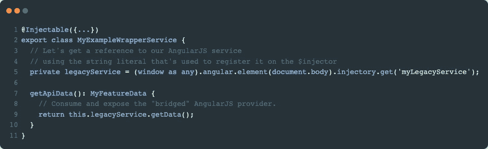
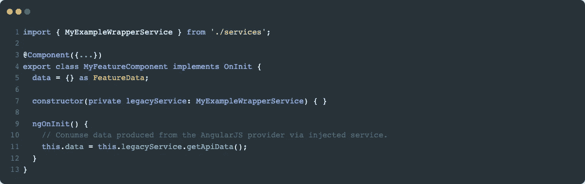

# 使用角元素升级:主要经验教训

> 原文：<https://medium.com/capital-one-tech/upgrading-with-angular-elements-eb3185e26382?source=collection_archive---------6----------------------->

在我的上一篇博客中，[Capital One 如何使用 Angular Elements 从 AngularJS 升级到 Angular](/capital-one-tech/capital-one-is-using-angular-elements-to-upgrade-from-angularjs-to-angular-42f38ef7f5fd) ，我深入探讨了 Capital One 对我们的客户服务平台进行的大规模角度转型。今天，我想在此基础上与大家分享我们在迁移过程中所学到的重要经验。这些课程中有些是以人为中心的，有些则围绕着我们所面临的技术挑战。

如果你还没有，看看我们的 [Ng-Conf 2019 谈话](https://www.youtube.com/watch?v=WFzph5uTdmw)关于我们如何使用角元素！

# 顶级课程

1.  准备工作 —培训你的开发人员。
2.  **计划** —不要本末倒置。
3.  **状态管理** —你可能需要，也可能不需要。
4.  **组件库** —设计系统几乎可以立即赢得一半的战斗。
5.  这是你过上更好生活的第二次机会——移民是机会，而不是负担。
6.  **工具是你的朋友** —为工作选择合适的工具。
7.  **沟通****——**为重要的高层决策建立利益相关者委员会。
8.  **定义迁移模式** —为您的团队定义最佳实践。
9.  **框架沟通** —定义从 AngularJS 到 Angular 的沟通模式。
10.  **变化检测怪癖** —不更新自己不知道的东西。

好吧，让我们开始吧！

# 1.准备

> 第 1 课:用新框架的底层概念和技术(例如 RxJS)教育您的开发人员，是任何迁移工作开始之前最好的第一步。

回想安古拉杰全盛时期。您的应用程序使用 MVC 架构和基于`Promise`的逻辑来解决异步工作。现在快进到今天的 Angular。应用程序架构已经转向更加模块化、基于组件的方法，通过 RxJS 与称为`Observables`的可组合数据流相结合来处理异步工作。这是我们在短短几年内用来驱动应用程序的前端框架底层架构的重大转变。

刚开始学 Angular 的时候，很容易忽略 RxJS。它很难掌握，但对 Angular 至关重要，因为它是框架的基本组成部分。也就是说，反应式编程需要从承诺到可观察的重大思维转变，因为它处理异步事件的方式。RxJS 不是一次性的获取和接收交互，而是将这些交互重新想象为数据流，当数据通过数据流发出时，可以提取和操作这些数据流。许多开发人员倾向于在 RxJS 中犯一些常见的错误，比如嵌套订阅、在错误的地方订阅或者根本没有取消订阅。RxJS 非常强大、可组合和灵活。归根结底，掌握 RxJS 是优秀的 Angular 开发人员和优秀的 Angular 开发人员的区别。既然 Angular 在引擎盖下充分利用了它，那就好好学习吧！

# 2.计划

> 教训#2:不要本末倒置——在尝试迁移功能代码之前，为所有功能都需要的核心应用程序资源做好准备。

如果迁移到 Angular 已经有一段时间了，那么一头扎进代码中，全力开发迁移特性可能会很有诱惑力。在 Angular 中完全可以使用 AngularJS 提供者，方法是通过`$injector`获取该提供者的引用；然而，抗拒诱惑！几乎可以肯定的是，核心服务，如 i18n 内容、认证、数据水合等等，将需要首先在 Angular 中迁移和可用，因为这些功能很可能依赖于它们。如果这些服务没有在功能本身之前进行转换，桥接 AngularJS 提供者可能会引入许多复杂性，随着时间的推移，这些复杂性可能会变得难以管理。复杂性可能包括(但不限于):

1.  跟踪已经迁移到 AngularJS 的服务和仍在 Angular js 中的服务。
2.  记住哪些特性最初使用桥接服务，但后来迁移到纯服务——随着时间的推移，实现细节可能会发生变化。
3.  必须防止这些共享资源的重复迁移工作。
4.  用服务的实现变化来改进特性工作。

鉴于这些复杂性，预先建立这些关键服务不仅会使迁移更加顺利，还会减少“进行中”的认知负荷，包括在您的功能迁移工作完成之前实现随时间变化的可能性。

# 3.状态管理

> 第 3 课:预先确定状态管理对于您的应用程序是否必要。很有可能，如果你还没有需要它，你现在可能也不需要它。

状态管理可能是一个有点争议的话题，而这恰好是 Angular 尚未采取官方立场的事情之一。Angular 社区支持一些很棒的库，包括用于 redux 风格模式的 [NGRX](https://ngrx.io/) 和 [NGXS](https://www.ngxs.io) ，以及用于更面向对象方法的 [Akita](https://netbasal.gitbook.io/akita/) (其功能类似于带有表格的数据库)。

尽管您可以在应用程序生命周期中的任何时候选择加入状态管理库，但在迁移特性时提前加入还是有好处的。已经有太多的比较文章了，所以我不会深入讨论您应该选择哪个州管理库。相反，我鼓励你做你的功课，看看哪个最适合你的用例。

如果其他方法都失败了，许多开发人员选择简单地在他们的 Angular 服务中使用`BehaviorSubjects`来维护该服务的状态/数据。 [Dan Wahlin](https://twitter.com/DanWahlin) 在 Ng-Conf 2019 上做了一个很棒的[演讲，讲述了开发人员如何使用 RxJS 在组件之间进行通信，而无需选择加入状态管理方法。](https://www.youtube.com/watch?v=_q-HL9YX_pk)

# 4.组件库

> 第四课:利用一个设计系统几乎可以立即赢得一半的战斗。

使用组件库可以为开发人员节省几个小时(如果不是几天的话)来重新创建通用用户界面小部件。每个 web 应用程序都使用日期选择器、输入框、下拉菜单、单选按钮等等。许多设计系统承担着确保所有东西都有一致的外观和感觉的重任，同时确保它们对用户来说是可访问的。虽然不需要用专用的设计系统来开发 Angular 应用程序，但它为开发人员减轻了很多设计负担。以下是一些流行的角度组件库:

*   [材料设计](https://material.angular.io/)
*   [清晰度](https://clarity.design/)(来自 VMware)
*   [剑道](https://www.telerik.com/kendo-angular-ui)
*   [自举](https://ng-bootstrap.github.io/#/home)

如果这些都不符合你的审美需求，Angular 向开发人员提供了 Material Design 的基线基础，称为[组件开发工具包](https://material.angular.io/cdk/categories) (CDK)。请将此视为“无蒙皮”版本的材质设计，可以根据您公司的特定设计语言进行样式化。

# 5.这是你过上更好生活的第二次机会

> 第五课:迁移是机会，而不是负担。

尝试从头开始重新思考每个特性。很有可能，代码并不像您所希望的那样干净，或者它可以用今天可用的更新技术以更好、更简单的方式来完成。即使你觉得没有必要重新设计一段特定的代码，一点清理也比什么都没有好。遵循[鲍勃大叔的](https://blog.cleancoder.com/)童子军规则— *总是让代码比你发现的更干净。*

如果我可以强调一个关键的教训，那就是将特性从一个框架迁移到另一个框架很可能要求特性的架构与遗留框架不同——这不是一对一的。不要试图将现有的实现放入框架中。相反，利用框架*提供的新方法*来获得一个更干净、更高效的解决方案。

# 6.明面上是你的朋友

> 第六课:为工作选择合适的工具。

有许多不同的工具为我们的应用程序做非常具体的事情。我们有构建器、缩小器、混淆器、静态代码分析器、CLI、测试运行器、格式化器、linters、原理图等等！您选择的工具，以及如何使用它们，会极大地影响开发人员的体验，所以要谨慎选择。

以下是一些我们认为有用的流行工具，它们非常适合 Angular:

*   [Nx](https://nx.dev) (用于 monorepo 式应用)及其示意图
*   [笑话](https://jestjs.io)
*   [更漂亮](https://prettier.io)
*   [ESLint](https://eslint.org)

在我们的旅程中，我们遇到了用角度元素高效构建应用程序的实际需求。创建的每个元素都需要一个独立的构建过程，以便打包该元素，使其对应用程序可用。当我们必须构建几十个这样的迷你 Angular 应用程序时，这个构建过程会非常耗费 CPU 资源。谢天谢地，我们来自 NRWL 的朋友用他们在这些复杂情况下的专业知识让开发者的生活变得更加美好，我们对他们的服务感激不尽。

# 7.沟通

> 经验 7:为重要的高层决策建立利益相关者委员会。

随着闸门打开，开发人员深入到迁移工作中，可能会出现各种问题，这些问题会影响整个应用程序。这可以是定义模式、选择特定的第三方库或者选择状态管理库。不管是什么问题，建立一个可以为应用程序提供指导和决策的团队会产生巨大的影响。这有助于集中开发人员的精力，消除他们自己决定这些设计决策的负担，防止各种实现做同样的事情，并优化最佳方法。

根据我们的经验，我们有许多团队为我们的平台做出贡献，所以我们从每个主要的开发团队中选出一名代表加入利益相关者委员会。这样做引入了一种民主的动态，允许每一组开发人员表达他们的需求、关注，甚至提出想法，以使整体开发人员体验更好。此外，该委员会做出的任何决定都可以通过该代表传达给更大的开发团队。我们已经看到这种模式取得了巨大的成功，我强烈推荐这种方法。

此外，利益相关者圆桌会议的相同模型可以应用于开发人员小组的较小子集。这允许这些开发人员组选择一些开发人员来提出任何问题、遗漏的最佳实践或新的模式，这些应该由组外的其他开发人员来遵循。

# 8.定义迁移模式

让我们强调一下我们遇到的一些更有趣的技术问题，因为我们使用角度元素作为升级工具的方式。

> 第 8 课:为你的团队定义编码最佳实践。

这是一个很好的机会，你可以建立或改变代码标准的规范、应用程序和特性结构、TypeScript 和 Angular 的最佳实践、特性设计、干净的代码定义等等。许多团队在开发过程中有他们自己的风格，这将是重新校准做事方式的好时机。

根据我的经验，我的团队在专门的功能设计会议上取得了巨大的成功，在会议上，我们采用现有的功能，并在白板上展示我们希望它如何设计。由于存在基本的框架差异，我们可以在从遗留代码库迁移业务逻辑的同时从头开始设计。

此外，由于迁移工作的性质不同于标准的特性开发工作，记住将会有一个学习曲线和调整期是很重要的。有时开发时间可能比预期的要长，这没关系。了解在迁移工作中哪些地方的评估是错误的，以及可能出现了哪些阻碍因素，以便改进整个迁移过程。

# 9.框架通信

> 第九课:从角度到角度的交流。

在整个迁移过程中，我们大量使用 AngularJS 提供商(例如`service`、`provider`、`factory`、`constant,`等)。)直接放在我们的 Angular 代码中，而不必首先迁移遗留代码。没错。你没看错。在我之前的博客文章中，我提到当整个应用程序加载时，我们会引导两个框架。在每个框架引导之后，我们能够获取 AngularJS 提供者的引用，并在我们的 Angular 代码中直接使用它们。AngularJS 的`$injector`上声明和注册的任何东西都可以在 Angular 中使用。

为了使用 AngularJS 提供程序，我们可以通过 Angular 中的 window 对象来访问它。从那里我们可以深入到`$injector`，在那里它有自己的常规 AngularJS APIs！这很棒，因为这意味着我们可以获取 AngularJS 资源，并在 Angular 代码中的任何地方使用它。根据我们的经验，我们发现创建“包装器”服务非常成功，这些服务获取对 AngularJS 提供者的引用，并通过 Angular 的依赖注入系统使它们可用。这允许我们创建一个类，它将在一个服务中维护这个遗留提供者的消费，当我们准备好迁移提供者的逻辑时，我们只需要在一个地方更新代码。

从这里，我们可以将提供者依赖注入到智能组件中，并使用我们的服务公开的 AngularJS 资源来获取我们的数据(或调用其他遗留方法)并迁移我们的功能，而无需移动任何遗留提供者逻辑。让我们来看看那会是什么样子:

Example Wrapper Service

Example Consuming Component

# 10.变化检测怪癖

> 第十课:一个人不会更新他不知道的东西。

在我们整个迁移过程中，我们遇到了一些奇怪的情况，DOM 没有呈现任何数据更新，并且在 Angular 中变化检测似乎没有像预期的那样工作。无论我们如何实现一个特性或设计一个服务，当我们试图利用由包装器服务桥接的 AngularJS 资源时，自动变化检测似乎不能拾取任何正在发生的事件。不过，这绝不是什么值得大惊小怪的事情！当你考虑当时的情况时，你会发现这是有道理的。

由于两个框架都是单独引导的，并且不知道彼此的存在，所以在任一框架中产生的事件对另一个框架没有任何影响。这意味着 AngularJS 中的事件不会导致 Angular 的变化检测在事件解决时启动，反之亦然。例如，如果我们从 AngularJS 提供者中桥接一个方法，该方法在`Promise`解析/拒绝时返回一个`Promise,`，那么该事件将在 AngularJS 中处理，而 Angular 永远不会拾取该事件。

也就是说，我们建立了一些方法来确保在必要时进行变更检测:

1.  `NgZone` —这是我们发现的连接变更检测系统的最佳方法。`NgZone`提供了一种`run()`方法，允许我们选择回到自动化变更检测系统，这已经被证明是最可靠的方法。此外，我们还创建了一个实用函数，允许我们将一个`Promise`转换成一个`Observable`，同时挂钩回`NgZone`。由于 AngularJS 中所做的大部分异步工作都是基于`Promise`的，这已经取得了令人难以置信的成果。关于这一点需要注意的关键是，挂钩到`NgZone.run()`最好是在服务内部使用，而 ***不是在组件中使用*** 。通过在桥接资源的服务中提升`NgZone.run()`的使用，这消除了必须在每个组件中实现`NgZone`的开销，该组件使用调用在 AngularJS 中解析的事件的服务。
2.  `changeDetection.OnPush()` —这个选项是让变更检测在组件级为您工作的最后手段。如果有限制条件阻止您在服务的数据生成器中使用`NgZone.run()`,这是您的下一个最佳选择。

# 总结

总的来说，这次迁移之旅极具挑战性，但也非常值得。在高层次上，我们已经了解到准备是至关重要的，计划是必不可少的，沟通可以成就或破坏它，适当的工具使我们的生活更容易，并且定义可伸缩的模式可以产生高质量的代码库。它向我和我的其他开发伙伴提出了挑战，要求他们将这一迁移路径推向更高的水平。通过我们的努力，我们已经建立了一个可扩展的，健壮的方法来使用 Angular 元素作为一个工具来迁移到最新的和最好的 Angular。

请继续关注即将发布的关于一些更具技术性主题的文章，这些文章深入探讨了框架之间的通信，以及我们如何在 AngularJS 中使用 NGRX/Store 作为两个框架之间的单一事实来源！

披露声明:2019 首创一。观点是作者个人的观点。除非本帖中另有说明，否则 Capital One 不隶属于所提及的任何公司，也不被这些公司认可。使用或展示的所有商标和其他知识产权是其各自所有者的财产。