# 使用 Mendix 将文件上传到 SharePoint

> 原文：<https://medium.com/mendix/upload-a-file-to-sharepoint-using-mendix-5f8f6c696a42?source=collection_archive---------0----------------------->

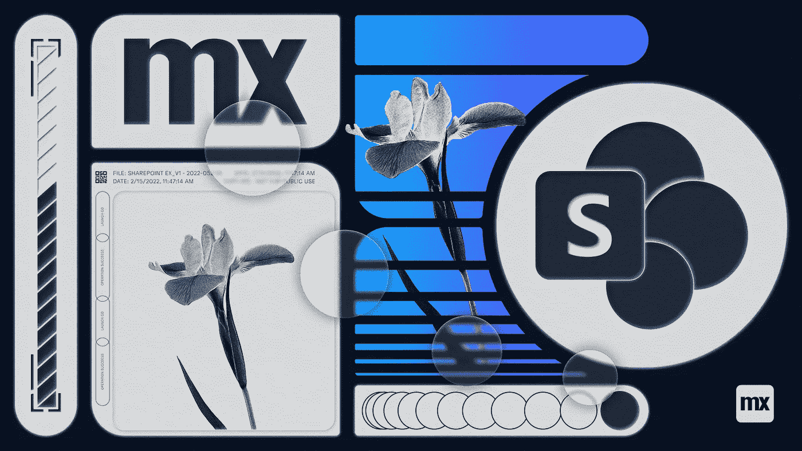

# **在当今的商业中，组织需要安全地收集和存储客户信息，以便有效地运营。大多数人会考虑将他们的数据或文档安全地存储在云中，所有这些都在一个地方，可以与同事和合作伙伴共享。让我们来看看如何使用 Sharepoint 和 Mendix 实现这一点。**

**SharePoint 是一种基于云的服务，提供了一个安全的位置来存储、组织、访问和共享来自任何设备的文档。**

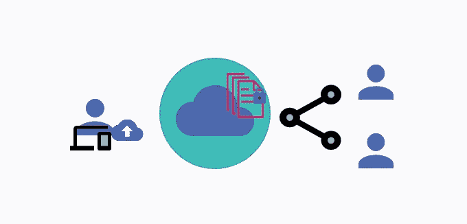

**首先，我们需要知道如何访问 SharePoint**

**让我们从基本设置开始**

SharePoint 是 Microsoft office 套件的产品。要访问 SharePoint，我们需要创建微软 365 开发人员帐户并加入[微软 365 开发人员计划](https://developer.microsoft.com/en-us/microsoft-365/dev-program)！并从配置文件中获取域邮件。

在开始集成步骤之前，我们将简要介绍一下 **Azure Active Directory** 。

> Azure AD 是一个基于云的身份和访问管理服务，一个人只需一套登录凭证就可以注册多个服务，并通过云访问任何地方。

# **在 Azure Active Directory 中创建一个应用程序，开始集成过程。**

**按照步骤实现:**

**第一步:-**
借助
微软开发者会员域名邮箱在 Azure Active Directory 中创建一个 [**开发者账号**](https://portal.azure.com/) 。成功登录后，转到 Azure Active Directory 概述页面。

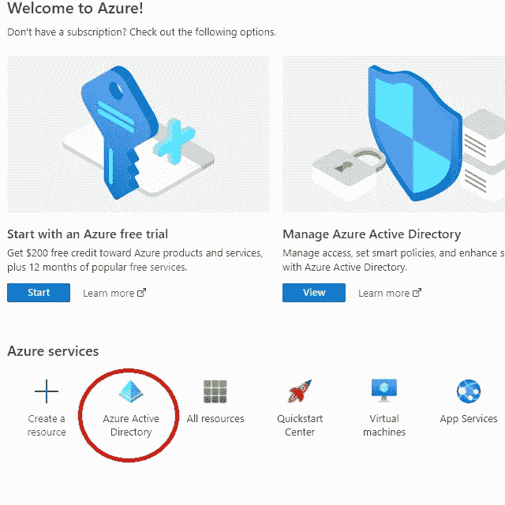

第二步:-
下一步是在 Azure 中创建你的应用。

为此，从菜单中点击**企业应用**并点击新建应用，选择非图库应用，然后命名您的应用并点击**添加**。

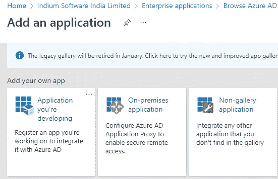

现在已经创建了您的应用程序，但是如果您想从 Mendix 访问它，您需要提供 API 权限和 Grant 类型的客户端凭证来生成访问令牌。

**第三步:-**
点击菜单中的 API 权限，授予访问 API 权限和 SharePoint 权限。

一旦 API 选择完成，点击**授予管理员许可**按钮，为所有 API 提供管理员访问权限。

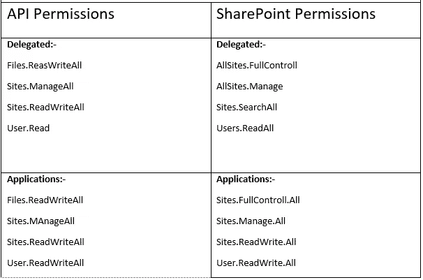

Summary of required Azure API Permissions

**第四步:-** 检查你的申请详情，里面有客户 Id 和租户 Id。
要获取客户端秘密值，点击**客户端凭证**，设置**到期日**，点击**添加**。复制客户端的秘密值(并**将其保存在某个安全的地方**)。

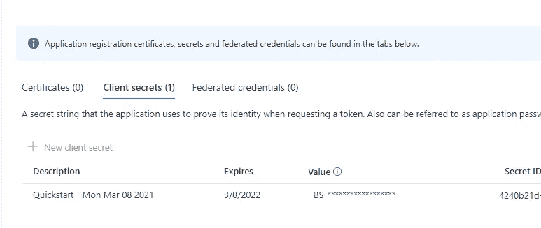

你的 Azure AD 设置完成了，让我们在 **Mendix** 中实现它。
我们需要一个授权令牌来访问 SharePoint，我们需要使用授权类型客户端凭据来生成访问令牌。

# **现在进行 Mendix 集成**

**第一步:-**

在 Mendix Studio Pro 中创建一个应用程序，在域模型中创建一个**实体**，并添加下图所示的属性。右键单击实体以生成概览页面。将所有值存储在数据中。

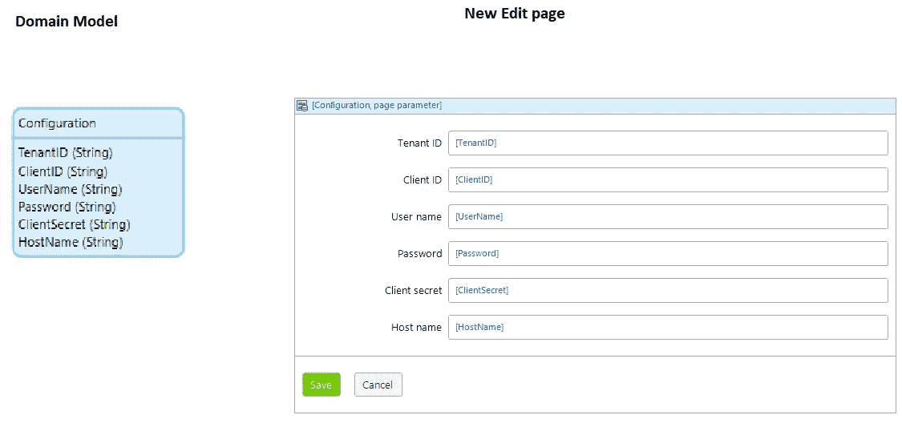

**步骤 2:-** 创建一个微流，通过调用 REST 活动来获取访问令牌。

HTTP 方法帖子和位置 URL:-[https://login.microsoftonline.com/{1}/oauth2/token](https://login.microsoftonline.com/{1}/oauth2/token)

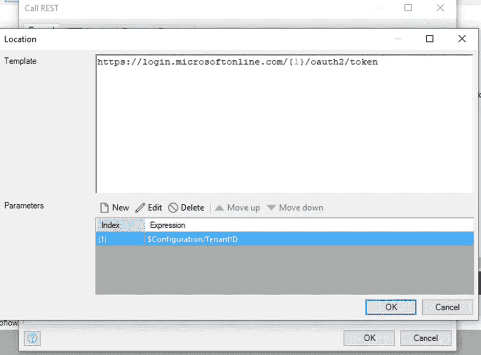

**步骤 3:-**
在请求选项卡中传递客户端 Id、客户端值、用户名和密码。

*资源变量是作为参数传递给此微流的 API 的主机名，资源将根据 API 而变化。
例如:*[*https://graph.microsoft.com/v1.0/sites/{siteid}/lists*](https://graph.microsoft.com/v1.0/sites/%7bsiteid%7d/lists) *这里的资源值将是*[*https://graph.microsoft.co*](https://graph.microsoft.com/)*m*

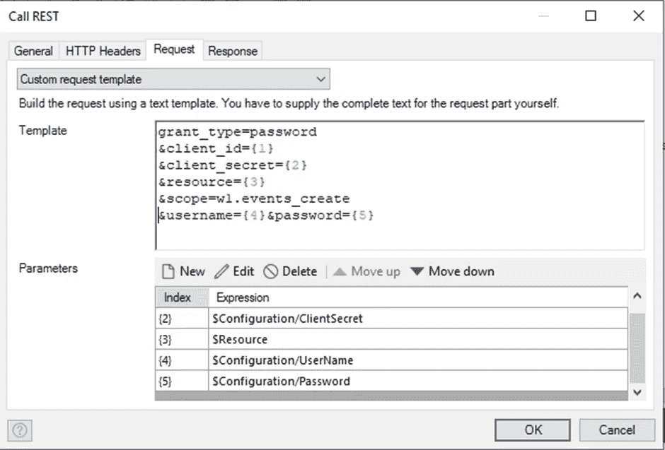

**步骤 4:-** 创建一个导入映射，应用于响应选项卡，以存储值并重用生成的访问令牌。

> **生活帮**:要获得一个 REST 活动响应有效负载的例子，**在 Studio Pro 中进入你的控制台，点击高级- >设置日志级别- >定位 REST 消费和 REST 发布- >将它们都设置为跟踪**。(现在，每当该服务被触发时，它会将有效负载打印到控制台，直到您的日志级别被重置)

使用调试器复制响应，然后创建 JSON 结构并粘贴响应。从新创建的导入映射中选择 JSON 结构，并选择访问令牌元素。

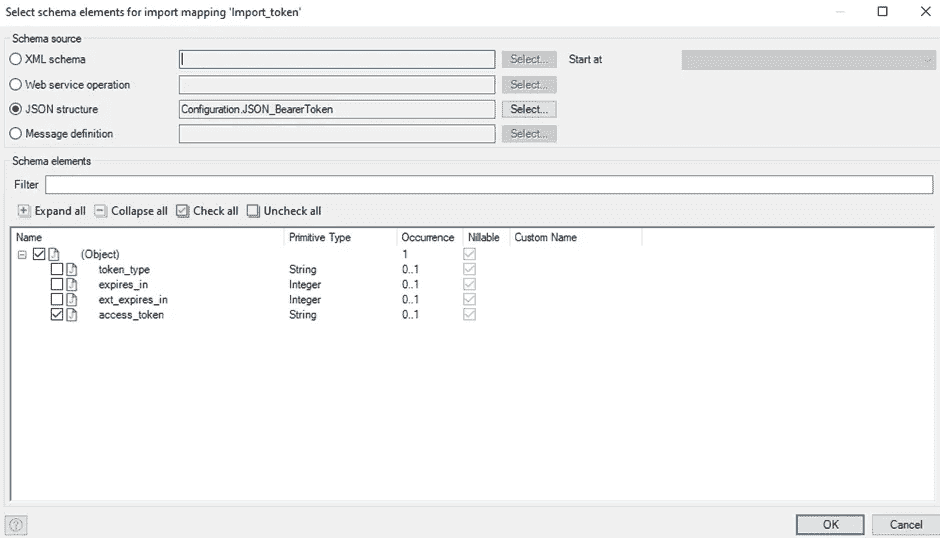

这就是微流的样子。现在让我们看看我们把这个称为微流的地方。

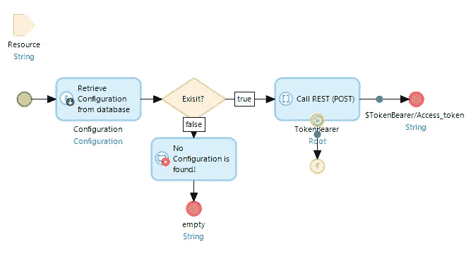

这是从前端上传和提交文件时的整个微流，正如您可以看到的，我们在这里调用上述微流来生成访问令牌。

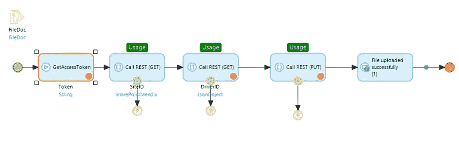

生成令牌后，我们需要站点 ID 和驱动器 ID 来推送文件。将生成的访问令牌作为'**授权:** **无记名** '+ **令牌**作为**自定义 HTTP 头**在 HTTP 头页签中传递。
在导入映射中保存所有响应，与我们保存访问令牌的方式相同。

**步骤 5:-**
获取站点 ID 在 call REST 活动中点击此端点

**HTTP GET** 方法
[https://graph . Microsoft . com/v 1.0/sites/* * * * . SharePoint . com:/sites/Mendix？$select=id](https://graph.microsoft.com/v1.0/sites/****.sharepoint.com:/sites/Mendix?$select=id)
*star 定义你的域名。*

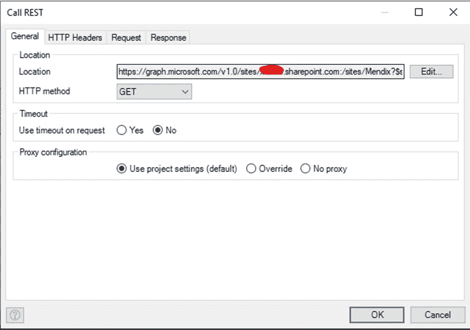

**步骤 6:-**
在自定义 HTTP 头中传递访问令牌值

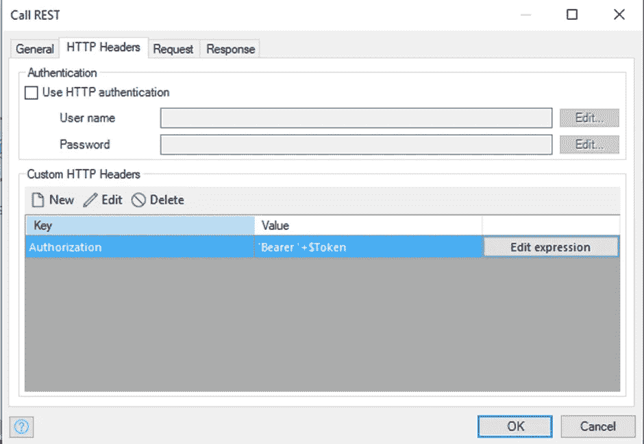

您将收到如下回复，
回复:-

```
{“@odata.context”: “https://graph.microsoft.com/v1.0/$metadata#sites(id)/$entity",“id”: “****************,********************************* “}
```

**步骤 7:-**
将这个响应保存在 JSON 结构中并应用导入映射，我们需要使用来自响应的 ID 值。

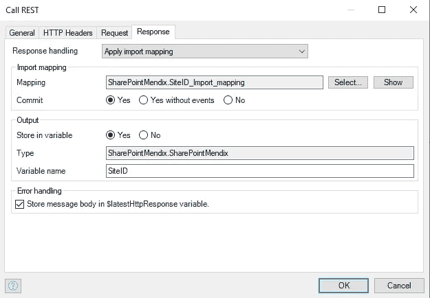

**第八步:-**

现在要获得驱动器 ID，在同一个微流中添加 call REST 活动。插入呼叫休息活动操作。

**HTTP GET** 方法
[https://graph.microsoft.com/v1.0/sites/{1}/](https://graph.microsoft.com/v1.0/sites/%7B1%7D/)驱动

将站点 ID 作为参数传递
保存响应并应用导入映射。

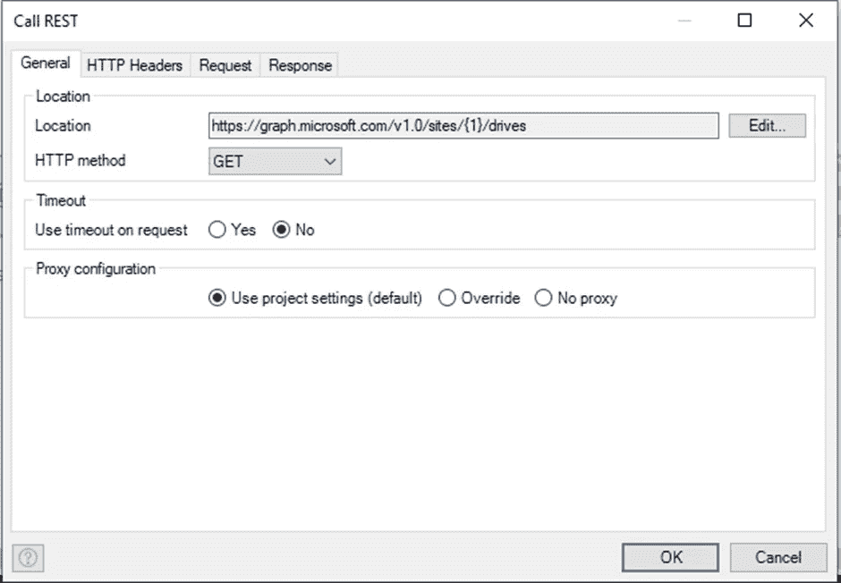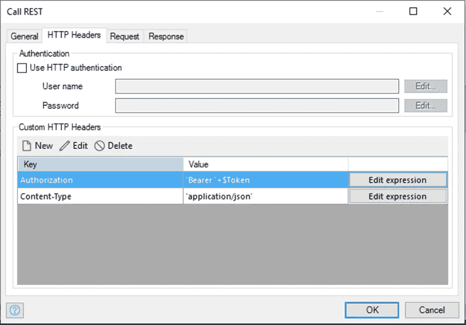

**第九步:-** 下一步是从 Mendix 应用程序将文件推送到 SharePoint。为此，我们需要调用下面的 API

**HTTP PUT** 方法
[https://graph . Microsoft . com/v 1.0/drives/{ { drive-id } }/items/root:/{ { file-name } }:/content](https://graph.microsoft.com/v1.0/drives/%7B%7Bdrive-id%7D%7D/items/root:/%7B%7Bfile-name%7D%7D:/content)
在 HTTP headers 选项卡中传递授权不记名令牌

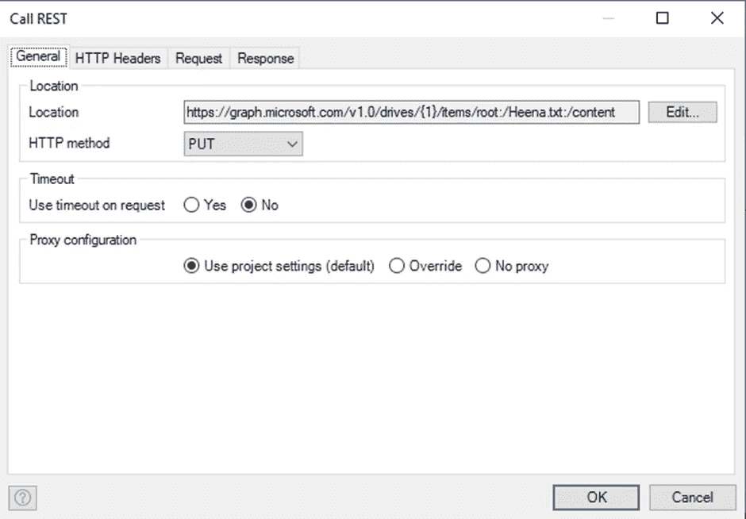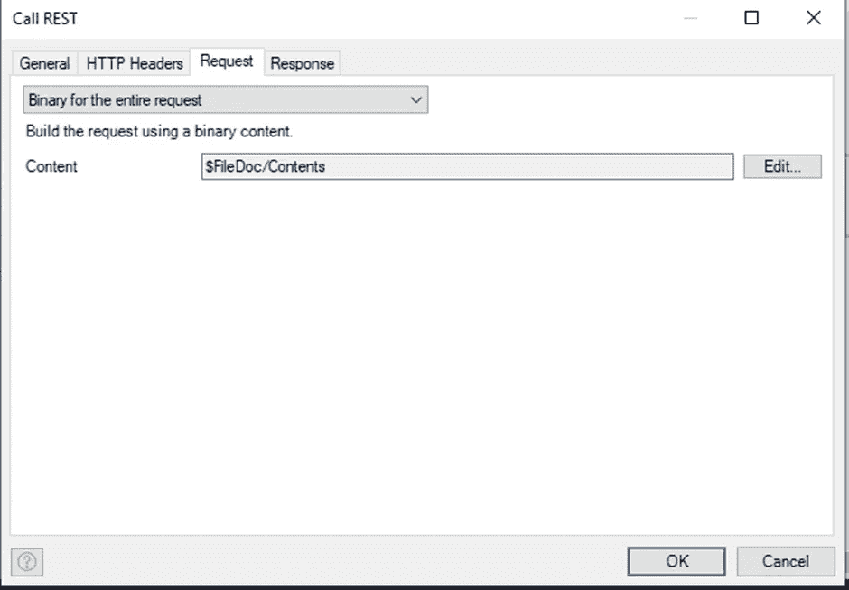

**步骤 10:-** 创建一个新的编辑页面，从保存按钮调用上面的微流

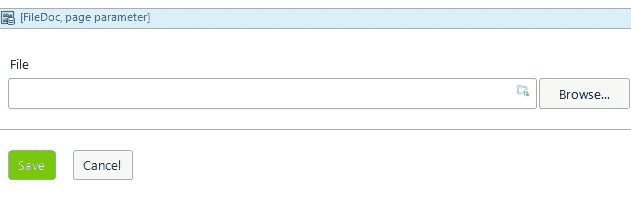

## 最后，我们可以运行我们的应用程序，并进行测试！

上传文件，单击提交保存按钮并检查您的 SharePoint 以查看您上传的文件。

我希望你喜欢学习如何在 Azure AD 和微软的帮助下从 Mendix 应用程序向 SharePoint 推送或上传文件。

**希望这篇文章对你有所收获，谢谢！**

## 阅读更多

[](https://docs.microsoft.com/en-us/sharepoint/) [## SharePoint 文档

### 面向 IT 专业人员和管理员的 SharePoint 文档

docs.microsoft.com](https://docs.microsoft.com/en-us/sharepoint/) [](https://docs.microsoft.com/en-us/azure/active-directory/fundamentals/active-directory-access-create-new-tenant) [## 快速入门-访问和创建新租户- Azure AD

### 您可以使用 Azure Active Directory (Azure AD)门户完成所有管理任务，包括创建一个…

docs.microsoft.com](https://docs.microsoft.com/en-us/azure/active-directory/fundamentals/active-directory-access-create-new-tenant) [](https://docs.mendix.com/refguide/call-rest-action) [## 呼叫 REST 服务- Studio Pro 9 指南| Mendix 文档

### 此活动只能在微流中使用。Call REST 服务活动可用于调用 REST 端点。你…

docs.mendix.com](https://docs.mendix.com/refguide/call-rest-action) [](https://docs.mendix.com/refguide/call-rest-action#http-headers) [## 呼叫 REST 服务- Studio Pro 9 指南| Mendix 文档

### 此活动只能在微流中使用。Call REST 服务活动可用于调用 REST 端点。你…

docs.mendix.com](https://docs.mendix.com/refguide/call-rest-action#http-headers) 

*来自发布者-*

*如果你喜欢这篇文章，你可以在我们的* [*中页*](https://medium.com/mendix) *找到更多喜欢的。对于精彩的视频和直播会话，您可以前往*[*MxLive*](https://www.mendix.com/live/)*或我们的社区*[*Youtube PAG*](https://www.youtube.com/c/MendixCommunity/community)*e .*

*希望入门的创客，可以注册一个* [*免费账号*](https://signup.mendix.com/link/signup/?source=direct) *，通过我们的* [*学苑*](https://academy.mendix.com/link/home) *获得即时学习。*

有兴趣加入我们的社区吗？你可以加入我们的 [*Slack 社区频道*](https://join.slack.com/t/mendixcommunity/shared_invite/zt-hwhwkcxu-~59ywyjqHlUHXmrw5heqpQ) *或者那些想要更多参与的人，看看加入我们的*[*Meetups*](https://developers.mendix.com/meetups/#meetupsNearYou)*。*