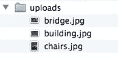

# 如何在 AJAX 中上传文件？逐步指南

> 原文：<https://medium.com/edureka/upload-file-in-ajax-684efdbe70d?source=collection_archive---------2----------------------->


上传文件对开发者来说是一项具有挑战性的任务，但是用 Ajax 上传文件呢？这是难以置信的简单！Ajax 和浏览器支持的进步进一步减轻了文件上传的负担。HTML5 uploader 提供了快速解决方案，但它不安全，并且不能在所有浏览器中工作。在本文中，我们将了解如何在 AJAX 中上传文件:

*   在 AJAX 中上传文件的重要步骤
*   文件上传中第三方的问题
*   上传文件

# 在 AJAX 中上传文件的重要步骤

通过 Ajax 上传文件时，有几个关键步骤需要注意。这看起来有点累人，但是如果方法正确，这是非常容易的。您需要小心:

1.  为 XMLHttpRequest 设置实例
2.  为各种 XMLHttpRequest 处理程序设置对象
3.  设置 Ajax 请求向后端发送数据
4.  验证表单
5.  为观众设置反馈

# 文件上传中第三方的问题

你是否考虑在你的 Ajax 文件上传中加入第三方？通过涉及第三方，您可能会遇到三个主要问题。首先，您将无法控制对存储背后的基础架构的访问。


其次，当文件包含敏感数据时，你会遇到隐私问题，尤其是当你上传健康记录、财务记录或法律文件时。第三，当涉及第三方时，存在不可避免的遗留系统。

# 编码

我们将描述一种用 Ajax 上传文件的方法，只要 formdata 可用，它就能工作。在这种方法中，上传需要三个主要组件或重要文件:

1.  HTML/CSS 文件—文件输入元素及其多个属性
2.  PHP 文件—新的 API 文件和 FileReader 对象
3.  JavaScript — XMLHttpRequest2 和 FormData 对象

**HTML/CSS 文件的标记和样式**

这是一个非常简单的涉及代码的步骤。任何新手都可以这样做，下面是上传的代码:

**HTML 代码**

```
<!DOCTYPE html>
<html lang="en">
<head>
<meta charset="UTF-8" />
<title>HTML5 File API</title>
<link rel="stylesheet" href="style.css" />
</head>
<body>
<div id="main">
<h1>Upload Your Images</h1>
<form method="post" enctype="multipart/form-data" action="upload.php">
<input type="file" name="images" id="images" multiple />
<button type="submit" id="btn">Upload Files!</button>
</form>
<div id="response"></div>
<ul id="image-list">
</ul>
</div>
<script src="https://ajax.googleapis.com/ajax/libs/jquery/1.6.2/jquery.min.js"></script>
<script src="upload.js"></script>
</body>
</html>
```

**CSS 代码**

```
body {
font: 14px/1.5 helvetica-neue, helvetica, arial, san-serif;
padding:10px;
}h1 {
margin-top:0;
}#main {
width: 300px;
margin:auto;
background: #ececec;
padding: 20px;
border: 1px solid #ccc;
}
#image-list {
list-style:none;
margin:0;
padding:0;
}
#image-list li {
background: #fff;
border: 1px solid #ccc;
text-align:center;
padding:20px;
margin-bottom:19px;
}
#image-list li img {
width: 258px;
vertical-align: middle;
border:1px solid #474747;
}
```

看到这可以如此容易地实现，您是否感到震惊？现在，让我们继续创建 PHP 文件。

**PHP:后端开发**

让我们看看如何在后端处理文件上传。随着 PHP 的进步，为了安全起见，我们需要增加几行代码。下面的代码给你一个无错误的文件上传。创建它是为了上传一个文件，然后将它移动到 uploads 文件夹。你需要创建一个名为 upload.php 的文件

```
<?phpforeach ($_FILES["images"]["error"] as $key => $error) {
if ($error == UPLOAD_ERR_OK) {
$name = $_FILES["images"]["name"][$key];
move_uploaded_file( $_FILES["images"]["tmp_name"][$key], "uploads/" . $_FILES['images']['name'][$key]);
}
}
echo "<h2>Successfully Uploaded Images</h2>";
```

您需要链接一个 jQuery 和 upload.js 文件来弹出，如下图所示。


**JavaScript**

使用 Ajax，我们可以隐藏上传图像猫按钮。下面是上传的代码。

```
(function () {
var input = document.getElementById("images"),
formdata = false;if (window.FormData) {
formdata = new FormData();
document.getElementById("btn").style.display = "none";
}
}
();
```

下面给出的是隐藏的帮助函数，有助于文件上传。

浏览器阅读图像后显示图像:

```
function showUploadedItem (source) {
var list = document.getElementById("image-list"),
li = document.createElement("li"),
img = document.createElement("img");
img.src = source;
li.appendChild(img);
list.appendChild(li);
}
```

向用户显示图像后，您需要显示图像并上传文件。

onchange 事件被激发。

```
if (input.addEventListener) {
input.addEventListener("change", function (evt) {
var i = 0, len = this.files.length, img, reader, file;document.getElementById("response").innerHTML = "Uploading . . ."for ( ; i < len; i++ ) {
file = this.files[i];if (!!file.type.match(/image.*/)) {}
}}, false);
}
```

图像上传后，我们需要确认文件是否是图像，以及它是否在指定的长度和大小。

检查以下代码:

```
if ( window.FileReader ) {
reader = new FileReader();
reader.onloadend = function (e) {
showUploadedItem(e.target.result);
};
reader.readAsDataURL(file);
}
if (formdata) {
formdata.append("images[]", file);
}
```

我们需要将 file 对象传递给 reader.readAsDataURL，该操作为上传的图像创建一个数据 URL。这个数据 URL 不会从函数传递回来，而是作为 even 对象的一部分使用。我们需要检查浏览器是否支持 formdata 和 FormData 对象。

它保存我们使用表单提交的值。在 images[]中添加方括号将追加另一个值，而不是覆盖。

现在，上传图像的最后一步将通过下面这段代码来完成。

```
if (formdata) {
$.ajax({
url: "upload.php",
type: "POST",
data: formdata,
processData: false,
contentType: false,
success: function (res) {
document.getElementById("response").innerHTML = res;
}
});
}
```

一旦上传结束，我们需要看看它是否支持表单数据，因为我们是使用 Ajax 上传的，它应该可以避免所有的错误和特殊情况。
当用户尝试上传图片时，会弹出如下图片:


选择图像后，屏幕上会显示:

一旦图像上传完成:



使用 Ajax 上传文件就像在公园散步一样简单。随着新技术的进步，这些任务应该变得尽可能简单。

至此，我们结束了 AJAX 文章中的上传文件。

如果你想查看更多关于人工智能、Python、道德黑客等市场最热门技术的文章，那么你可以参考 [Edureka 的官方网站。](https://www.edureka.co/blog/?utm_source=medium&utm_medium=content-link&utm_campaign=upload-file-in-ajax)

```
if (!!file.type.match(/image.*/)) {}
}}, false);
}
```

*原载于 2019 年 9 月 23 日【https://www.edureka.co】[](https://www.edureka.co/blog/upload-file-in-ajax)**。***