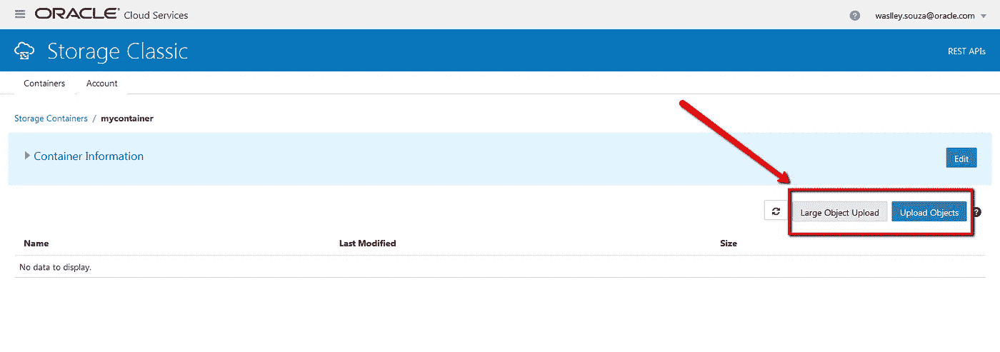
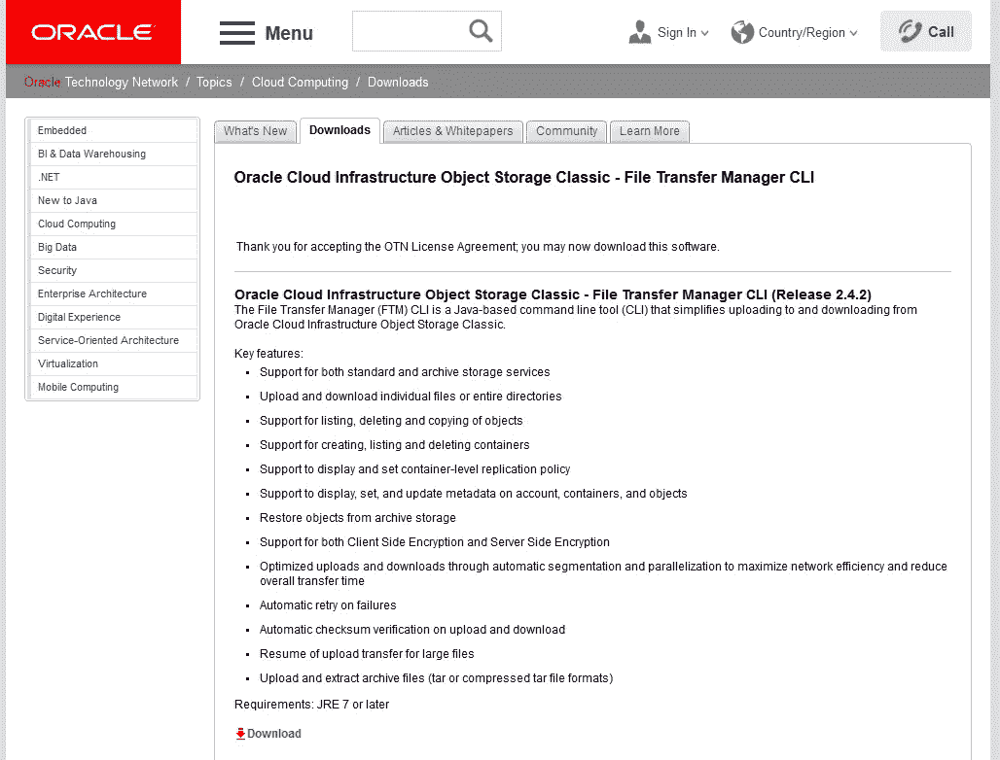
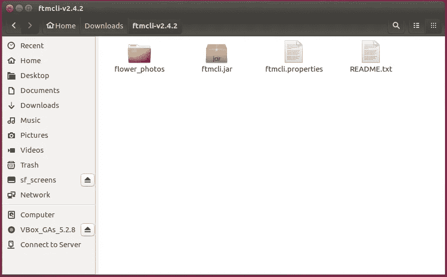
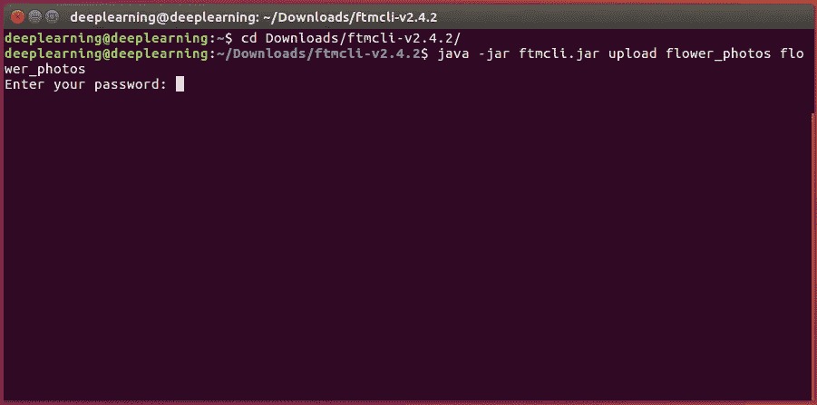
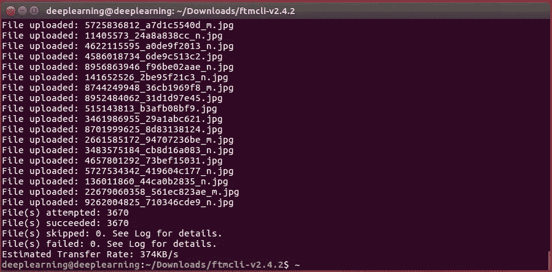
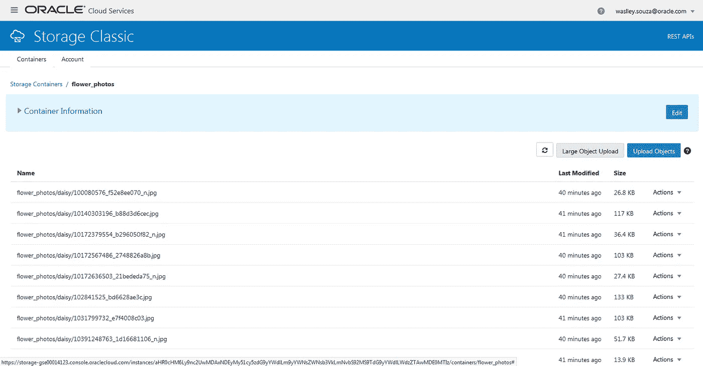

# 使用 FTM CLI 将文件上传到 Oracle 对象存储经典版

> 原文：<https://medium.com/oracledevs/upload-files-to-oracle-object-storage-classic-with-ftm-cli-fffc4b12bd96?source=collection_archive---------5----------------------->

当您有一些文件要上传到 Oracle Cloud Object Storage Classic 时，您可以使用 web 界面上的上传按钮，这非常简单！



但是当你需要上传数百或数千个组织在文件夹中的文件时，你需要一个工具来使它变得更容易。在这篇博文中，您将了解如何使用 Oracle Cloud infra structure Object Storage Classic File Transfer Manager 命令行界面(FTM CLI)在 Oracle Cloud 中上传这些文件。

首先在这里下载 FTM CLI:[http://www . Oracle . com/tech network/topics/cloud/downloads/storage-cloud-upload-CLI-3424297 . html](http://www.oracle.com/technetwork/topics/cloud/downloads/storage-cloud-upload-cli-3424297.html)。



解压缩该文件，并使用您的环境信息编辑 ftmcli.properties 文件。
在大多数情况下，你只需要改变用户名和 REST 端点的 URL。

```
#---------------Account parameters---------------

# Your user name if you're using FTM CLI 2.4.
# In case of FTM CLI 2.3 or earlier, user=Storage-acme:jack.jones@example.com
# OR similar to user=Storage-7b16fede61e1417ab83eb52e06f0e365:jack.jones@example.com
# for a REST Endpoint (Permanent).
user=jack.jones@example.com

# REST Endpoint URL for your account
# In case of REST Endpoint (Permanent), use similar to the following:
# https://storage-7b16fede61e1417ab83eb52e06f0e365.storage.oraclecloud.com/v1/Storage-7b16fede61e1417ab83eb52e06f0e365
rest-endpoint=https://acme.storage.oraclecloud.com/v1/Storage-acme
```

将您想要上传到 Oracle Cloud 的文件夹复制到 FTM 文件夹中。



打开终端并执行以下命令。

```
java -jar ftmcli.jar upload flower_photos flower_photos
```

输入您的密码开始上传。



等待您的文件上传到云。



上传完成后，你所有的文件都将保存在云中，你可以使用它们。



玩得开心！

*原载于 2018 年 5 月 7 日 waslleysouza.com.br**的* [*。*](http://waslleysouza.com.br/en/2018/05/upload-files-to-oracle-object-storage-classic-with-ftm-cli/)