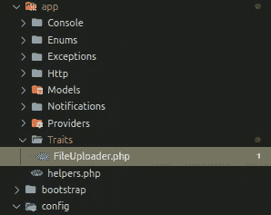
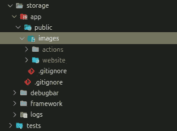

# Upload Multiple File (Using Trait) For Your Laravel App

> 原文：<https://medium.easyread.co/upload-multiple-file-using-trait-for-your-laravel-app-2f84404492a7?source=collection_archive---------3----------------------->

Assalamu’alaikum Warahmatullahi Wabarakatuh…

Baiklah, kali ini kita akan membagikan cara meng-upload file di laravel menggunakan trait. Kenapa memakai trait? sebelum tahu hal ini, kemungkinan besar kalian belum terlalu paham hal dasar dari OOP (Object Oriented Programming) karena tujuan dari OOP sendiri adalah kita membuat class2 yang re-usable yang sangat berguna agar kita bisa menerapkan konsep DRY (Don’t Repeat Yourself).

Seperti yang kita bahas diatas. Kita menggunakan trait disini, karena fungsi di dalam `Trait` ini, akan kita gunakan di banyak `controller` nantinya. Jadi, untuk memanggilnya kita hanya perlu menggunakan:

```
...use App\Traits\*FileUploader*;...class UserController extends Controller
{
  use FileUploader; ...
}
```

Dengan cara ini, akan menjadikan code di dalam file `FileUploader.php` menjadi lebih re-usable tentunya.

Langsung saja, pertama kita buat dulu Folder `Traits` di dalam `App`

Kemudian buatlah sebuah file bernama `FileUploader.php`



Trait Directory

Isi dari file `FileUploader.php` bisa kalian tambahkan seperti dibawah ini:

Kode di atas berisi dua buah funcion untuk meng-upload dua file berbeda. function `uploadImages()` untuk mengupload asset gambar dari aplikasi kita, sedangkan function `uploadPhoto()` untuk mengupload avatar dari user di aplikasi laravel kita.

Tentunya masih sangat memungkinkan untuk berubah-ubah sesuai dengan *case* yang kita punya di project masing-masing.

Untuk memahami cara kerjanya, akan saya contohkan di dalam sebuah controller.

ini adalah contoh saat kita mengupload banyak file di dalam controller:

```
public *function* create()
{
  ...
}public *function* store(*Store* $request)
{ $website = *Website*::create($request->validated()); *$this*->uploadImage($request, $website, 'website', 'hero');
 *$this*->uploadImage($request, $website, 'website', 'profile_img');
 *$this*->uploadImage($request, $website, 'website', 'penelitian_img');
 *$this*->uploadImage($request, $website, 'website', 'pengabdian_img');
 *$this*->uploadImage($request, $website, 'website', 'pengabdian_img');
 *$this*->uploadImage($request, $website, 'website', 'kontak_img1');
 *$this*->uploadImage($request, $website, 'website', 'kontak_img2');
 *$this*->uploadImage($request, $website, 'website', 'kontak_img3');
 *$this*->uploadImage($request, $website, 'website', 'kontak_img4') return redirect()->back()->withSuccess('Website Kampus saved');}public  *function* show(*Website* $website)
{
  ...
}
```

Parameter pertama, diisi dengan variabel `$request` .
Parameter kedua, berisi data yang baru saja dibuat yang ditampung dalam variabel `$website`

Parameter ketiga, diisikan nama directory setelah `storage/app/public/images/...`



storage dir

dan terakhir, Parameter keempat yang merupakan opsional (boleh dikosongkan) diisi dengan:

*   attribute `name="..."` di tag html `<input ...>`
*   nama kolom di table database kita

> kedua nama diatas **HARUS SAMA !** untuk membuat efisien penulisan kode

> Update 21 September 2021

Penambahan dua function untuk upload, dan delete file untuk mempermudah kita saat membaca kodingan di `controller` . Untuk cara pakainya seperti berikut:

```
public function destroy(Data $data) { // delete file
 *$this*->deleteFile($pertemuan->materi_pembelajaran); $data->delete();}
```

Mungkin sampai disini dulu, jika kalian merasa artikel ini bermanfaat. Silahkan klik ikon 👏(clap) dan bagikan ke teman2 lain yang membutuhkan.

Sekian. Semoga bermanfaat.

Wassalamu’alaikum Warahmatullahi Wabarakatuh…