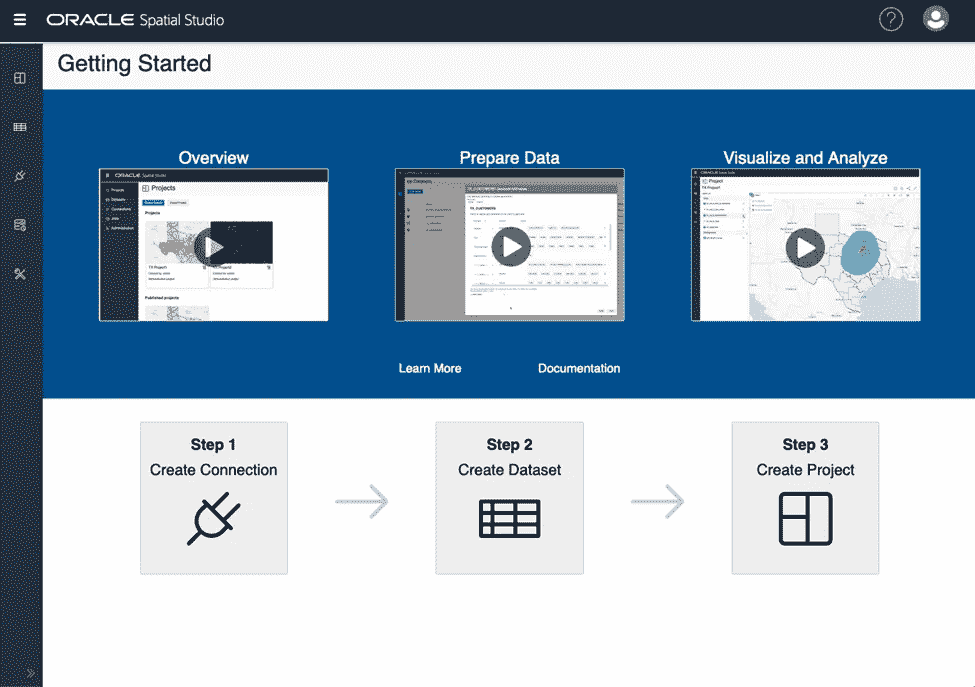
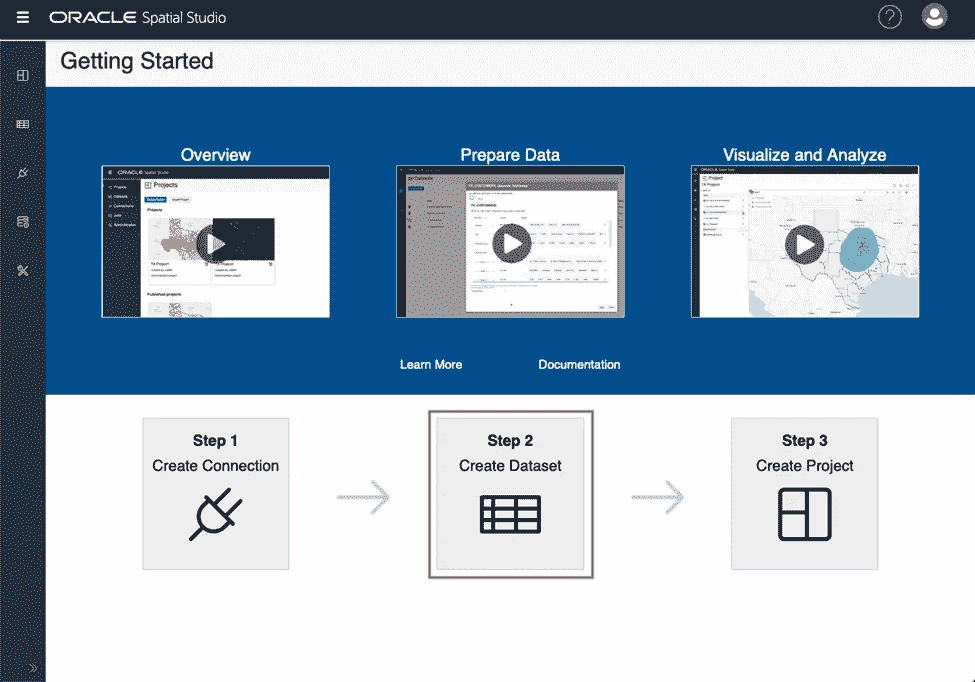
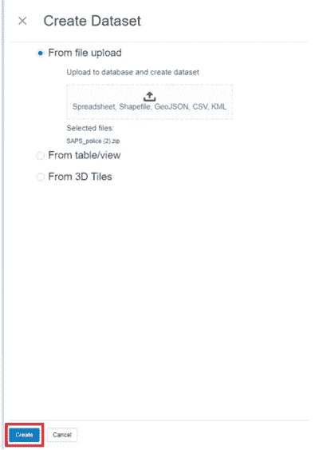
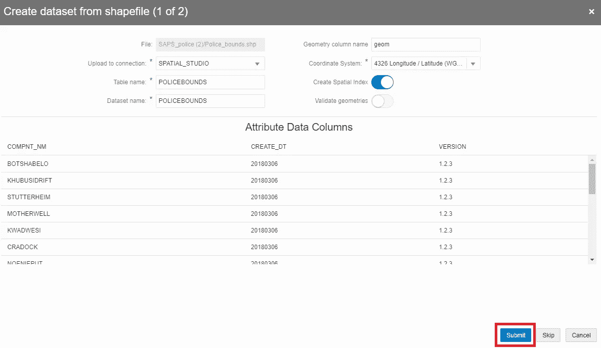
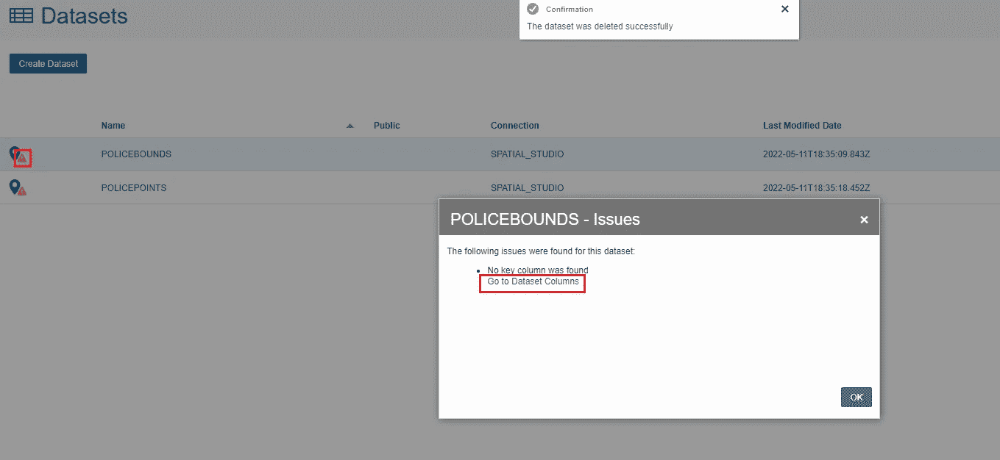
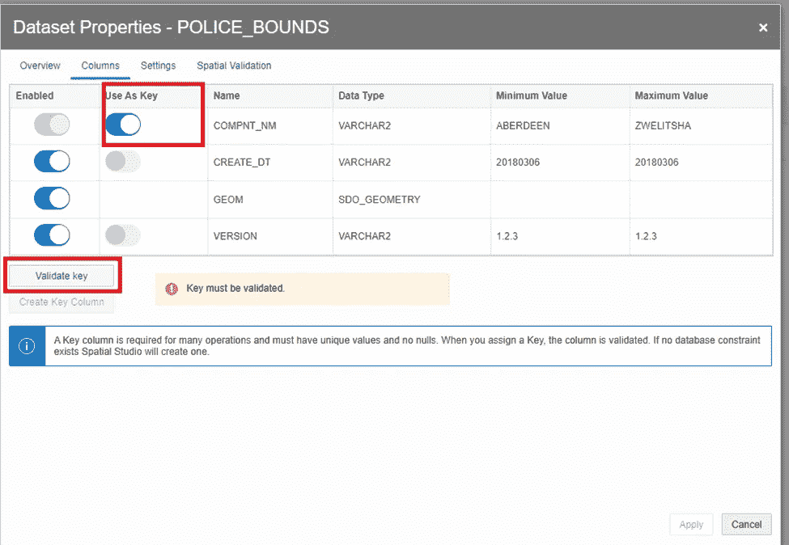
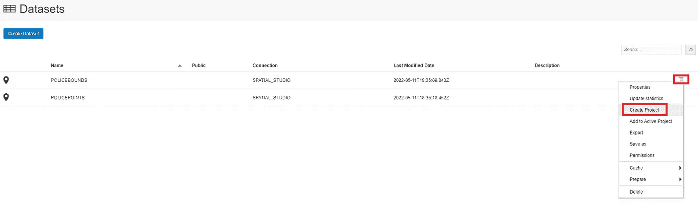
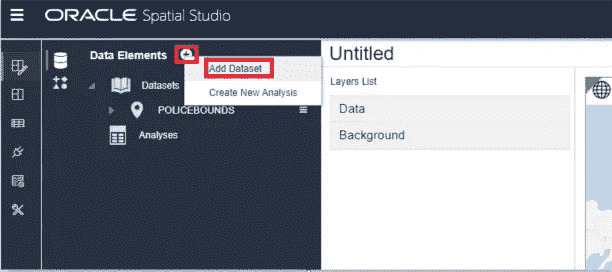
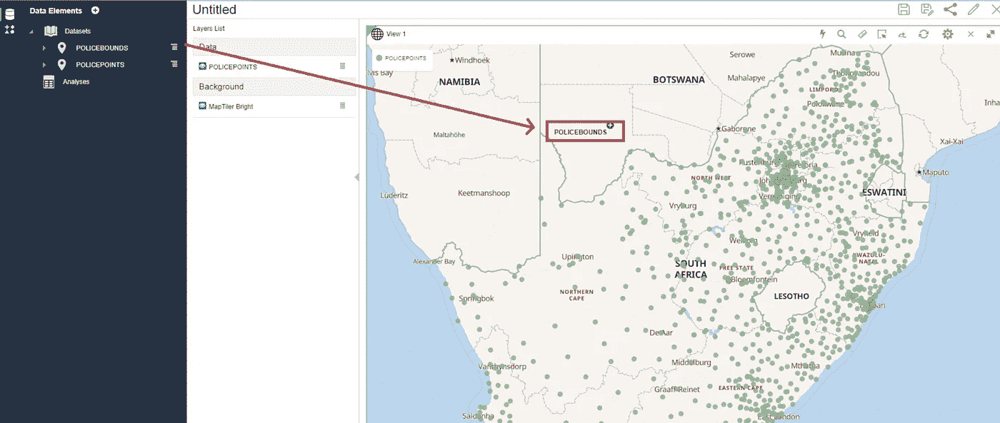
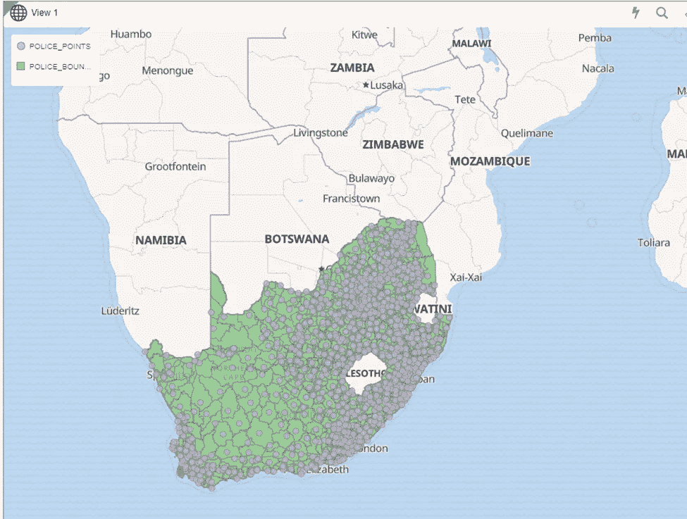

# 将 Shapefiles 上传到 Oracle Spatial Studio

> 原文：<https://medium.com/oracledevs/upload-shapefiles-to-oracle-spatial-studio-db08cf8cb76d?source=collection_archive---------2----------------------->

Oracle Spatial Studio 注重全面和易于使用，因此用户可以专注于解决业务关键型需求，而不是试图弄清楚如何使用基本工具。

在这篇博客中，我将向您展示将 shapefiles 上传到 Spatial Studio 是多么容易，Spatial Studio 是一个用于使用 Oracle 数据库的 [Spatial](https://www.oracle.com/database/spatial/) 功能的无代码 web 工具。我将使用 Spatial Studio 和 Oracle 自治数据库。有关 Spatial Studio 的更多信息，包括部署选项，请点击[这里](https://www.oracle.com/database/technologies/spatial-studio/get-started.html)。

在这个场景中，我们将使用包含警察边界和事故信息的文件。我们希望根据事故发生最多的地方来验证警察局是否位于最佳位置。

我们已经提供了一个自治数据库，为 Spatial Studio 创建了一个用户，并安装了 Spatial Studio(这个[研讨会](https://apexapps.oracle.com/pls/apex/dbpm/r/livelabs/view-workshop?wid=778&clear=180&session=111366777721822)帮助您执行这些步骤)。我们将直接上传形状文件。

***上传 Shapefile 到 Spatial Studio***

1.  我们不会在这里创建连接，因为我们可以使用 Spatial Studio 存储库连接进行验证。点击图块**步骤 2 创建数据集**。

*注意:我们建议将 shapefiles(或任何其他空间数据)加载到专用模式中，而不是使用 Spatial Studio 元数据模式。*

2.然后将文件拖放到文件上传磁贴，或者单击文件上传磁贴并导航到该文件。点击 **创建**。Spatial Studio 接受电子表格、shapefiles、GeoJSON、CSV 和 KML。您也可以将数据集保存在 zip 文件中，然后直接上传 zip 文件！

3.在数据预览中，将上传到连接设置为 SPATIAL_STUDIO。如果表名或数据库名包含特殊字符，您可能需要更改它们的格式。然后点击**提交**。

4.上传完成后，将会列出数据集。可能会出现一个警告图标，指示需要采取的操作。单击警告图标，然后单击链接**转到数据集列**来分配一个键列。

5.选择想要用作密钥的属性，然后点击**验证密钥**。在这种情况下，COMPNT_NM 是包含唯一值的属性。如果您的数据集没有包含唯一值的属性，您可以单击**创建键列**，将会为您创建一个键。

验证密钥后，点击**应用**。

6.点击您正在使用的数据集的操作菜单，并选择**创建项目**。

如果需要，您可以通过点击+号并选择**添加数据集**来添加更多数据集。

7.单击并拖动要显示的数据集，然后将其放在地图上的任意位置。

数据集将作为地图图层添加，地图将平移并缩放至数据区域。

您的 shapefile 已上传并显示在地图上！

想讨论一下吗？加入我们的[公共 Slack 频道](https://bit.ly/devrel_slack)与其他 Oracle 开发人员交流！