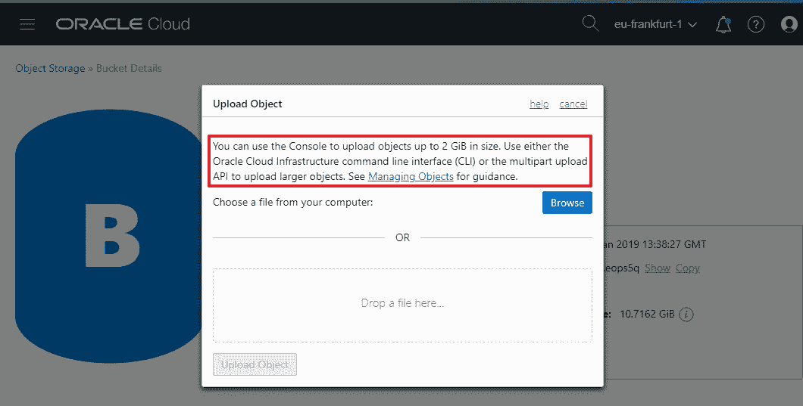

# 使用命令行界面(CLI)将大文件上载到 Oracle 对象存储

> 原文：<https://medium.com/oracledevs/uploading-large-files-to-oracle-object-storage-using-a-command-line-interface-cli-56a6d96f43d8?source=collection_archive---------0----------------------->


Object Storage common Use Cases

在这篇博文中，我将列出并解释在 Linux 或 MacOS 上使用命令行界面(CLI)将大文件上传到 Oracle 对象存储所需的步骤。

# 介绍

Oracle 云基础设施提供了一种[对象存储服务](https://cloud.oracle.com/storage/object-storage/features)，允许以高度安全、可扩展和持久的方式将文件存储为对象。

对象存储可以支持多种用例，包括日志分析、数据湖的创建、数据迁移、备份和灾难恢复。

Oracle Cloud 提供了一个 Web 控制台来将文件上传到对象存储，但是，它只能上传最大 2 GB 的文件。对于较大的文件，用户可以使用 API、Java SDK 或[命令行界面(CLI)](https://docs.cloud.oracle.com/iaas/Content/API/Concepts/cliconcepts.htm) 执行多部分上传。

上传对象的最大大小为 10 TiB。目标零件不得大于 50 GiB。



Files up to 2 GiB can be uploaded using the Web Console

# 安装和配置 CLI

使用 CLI 将大型对象上传到对象存储的第一步是[安装和配置 CLI 本身](https://docs.cloud.oracle.com/iaas/Content/API/SDKDocs/cliinstall.htm)。

CLI 基于 Python(2 . 7 . 5 或 3.5 或更高版本)构建，因此我们需要确保上传文件的机器上安装了这两个 Python 版本。

打开终端后，我们可以运行以下命令来运行安装程序并响应一些提示(默认值是可以的):

```
bash -c "$(curl -L [https://raw.githubusercontent.com/oracle/oci-cli/master/scripts/install/install.sh](https://raw.githubusercontent.com/oracle/oci-cli/master/scripts/install/install.sh))"
```

成功完成安装后，我们需要运行一个一次性配置过程，该过程将在`~/.oci`目录下存储一个配置文件。CLI 请求使用 API 密钥进行身份验证，因此如果您需要生成密钥对，可以先运行`oci setup keys`并提供一个路径来存储生成的私有和公共密钥(在这种情况下，不要忘记将生成的公共密钥上传到用户控制台，以便身份验证机制正常工作)。

要开始配置过程，我们需要运行`oci setup config`命令并按照提示进行操作。将需要三个参数:

1.  [租赁 OCID](https://docs.cloud.oracle.com/iaas/Content/API/Concepts/apisigningkey.htm#Other) ，可以在 OCI 控制台*管理>租赁详情*下找到
2.  [用户 OCID](https://docs.cloud.oracle.com/iaas/Content/API/Concepts/apisigningkey.htm#Other) ，可以在 OCI 控制台下找到身份>用户>用户>用户 A
3.  [地区名称](https://docs.cloud.oracle.com/iaas/Content/General/Concepts/regions.htm)，例如`eu-frankfurt-1`，如果您使用的是法兰克福数据中心

生成的配置文件将类似于下面的屏幕截图(出于安全目的，我将一些部分像素化):


The CLI generated configuration file

# 生成一个随机的大文件

如果您没有用于测试目的的大文件要上传，您可以利用下面的 Unix 命令生成一个大约 10 GB 的随机文本文件:

```
# Generate a ~10 GB random file
dd if=/dev/urandom of=random_file.txt bs=1048576 count=10000
```

# 上传大文件

现在可以使用`oci os object put`命令上传上一步生成的随机文本文件:

```
oci os object put \
-ns <object_storage_namespace> \
-bn <bucket_name> \
--file <file_location> \
--name <object_name> \
--part-size <upload_part_size_in_MB> \
--parallel-upload-count <maximum_number_parallel_uploads>
```

让我们快速回顾一下该命令使用的参数:

*   ***ns*** (可选)[对应 OCI 租赁名称](https://docs.cloud.oracle.com/iaas/Content/Object/Tasks/understandingnamespaces.htm) —如果没有提供，则使用`oci os ns get`进行检索
*   ***bn*** 是我们上传文件的存储桶名称，如果不存在，需要先创建
*   ***文件*** 是要上传的本地文件的路径，例如`/path/to/random_file.txt`
*   ***名称*** (可选)为上传的对象指定一个不同的名称
*   ***部分大小*** (可选)是通过多部分上传操作上传时使用的部分大小(以 MiB 为单位)
*   ***并行上传计数*** (可选)表示可以并行上传的最大零件数(默认为 3)


An example of CLI upload

也可以指定其他参数。可以在[这里](https://docs.cloud.oracle.com/iaas/tools/oci-cli/latest/oci_cli_docs/cmdref/os/multipart.html)找到对象存储对象 PUT 的完整 CLI 命令参考。

上传操作完成后，您可以在存储桶中看到上传的文件:


Files can be viewed and downloaded from the Web Console

# 在 Oracle 云上免费试用

对象存储只是 Oracle 云提供的众多服务之一。还有许多其他方法可以用来增强您的云应用程序。

你可以通过[在这里](http://bit.ly/LucaMediumBlogOCI)注册一个免费试用账户来尝试我在本教程中描述的步骤，并借此机会发现 OCI 提供的许多其他服务。

[试用甲骨文云 30 天！](http://bit.ly/LucaMediumBlogOCI)