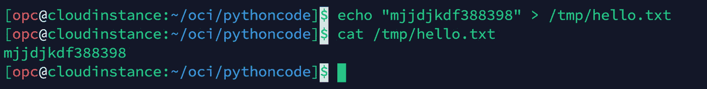

# 使用 AWS Python SDK 将文件上传到 Oracle 云基础架构对象存储

> 原文：<https://medium.com/oracledevs/use-aws-python-sdk-to-upload-files-to-oracle-cloud-infrastructure-object-storage-b623e5681412?source=collection_archive---------0----------------------->

甲骨文云基础设施(OCI)有一个互联网规模的对象存储称为 OCI 对象存储服务。OCI 对象存储提供亚马逊 S3 兼容的 API 的，使用它你可以从任何工具或支持亚马逊 S3 的 SDK 访问 OCI 对象存储。

亚马逊的 Python SDK 叫 BOTO3。Boto3 可以用于多种 AWS 服务，但在这篇博客文章中，我们将专注于给 S3 打电话。我们将创建一个 Boto3 Python 脚本来查询一个 OCI 桶，然后使用亚马逊的 S3 API 将文件上传到桶中。如果您正在构建本质上是多云计算的应用程序，这是一个非常方便的特性。


**OCI 的先决条件步骤:**

1.  **从 OCI 用户设置创建客户密钥(S3 兼容密钥现在称为“客户密钥”)**

**A.** 转到 OCI 控制台>用户设置>客户密钥


**B.** 生成密钥。对于 AWS SDK 验证，OCI 密钥将为“***”AWS _ Secret _ access _ key***


复制并保存此密钥，因为它不会再次显示。

**C.** 复制创建客户密钥后显示的访问密钥。在 AWS SDK 身份验证中，OCI 访问密钥将是您的'***AWS _ Access _ Key _ id***'。


**2。用 pip 安装 Python3 和依赖包在任何 Linux 虚拟机或你的本地客户机上安装 awscli，boto3 (Boto3 是 Amazon 的 Python SDK)**

用 apt 在 Debian 发行版上安装 Python3

$ `sudo apt-get install python3.7`

使用 yum 在 Redhat 发行版上安装 Python3

$ `sudo yum install python37`

用 zypper 在 Suse 发行版上安装 Python3

$ `sudo zypper install python3-3.7`

在 Mac OS 上安装 Python3 和自制软件

$ `/bin/bash -c "$(curl -fsSL https://raw.githubusercontent.com/Homebrew/install/HEAD/install.sh)"`

$ `brew install python3`

$ `python3 --version`

安装 AWS SDK 的相关 Python 包

$ `pip3 install boto3`

$ `pip3 install awscli`

**3。在您的 OCI 租赁中创建一个 Bucket，您将在其中加载文件**

OCI 控制台>对象存储>存储桶>“创建存储桶”


**4。使用下面的代码将密钥凭证添加到. py 文件中。**

这个脚本将列出您的 OCI bucket，然后将一个样本文件从您的本地实例(VM)或客户机中的/tmp 上传到您的 OCI bucket。在我的例子中，在 OCI 的“ap-sydney-1”区域中，存储桶的名称是“Shadab-DB-Migrate”

```
Important Note : This code is a simple ListBucket and PutObject operation to OCI using Amazon Python SDK. Please note not all S3 API operations are supported. For all supported S3 operations refer : [https://docs.oracle.com/en-us/iaas/Content/Object/Tasks/s3compatibleapi.htm](https://docs.oracle.com/en-us/iaas/Content/Object/Tasks/s3compatibleapi.htm)***aws_secret_access_key*** is the Secret key of OCI displayed in Section 1.B***aws_access_key_id*** is the Access Key of OCI displayed in Section 1.C***endpoint_url*** is in format https://<OCI-Tenancy-Namespace>.compat.objectstorage.<OCI-Region>.oraclecloud.com
eg: [https://ocicpm.compat.objectstorage.ap-sydney-1.oraclecloud.com](https://ocicpm.compat.objectstorage.ap-sydney-1.oraclecloud.com)In newer OCI tenancies the tenancy namespace is a random string instead of a proper noun. Ref : [https://docs.oracle.com/en-us/iaas/Content/Object/Tasks/understandingnamespaces.htm](https://docs.oracle.com/en-us/iaas/Content/Object/Tasks/understandingnamespaces.htm)
```

Python BOTO3Scipt : OCIS3.py

**5。执行 Python 代码列出所有的 Bucket 并将 fie /tmp/hello.txt 上传到 Bucket**

$ `echo "mjjdjkdf388398" > /tmp/hello.txt`



$ `python3 OCIS3.py`


现在，您可以看到文件出现在您的 OCI 存储桶中


**结论:**

我们可以轻松地使用 AWS 的原生 SDK 将文件上传到 Oracle 对象存储或执行更多 S3 操作。下面列出了 OCI S3 兼容 API 的一些使用案例。

**多种云使用案例:**

1.  如果您的 ETL 系统运行在 AWS 上，您可以将数据从 AWS 中的上游系统发送到 Oracle 自治数据库，使用 OCI 的 [OAC 进行分析。](https://www.oracle.com/middleware/technologies/oracle-analytics-cloud.html)
2.  在多云环境中，您可以将关键文件备份到 Oracle Cloud，作为关键数据的额外可用性机制。如果 AWS 在某个地区出现故障，这可能是一个节省业务的事件。
3.  使用 OCI 对象存储作为任何第三方云备份工具的备份目标。如果您有一个多云环境，并且希望使用单一工具备份到多个云，这一点非常重要。大多数云备份工具支持 S3，因此您不需要投资新工具来备份到 OCI。
4.  将数据从 AWS RDS 实例卸载到 Oracle 自治数据库。您可以绕过任何中间层，将 RDS 事务作为 CSV 或 Parquet 文件直接卸载到 Oracle 对象存储。这也可以使用 AWS Python Lambda 函数来完成。但那是另一篇博文的故事了:)

**参考资料:**

【1】[https://docs . cloud . Oracle . com/en-us/iaas/Content/Object/Tasks/S3 compatibleapi . htm](https://docs.cloud.oracle.com/en-us/iaas/Content/Object/Tasks/s3compatibleapi.htm)
【2】[https://docs . cloud . Oracle . com/en-us/iaas/Content/Identity/Tasks/managingcredentials . htm # work 2](https://docs.cloud.oracle.com/en-us/iaas/Content/Identity/Tasks/managingcredentials.htm#Working2)
【3】[https://aws.amazon.com/sdk-for-python/](https://aws.amazon.com/sdk-for-python/)