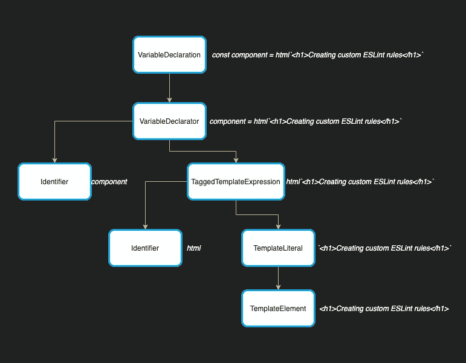

# 使用 ESLint 加强设计系统

> 原文：<https://medium.com/quick-code/use-eslint-to-enforce-design-system-eaffbb1cd4e7?source=collection_archive---------1----------------------->

## 了解 ESLint 如何构建测试规则，以确保设计系统组件在生产中得到正确使用

如果您正在为您的公司或开源社区创建一个设计系统组件库，那么您很可能对最终用户应该如何使用您的设计系统有强烈的意见。

为了确保您的设计系统以预期的方式使用，并减少可能的错误数量，您可能希望您的用户遵循您的最佳实践。以下是两个可能的最佳实践示例:

*   避免元素中的内联样式
*   确保工具提示不包含交互式内容。

> 如果你是唯一一个设计、开发和使用你的设计系统的人，那么你可以放心地睡觉，因为你知道你的设计系统被完全按照预期的方式使用。

有可能你不是唯一一个开发设计系统的人，当有人使用它的时候你肯定不会在场。你如何确信每个人都遵守你的设计系统的最佳实践？您可以祈祷并相信您的最终用户会阅读文档，注意您的警告，并且永远不会不遵守您的规则。

不幸的是，情况往往不是这样，很容易错过警告或误解如何正确使用工具。

鼓励你的消费者遵循你的最佳实践的一个好方法是通过使用 [ESLint](https://eslint.org/) ，一个静态分析工具来发现你的代码中的问题。

默认情况下，ESLint 附带了一些通用的最佳实践，称为*规则*，如果违反了这些规则，它会在你的 IDE 中显示红色的曲线。这些规则包括:

*   对象中没有重复的键
*   没有不可及的代码
*   没有未使用的变量

然而，您在项目中启用的规则不需要直接来自 ESLint。像 [Cypress](https://www.cypress.io/) 、 [Lodash](https://lodash.com/) 和 [React](https://reactjs.org/) 这样的流行库都有 ESLint 配置，任何人都可以在自己的项目中使用，以确保用户遵循最佳实践。如果您是 JavaScript 语言的勇敢探索者，您可以更进一步，创建特定于您的设计系统的自定义规则，您可以导出这些规则供其他人在他们的项目中使用。

在本文中，我们将花一些时间来理解像 ESLint 这样的工具是如何将 JavaScript 解析成一种叫做*抽象语法树* (AST)的数据结构的。然后我们会谈到 ESLint 规则是如何工作的，以及如何将 Lit 模板解析成 HTML。最后，我们将开始创建我们的第一个规则。我们甚至将使用 ESLint 的内置测试工具来确保我们的规则在各种条件下都能工作。

本文的先决条件是一些 JavaScript + HTML 知识。使用 ESLint 和 Lit 的一点经验可能会派上用场，但不是必需的。

# 什么是抽象语法树？

对于那些以前没有接触过编译器的人来说，构想我们在 IDE 中编写的人类可读语言是如何被像 [Webpack](https://webpack.js.org/) 、[pretty](https://prettier.io/)和 [Babel](https://babeljs.io/) 这样的工具理解(和转换)的，感觉就像是魔法一样。

在幕后，当像 ESLint 这样的工具想要对你的 JavaScript 执行动作时，它会解析你的代码。解析是获取您编写的 JavaScript 并将其转换成代码的树表示的过程，一个*抽象语法树* (AST)。

这个解析过程分为两个部分，*标记化*和*树构建*。

标记化将代码分割成称为标记的东西，这些标记描述了语法的独立部分。

JavaScript 程序的标记，如:

看起来会像这样:

解析过程的第二步是*树构建*，它将令牌重新格式化为 AST。AST 描述了语法的每个部分及其与其他部分的关系。

> 在这个例子中，我们使用了 [js-tokens](https://github.com/lydell/js-tokens) 作为标记 js 的一种快速方式，但是在本文中，我们不会自己直接处理标记化。

我们可以通过解析以下 JavaScript 语句来可视化这种关系:

它将被转换成 AST，具有以下结构:

像 Babel 和 Prettier 这样的工具可以把你写的 JavaScript 转换成 AST 来分析和转换我们写的代码。Babel 使用 AST 将我们的代码转换成浏览器友好的 JavaScript 版本，而 Prettier 使用 AST 重新格式化您的代码。

# 对 AST Explorer 感到好奇

要真正探索 AST 是什么样子，可以使用 [AST explorer](https://astexplorer.net/) 。熟悉 AST explorer，因为我们将在本文后面使用它。

写一个简单的语句，如下所示:

您将看到树的顶层描述了整个程序，我们可以查看*主体*数组，以查看 AST 中表示的上述语句的各个组成部分。

如果您将鼠标悬停在`VariableDeclaration`上，您可以看到左侧的整个语句被高亮显示。如果我们深入到`declarations`数组，您会看到一个额外的节点`VariableDeclarator`。如果我们继续前进，我们最终会到达谷底。在我们的 hello world 语句中，它包含变量的`Identifier`和变量的`Literal`值。

让我们回顾一下之前的组件:

如果您在 AST explorer 中遍历树，您可以看到该结构与我们之前的图像相匹配。请特别注意`TaggedTemplateExpression`节点和`TemplateLiteral`节点。当我们编写 ESLint 规则时，这些将会派上用场。

我们对`html`函数的调用是一个表达式，但它看起来与其他函数定义有点不同。让我们看看 AST 与如下表达式有何不同:

如果我们将鼠标悬停在`heyThere()` `ExpressionStatement`上，我们会看到属性与我们的`html` ExpressionStatement 相匹配。主要区别在于`expression`属性中的值看起来不同。这次的表达式是一个`CallExpression`，和我们的`TaggedTemplateExpression`有一组不同的属性。

如果我们回头看看我们的`TaggedTemplateExpression`，我们可以看到我们有类似 tag 和 quasi 的属性。

标签给了我们一些关于函数名的细节。在这种情况下是`html`。

这意味着当我们编写 ESlint 规则时，我们可以这样做:

最后，如果您查看`TaggedTemplateExpression`对象，您会看到一个名为`quasi`的属性。这个属性包含了我们两个值得注意的属性`expressions`和`quasis`。以下面的表达式为例:

第二条绿色下划线将位于`expressions`数组中，并提供对变量名称的引用。像`quasis`一样，数组中的项目按照它们被定义的顺序排列。这使得稍后协调模板文字变得非常容易。

这里有一个问题，如果我们的模板文字的第一个字符是一个表达式，会发生什么？这在我们的 AST 中是如何表示的？在 AST 浏览器中尝试以下代码片段:

如果你对准词语和表达仍然感到陌生，那就多花点时间去探索它们。

> 当访问您的 quasis 中的值时，您将看到字符串可以是 *raw* 或 *cooked。*这些值决定是否忽略或解释转义序列。Axel Rauschmayer 在本文中对此做了更详细的介绍。

幸运的是，在编写 ESLint 规则时，我们不需要直接处理解析过程。我们已经覆盖了很多领域，因为对工具如何工作有一个高层次的理解，有助于以后更直观的开发体验。

> 如果你有兴趣学习更多关于整个编译过程的知识，超级小编译器是一种非常有趣的方式，只需要几百行代码就可以构建你自己的 JavaScript 编译器。

# Eslint 规则是如何工作的？

# 访问者模式

幸运的是，在编写 ESLint 规则时，我们不需要进行任何转换，而是在代码中针对特定的节点类型编写检查。这些节点是我们代码的 AST 片段。

一旦 ESLint 将您的代码解析成 AST，它就会遍历您的树，*访问沿途的每个节点。对于那些熟悉编程设计模式的人来说，您可能会将这种模式称为 *visitor* 模式。*

访问者模式是一种在不修改对象的情况下对对象运行新逻辑的方式。ESLint 使用 visitor 模式将用于对您的代码进行检查的代码与 AST 分开。

让我们来看看[访客模式在起作用](https://codesandbox.io/s/mystifying-morning-lk3xh?file=/src/index.js)。

你可以看到，我用 3 个代码块实现了访问者:

1.  `ast.js`:用于`const name = 'andrico'`的 AST
2.  `traverser.js`:遍历 AST 节点的算法。
3.  `visitors.js`:一个方法对象，当遍历器到达其对应的节点时，给定的方法被触发。在我们的例子中，当遍历器到达一个`VariableDeclarator`节点时，它触发我们的访问者函数。

让我们把`traverser`再分解一下:

我们从`index.js`开始，创建我们的`Traverser`类的一个实例，并通过我们的 AST 和我们的 visitors。在幕后，我们的`Traverser`类将 AST 和 visitors 存储为实例变量，供我们以后使用。

然后我们调用实例的`traverse`方法。如果您移动到`traverser.js`文件，您可以看到当我们调用`traverse`时会发生 5 件事情:

1.  节点是`null`，当我们手动调用没有任何参数的`traverse`方法时就会发生这种情况。当这种情况发生时，我们使用在类初始化期间存储的 AST 开始遍历函数。
2.  *节点*的类型为`Program`，这将发生在我们的 AST 中的顶级节点上。当这种情况发生时，我们在子节点上递归调用遍历方法。
3.  *节点*的类型与访问者函数相匹配。当这种情况发生时，我们触发我们的访问者函数，并通过节点作为参数。
4.  节点有额外的声明，所以我们继续在这些子声明上调用我们的遍历函数。
5.  我们的*节点*不满足这些条件，这将导致我们的遍历方法退出。

在我们的`const name = 'andrico'`示例的上下文中，我们的遍历函数将继续遍历 AST，直到到达`VariableDeclarator`，在那里它将调用我们在`visitors.js`中定义的访问者。在这个 visitor 中，我们检查值是否为`Andrico`,如果是，我们记录一条消息说这是一个无效的名称。

在 CodeSandbox 中打开控制台，查看它的输出。尝试在您的访问者中更改支票，看看会发生什么。

好消息是 ESLint 为我们的 JavaScript 处理遍历逻辑。另一个好消息是，我们需要为解析后的 HTML 实现遍历逻辑😄

# Eslint 规则看起来像什么？

编写 ESLint 规则不需要任何花哨的东西，它只是一个普通的旧 JavaScript 对象。对象的顶层可以接收两个属性:`meta`和`create`。

`meta`为规则提供元数据。

`create`属性是一个函数，它返回 ESLint 在访问每个节点时调用的 visitors 对象。这与 codesandbox 中的代码片段遵循相同的原则。与我们的 codesandbox 中的演示非常相似，每个访问者函数的名称就是我们想要访问的节点的名称。

事实上，我们甚至可以重新利用前面的伪代码，并用特定于 ESLint 的样板文件来修饰它:

`create`函数还提供了一个上下文对象，它提供了一些额外的助手和关于当前规则的信息。我们现在最关心的助手是`report()`方法。每当我们希望在控制台或 IDE 中显示 ESLint 错误时，我们都可以调用`report`。

[Context.report](http://Context.report) 获取一个具有少量属性的对象，但我们最感兴趣的是以下内容:

*   消息:问题的描述
*   节点:与问题相关的 AST 节点

在继续之前，为什么不考虑调整上面的伪代码，以便在调用带标签的模板时显示 ESLint 错误，而模板文字没有内容，就像这样:

对 JavaScript 的 AST、访问者模式和 ESLint 规则的剖析有了基本的了解之后，剩下要做的唯一一件事就是在开始创建规则之前，如何将模板字符串解析成 HTML。

要更深入地解读 ESLint 规则，没有比官方文件[更好的地方了。](https://eslint.org/docs/developer-guide/working-with-rules)

# 我们如何将模板转换成 HTML？

当使用 ESLint 时，我们可以享受 ESLint 为我们提供的解析后的 JavaScript AST。虽然 ESLint 不能解析我们的 HTML，但我们可以使用像`[parse5](https://github.com/inikulin/parse5)`这样的库将有效的 HTML 字符串解析成数据结构，这与我们的 JavaScript AST 没有什么不同。

我们花了很多时间探索的 AST explorer 甚至有显示[HTML AST](https://astexplorer.net/#/1CHlCXc4n4)的设置。

因为我们的一个规则将阻止我们传递内联样式，所以让我们看看以下内容是如何被表示为 AST 的:

如果我们深入 AST 并寻找我们的 div，我们可以看到我们得到了一些有用的信息。最值得注意的是:

**标记名**:html 元素的名称。(本例中为`div`)。

attrs :这是一个属性数组，表示为一个键值对。我们的 div 的`attrs`属性保存单个项目。物品有一个`style`的`name`和一个`display:inline;`的`value`。

利用这些信息，我们已经可以开始了解如何将我们所学的一切拼凑起来，创建我们的第一个 lint 规则。

下面是我们如何使用`parse5`库解析 JavaScript 模板:

感谢像 parse 5 和 ESLint 这样的工具，我们可以卸载大量复杂的处理，并专注于为我们的特定规则编写代码。

# 更进一步

我们已经学习了 ESLINT 如何工作的基础知识，以及如何编写第一个规则来测试我们的代码是否符合简单的设计系统指南。在下一篇文章中，我们将更深入地探讨如何设置和构建更复杂的 ESLint 规则，并将我们所学到的一切应用到您自己的设计系统中。

*原载于*[*https://back light . dev*](https://backlight.dev/blog/best-practices-w-eslint-part-1)*撰写于 2021 年 11 月 16 日*[@ AndricoKaroulla](https://twitter.com/AndricoKaroulla)*。*

资源:

沙箱:

*   [https://codesandbox.io/s/mystifying-morning-lk3xh?file=/src/index.js](https://codesandbox.io/s/mystifying-morning-lk3xh?file=/src/index.js)

资源:

*   [js-令牌](https://github.com/lydell/js-tokens)
*   [pars5](https://github.com/inikulin/parse5)
*   [AST 浏览器](https://astexplorer.net/)
*   [抽象语法树肯特·多兹](https://egghead.io/lessons/javascript-introduction-to-abstract-syntax-trees)
*   [JS 中的解析和 ASTs](https://blog.sessionstack.com/how-javascript-works-parsing-abstract-syntax-trees-asts-5-tips-on-how-to-minimize-parse-time-abfcf7e8a0c8)
*   [超级微型编译器](https://github.com/jamiebuilds/the-super-tiny-compiler/blob/master/the-super-tiny-compiler.js)
*   [你还不知道 JS](https://github.com/getify/You-Dont-Know-JS/blob/2nd-ed/get-started/ch1.md)—第 1 章
*   [使用规则— ESLint](https://eslint.org/docs/developer-guide/working-with-rules)
*   [ESLint rule tester](https://eslint.org/docs/developer-guide/nodejs-api#ruletester)[互动内容](https://developer.mozilla.org/en-US/docs/Web/Guide/HTML/Content_categories#interactive_content)
*   [巴别塔插件手册](https://github.com/jamiebuilds/babel-handbook/blob/master/translations/en/plugin-handbook.md)
*   [ESLint 插件点亮 A11y](https://github.com/open-wc/open-wc/tree/master/packages/eslint-plugin-lit-a11y)
*   [ESLint 插件点亮](https://github.com/43081j/eslint-plugin-lit)