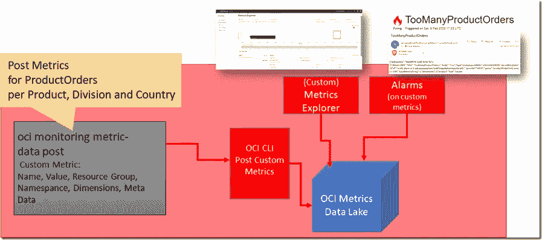

# 将 OCI 监控、警报和通知用于您自己的定制和功能指标

> 原文：<https://medium.com/oracledevs/use-oci-monitoring-alarms-and-notifications-for-your-own-custom-and-functional-metrics-e5dccdec2be0?source=collection_archive---------6----------------------->

在之前的文章中，我讨论了 Oracle 云基础设施中用于监控几乎所有 OCI 服务发布的指标的特性。当调用函数、编写文件、API 网关处理请求、发布事件、创建用户和网络传输数据包时，这些指标就会发布。这些指标是…