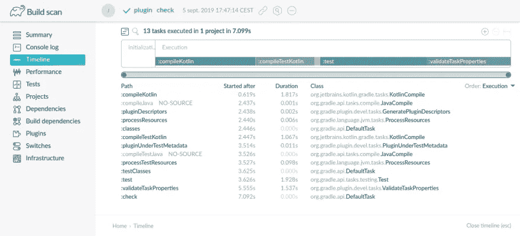
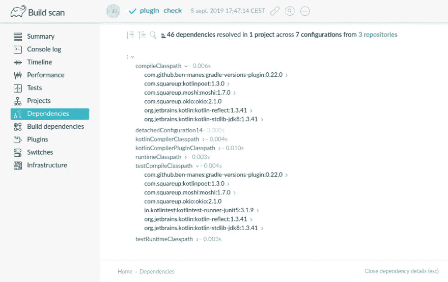
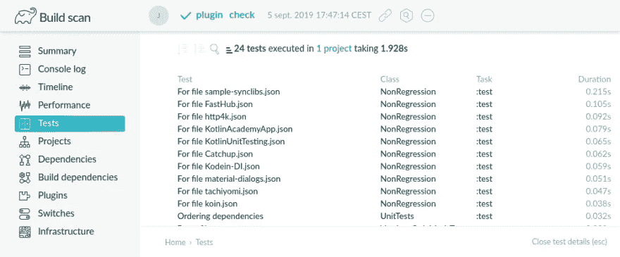
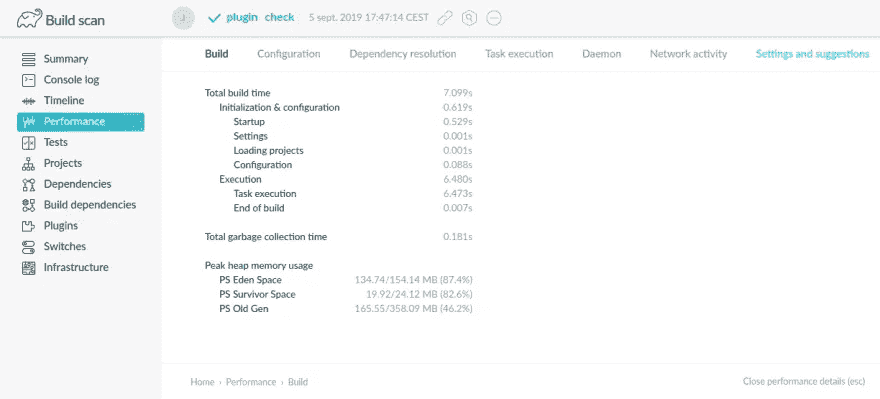
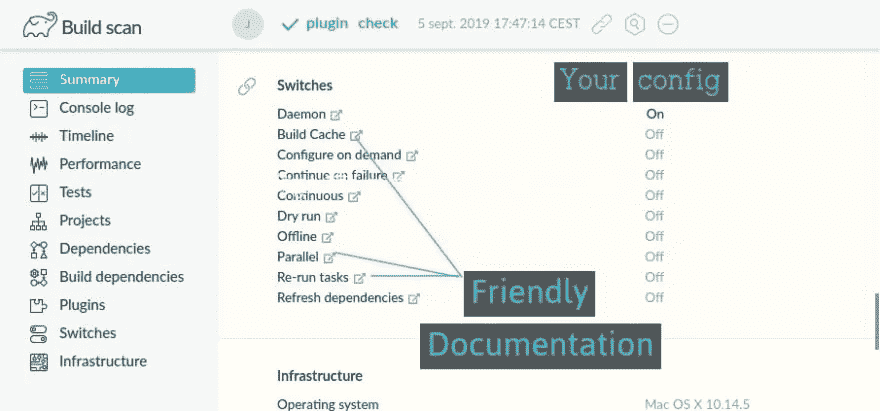

# 取代所有其他戏法的一个戏法

> 原文：<https://blog.kotlin-academy.com/use-the-gradle-build-scan-875b384554d1?source=collection_archive---------2----------------------->


# 使用 Gradle Build 扫描！

> Android 世界中有一个非常可悲的问题有一个好的简单的解决方案。

所以，如果你是 Android 开发者或者正在使用 Gradle，请注意！

# 问题是:失去了背景

让我们想象你早上去上班。弹出通知窗口:

> 亲爱的开发者你好。一位客户报告说，该应用程序从昨天开始就不工作了。请尽快修复*。*

我大胆的猜测是，你会有这样的反应:

> *请问？什么不起作用？*
> 
> 那是撞车吗？你有堆栈跟踪吗？
> 还是有些东西没有按预期工作？为什么呢？
> 
> *哪个版本的 app？在哪个智能手机上？
> 有复制步骤吗？*

# 这是 101 号报告。

然而，不知何故，当谈到我们的建设时，我们忘记了这一点。

那些上下文无关的“错误报告”和提示无处不在。看着贴着 [android+gradle](https://stackoverflow.com/questions/tagged/android+gradle) 标签的 StackOverflow 问题，我很难过。当我在 Android 问题追踪器中看到问题时，我很难过。看了那些中帖都很难过。到处都是相同的模式:

> *(original_post)您好，我的 build 不工作/慢，请指教！这里是我从我的构建中复制/粘贴的 2000 个可能不相关的行。*
> 
> (回答 1)将这个 Groovy 片段复制/粘贴到你的构建中的某个地方。我不明白它有什么用，但它对我很有效。
> 
> 不，那没用。

那些脱离上下文的对话令人愤怒。好消息是，对此有一个好的、简单的答案！

# 解决方案:一个渐变的构建扫描 URL

每当你需要了解你的构建失败的原因并寻求帮助时，重新运行用`--scan`失败的 Gradle 任务。例如:

Publishing build scan… [https://scans.gradle.com/s/ug6vfggccmozm](https://scans.gradle.com/s/ug6vfggccmozm)

为了更加方便，您应该将这个设置添加到您的 top `./build.gradle`文件中。

你会在[https://plugins.gradle.org/plugin/com.gradle.build-scan](https://plugins.gradle.org/plugin/com.gradle.build-scan)找到*$版本*

在 https://docs.gradle.com/build-scan-plugin/阅读文件

# 这给我们带来了什么？

一切。

在[https://scans.gradle.com/s/ug6vfggccmozm/](https://scans.gradle.com/s/ug6vfggccmozm/)自己探索

还是继续看。

# 任务执行的时间表



# 堆栈跟踪

如果构建失败，stacktrace 也是可用的。

# 您的开发基础设施:操作系统、JVM……


# 您的版本正在使用的插件及其版本


# 您正在使用的依赖项及其版本



# 你失败的测试

不要再试图在你的詹金斯日志中解释为什么你的测试失败了。Gradle 构建扫描还会报告哪些测试失败以及失败的原因:



# 绩效指标和个性化建议

Gradle 为您的构建的**性能指标提供个性化建议。**



连同它的同伴手册一起阅读 https://scans.gradle.com/s/ug6vfggccmozm/performance/build
T3

# 在企业环境中使用

在企业环境中，与 Gradle 和其他所有人共享可能敏感的数据可能是一个问题。

构建扫描用户手册解释了如何在公司服务器上发布构建扫描

```
buildScan {
    server = 'https://gradle-enterprise.mycompany.com'            
    publishAlways()                                               
}
```

在[https://docs.gradle.com/build-scan-plugin/](https://docs.gradle.com/build-scan-plugin/)阅读文件

# 这太棒了。为什么我以前不知道这些？

有的会回答:“因为你没有 RTFM？”。

但是我发现关于 [RTFM](https://en.wikipedia.org/wiki/RTFM) 有趣的是它有两种截然不同的含义:**读他妈的手册**和**读友好的手册**。

Android 官方网站上的[“配置你的构建”部分真的很糟糕，如果你所依赖的是 Gradle Build 扫描，我并不惊讶你不知道它。](https://developer.android.com/studio/build?hl=en)

这也许是使用 Gradle 构建扫描最好的部分:它提供了到 Gradle 官方文档相关部分的直接链接，这些文档更像是友好的手册。

例如:



自己看:[https://scans.gradle.com/s/ug6vfggccmozm#switches](https://scans.gradle.com/s/ug6vfggccmozm#switches)

# 参考

*   创建构建扫描[https://guides.gradle.org/creating-build-scans/](https://guides.gradle.org/creating-build-scans/)
*   提高 Gradle builds 的性能【https://guides.gradle.org/performance/ 
*   构建扫描插件用户手册[https://docs.gradle.com/build-scan-plugin/](https://docs.gradle.com/build-scan-plugin/)

# 单击👏说“谢谢！”并帮助他人找到这篇文章。

了解卡帕头最新的重大新闻。学院，[订阅时事通讯](https://kotlin-academy.us17.list-manage.com/subscribe?u=5d3a48e1893758cb5be5c2919&id=d2ba84960a)，[观察推特](https://twitter.com/ktdotacademy)并在媒体上关注我们。

如果你需要一个科特林工作室，看看我们如何能帮助你: [kt.academy](https://www.kt.academy/) 。

[](https://kotlin-academy.us17.list-manage.com/subscribe?u=5d3a48e1893758cb5be5c2919&id=d2ba84960a)