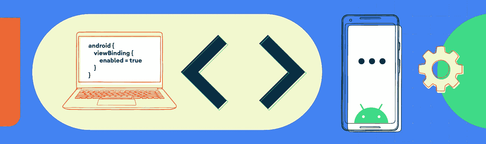
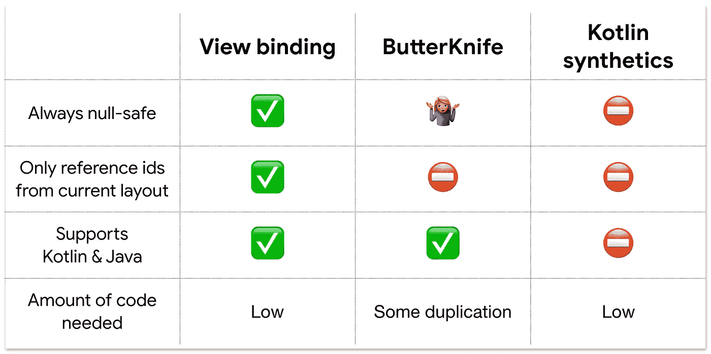

# 使用视图绑定替换 findViewById

> 原文：<https://medium.com/androiddevelopers/use-view-binding-to-replace-findviewbyid-c83942471fc?source=collection_archive---------0----------------------->



Android Studio 3.6 中新增的视图绑定让您能够用生成的绑定对象替换`findViewById`，以简化代码，消除 bug，并避免所有`findViewById`的样板文件。

## TL；速度三角形定位法(dead reckoning)

*   在`build.gradle`中启用视图绑定(没有库依赖)
*   视图绑定为模块中的每个布局生成一个绑定对象(`activity_awesome.xml` → `ActivityAwesomeBinding.java`)
*   绑定对象为布局中具有 id 的每个视图包含一个属性—具有正确的类型和空安全
*   完全支持 Java 编程语言和 Kotlin

## 更新`build.gradle`以启用视图绑定

您不需要包含任何额外的库来启用视图绑定。从 Android Studio 3.6 中发布的版本开始，它被内置到 Android Gradle 插件中。要启用视图绑定，请在您的模块级`build.gradle`文件中配置`viewBinding`。

```
// Available in Android Gradle Plugin 3.6.0
android {
    viewBinding {
        enabled = true
    }
}
```

在 Android Studio 4.0 中，`viewBinding`被移到了`buildFeatures` [ [发布说明](https://developer.android.com/studio/preview/features/#agp-4-0-0)中，你应该使用:

```
// Android Studio 4.0
android {
    buildFeatures {
        viewBinding = true
    }
}
```

一旦为项目启用，视图绑定将自动为您的所有布局生成一个绑定类。您不必对 XML 进行修改，它会自动与您现有的布局协同工作。

> 视图绑定使用现有的 XML，并将为模块中的每个布局生成一个绑定对象。

无论何时展开布局，如`Fragment`、`Activity`，甚至是 RecyclerView `Adapter`(或`ViewHolder`)，都可以使用 binding 类。

## 在活动中使用视图绑定

如果您有一个名为`[activity_awesome.xml](https://gist.github.com/objcode/3ee41edae40ba13f13da569b8f27333a)`的布局，其中包含一个按钮和两个文本视图，视图绑定会生成一个名为`ActivityAwesomeBinding`的小类，其中包含布局中每个带有 ID 的视图的属性。

使用视图绑定时，您不必调用`findViewById`——相反，只需使用所提供的属性来引用布局中带有 id 的任何视图。

布局的根元素总是存储在一个自动生成的名为`root`的属性中。在一个`Activity`的`onCreate`方法中，你将`root`传递给`setContentView`来告诉活动使用绑定对象的布局。

> **易错:**用布局资源 id 而不是膨胀的绑定对象调用`setContentView(…)`是一个容易犯的错误。这导致布局被放大两次，监听器被安装在错误的布局对象上。
> 
> **解决方案:**当在一个`Activity`中使用视图绑定时，你应该总是用`setContentView(binding.root)`从绑定对象中传递布局。

## 使用绑定对象的安全代码

`findViewById`是 Android 中许多面向用户的 bug 的来源。很容易传递一个不在当前布局中的 id——产生`null`和崩溃。而且，因为它没有内置任何类型安全，所以很容易发布调用`findViewById<TextView>(R.id.image)`的代码。视图绑定用一个简洁、安全的替代方法取代了`findViewById`。

视图绑定是…

*   **类型安全**，因为属性总是*基于布局中的视图*被正确键入。因此，如果您在布局中放置一个`TextView`，视图绑定将公开一个`TextView`属性。
*   **空安全**用于在多个配置中定义的布局。视图绑定将检测视图是否只存在于某些配置中，并创建一个`@Nullable`属性。

由于生成的绑定类是带有 Kotlin 友好注释的常规 Java 类，所以可以从 Java 编程语言和 Kotlin 中使用视图绑定。

## 它会生成什么代码？

视图绑定生成一个 Java 类，取代了代码中对`findViewById`的需求。在映射名称时，它将为模块中的每个 XML 布局生成一个绑定对象，因此`activity_awesome.xml`映射到`ActivityAwesomeBinding.java`。

当在 Android Studio 中编辑 XML 布局时，代码生成将被优化为仅*更新与该 XML 文件相关的绑定对象，并且它将在内存中这样做以使事情变得更快。这意味着对绑定对象的更改在编辑器中立即可用，您不必等待完整的重新构建。*

> Android Studio 经过优化，可以在编辑 XML 布局时立即更新绑定对象。

让我们浏览一下本文前面为示例 XML 布局[生成的代码，以了解视图绑定会生成什么。](https://gist.github.com/objcode/3ee41edae40ba13f13da569b8f27333a)

Properties generated by view binding are correctly typed and null-safe.

视图绑定将为每个具有指定`id`的视图生成一个正确类型的属性。它还将生成一个名为`rootView`的属性，该属性通过一个 getter `getRoot`公开。视图绑定不做任何逻辑处理——它只是在一个绑定对象中公开您的视图，这样您就可以将它们连接起来，而不需要对`findViewById`进行容易出错的调用。这使生成的文件保持简单(并避免减慢构建)。

如果您使用的是 Kotlin，那么这个类针对互操作性进行了优化。因为所有属性都用`@Nullable`或`@NonNull`标注，所以科特林知道如何将它们公开为空安全类型。要了解关于语言间互操作的更多信息，请查阅从 Kotlin 调用 Java 的文档。

View binding generates an inflate method, which is the primary way to make new binding objects.

在`ActivityAwesomeBinding.java`中，视图绑定生成一个公共的`inflate`方法。单参数版本将`null`作为父视图传递，并且不附加到父视图。视图绑定还公开了一个三参数版本的`inflate`，让您在需要时传递`parent`和`attachToParent`参数。

对`bind`的调用是奇迹发生的地方。它将采用展开的布局并绑定所有属性，并添加一些错误检查来生成可读的错误消息。

Simplified version of the generated public bind method.

`bind`方法是生成的绑定对象中最复杂的代码，每个要绑定的视图都有一个对`findViewById`的调用。这里您可以看到神奇的事情发生了——因为编译器可以直接从 XML 布局中检查每个属性的类型和潜在的空性，它可以安全地调用`findViewById`。

注意，`bind`方法实际生成的代码更长，并且使用带标签的 break 来优化字节码。查看杰克·沃顿的[这篇文章](https://jakewharton.com/optimizing-bytecode-by-manipulating-source-code/)，了解更多关于优化的应用。

在每个绑定类上，视图绑定公开了三个公共静态函数来创建绑定对象，下面是何时使用每个函数的快速指南:

*   `**inflate(inflater)**`–在没有父视图传递给绑定对象的`Activity` `onCreate`中使用。
*   `**inflate(inflater, parent, attachToParent)**`–在需要将`parent` `ViewGroup`传递给绑定对象的`Fragment`或回收视图`Adapter`(或`ViewHolder`)中使用。
*   `**bind(rootView)**`–当您已经放大了视图，并且您只想使用视图绑定来避免`findViewById`时，使用此选项。这对于将视图绑定融入您现有的基础设施以及重构代码以使用`ViewBinding`非常有用。

## 包含的布局呢

模块中的每个`layout.xml`都会生成一个绑定对象。即使当另一个布局是这个布局时也是如此。

Example of include tag in view binding. Note that the <include> tag has an id!

在包含布局的情况下，视图绑定将创建对包含布局的绑定对象的引用。

注意，`<include>`标签有一个 id: `android:id="@+id/includes"`。这是视图绑定生成属性所必需的(就像普通视图一样)。

> Include 标记必须有 id 才能生成绑定属性。

视图绑定将生成对`ActivityAwesomeBinding`中`IncludedButtonsBinding`对象的引用。

## 使用视图绑定和数据绑定

视图绑定只是对`findViewById`的替代。如果你也想自动绑定 XML 视图，你可以使用[数据绑定](https://www.google.com/search?q=data+binding+android&rlz=1C5CHFA_enUS871US871&oq=data+binding+androi&aqs=chrome.0.0j69i57j0l3j69i60l3.4174j0j4&sourceid=chrome&ie=UTF-8)库。这两个库可以应用于同一个模块，它们可以一起工作。

当两者都启用时，使用`<layout>`标签的布局将使用数据绑定来生成绑定对象。所有其他布局将使用视图绑定来生成绑定对象。

> 您可以在同一个模块中使用数据绑定和视图绑定。

除了数据绑定之外，我们还开发了视图绑定，因为许多开发人员提供了反馈，他们想要一个轻量级的解决方案来代替没有数据绑定库的其他部分的`findViewById`——视图绑定提供了这种解决方案。

## 查看装订和 Kotlin 合成纤维或 ButterKnife

关于视图绑定最常见的问题之一是，“我应该使用视图绑定而不是 Kotlin 合成或 ButterKnife 吗？”这两个库都被许多应用程序成功使用，并解决了相同的问题。

对于大多数应用程序，我们建议尝试视图绑定而不是这些库，因为视图绑定提供了更安全、更简洁的视图查找。



Comparing features of View binding, ButterKnife, and Kotlin synthetics.

> 虽然 ButterKnife 在运行时验证可空/非空，但编译器不会检查您是否正确匹配了布局中的内容

> 我们建议尝试视图绑定，以实现安全、简洁的视图查找。

## 了解更多信息

要了解更多关于视图绑定的信息，请查看官方文档。

我们很乐意在 twitter 上听到你使用 [#ViewBinding](https://twitter.com/search?q=%23ViewBinding) 图书馆的经历！