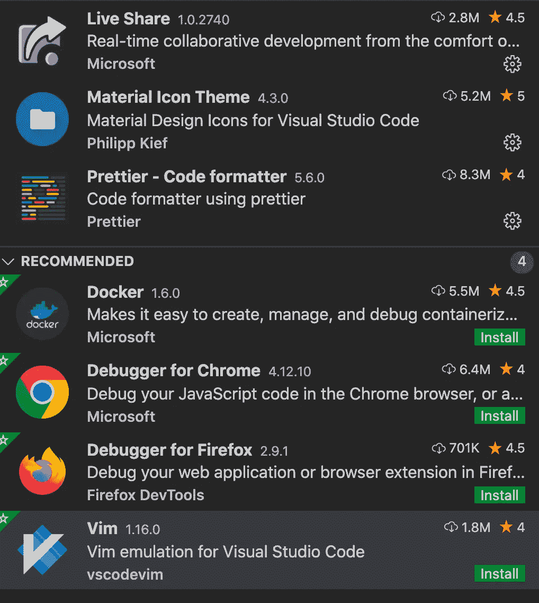

# 前端开发人员的有用扩展

> 原文：<https://medium.com/quick-code/useful-extension-for-frontend-developer-6d709218f8ae?source=collection_archive---------1----------------------->

## 前端。

## Visual Studio 代码。

**Git 镜头**

我们都需要一个控制不同版本应用程序的系统。这就是我们使用 git 的原因。

当我们打开一个文件时，我们需要知道是谁添加或删除了代码。我们需要知道这个文件的历史。Git lens 帮你搞定。这个应用程序以一种方便的方式跟踪文件中的所有变化。从现在开始用那个程序。

访问[页面](https://github.com/eamodio/vscode-gitlens)。

**微软 Visual Studio 现场分享**

如今，开发人员正在远程工作，在某些时候，你将需要来自你的大学的帮助。您可能会用 skype 给他们打电话，向他们展示代码，并询问一些相关问题。这不是一个方便的方法。

实时共享允许我们在一个文件中一起工作。一个是服务器，另一个可以连接到他。过去的好时光，你需要说去第 120 行，把参数 A 传过去。

访问[页面](https://visualstudio.microsoft.com/en/services/live-share/)。

**素材图标主题**

作为一名开发人员，我处理过不同类型的文件，比如 js、html、ts、css。即使文件具有相同的扩展名，类的目的也是不同的，如模型、控制器、管道等。当你在每种情况下都有一个不同的图标是很好的，你只要看着一个图标就知道这个文件包含了什么。

这个扩展完全符合我刚才对你说的。

访问[页面](https://marketplace.visualstudio.com/items?itemName=PKief.material-icon-theme)。

**角语服务**

在我的作品中，我使用棱角分明。这个扩展有模板写一些代码，而不是我。以前，当我需要创建一个类时，我在我的项目副本中找到正确的类，然后粘贴到一个新文件中，然后编辑它。现在我使用这个扩展，它使我的生活更容易。

如果你使用不同的框架，你需要找到正确的代码片段扩展。

访问[页面](https://marketplace.visualstudio.com/items?itemName=Angular.ng-template)。

**文件切换器**

这个扩展的名字很容易理解。每个项目都被分成小部分，这意味着每个组件都有 js/ts 文件、html 文件和 css/less 文件。这个扩展名帮助您在这些文件之间切换。

访问[页面](https://marketplace.visualstudio.com/items?itemName=johnathanludwig.fileswitcher)。

**更漂亮的**

没有格式化工具，怎么能给开发人员列出工具清单呢？我不会破例。

漂亮的支持前端开发人员的所有格式，如 html，json，css，js，ts 等。

访问[页面](https://marketplace.visualstudio.com/items?itemName=esbenp.prettier-vscode)。

*原载于 2020 年 9 月 20 日*[*【http://tomorrowmeannever.com】*](https://tomorrowmeannever.com/2020/09/20/useful-extension-for-frontend-developer/)*。*