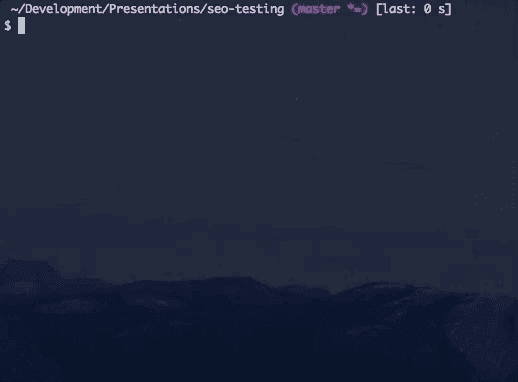
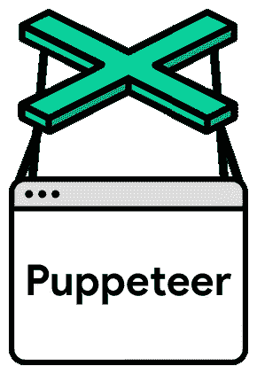

# 有用的工具:用于浏览器自动化和测试的无头 Chrome 和木偶师。

> 原文：<https://medium.com/square-corner-blog/useful-tools-headless-chrome-puppeteer-for-browser-automation-testing-1ac7707bad40?source=collection_archive---------1----------------------->

## **了解一些新工具，这些工具可以使端到端测试更容易&更准确，以及自动化您在 web 浏览器中可以做的任何事情！**


> 注意，我们已经行动了！如果您想继续了解 Square 的最新技术内容，请访问我们的新家[https://developer.squareup.com/blog](https://developer.squareup.com/blog)

网站变得比以往更加复杂。现代网站通常由多个组件文件组成，这些文件打包在一起，然后进行优化，而不是单一的 html 页面。当一个网站加载这些文件时，它会发出几十个不同的异步请求，以完成包含更多信息的页面，此外还会加载和运行所有的广告和分析脚本。我们希望所有这些不同的活动部件都能为我们的用户带来无缝的、令人愉快的新鲜出炉的体验，但情况并非总是如此。有时候，直到你完成烘焙，你才知道一种配料已经变质。端到端(E2E)测试工具旨在确保您在设置模板之前发现任何错误。如果你已经接受了从头到尾测试的需求，那么你需要了解无头浏览器。

# **无头镀铬**

最新最棒的端到端测试工具之一是 Headless Chrome。在你开始考虑幽灵骑士之前，要知道 Headless Chrome 是你所知道的同一个网络浏览器，除了你可以关闭所有的 UI，从命令行运行它，并做一些*spooooooooky*编程控制。

关于 Headless Chrome，你需要知道的第一件事是，你不是从你的桌面或 dock 启动它。相反，您将从命令行执行所有操作。



Running Headless Chrome from the command line.

首先，您需要为 Chrome 可执行文件创建一个别名，这样您就可以更容易地从命令行运行它。对我来说(在 Mac 上)，这看起来就像深入挖掘谷歌 Chrome 应用程序以找到其下面的可执行文件:

```
$ alias chrome="/Applications/Goo...Chrome"
```

我已经把它添加到我的`bash_profile`中，这样每当我打开一个新的终端窗口时，这个别名就会出现。在无头模式下运行 Chrome 就像一个命令行标志`--headless`一样简单。您需要提供的唯一其他参数是您想要访问的网站的 URL。有了这两个标志，Headless Chrome 将发出请求并得到响应，然后出色地完成任务并退出。乍一看，这似乎更像是一个更糟糕的`cURL`请求，但是有一些命令行标志可以让它更有用一些。

## **远程调试**

请求一个页面并退出并不令人兴奋，但是可以与`--headless`结合使用的一个简洁的命令行标志是`--remote-debugging-port`。这个标志打开了一个端口，用于通过 [DevTools 协议](https://chromedevtools.github.io/devtools-protocol/)控制 Chrome 实例并与之交互。你需要指定一个端口号(比如`--remote-debugging-port=9222`，你甚至可以在 Chrome 中尝试远程调试。只需打开一个新的(非无头)标签，并前往`localhost:9222`。你将能够看到所有运行的 Chrome 实例，浏览渲染过的网站，使用它们的 javascript 控制台，甚至点击、键入或以其他方式与页面交互(尽管如果你想浏览网页，使用 DevTools 从另一个 Chrome 浏览器控制一个无头 Chrome 实例可能不是最好的方法😄).当您开始运行完全无头的复杂操作，然后需要一种方法来查看发生了什么时，这个标志将非常有用。

## **截图&pdf**

命令行 Headless Chrome 的一个真正有用且易于使用的功能是截图或创建网站的 pdf 文件。这两个标志的工作方式类似，但会产生非常不同的结果。标志`--print-to-pdf=site.pdf`将具有与浏览打印对话框并保存为 pdf 名称`site.pdf`相同的效果。因为它使用了打印对话框，所以它创建了打印媒体 css 的 pdf，这取决于你的站点期望打印多少，可能有点不可靠。通常你更喜欢截图而不是 pdf，而且还有一个标志！`--screenshot=file.png`将提取渲染的像素并保存到一个名为`file.png`的图像文件中。将它与其他标志如`--window-size=1200,1600`结合起来，你可以创建大量不同尺寸的网站截图，以查看你的页面在任何你想要的设备上的外观。

仅仅从命令行使用 Headless Chrome 有着巨大的价值:很容易对从分支代码构建的网站进行截屏，以自动包含到拉取请求中，或者对本地环境进行截屏，并使用类似`[pixelmatch](https://github.com/mapbox/pixelmatch)`的图像区分工具将它们与生产站点的实时图像进行比较。

但是，如果您尝试对网页进行一些更复杂的测试或交互，这些命令行标志不会对您有所帮助。为此，我们需要更强大的东西。

## 操纵木偶的人



Puppeteer is ©Google and licensed under Apache 2.0

Puppeteer 是一个基于 NodeJS 的库，它使用相同的 Headless Chrome 和 DevTools 协议与 Headless Chrome 进行交互，但是在 JavaScript 中具有更强大和可扩展的接口。从 NPM 安装`puppeteer`之后，它通常看起来是这样的:

你可能会注意到我们大量使用了`async`和`await`。如果你不熟悉 async/await，一定要花点时间阅读一下 `[async](https://developer.mozilla.org/en-US/docs/Web/JavaScript/Reference/Statements/async_function)` [&](https://developer.mozilla.org/en-US/docs/Web/JavaScript/Reference/Statements/async_function) `[await](https://developer.mozilla.org/en-US/docs/Web/JavaScript/Reference/Statements/async_function)`的[文档。通过上面的代码，我们创建了一个新的 Chrome 浏览器，加载了一个新页面，然后在页面转到一个网站时运行几个异步函数，执行一个操作，最后关闭浏览器。Puppeteer 中几乎所有与网站交互的东西都是异步的，当你想以可预测的线性方式使用网站时，这不是很好。我们将对大多数命令使用`await`来保持执行流程更加同步，而不是无休止地`then`调用或使用回调。让我们更深入地了解一下你可以用 NodeJS 和 Puppeteer 进行交互的一些方式:](https://developer.mozilla.org/en-US/docs/Web/JavaScript/Reference/Statements/async_function)

## **浏览器**

浏览器是你首先要创建的对象之一，当你启动浏览器时，你有很多选择。我使用的最常见的配置选项之一是`headless`，它是一个布尔值，让你可以通过 UI 运行 Chrome，这样你就可以看到你的木偶脚本在做什么。`slowMo`也非常有用，因为它将为几乎所有的事情增加一个人为的毫秒数延迟。这可以使人类看不到的事件变得更加明显，并且可以在与具有许多异步添加的事件处理程序的网页交互时帮助润滑轮子。

就你可以用浏览器做什么而言，你最常做的事情是创建一个`newPage`，但是你也可以创建新的匿名标签，以及对关闭页面、检查浏览器版本和用户代理的基本控制。你可以在布偶师 [GitHub 文档](https://github.com/GoogleChrome/puppeteer/blob/master/docs/api.md#class-browser)上阅读更多关于`browser`对象的信息。

## **页面**

Headless Chrome 的页面对象类似于你可能习惯的 Chrome 版本中的标签。page 对象有很多功能和函数来控制网站如何被请求、加载和使用。

您通常只是创建新页面并与内容进行交互，但是页面对象也是您可以更改一些有用设置的地方。通过`setViewport`、`setUserAgent`、&、`emulate`，你可以像移动设备或平板电脑一样加载网页，让你知道(并测试)你的网站*如何响应*响应环境。

还有大量的事件处理程序可以用于页面。

您可以创建在页面输出到其 javascript 控制台时运行的函数，或者当它创建对图像和其他资源的附加请求时运行的函数，以及当这些请求的响应返回时运行的函数。

## **鼠标**

与内容交互相比，加载网站并不那么有用，鼠标是一个很好的方式。木偶戏给了你一个有用的功能，`page.click()`，它允许你在指定的选择器上创建一个点击，并可以选择指定点击的类型和你按住按钮的时间。

您还可以使用`page.mouse()`对鼠标进行更精细的控制，这是一个让您可以控制移动鼠标的对象，并打开更复杂的序列，如拖动。

## **键盘**

键盘是另一个很好的交互来源，就像鼠标一样，puppeteer 为您提供了一个助手功能，让您选择选择器和您想要键入的内容，以及用于精确按键控制的低级命令，选择单个键，并决定它们被按住的时间。

# 实践中的无头浏览器

Headless Chrome 和 Puppeteer 提供的所有不同的工具可以组合在一起，创造出测试和网站自动化的交响乐。最简单的用例之一可能是创建一个测试，寻找站点的本地分支和产品版本之间的视觉差异。

这个脚本使用 Headless Chrome 的命令行标志来创建您的本地代码截图(`localhost:8080`)，并使用 [pixelmatch](https://github.com/mapbox/pixelmatch) (一个图像区分工具)将其与您的生产站点截图(`example.com`)进行比较。

我们也可以用木偶师做同样的例子，做一些更复杂的互动。

使用这段代码，我们可以加载一个页面，等待特定的选择器出现在页面上，然后使用 NodeJS 库的完整生态系统来处理和操作结果图像。

还可以运行跨多个页面和交互的非常复杂的网站交互。下面是一个注册页面的端到端测试示例:

进入页面后，鼠标事件用于点击按钮，导航到一个新页面，然后在页面上的 iframe 中键入内容以填写注册细节。需要注意的一点是这一节:

当使用点击事件在页面间导航时，这实际上是一个最佳实践。`page.click()`返回一个承诺，但是当点击事件完成时，这个承诺就失效了。这并没有足够的时间来看到下一页的导语，如果你只是像往常一样做`await`，那么你的下一行代码很可能会失望。幸运的是，有`page.waitForNavigation()`返回一个承诺，直到浏览器导航到一个新的页面才会解决。通过将它们都包装在一个`Promise.all()`中，你可以确保在链接被点击*和*到下一页之前不会继续执行。

这种复杂的页面交互是 Headless Chrome 在端到端测试和网站自动化方面的超级能力。这篇文章仅仅向你展示了使用 Headless Chrome 可以改进你的测试工作流程的冰山一角。如果您想更深入地了解这些工具，请查看以下资源:

*   [无头 Chrome 入门](https://developers.google.com/web/updates/2017/04/headless-chrome) & [无头 Chrome 自动化测试](https://developers.google.com/web/updates/2017/06/headless-karma-mocha-chai)均由 [Eric Bidelman](https://medium.com/u/443b43fab64?source=post_page-----1ac7707bad40--------------------------------) 在 Google web developers 网站上发布
*   [Google chrome/puppeter](https://github.com/GoogleChrome/puppeteer)和 GitHub 上的[puppeter API 文档——阅读所有方法的绝佳资源。](https://github.com/GoogleChrome/puppeteer/blob/master/docs/api.md)
*   [Chrome/light house](https://github.com/GoogleChrome/lighthouse/blob/master/docs/readme.md#using-programmatically)——以 Chrome 扩展、NodeJS 包和 CLI 工具的形式提供，这是一种快速测试网站重要领域的好方法，包括可访问性、速度& SEO。

希望你喜欢这篇文章，看看你可以用无头浏览器做些什么。如果您想了解我们的最新内容，请务必关注这个[博客](https://medium.com/square-corner-blog) &我们的 [Twitter](https://twitter.com/SquareDev) 账户，并注册我们的[开发者简讯](https://www.workwithsquare.com/developer-newsletter.html?channel=Online%20Social&sqmethod=Blog)！