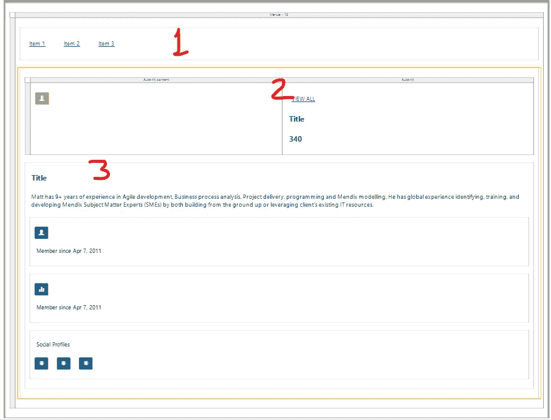

# Mendix 中的用户界面和用户体验

> 原文：<https://medium.com/mendix/user-interface-user-experience-in-mendix-463592e35da7?source=collection_archive---------4----------------------->

# 网站和应用程序应该总是看起来很好，对用户友好，这就是用户界面和 UX 进入画面的时候。UI 代表用户界面，UX 代表用户体验。

这个博客向你展示了一切，从如何设置导航布局，如何创建页面，如何使用构建块和小部件，以及如何使用可重用的组件来设计你的应用程序。

**设计元素**

我同时使用了 Mendix Studio 和 Mendix Studio Pro 来设计应用程序。

**布局**是设计 UI 元素的第一步。选择布局后，你可以在编辑器的工具栏中找到模板页面，以及构建模块和小部件。

1.导航布局

2.页面模板

3.积木

4.小工具

这些都是任何 app 前端的基础。

**1。导航布局**

导航布局是使用平台布局构建的。导航布局是为页面选择的第一件事，每个页面都基于一个布局。

布局使用特定的控件，如布局网格、内容占位符、滚动容器、滑动菜单栏和代码片段。

**布局类型:**

1.Atlas _ 默认

2.人口播出

3.Atlas _ 自定义

4.Atlas_TopBar

**2。页面模板**

页面模板被选作创建任何新页面的基线。使用画布宽度和画布高度管理页面模板的大小。默认画布宽度为 800，默认画布高度为 600。

要找到最适合您应用的页面模板:

1.右键单击您的模块

2.点击添加页面

3.将打开“创建页面”窗口，然后从仪表板中选择合适的模板。

**3。积木**

积木就像部件一样。这些用于页面创建过程。构建块是预定义的组件，您只需要在页面上拖放到您想要的位置。

因为它是预配置的，所以我们不需要担心样式部分，因为样式已经内置在每个构造块中。

这里我用了一些积木:

1.面包屑大

2.卡片度量

3.卡片信息

**4。小部件**

小部件是一个页面元素，用于在页面上显示信息。Mendix 中有几十个小部件。我们可以从 Mendix 应用商店下载小工具。

如果您想要构建自己的小部件，任何开发人员都可以使用 JavaScript 构建一个定制的小部件，并将其上传到市场。

**设计应用程序的样式**

**1。主题定制器**

要为应用程序、字体和标题创建漂亮的设计和良好的颜色，请使用主题定制器。这是定制您的应用程序/徽标的绝佳工具。

要使用主题定制器，第一步是在 Mendix Studio 中打开您的应用程序，并更改项目的支线。在 Mendix studio 中打开应用程序后，单击左侧菜单栏中的画笔图标。

公司徽标可以从主题定制器上传，如下图所示。

**2。定制造型**

Mendix 使用 SASS 和 CSS 进行样式化。对于自定义样式，需要在 Visual Studio 代码中打开项目文件夹，并在主题文件夹下开始编写 CSS 代码进行样式化。

在 _custom.scss 文件中应用自定义 css 和 _custom-variables.scss 文件中更改用于样式的 SASS 变量。

Calypso 和 Gulp/Grunt 是我们用来在本地或浏览器中更改 sass 和 CSS 的工具。

对于大多数用户来说，Calypso 是最简单的造型解决方案。所有东西都打包在 Calypso 中，所以你只需要安装它并选择一个 Mendix 应用程序开始定制。

**下载 Calypso :**

[https://www . Dropbox . com/sh/46 HP 6 pq 8 S9 IP qp/AAAHBwm-8 qcv 9 bqksr 7 br irca？dl=0](https://www.dropbox.com/sh/46hip6pq8s9ipqp/AAAHBwm-8qcv9bQKSR7BrirCa?dl=0)

**设置 Calypso。**

[https://docs.mendix.com/howto/front-end/calypso](https://docs.mendix.com/howto/front-end/calypso)

**可重用页面元素:**

**片段**

Snipppets 是 Mendix 中可重用的组件。这意味着您可以在应用程序的任何页面上使用 snippet。它可用于页面和布局。

用于创建片段:

1.  将代码片段调用小部件从工具栏拖到页面上。

2.您需要在代码片段上定义实体，也可以管理代码片段的画布高度和宽度。

3.选择要包含在页面中的代码段。

**当你的应用被停止时会发生什么？**

**错误页面**

每当你的应用程序停止，你需要显示错误页面。

主要为错误页面创建三个文件:

1 offline.html:在手动停止应用程序时使用。

2 404.html:路径不存在时使用。

3 403.html:当对资源的访问被拒绝时使用。

如果您不创建这些文件，默认的绿色怪物将用于每个场景。

对于创建自定义错误页面:

1.打开应用程序的本地文件夹

2.前往主题

3.创建名为错误页面的新文件夹

4.在错误页面文件夹中放置您的 offline.html 文件

offline.html 的文件看起来是这样的:

这是我为这个作品创建的演示应用程序。

[https://mydemoapp143-sandbox.mxapps.io/index.html?profile =响应式](https://mydemoapp143-sandbox.mxapps.io/index.html?profile=Responsive)