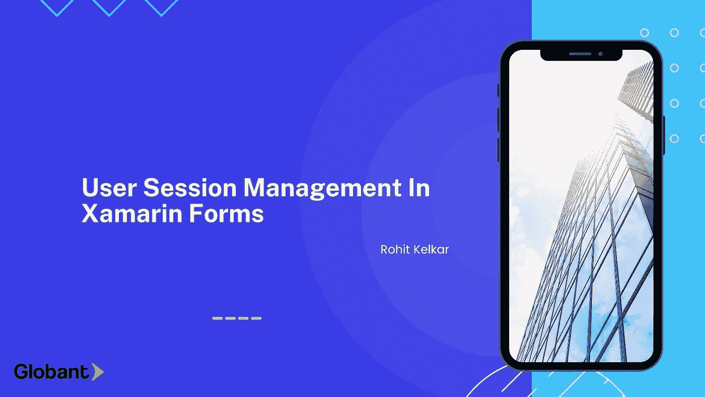

# Xamarin 表单中的用户会话管理

> 原文：<https://medium.com/globant/user-session-management-in-xamarin-forms-b12f823fdf8?source=collection_archive---------1----------------------->



你好，读者，特别是移动应用程序开发人员，他们在这里可以获得一些帮助和参考，了解我们如何在 Xamarin forms 应用程序中管理用户会话。

直接跳到主题，我们在开发过程中都遇到过这样的问题，需要处理用户会话，检测用户在特定时间内的不活动状态，并对其执行一些操作。一个典型的场景包括用户在“N”分钟不活动后从应用程序注销到登录屏幕。

从用户的角度来看，应用程序的不活动包括用户没有与我们的应用程序交互、触摸、滚动、点击或进行任何类型的活动。对于这样的场景，我们需要处理自动注销，并将用户重定向到登录屏幕(取决于业务需求)。

在 Xamarin 表单应用程序中，没有这样的内置条款，我们需要根据业务需求来构建。所以让我们把这项任务分成两部分。

> **第 1 部分:**创建会话管理器，并添加启动、停止和扩展会话的方法。
> **第二部分:**检测用户与 Android 和 iOS 应用的交互，并与会话管理器交互以管理会话。

让我们从第 1 部分开始编写一些代码。
这里我们创建了***appsession manager . cs****作为 singleton a 类。*

```
using System;
using System.Diagnostics;
using Xamarin.Forms;namespace SessionManager
{
    public sealed class AppSessionManager
    {
        private static readonly Lazy<AppSessionManager> lazy = new Lazy<AppSessionManager>();
        public static AppSessionManager Instance { get { return lazy.Value; } }private Stopwatch StopWatch = new Stopwatch();
        private readonly int _sessionThreasholdMinutes = 1;public AppSessionManager()
        {
            SessionDuration = TimeSpan.FromMinutes(_sessionThreasholdMinutes);
        }private TimeSpan SessionDuration;public void EndSession()
        {
            if (StopWatch.IsRunning)
            {
                StopWatch.Stop();
            }
        }public void ExtendSession()
        {
            if (StopWatch.IsRunning)
            {
                StopWatch.Restart();
            }
        }public void StartSession()
        {
            if (!StopWatch.IsRunning)
            {
                StopWatch.Restart();
            }
            Console.WriteLine("Session Started at " + DateTime.Now.ToLongTimeString());
            Device.StartTimer(new TimeSpan(0, 0, 1), () =>
            {
                bool isTimerRunning = true;if (StopWatch.IsRunning && StopWatch.Elapsed.Minutes >= SessionDuration.Minutes) //User was inactive for N minutes
                {
                    RedirectAndInformInactivity();
                    EndSession();
                    isTimerRunning = false;
                }
                Console.WriteLine("Current Time Elapsed -" + StopWatch.Elapsed.ToString());
                return isTimerRunning;
            });}//TODOprivate void RedirectAndInformInactivity()
        {
            Device.BeginInvokeOnMainThread(() =>
            {
                Application.Current.MainPage.DisplayAlert("Session Expired", "Your session has expired", "Restart");
            });
        }
    }
}
```

在上面的类中，我们指定需要检测不活动状态的分钟数。如果需要定义应用程序生命周期内不活动的动态时间限制，您也可以将其设为属性。它有启动、停止和延长当前会话的方法，这些方法将被应用程序使用。

应用程序启动时或根据业务需求，需要启动会话。添加后，下面的行将启动新的会话。

```
AppSessionManager.Instance.StartSession();
```

因此，Xamarin Android 和 Xamarin iOS 都提供了不同的方法来实现这一点，并检测用户与应用程序的交互。

> ***Xamarin Android 实现:***
> 
> *Android 项目提供了一个简单的实现。覆盖 Android 项目中****main activity . cs****中的以下方法。
> 当用户与应用程序交互并调用 AppSessionManager 的 ExtendSession 方法来重启计时器时，该方法被调用，如上面的实现所示。*

```
public override void OnUserInteraction()
        {
            base.OnUserInteraction();
            AppSessionManager.Instance.ExtendSession();
            Console.WriteLine("Touch detected. Extending user session");
        }
```

> **Xamarin iOS 实施:**

在 iOS 上，我们需要创建一个如下图所示的继承 UIApplication 的自定义 UIApplication 类，并修改 ***Main.cs*** 文件以使用自定义 UIApplication 类。

1.  创建 CustomUIApplication 类(您可以随意命名)

```
using System;
using System.Linq;
using UIKit;namespace SessionManager.iOS
{public class SessionManagerApp : UIApplication
    {
        public SessionManagerApp() : base()
        {
        }public SessionManagerApp(IntPtr handle) : base(handle)
        {
        }public SessionManagerApp(Foundation.NSObjectFlag t) : base(t)
        {
        }public override void SendEvent(UIEvent uievent)
        {
            if (uievent.Type == UIEventType.Touches)
            {
                if (uievent.AllTouches.Cast<UITouch>().Any(t => t.Phase == UITouchPhase.Began))
                {
                    AppSessionManager.Instance.ExtendSession();
                    Console.WriteLine("Touch detected. Extending user session");
                }
            }
            base.SendEvent(uievent);
        }
    }
}
```

2.修改 ***Main.cs*** 并添加以下代码。

```
public class Application
    {
        static void Main(string[] args)
        {
            UIApplication.Main(args, typeof(SessionManagerApp), typeof(AppDelegate));
        }
    }
```

你都准备好了！！现在，您的 android 和 iOS 项目中已经有了检测用户交互并使用 AppSessionManager 将会话延长到下一个“N”分钟的函数。

您需要将逻辑放在 AppSessionManager.cs 中，以便在会话过期时将用户重定向到所需的页面(检查 TODO)。

你可以在这里查看这个项目的 Git 库[https://github.globant.com/Rohit-Kelkar/SessionManager](https://github.globant.com/Rohit-Kelkar/SessionManager)

干杯！