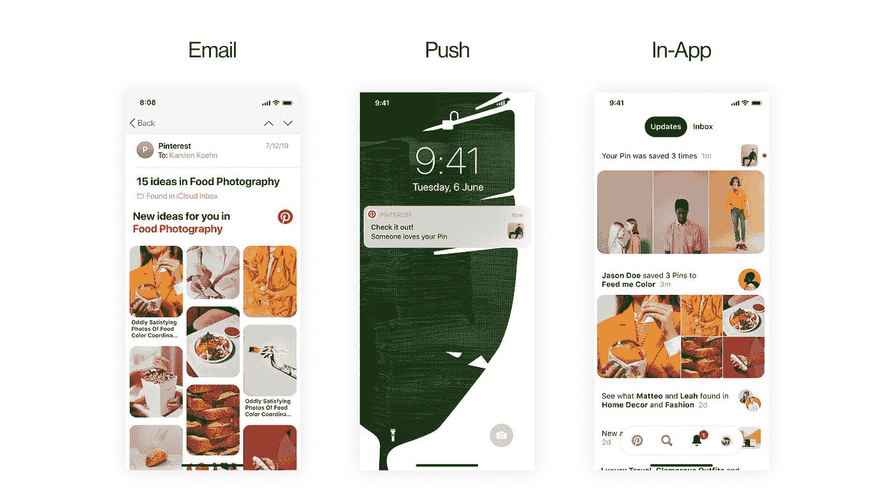
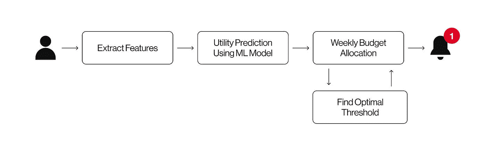
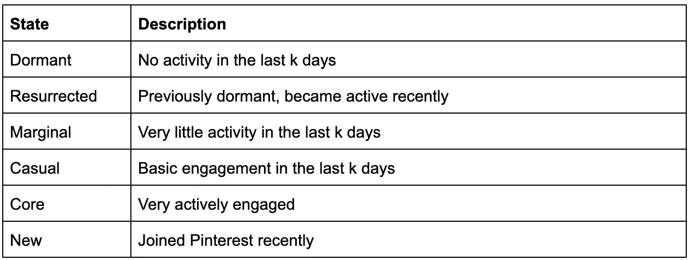
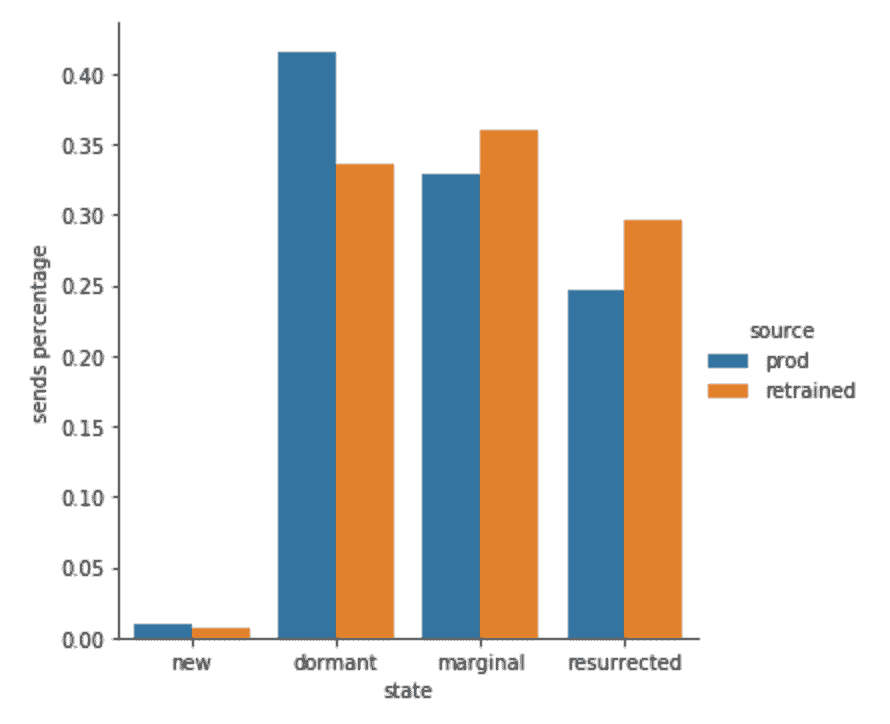

# 基于用户状态的通知量优化

> 原文：<https://medium.com/pinterest-engineering/user-state-based-notification-volume-optimization-7764118f73ff?source=collection_archive---------1----------------------->

Arun Nedunchezhian |软件工程师，增长

通知在帮助 Pinterest 每月超过 3.35 亿的活跃用户发现和参与鼓舞人心的内容方面发挥了重要作用。发送正确数量的高质量内容的通知至关重要。如果我们发送的通知太少，Pinners 可能会错过发现想法的大好机会，而发送太多的通知可能会导致疲劳，并导致他们完全取消订阅通知。

Types of Notifications

对我们来说，通知预算意味着计算每个人在一周内要发送的最佳通知数量，我们训练一个模型来确定最佳数量。

# **电流系统**

我们目前的通知预算系统基于“Pinterest 的通知量控制和优化系统”，该系统已于 2018 年在 KDD 以[论文](https://labs.pinterest.com/user/themes/pin_labs/assets/paper/notifications-kdd18.pdf)的形式发布。该系统由两个步骤组成:

1.  效用预测:使用最大似然模型来预测给定用户的效用值 *u*
2.  预算分配:为给定的用户决定一周的最佳预算 *u*

**效用预测**

让 p(a|u，ku)表示给定通知量 ku，用户“u”本周执行动作“a”的概率。动作“a”可以是我们想要优化的任何指标。我们训练一个模型来预测给定用户 u 的 k 个通知的动作“a”的概率。我们对 kmin 到 kmax 范围内的值进行预测。在预算分配步骤(如下所述)中，我们从预测值中选择最佳预算“b”。我们目前的生产系统将日常参与作为最大化所有用户的行动，因为优化它有助于我们增加日常活跃用户(DAU)。

对于参与度低的用户来说，日常参与可能是一个遥不可及的机会。然而，将更多低参与度用户转换为每周活跃用户(WAU)是一个更合理的目标。与我们现有预算系统的主要区别在于，我们现在有了针对低参与度和高参与度用户的单独模型，而不是针对所有用户的一个模型。为低参与度用户定制一个模型，并使用不同的指标进行优化，这将有助于提高前一个模型未覆盖的用户的整体参与度。

# **预算分配**

向用户 u 发送 k+1 通知的增量实用程序是 p(a|u，k+1)-p(a | u，k)。为了在通知数量有限的情况下实现最大效用，我们需要删除增量效用最低的潜在通知。

Notification Budgeting overview

对于每个用户，我们首先在允许的范围内计算最优预算 imax[kmin，kmax]，然后我们从 kmin 到 IMAX 逐渐增加预算，直到剩余通知的平均增量值低于阈值。给出最大增量效用的值 I 被选为用户一周的预算。寻找最佳阈值的算法可以在[KDD 18 年的论文](https://labs.pinterest.com/user/themes/pin_labs/assets/paper/notifications-kdd18.pdf)中找到。

# **用户群**

我们希望我们的通知能够根据用户当前的活动增加他们的参与度(例如，如果他们每周都回来，我们的目标是展示吸引人的内容，让他们每天都回来)。

根据用户在 Pinterest 上的活动，我们为他们分配六种可能的用户状态之一:

User states and their descriptions

Pinner 的参与度越低，就越难开发精确的模型，所以我们根据用户的活跃程度建立了不同的模型。

我们根据每周或每天的参与度将用户分为两大组。

因此，基于每个用户的参与度，我们决定使用哪个指标作为模型的目标函数。然后，我们训练一个梯度推进决策树(GBDT)分类器，以预测在给定本周通知预算“b”的情况下，用户在下周是否会活跃。

# **培训设置**

我们通过有两个不同的学习目标来将这一问题框架化为机器学习问题。

虽然将有两个模型优化两个不同的目标，但当前生产系统中使用的功能将被保留。关于所用特性的更多信息可以在[KDD 2018 年的论文](https://labs.pinterest.com/user/themes/pin_labs/assets/paper/notifications-kdd18.pdf)中找到

尽管两个模型使用了相同的特征，但是生成的训练标签是不同的。对于 WAU，如果用户一周至少有一天在 Pinterest 上有参与行为，我们将标签设置为 1，否则为 0。对于 DAU，如果用户一周有 4 天是活跃的，我们设置 4 个正面标签和 3 个(7–4)负面标签。然后，我们使用适当的标签为 WAU 和 DAU 用户群训练两个独立的模型。

# **学习&结果**

我们对相当一部分只订阅推送通知的用户进行了 A/B 实验。

我们的系统能够在不影响整体推送打开率或任何其他关键指标的情况下，减少发送给不会从中受益的低参与度用户的通知量。系统能够向受益于接收通知的用户发送更多通知，使启用组的 WAU 计数增加了 **1%** 。在对用户状态级别进行更深入的分析后，结果表明该系统能够通过将休眠用户的通知减少 **3%** ，将复活用户的通知增加 **17%** ，将边缘用户的通知增加 **7%** 来实现 WAU 增长。基于用户活动状态的不同目标函数导致更有效的通知预算分配。

Distribution of notification among different user states for the existing prod and the new retrained model

# **未来工作**

基于用户状态的通知量优化在提高用户参与度方面取得了非常好的效果。我们正在研究其他方法来改进我们的系统，例如:

*   如有必要，创建其他组以优化其他指标
*   根据用户的首选渠道(电子邮件通知、推送通知或两者都有)，将一些用户状态从 WAU 组移动到 DAU 组
*   考虑其他指标，如收入、印象、点击率或参与度，以更好地优化高参与度用户

# **致谢:**

*这是增长通知团队的王玉祥和成田幸一郎的合作成果。我们要感谢建立了预算系统的第一个版本并提供了宝贵的反馈，还要感谢郭在整个项目中提出的宝贵建议。*