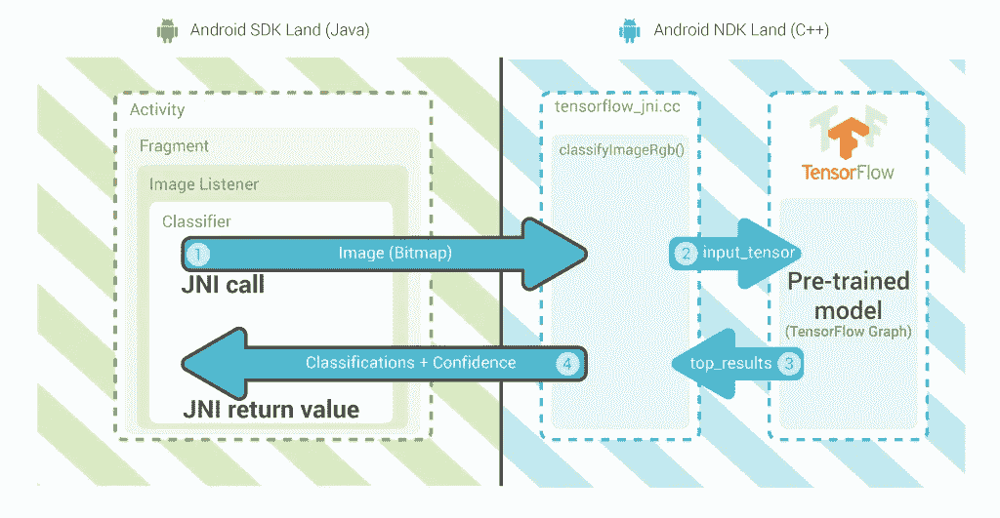
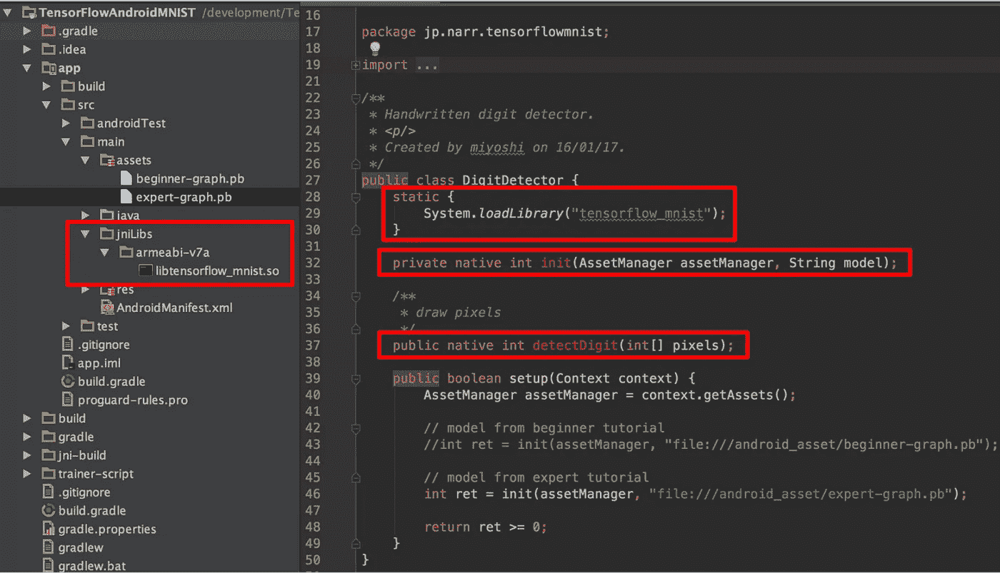
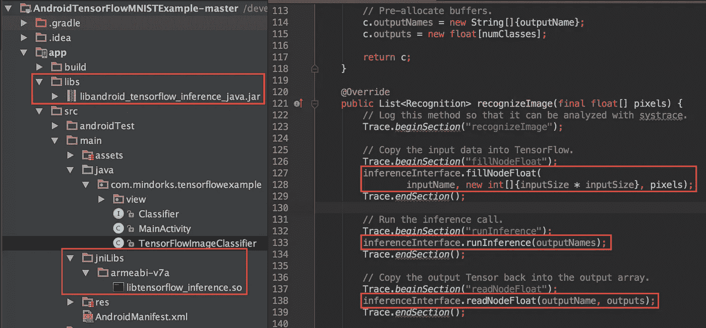

# 在 Android 上使用预先训练好的 TensorFlow 模型—第 1 部分

> 原文：<https://medium.com/capital-one-tech/using-a-pre-trained-tensorflow-model-on-android-e747831a3d6?source=collection_archive---------2----------------------->

以前在 Android 上嵌入一个预先训练好的 TensorFlow 模型真的很难，现在轻松多了！

## 多给我讲讲！

在 DC 安得康做了我的“Android 开发者的机器学习”演讲后([截屏](https://www.youtube.com/watch?v=Lt-KLtkDlh8)，[幻灯片](https://speakerdeck.com/daj/machine-learning-for-android-developers))，我开始抱怨将 TensorFlow 模型嵌入 Android 应用的复杂性。幸运的是，一些谷歌 IOT 开发者的拥护者在那里。除了发表精彩的演讲和举办精彩的黑客马拉松，他们还能回答很多问题。:-) [Wayne Piekarski](https://plus.google.com/+WaynePiekarski) 向我展示了这个 Android Things 项目示例:

 [## 人造物体/样本-张量流-图像分类器

### 在 GitHub 上创建一个帐户，为 sample-tensor flow-image classifier 的开发做出贡献。

github.com](https://github.com/androidthings/sample-tensorflow-imageclassifier) 

这个项目演示了一种嵌入预训练模型的简单方法，简单地通过向您的`build.gradle`添加一个依赖项，然后使用`TensorFlowInferenceInterface`类(文档在[tensor flow contrib README](https://github.com/tensorflow/tensorflow/tree/master/tensorflow/contrib/android)中)。

## 这以前是怎么运作的？

这里有一个可爱的图表，展示了一个 Android 应用程序如何通过使用 Java 原生接口(JNI)桥接到 NDK，从 Java 调用 TensorFlow:

Source: [https://jalammar.github.io/Supercharging-android-apps-using-tensorflow/](https://jalammar.github.io/Supercharging-android-apps-using-tensorflow/)

TensorFlowAndroidMNIST[项目给出了一个让这一切工作的方法的例子。作者编写了 JNI 代码，并将其构建成一个`libtensorflow_mnist.so`本地库，然后从 Java `DigitDetector`中调用它:](https://github.com/miyosuda/TensorFlowAndroidMNIST)

这种代码很复杂，很难维护，例如，JNI 代码的构建需要不同于正常的 Android Studio/Gradle 构建。

在上面的例子中，只支持`armeabi-v7a`架构，所以我预计这个项目会在其他架构上崩溃(例如 x86 模拟器)。

## 你得承认，越来越好了！

为了让这变得更容易，谷歌在 2016 年末添加了`TensorFlowInferenceInterface`类( [GitHub 提交](https://github.com/tensorflow/tensorflow/commits/341da02072ee1c1093a5dca6ad45a1488306193d/tensorflow/contrib/android/java/org/tensorflow/contrib/android/TensorFlowInferenceInterface.java))。这有助于标准化如何与 Java 中的 TensorFlow 模型进行交互。它提供了这些预构建的库:

*   `libandroid_tensorflow_inference_java.jar`—Java 接口层。
*   `libtensorflow_inference.so` —与张量流模型对话的 JNI 代码。

[AndroidTensorFlowMNISTExample](https://github.com/MindorksOpenSource/AndroidTensorFlowMNISTExample)项目给出了这种方法的一个例子:

您可以看到在 tensorflowenceinterface 的 [r1.0 版本中可用的方法的完整列表(方法名称在](https://github.com/tensorflow/tensorflow/blob/r1.0/tensorflow/contrib/android/java/org/tensorflow/contrib/android/TensorFlowInferenceInterface.java) [r1.2](https://github.com/tensorflow/tensorflow/blob/r1.2/tensorflow/contrib/android/java/org/tensorflow/contrib/android/TensorFlowInferenceInterface.java) 和更新版本中已经全部更改)。

## 未来就在现在

2017 年 2 月，TensorFlow 中添加了一个 Android 特定的 [contrib，它允许将所有原生二进制文件和 Java 代码构建到单个库中(打包为 AAR 文件)。](https://github.com/tensorflow/tensorflow/tree/master/tensorflow/contrib/android)[2017 年 5 月](https://github.com/tensorflow/tensorflow/commit/d726686d2dff34a11f85841dfc52bf45698ac49d#diff-8f7c6468dd704fc099a7fce03a5cdd0bR17)该依赖关系在 JCenter 上发布。

现在，要嵌入现有的张量流模型，我们需要做的就是:

1.  在您的`build.gradle`中包含`compile 'org.tensorflow:tensorflow-android:+'`依赖项。
2.  使用`TensorFlowInferenceInterface`与您的模型交互。

我通过更新[AndroidTensorFlowMNISTExample](https://github.com/MindorksOpenSource/AndroidTensorFlowMNISTExample)项目来使用新的 Gradle 依赖项，亲自尝试了一下。这是我的拉请求:

 [## 通过 daj Pull 使用“org . tensor flow:tensor flow-Android”依赖关系支持所有架构…

### org . tensor flow:tensor flow-Android:1 . 2 . 0 依赖项下载了一个 AAR 文件，该文件包含适用于所有应用程序的本机二进制文件…

github.com](https://github.com/MindorksOpenSource/AndroidTensorFlowMNISTExample/pull/1) 

阅读[第 2 部分](/@daj/using-a-pre-trained-tensorflow-model-on-android-part-2-153ebdd4c465)，了解更多关于`TensorFlowInferenceInterface`和`org.tensorflow:tensorflow-android`依赖关系如何工作的信息！

*声明:这些观点仅代表作者个人观点。除非本帖中另有说明，否则 Capital One 不属于所提及的任何公司，也不被其认可。使用或展示的所有商标和其他知识产权都是其各自所有者的所有权。本文为 2017 首都一。*

*欲了解更多关于 API、开源、社区活动和 Capital One 的开发者文化，请访问我们的一站式开发者门户网站 DevExchange:*[*https://developer.capitalone.com/*](https://developer.capitalone.com/)