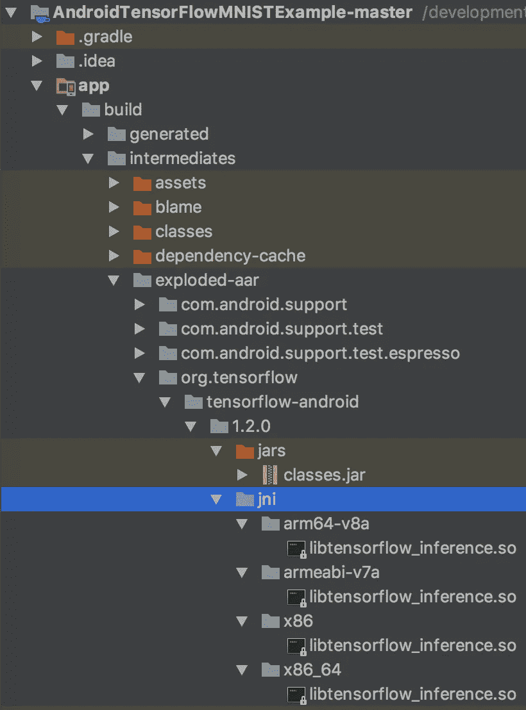
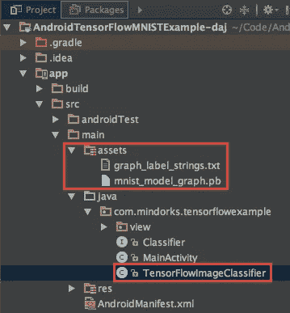
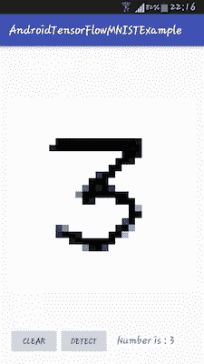

# 在 Android 上使用预先训练好的 TensorFlow 模型—第 2 部分

> 原文：<https://medium.com/capital-one-tech/using-a-pre-trained-tensorflow-model-on-android-part-2-153ebdd4c465?source=collection_archive---------1----------------------->


在第 1 部分的[中，我向您介绍了`TensorFlowInferenceInterface`和`org.tensorflow:tensorflow-android`依赖关系。它们一起提供了一种将预训练 TensorFlow 模型嵌入您的 Android 应用程序的简单方法。](/@daj/using-a-pre-trained-tensorflow-model-on-android-e747831a3d6)

在本帖中，我们将通过查看这个简单的 GitHub 项目示例来挖掘更多细节:

[](https://github.com/daj/AndroidTensorFlowMNISTExample) [## daj/androidtensorflowmnitestexample

### Android TensorFlow mnistexample-Android tensor flow 机器学习 MNIST 示例(使用 tensor flow 为……

github.com](https://github.com/daj/AndroidTensorFlowMNISTExample) 

## 从属关系中有什么？

让我们看看`org.tensorflow:tensorflow-android`依赖给我们的项目带来了什么。Android Studio 中的项目视图让我们可以浏览到`app/build/intermediates/exploded-aar`文件夹，看看下载了什么。



我们可以看到，对于四种架构的每一种，我们都有一个本地二进制文件:`arm64-v8a`、`armeabi-v7a`、`x86`和`x86_64`。还有一个包含`TensorFlowInferenceInterface`和其他支持类的`classes.jar` 。

## 项目结构

我们的张量流图(。pb)和标签(。txt)都在`app/src/main/assets`里。

`TensorFlowImageClassifier`与`TensorFlowInferenceInterface`接口。



## 代码—初始化

初始化`TensorFlowInferenceInterface`。

```
c.inferenceInterface = new TensorFlowInferenceInterface(assetManager, modelFilename);
```

## 代码-模型定义

我们需要定义一些与张量流模型接口所需的名称和大小。

下面显示的大多数值来自[主活动](https://github.com/daj/AndroidTensorFlowMNISTExample/blob/master/app/src/main/java/com/mindorks/tensorflowexample/MainActivity.java#L54)。

```
private static final String *MODEL_FILE* = 
        "file:///android_asset/mnist_model_graph.pb";
private static final String *LABEL_FILE* =
        "file:///android_asset/graph_label_strings.txt";
```

这些模型和标签文件的名称与我们之前在`assets`文件夹中看到的文件相匹配。

```
private static final String *INPUT_NAME* = "input";
private static final String *OUTPUT_NAME* = "output";
```

模型的输入和输出的名称来自我们的 [mnist.py](https://github.com/daj/AndroidTensorFlowMNISTExample/blob/master/mnist.py#L144) 训练脚本。该脚本包含许多从头开始训练模型所需的复杂命令，但这些行显示了输入和输出张量的定义位置:

```
x_2 = tf.placeholder(“float”, shape=[None, 784], name=”**input**”)<snip>OUTPUT = tf.nn.softmax(tf.matmul(FC1, W_OUT) + B_OUT, name="**output**")
```

*另一种确定输入和输出节点名称的方法是* [*将 TensorFlow 模型导入 TensorBoard*](/@daj/how-to-inspect-a-pre-trained-tensorflow-model-5fd2ee79ced0) *并在那里检查。*

我们需要指定的最后一件事是输入大小。

```
private static final int *INPUT_SIZE* = 28;
```

在 MNIST 的例子中，我们的训练数据都是 28×28 像素的字符图像；为了简单起见，我们的示例项目让用户在 28x28“像素”的画布上绘制他们的角色(通过将 28 传递到 [DrawModel](https://github.com/daj/AndroidTensorFlowMNISTExample/blob/master/app/src/main/java/com/mindorks/tensorflowexample/view/DrawModel.java) 类构造函数中来实现[)。](https://github.com/daj/AndroidTensorFlowMNISTExample/blob/master/app/src/main/java/com/mindorks/tensorflowexample/MainActivity.java#L39)

为什么我们真的需要定义这个？根据代码注释:

> 理想情况下，inputSize 可以从输入操作的形状中检索。遗憾的是，graphdef 中通常使用的输入占位符节点并不指定形状，因此它必须作为参数传入。

幸运的是，outputSize 直接从张量流模型获得:

```
int numClasses =
        (int) c.inferenceInterface.graph().operation(outputName).output(0).shape().size(1);
```

## 代码—通过`TensorFlowInferenceInterface`运行分类器

现在，我们需要将用户绘制的 28x28 像素图片传递到我们预先训练好的分类器中。

下面是来自[tensorflowimagecordinator](https://github.com/daj/AndroidTensorFlowMNISTExample/blob/master/app/src/main/java/com/mindorks/tensorflowexample/TensorFlowImageClassifier.java#L121)的 recognizeImage 方法的一些(简化的)亮点:

```
@Override
public List<Recognition> recognizeImage(final float[] pixels) {
    // Copy the input data into TensorFlow.
    inferenceInterface.**feed**(inputName, pixels, new long[]{inputSize * inputSize});

    // Run the inference call.
    inferenceInterface.**run**(outputNames);

    // Copy the output Tensor back into the output array.
    inferenceInterface.**fetch**(outputName, outputs);

    // Find the best classifications.
    for (int i = 0; i < outputs.length; ++i) {
        <snip> 
    } return recognitions;
}
```

我们在像素数据中`feed`，`run`分类器，然后`fetch`输出。

然后对这些输出进行排序，以获得具有最高置信度(高于指定阈值)的输出，并显示给用户:



你可以在[tensor flow Android contrib](https://github.com/tensorflow/tensorflow/blob/master/tensorflow/contrib/android/README.md)中阅读更多关于[TensorFlowInferenceInterface.java](https://github.com/tensorflow/tensorflow/blob/master/tensorflow/contrib/android/java/org/tensorflow/contrib/android/TensorFlowInferenceInterface.java)的信息。

## `Warning — the TensorFlowInferenceInterface` API 变更！

TensorFlow 仍在积极开发中，TensorFlow 的 r1.1 和 r1.2 版本之间的`TensorFlowInferenceInterface`发生了变化。

通过查看位于 r1.1 (使用`fillNodeFloat`)和 r1.2 (使用`feed`)的 TensorFlowImageClassifier [可以看到这一点。](https://github.com/tensorflow/tensorflow/blob/r1.1/tensorflow/examples/android/src/org/tensorflow/demo/TensorFlowImageClassifier.java#L153)

如果您正在查看旧的示例，这可能会让您感到困惑。

*声明:这些观点仅代表作者个人观点。除非本帖中另有说明，否则 Capital One 不属于所提及的任何公司，也不被其认可。使用或展示的所有商标和其他知识产权都是其各自所有者的所有权。本文为 2017 首都一。*

*如需了解更多关于 Capital One 的 API、开源、社区活动和开发者文化的信息，请访问我们的一站式开发者门户网站 DevExchange:*[*https://developer.capitalone.com/*](https://developer.capitalone.com/)