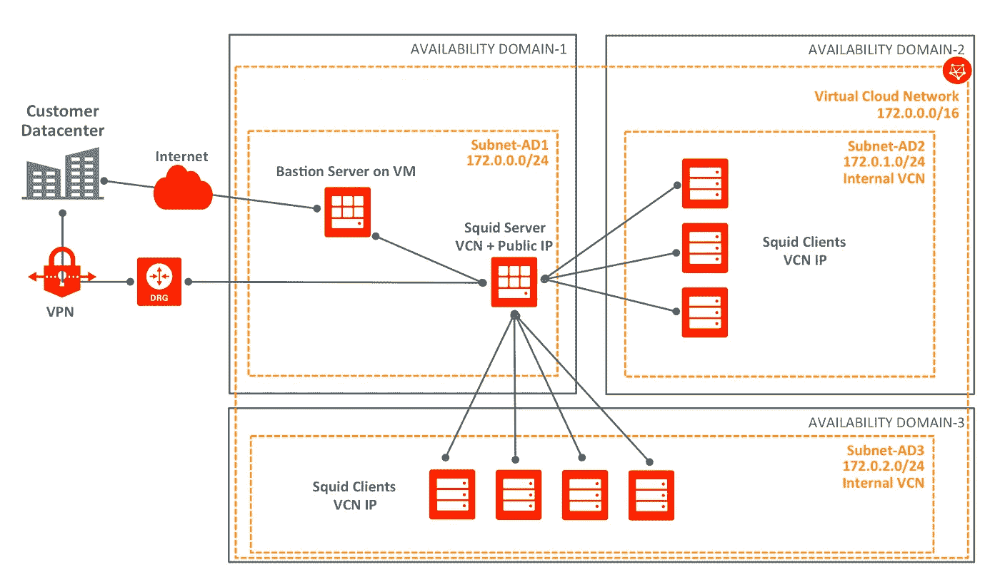
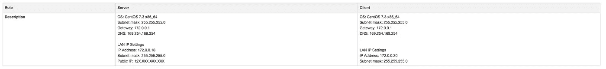
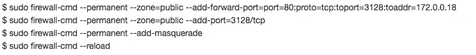
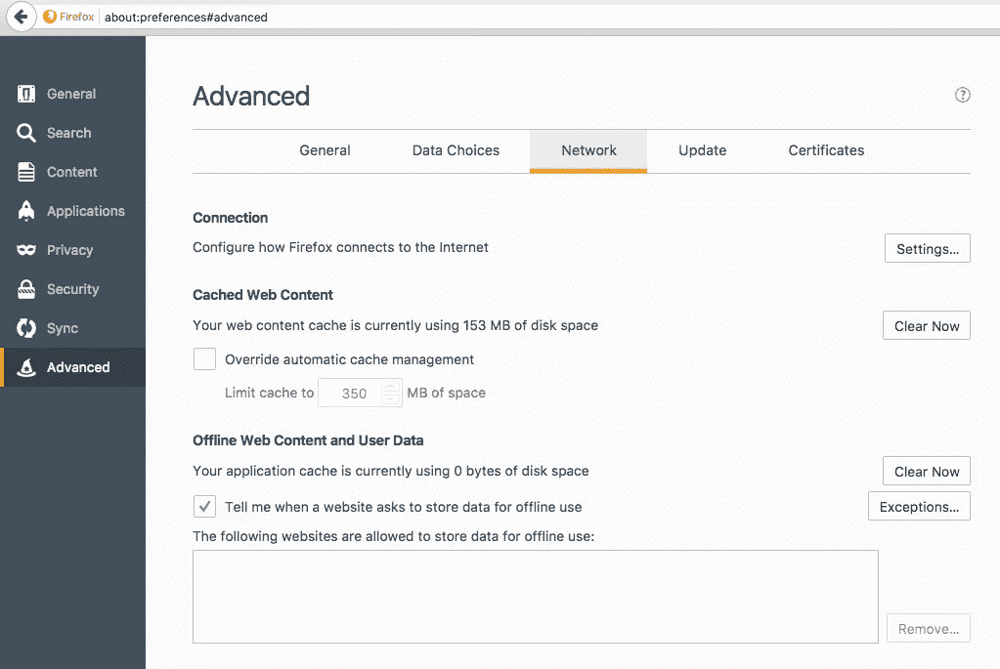
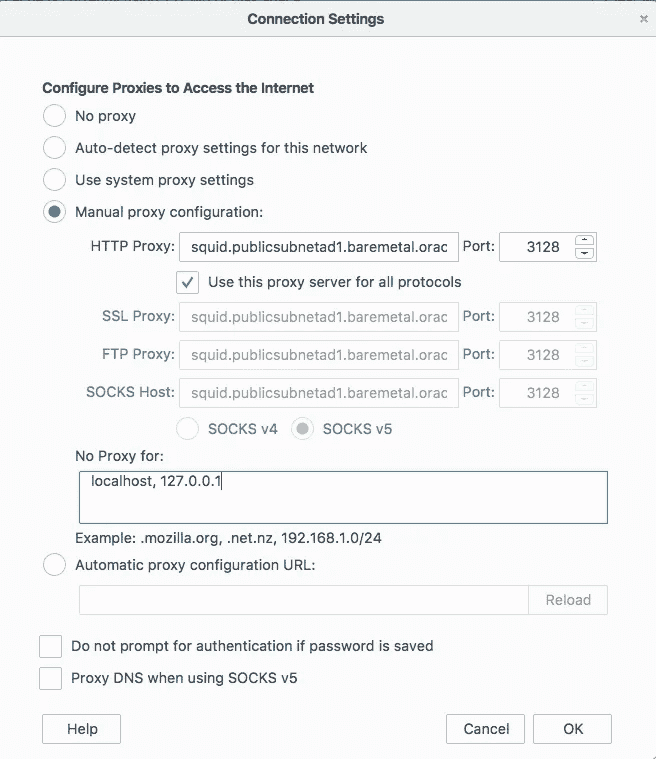
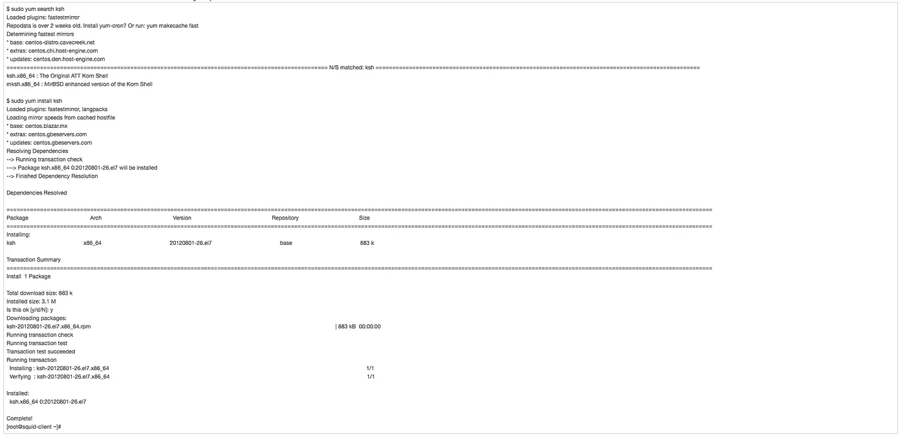

# 在 Oracle 云基础设施上使用 Squid 代理服务

> 原文：<https://medium.com/oracledevs/using-a-proxy-service-on-bare-metal-cloud-services-8deda5dcfc7e?source=collection_archive---------0----------------------->

当供应没有公共 IP 地址的云实例(或者是一个[虚拟机](https://www.oracle.com/cloud/compute/virtual-machines/what-is-virtual-machine/)或者是裸机形状)时，它将无法与外部通信，因此您将需要一个堡垒服务器来登录它，并且需要一个代理服务器来访问互联网或获取更新，例如，因此每个实例(需要互联网访问)都应该配置有代理服务器的详细信息。

代理服务的一个可能选项是 Squid，本教程解释了它在 Oracle 云基础设施(OCI)上的部署步骤。

# 鱿鱼是什么？

[Squid](http://www.squid-cache.org/) 是一个 Web 缓存代理，支持 HTTP、HTTPS、FTP 等等。它通过缓存和重用频繁请求的网页来减少带宽和提高响应时间，它有广泛的访问控制，是一个很好的服务器加速器。

它可以在大多数可用的操作系统上运行，包括 Windows，并在 GNU GPL 下获得许可。

# 入门指南

本教程基于[“如何在 CentOS 7 / RHEL 7 上配置 Squid 3.x 作为代理”](http://broexperts.com/how-to-configure-squid-3-x-as-transparent-proxy-on-centos-7-rhel-7/)的文章，并对其进行了修改，以使其与 OCI 兼容

# 环境

这是本教程中 Squid 配置的一个例子

如果没有代理配置，虚拟客户端网络(VM)客户端 VM 就无法与外部通信，因此下面是一个在没有代理服务器的情况下尝试使用“yum”的示例:

要修复上面的“网络不可达”错误信息，你需要一个代理服务器，下面是你如何配置它。

# Squid 服务器安装

运行以下命令安装 squid 软件包:

$ sudo yum 安装 squid -y

编辑 squid 配置文件。在编辑默认配置文件之前，强烈建议创建一个备份

$ sudo CP/etc/squid/squid . conf/etc/squid/squid . conf . bk

打开配置文件并添加下面提到的参数

$ sudo vi /etc/squid/squid.conf

添加代理设置并添加以下选项，以允许“我们的网络”通过代理进行通信。确保您更改了以下网络(即:与您当前的 VCN 网络掩码相匹配。

#允许局域网

acl 我们的网络 src 172.0.0.0/255.255.255.0

#允许网络 ACL 允许/拒绝部分#

http_access 允许我们网络

#代理参数

http_port 3128

visible _ 主机名 squid

保存并退出。

现在启动 squid 服务，并确保它在启动时被添加。

$ sudo systemctl 启动 squid

$ sudo systemctl 启用 squid

使用 firewall-cmd 工具在 OL/RHEL7/CentOS7 防火墙中添加端口重定向和伪装规则。

现在，您需要更新裸机 VCN 安全列表，以允许内部使用端口 3128，有两种方法可以做到这一点。

第一个是只开放端口 3128 到本地网络，如下图所示，通过 OCI VCN 仪表板

资料来源:172.0.0.0/16

IP 协议:TCP

源端口范围:所有

目标端口范围:3128

允许:端口的 TCP 流量:3128

您也可以只向内部网络开放所有端口！

资料来源:172.0.0.0/16

IP 协议:所有协议

允许:所有端口的所有流量

**注意:**确保您使用的是内部网络 IP 范围，而不是公共互联网 IP 范围。

下一步是将您的裸机 VCN 虚拟机指向您的 Squid 服务器。

# Squid 客户端配置

# Linux 代理客户端

根据您当前使用的操作系统和您想要提供的公共访问，有不同的方法可以实现这一点。

例如，您可以通过终端配置裸机实例代理设置，如下所示，这应该适用于所有应用程序。以下过程基于[代理客户端文章](https://www.server-world.info/en/note?os=CentOS_7&p=squid&f=2)。

$ sudo vi /etc/profile

#在末尾加上这几行。将代理设置设置为环境变量

我的 _ PROXY _ URL = "【http://squid.publicsubnetad1.baremetal.oraclevcn.com:3128/】T4

HTTP_PROXY=$MY_PROXY_URL

HTTPS 代理= $我的代理网址

FTP_PROXY=$MY_PROXY_URL

http_proxy=$MY_PROXY_URL

https_proxy=$MY_PROXY_URL

ftp_proxy=$MY_PROXY_URL

导出 HTTP _ 代理 https _ 代理 FTP _ 代理 HTTP _ 代理 https _ 代理 FTP _ 代理

$ source /etc/profile

如果您愿意，您可以更具体地指定允许哪些应用程序进行外部通信。

# 妙的

$ sudo vi /etc/yum.conf

#设置代理设置

代理=[http://squid.publicsubnetad1.baremetal.oraclevcn.com:3128](http://squid.publicsubnetad1.baremetal.oraclevcn.com:3128/)

# WGET

$ sudo vi /etc/wgetrc

http://squid.publicsubnetad1.baremetal.oraclevcn.com:3128/

http://squid.publicsubnetad1.baremetal.oraclevcn.com:3128/

http://squid.publicsubnetad1.baremetal.oraclevcn.com:3128/

# Windows 代理客户端

在 Firefox 上，点击[编辑]—[首选项]，进入[高级]—[网络]选项卡，点击[设置]按钮。

选中“手动代理配置”框，输入您的代理服务器的主机名或 IP 地址。

上述过程也可以在谷歌 Chrome、MS Internet Explorer 等浏览器上完成。

# 测试您的代理配置

在 Squid 代理服务器和客户机配置完成之后，您应该可以正常使用您的应用程序了。

当重新运行“yum install ksh”命令时，您可以看到“网络不可达”问题现已修复。

