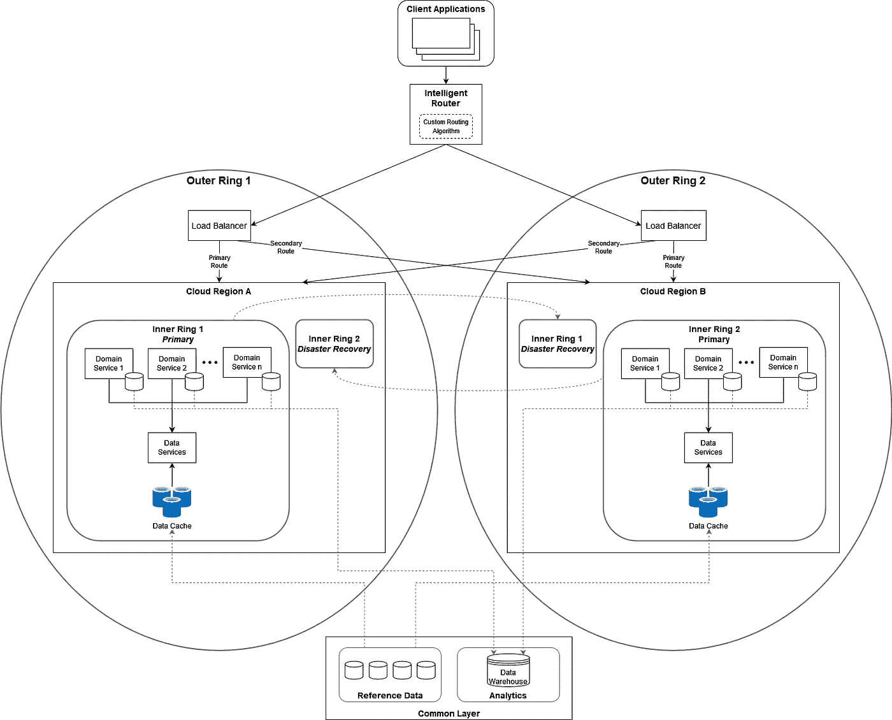

# 使用环形架构实现店内应用弹性

> 原文：<https://medium.com/walmartglobaltech/using-a-ring-architecture-for-in-store-application-resiliency-380aafc26c24?source=collection_archive---------3----------------------->

# ***解决零售店系统技术的现实弹性和规模挑战***

Source: [https://pixabay.com/illustrations/tech-circle-technology-abstract-5142625/](https://pixabay.com/illustrations/tech-circle-technology-abstract-5142625/)

# 挑战

想象一下，如果软件性能不佳、行为不一致或停机导致收入损失。让我们更进一步，想象一下客户体验和品牌声誉在哪里受到这些场景的直接影响。在零售和面向顾客的解决方案领域工作意味着始终从顾客和使用我们提供的技术的商店员工的角度来看待问题。在沃尔玛，我们处理…嗯…沃尔玛规模，这意味着全国，国际，零售，电子商务和移动。这是一个高度复杂的环境，要求我们的解决方案能够顺利运行，并得到高度灵活且可扩展的基础架构的支持，从而保持正常运行。即使它们闪烁，也必须有一种方法来恢复到满功率，以促进销售，并保持客户体验平稳运行。为店内系统提供创造性的解决方案以实现高弹性和可扩展性并非易事。

我要做的是深入了解我们最近在沃尔玛的数字零售中为销售无线设备和计划的店内解决方案实施的云应用程序基础架构和模式。该平台目前支持在线销售，随着最近的实施，现在支持零售。如果你想了解更多关于这个平台的应用和服务层的信息，请参阅我的另一篇[文章。](/walmartglobaltech/microservices-with-orchestration-and-choreography-d09941b1b4e6)在使用这些模式时，有多种设计和实现决策，所以我将在稍微高一点的层次上解释要点以及为什么做出特定的解决方案设计选择。

如果你还没有读过我之前写的关于成为一名全栈架构师的重要性的文章，我鼓励你去读一读。它讨论了现代架构如何比以往更加复杂，以及为什么成为一名能够设计跨所有层的解决方案的架构师是至关重要的。这里讨论的主题是一个真实的例子，说明了成为一名全栈架构师的重要性。谈到弹性和可扩展性，传统方法(如集群、负载平衡和自动扩展)都是赌注。然而，在这种情况下，这些根本不足以满足我们零售用例的需求。开发一个全面的解决方案需要深入了解整个体系:网络、基础架构、应用程序和数据。在我进入细节之前，让我们先打好基础，谈谈问题陈述的各个方面:

*   无线设备通过多种渠道销售，包括全国各地的沃尔玛商店和沃尔玛的电子商务网站。此外，商店可以支持不同的运营商。
*   每个运营商的交易和销售收入因市场趋势、购物模式和其他因素而异。尽管在节假日、促销活动和新设备发布期间会出现购物高峰，但我们需要确保全年一致的性能和可用性。为意想不到的事情做计划是非常重要的。
*   store associates 的用户界面是一个基于平板电脑的新应用程序。在商店中运行的这些平板电脑和云中的后台微服务之间有一个复杂的基础设施网络。这包括边缘网关、店内无线网络、全球和内部负载平衡器以及强大的安全基础设施。
*   正如您所料，停机意味着销售损失、负面的客户体验以及很大的品牌影响。尽管对停机有一定的容忍度，但我们希望解决方案不会接近这种程度。毕竟，这是一个面向未来的平台，而不是面向昨天的。

**架构模式**

在我们开发架构之前，我们必须满足的关键目标已经确定，并用于驱动解决方案设计及其实施。这些都是经过深思熟虑和精心制作的，符合企业想要实现的目标，并基于整个平台需要交付的内容。

1.  **限制爆炸半径。**限制任何停机或中断的爆炸半径所需的解决方案。换句话说，任何停电都需要得到控制，以便受影响的商店数量最小，并且在最坏的情况下，不会跨越地理区域界限。
2.  **支持未来的可扩展性。**我们需要满足现有的可扩展性需求以及未来的需求。虽然这个平台最初是用于无线的，但是也有计划将其用于其他服务。该架构需要可扩展和扩充，以适应未来出现的用例。
3.  **保持客户体验。**在正常和异常情况下，不能牺牲用户界面性能和客户体验。所有的后台微服务都在云中，所以通信服务之间的距离很重要。架构解决方案需要考虑商店的物理位置和通信服务之间的距离。
4.  **保持数据一致且易于访问。**无线订单数据和用于交易处理和分析的其他数据必须一致。这意味着无论哪家商店在处理交易，定价信息、设备详细信息、商店库存和订单数据都需要保持一致，以便所有订单都得到相同的处理，没有任何差异。

我们最终采用的方法是使用*环形基础架构模式*。那么这到底是什么，它是如何工作的？首先，正如单词 *ring* 所暗示的，这种模式支持我们的基础架构和平台服务的逻辑分组的创建。它由几个关键部分组成:

*   **外环** —接收来自商店的客户交易，以便进行处理。它们离商店和客户端应用程序最近。
*   **内环** —包含负责处理客户交易的技术平台的应用和数据服务。它们还处理故障转移事件，确保我们的软件在任何单个环变得不稳定或不可用时继续运行。
*   **智能路由** —将商店流量路由到最近的外环。对于我们的用例，“最近的”是指距离任何给定沃尔玛商店最少英里数的环。

使用环形图案可以让我们实现几个目标。首先，可以根据需要设置任意多的外环和内环，使我们的平台具有极高的弹性和可伸缩性。其次，使用智能路由，我们能够保证商店交易由最近的云区域处理。这非常重要，因为它避免了单个客户交易由多个云区域处理的情况。如果发生这种情况，性能会很差，客户体验也会受到负面影响。

**解决方案设计**

既然我们已经回顾了该模式的核心方面，那么让我们来看看解决方案设计并讨论它是如何工作的:

Ring Architecture Solution Design

从顶层开始，商店中来自客户端应用程序的交易由智能路由器处理，该路由器确定目的外环。在我们的实现中，每个外环都是一个云区域，因此这个路由将存储流量定向到进行处理的地方。使用分配给每个沃尔玛商店并包含在每个交易请求中的唯一标识符，在不同区域之间划分商店流量。路由器中的自定义路由算法的工作是询问这些唯一标识符，并将流量发送到适当的区域。

每个云区域都有一个主内环和专用负载平衡器。在正常处理期间，负载平衡器通过主路由发送 100%的流量。次要路由仅在主要路由不可用时使用，这意味着存在中断。所有这些都是配置驱动的，不需要发布任何代码。一旦流量被发送到一个内环，所有后续的服务到服务集成都使用我们的服务网格框架留在该环内。

事务数据本地存储在每个环中，以保持事务处理的性能优化。这些事务存储被设计成在环或区域故障期间保证零数据丢失。我们使用云原生解决方案对此进行了配置，以避免不必要的复杂性。底部显示的公共层是所有事务性数据进行集成以进行分析的地方，也是我们存储参考数据的地方，这些参考数据被复制到数据缓存中的每个内环。这种设计使我们能够实现保留客户体验、确保零数据丢失以及在交易处理过程中实现数据一致性的目标。

当使用这种模式时，有许多含义需要在详细的设计和实现中显示出来。在这些之前完成足够深层次的架构以支持工程工作是很重要的。

*   作为核心事务一部分的服务必须是环感知的，这意味着它们都驻留在同一个内环中。请记住，让每个服务感知环可能会改变那些受影响的服务的应用程序架构。
*   不是核心事务的一部分的服务可以是环感知的，但不是必须是/不能是。这些可能包括来自外部域的依赖服务、使用异步模式集成的服务、消息/流服务或遵循不同部署模型的遗留业务服务。
*   每个主内环将有一个全容量灾难恢复(DR)环，该环*必须在不同的外环*中。这使得在外环不可访问的情况下(例如，存在区域中断)或者内环变得不稳定并且存在受控故障转移时，能够以全规模运行。
*   将存在不允许所有服务都是环感知的限制。如解决方案设计中所示，公共层将需要成为架构实现的一部分。在我们的例子中，公共层包含参考数据和数据仓库。参考数据在环基础设施之外创作和管理，并在每个内环内缓存。每个内环中的缓存将这些数据与使用它们的事务服务放在一起。所有报告和分析也位于环外，为运营分析提供单一、集成的来源。
*   寻找事务性数据需要知道在哪个内环中搜索。在我们的例子中，我们有一种方法可以做到这一点，即预先识别唯一的商店编号，并且知道最糟糕的情况是搜索每个内环。记住这个用例，并确保它得到解决。在只有几个环的情况下，搜索每个环可能工作得很好，但是随着更多环的加入，这将不能很好地扩展。
*   传统的负载平衡和路由算法不太可能与给定外环的流量分片所需的策略相匹配。如上所述，我们使用了商店位置并实现了一个定制的路由脚本。这是在分析了几个数据点后做出的决定，包括商店的销量、每家商店的收入以及云区域之间的延迟。确定哪些数据点符合您的需求，并仔细计划，因为这将直接决定需要多少外环和内环。
*   灾难恢复过程将变得更加复杂。最大限度地实现自动化，并特别注意需要如何处理事务性数据，以便在没有任何损失的情况下从中断中恢复。
*   不要忽视 CI/CD 自动化和部署对等性的重要性。当实现这个模式时，构建管道将需要总是部署到所有活动和灾难恢复内环。您可能还需要能够将商店应用程序部署到一个环或环中的一组商店。在我们的架构中，存储到环的映射被实现为技术参考数据。这些数据在一个中心位置进行管理，这样我们可以避免任何硬编码。
*   操作日志记录、监控和事务跟踪将变得更加困难。为每个外环和内环创建一个唯一的标识符，并将它们添加到所有应用程序日志中。这将能够跟踪事务并将其映射回处理它们的环。遵循 OpenTelemetry 等规范和标准，获取深度遥测数据，以帮助分析性能和行为。

**总结**

零售系统中的弹性和规模架构需要创新思维，并使用基础设施解决方案来补充应用层中采用的方法。环形基础设施架构模式就是这样一个例子，它使我们能够满足业务的高要求。使用它确实会增加复杂性，所以要明智地选择何时何地使用这种模式，并理解整个解决方案堆栈的含义。虽然这里展示了每个云区域一个，但是对于手边的用例，可以有任意多的内环和外环。从简单、实用开始，并根据您的独特需求进行改进。

## 承认

该架构及其实现的主要贡献者:[克里希纳·库马尔(KK)](/@sskrishna.kumar) 、[阿米特·拉吉](https://amit894.medium.com/)、[查希尔·拉菲](/@zahiritpro)和[西瓦·戈拉普迪](https://www.linkedin.com/in/siva-gollapudi-66621a6/)。