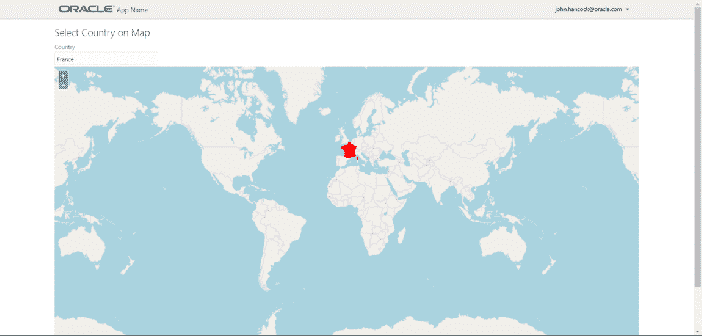
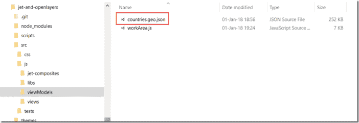

# 在 Oracle JET 应用程序中使用 OpenLayers 地图选择国家/地区

> 原文：<https://medium.com/oracledevs/using-an-openlayers-map-to-select-countries-in-an-oracle-jet-application-ce56822b4e03?source=collection_archive---------0----------------------->

在最近的一篇文章中，我讨论了如何在 Oracle JET 应用程序中使用开源的 geo、GIS 和地图库 OpenLayers。那篇文章展示了在标准 Oracle JET 复选框集组件中选择的国家是如何在世界地图上表示的。在本文中，我们将此向前推进了一步——或者实际上是几个步骤。通过在地图上添加交互性，我们允许用户在世界地图上选择一个国家，并将这一选择通知 JET 组件。同步是双向的:如果用户在 JET 输入文本组件中键入一个国家的名称，这个国家将在世界地图上突出显示。请注意，该地图具有完整的缩放和平移功能。



Gif 演示了地图是如何突出显示法国的。接下来，用户在输入文本组件中键入 Chile，当更改完成时，地图被同步:Chile 被突出显示。然后用户将鼠标悬停在摩洛哥——信息 DIV 元素显示了这一事实。尚未做出选择。然后用户鼠标点击摩洛哥。在地图上选择国家，JET 输入文本组件与国家的名称同步。随后，对印度进行同样的操作:悬停，然后选择。注意:地图可以轻松支持多国选择；我必须显式关闭该选项(默认行为是允许它)。

我在实施此功能时面临的挑战是:

*   添加带有国家(要素)的矢量图层
*   当鼠标悬停在国家上方时高亮显示该国家
*   添加*选择交互*以允许用户选择国家
*   将*地图*中的国家选择事件传达给“常规”JET 组件
*   将地图与在 JET 组件中键入的国家/地区名称同步

步骤(假设先执行本文中[的步骤):](https://technology.amis.nl/2018/01/01/embedding-openlayers-in-oracle-jet-for-advanced-maps-and-gis-style-user-interfaces/)

1.  用输入文本、信息 DIV 和地图容器(DIV)创建 mapArea.html
2.  为 mapArea 模块创建 mapArea.js
3.  向 index.html 添加一个带有 mapArea 模块数据绑定的 div
4.  下载 GEOJSON 格式的文件，其中包含世界各国的注释 geo-json 几何
5.  使用两个图层初始化地图-栅格 OSM 世界地图和矢量国家形状
6.  添加覆盖以突出显示悬停的国家
7.  添加选择交互—允许选择国家/地区—对所选国家/地区应用粗体样式
8.  从国家选择中更新 JET 组件
9.  根据 JET 组件中的值[更改]在地图上设置国家选择

这里是用来实现这个的代码:[https://github.com/lucasjellema/jet-and-openlayers](https://github.com/lucasjellema/jet-and-openlayers)。

# 用输入文本、信息 DIV 和地图容器(DIV)创建 mapArea.html

```
<link rel="stylesheet" href="https://cdnjs.cloudflare.com/ajax/libs/openlayers/4.6.4/ol-debug.css" /> 
<h2>Select Country on Map</h2> 
<div id="componentDemoContent" style="width: 1px; min-width: 100%;"> <div id="div1"> 
<oj-label for="text-input">Country</oj-label> 
<oj-input-text id="text-input" value="{{selectedCountry}}" on-value-changed="[[countryChangedListener]]"></oj-input-text> 
</div> 
</div> <div id="info"></div> <div id="map2" class="map"></div>
```

# 为 mapArea 模块创建 ViewModel mapArea.js

```
define( ['ojs/ojcore', 'knockout', 'jquery', 'ol', 'ojs/ojknockout', 'ojs/ojinputtext', 'ojs/ojlabel'], function (oj, ko, $, ol) { 'use strict'; 
function MapAreaViewModel() { 
var self = this; 
self.selectedCountry = ko.observable("France"); self.countryChangedListener = function(event) { } ... 
} 
return new MapAreaViewModel(); } );
```

# 向 index.html 添加一个带有 mapArea 模块数据绑定的 DIV

```
...</header> 
<div role="main" class="oj-web-applayout-max-width oj-web-applayout-content"> 
<div data-bind="ojModule:'mapArea'" /> 
</div> 
<footer class="oj-web-applayout-footer" role="contentinfo"> ...
```

# 下载 GEOJSON 格式的文件，其中包含世界各国的注释 geo-json 几何

我从 GitHub:【https://github.com/johan/world.geo.json】T2 下载了一个包含国家数据的 GEOJSON 文件，并将该文件放在我的 JET 应用程序的目录 src\js\viewModels 中:



# 使用两个图层初始化地图-栅格 OSM 世界地图和矢量国家形状

```
function MapAreaViewModel() { 
var self = this; 
self.selectedCountry = ko.observable("France"); self.countryChangedListener = function(event) { // self.selectInteraction.getFeatures().clear(); // self.setSelectedCountry(self.selectedCountry()) } $(document).ready ( 
// when the document is fully loaded and the DOM has been initialized 
// then instantiate the map 
function () { initMap(); }) function initMap() { 
var style = new ol.style.Style({ fill: new ol.style.Fill({ color: 'rgba(255, 255, 255, 0.6)' }), stroke: new ol.style.Stroke({ color: '#319FD3', width: 1 }), text: new ol.style.Text() });self.countriesVector = new ol.source.Vector({ url: 'js/viewModels/countries.geo.json', format: new ol.format.GeoJSON() }); self.map2 = new ol.Map({ layers: [ new ol.layer.Vector({ id: "countries", renderMode: 'image', source: self.countriesVector, style: function (feature) { style.getText().setText(feature.get('name')); return style; } }) , new ol.layer.Tile({ id: "world", source: new ol.source.OSM() }) ], target: 'map2', view: new ol.View({ center: [0, 0], zoom: 2 }) }); }//initMap
```

# 添加覆盖以突出显示悬停的国家

注意:这段代码被添加到 initMap 函数中:

```
// layer to hold (and highlight) currently selected feature(s) var featureOverlay = new ol.layer.Vector({ source: new ol.source.Vector(), map: self.map2, style: new ol.style.Style({ stroke: new ol.style.Stroke({ color: '#f00', width: 1 }), fill: new ol.style.Fill({ color: 'rgba(255,0,0,0.1)' }) }) }); var highlight; var displayFeatureInfo = function (pixel) { var feature = self.map2.forEachFeatureAtPixel(pixel, function (feature) { return feature; }); var info = document.getElementById('info'); 
if (feature) { 
info.innerHTML = feature.getId() + ': ' + feature.get('name'); 
} 
else { 
info.innerHTML = '&nbsp;'; 
} if (feature !== highlight) { 
  if (highlight) {   
    featureOverlay.getSource().removeFeature(highlight); 
  } 
  if (feature) { 
    featureOverlay.getSource().addFeature(feature); 
  } 
  highlight = feature; 
} 
}; self.map2.on('pointermove', function (evt) { 
  if (evt.dragging) { return; } 
  var pixel = self.map2.getEventPixel(evt.originalEvent);
  displayFeatureInfo(pixel); 
});
```

# 添加选择交互—允许选择国家/地区—对所选国家/地区应用粗体样式

这段代码就是基于这个例子:[http://openlayers . org/en/latest/examples/select-features . html](http://openlayers.org/en/latest/examples/select-features.html)。

```
// define the style to apply to selected countries var selectCountryStyle = new ol.style.Style({ stroke: new ol.style.Stroke({ color: '#ff0000', width: 2 }) , fill: new ol.style.Fill({ color: 'red' }) }); self.selectInteraction = new ol.interaction.Select({ condition: ol.events.condition.singleClick, toggleCondition: ol.events.condition.shiftKeyOnly, layers: function (layer) { return layer.get('id') == 'countries'; }, style: selectCountryStyle }); // add an event handler to the interaction self.selectInteraction.on('select', function (e) { 
//to ensure only a single country can be selected at any given time
// find the most recently selected feature, clear the set of selected features and add the selected the feature (as the only one)var f = self.selectInteraction.getFeatures() 
var selectedFeature = f.getArray()[f.getLength() - 1] self.selectInteraction.getFeatures().clear(); self.selectInteraction.getFeatures().push(selectedFeature); 
});
```

就在 self.map2 声明之后:

```
... self.map2.getInteractions().extend([self.selectInteraction]);
```

# 从国家选择中更新 JET 组件

向 selectInteraction 的 select 事件处理程序的末尾添加:

```
var selectedCountry = { "code": selectedFeature.id_, "name": selectedFeature.values_.name }; 
// set name of selected country on Knock Out Observable
self.selectedCountry(selectedCountry.name);
```

创造

```
self.setSelectedCountry = function (country) { 
//programmatic selection of a feature 
var countryFeatures = self.countriesVector.getFeatures(); 
var c = self.countriesVector.getFeatures().filter(function (feature) { return feature.values_.name == country }); self.selectInteraction.getFeatures().push(c[0]); }
```

# 根据 JET 组件中的值[更改]在地图上设置国家选择

在输入文本组件中实现 mapArea.html 文件中引用的 self . country changed listener l:

```
self.countryChangedListener = function(event) { self.selectInteraction.getFeatures().clear(); self.setSelectedCountry(self.selectedCountry()) 
}
```

创建以下监听器(用于在 countriesVector 中加载 GeoJSON 数据的结尾)；当加载准备就绪时，支持输入文本组件的 selectedCountry 可观察值中的当前国家值用于选择初始国家:

```
var listenerKey = self.countriesVector.on('change', function (e) { if (self.countriesVector.getState() == 'ready') { console.log("loading dione"); // and unregister the "change" listener ol.Observable.unByKey(listenerKey); self.setSelectedCountry(self.selectedCountry()) } 
});
```

# 参考

GitHub Repo 的代码(JET 应用):[https://github.com/lucasjellema/jet-and-openlayers](https://github.com/lucasjellema/jet-and-openlayers)。

国家 GeoJSON 文件—[https://github.com/johan/world.geo.json](https://github.com/johan/world.geo.json)

选择交互的打开层示例—[http://open Layers . org/en/latest/examples/Select-features . html](http://openlayers.org/en/latest/examples/select-features.html)

开放层 API-Vector:[http://open Layers . org/en/latest/API doc/ol . source . Vector . html](http://openlayers.org/en/latest/apidoc/ol.source.Vector.html)

带有 GEOJSON 源的 OpenLayers 矢量事件监听器—[https://GIS . stack exchange . com/questions/123149/layer-loadstart-loadend-events-in-OpenLayers-3/123302 # 123302](https://gis.stackexchange.com/questions/123149/layer-loadstart-loadend-events-in-openlayers-3/123302#123302)

动画 Gif 制作者—【http://gifmaker.me/ 

[OpenLayers 3:初学者指南](https://www.safaribooksonline.com/library/view/openlayers-3/9781782162360/)作者 Thomas Gratier 埃里克·哈扎德；保罗·斯潘塞，帕克特出版社，2015 年出版

OpenLayers Book —处理选择事件—[http://OpenLayers Book . github . io/ch11-creating-we B- map-apps/example-08 . html](http://openlayersbook.github.io/ch11-creating-web-map-apps/example-08.html)

*原载于 2018 年 1 月 2 日*[*technology . amis . nl*](https://technology.amis.nl/2018/01/02/using-an-openlayers-map-to-select-countries-in-an-oracle-jet-application/)*。*