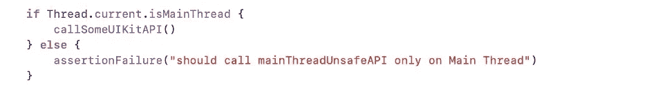
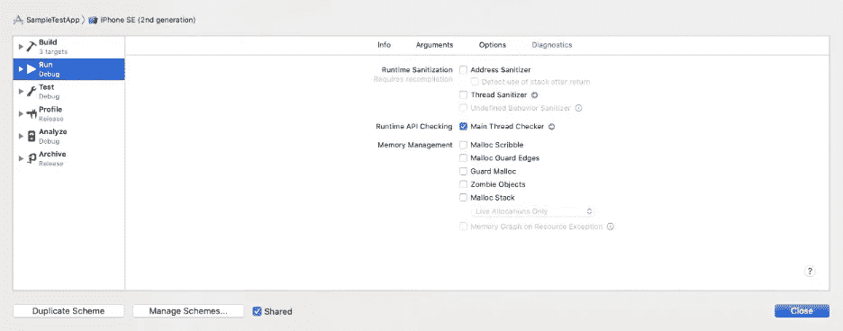
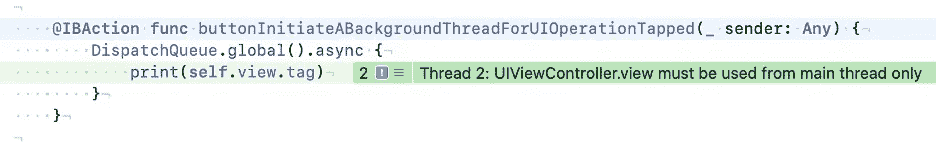
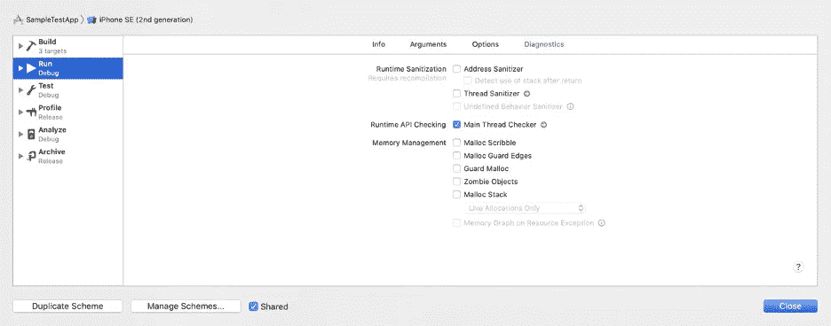
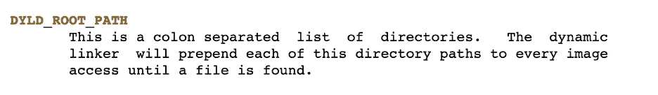
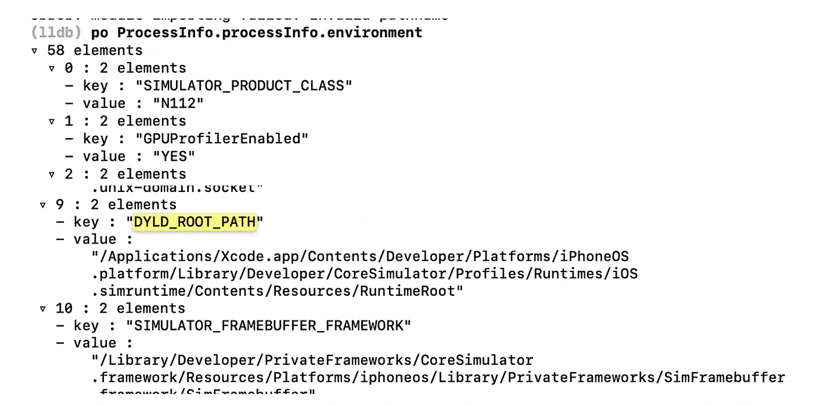
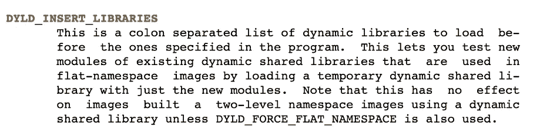
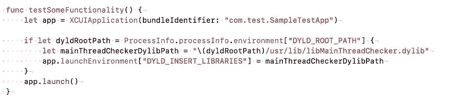
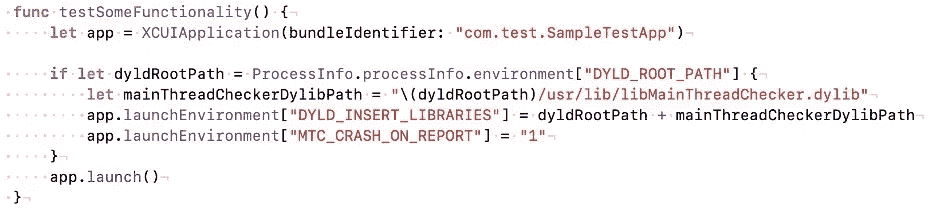

# 在 UI 测试中使用苹果的主要线程检测工具

> 原文：<https://medium.com/capital-one-tech/using-apples-main-thread-checker-tool-on-ui-tests-a89508bcd524?source=collection_archive---------5----------------------->

## 使用主线程检测器工具运行 UI 测试时识别主线程问题

UI 渲染是一项复杂且昂贵的操作。它需要对如此多的对象及其状态进行同步和并发处理，从性能的角度来看，有必要确保只从单个队列中执行操作。

引用作者 [Peter Steinberger](https://twitter.com/steipete) 关于线程安全类设计的伟大文章中关于 UIKit 为什么不是固有线程安全的内容:

> *“不使 UIKit 成为线程安全的是苹果方面有意识的设计决定。就性能而言，让它成为线程安全不会给你带来太多好处；事实上，这会使许多事情变得更慢。UIKit 与主线程绑定的事实使得编写并发程序和使用 UIKit 变得非常容易。你所要做的就是确保对 UIKit 的调用总是在主线程上进行。*

因此，UIKit(和 app kit)API 必须总是从主线程调用。否则，您的应用程序很可能会出现意外行为。

# 防止主线程违规

假设您想要添加一个简单的方法来在代码库中的主线程上执行代码。在调用 UIKit API 的地方，它大概会这样写。

由于显而易见的原因，这将很快成为一种负担，并极大地膨胀您的代码库。幸运的是，苹果有一个[主线程检测器(MTC)工具](https://developer.apple.com/documentation/xcode/diagnosing_memory_thread_and_crash_issues_early)可以派上用场。

# 什么是主线程检测器？

主线程检查器(MTC)是一个运行时工具，当应该在主线程上进行的系统 API 调用(如 UI 操作)在后台线程上被错误调用时，它会抛出警告。

# 启用 MTC

为你的应用启用 MTC 非常简单。只需打开诊断选项卡中的*主线程检测器*。

从这一点开始，每当您运行您的应用程序并且发生主线程冲突时，控制流将命中一个断点，让您知道发生了冲突。

# 在 UI 测试中使用 MTC

在运行 UI 测试时打开 MTC 可以使您的 UI 测试为您检测这些违规，因为只有当您在运行时执行特定的代码路径时，才能检测到 MTC 违规。

为您的 UI 测试启用 MTC 可以像在您的应用程序方案中打开主线程检查器选项一样简单。或者，您可以用几行代码以编程方式完成。

# 驻留在同一项目或工作区中的 UI 测试

如果你的 UI 测试和你的应用程序位于同一个工作区，那么你可以简单地在你的应用程序的方案中勾选*主线程检测器*的复选框，如下所示:

当执行 UI 测试时，Xcode 将编译您的应用程序，并在启用 MTC 的情况下启动它。

# 驻留在不同项目或工作区中的 UI 测试

如果您的 UI 测试是在一个单独的项目或工作区中进行的，那么上述方法将不起作用。相反，此配置中的测试不会使用应用程序的方案设置来启动应用程序。

为了在这个场景中启用 MTC，我们需要在从 UI 测试工作区启动应用程序时注入我们的 MTC enable 标志。

浏览[苹果文档](https://developer.apple.com/documentation/xcode/diagnosing_memory_thread_and_crash_issues_early)让我们对 Xcode 如何支持 MTC 有所了解:

*以上 dylib 的路径(来自苹果的文档)是针对 macOS 的。对于 iOS 模拟器的不同版本/操作系统，我们需要动态设置 dylib 的路径。*

因此，我们可以通过为架构找到正确的*libmainthreadchecker . dylib*来启用 MTC，然后在启动应用程序时注入它。

## 因为主线程检测器不要求您重新编译代码，所以您可以在现有的 macOS 二进制文件上运行它

将位于`/Applications/Xcode.app/Contents/Developer/usr/lib/libMainThreadChecker.dylib`的动态库注入到可执行文件中。

## 找到 libMainThreadChecker.dylib 的正确路径

从 [dyld 手册页](https://www.freebsd.org/cgi/man.cgi?query=dyld&apropos=0&sektion=0&manpath=Darwin+8.0.1%2Fppc&format=html) **:**

[Copyright 1994–2021 The FreeBSD Project. All rights reserved.](https://www.freebsd.org/copyright/freebsd-doc-license/)

在启动时，操作系统注入 **DYLD_ROOT_PATH** 作为环境变量的一部分。这可以用来找到相关的*mainthreadchecker . dylib .*

## 发布时在应用中注入 DYLIBs

你可以通过使用 **DYLD_INSERT_LIBRARIES** 在你的应用中注入一个 dylib。

来自 [dyld 手册页](https://www.freebsd.org/cgi/man.cgi?query=dyld&apropos=0&sektion=0&manpath=Darwin+8.0.1%2Fppc&format=html):

[Copyright 1994–2021 The FreeBSD Project. All rights reserved.](https://www.freebsd.org/copyright/freebsd-doc-license/)

结合以上两者，我们可以在从 UI 测试中启动 SUT 应用程序时注入 MTC dylib，如下所示:

请注意，当在独立于你的应用程序的 UI 测试上运行 MTC 时，它似乎不会工作，因为调试器没有连接到你的应用程序。

*(The above will not occur if your app is not attached to the debugger, which is the case when the UI Tests and your app project are in different workspaces.)*

处理这种情况的一个有用的技巧是当这种违规发生时使你的应用崩溃。要实现这一点，只需将 **MTC_CRASH_ON_REPORT** 传递给环境变量。

(*From an extremely insightful* [*article*](https://bryce.co/main-thread-checker-configuration/) *from Bryce Pauken where he lists a few hidden/poorly documented, but useful MTC features*)

# 结论

UIKit API 本质上不是线程安全的，这给开发人员清理所有 ui kit API 调用站点增加了额外的负担。这个问题在大型代码库中尤其严重，在大型代码库中有几个异步回调并不少见。主线程检测器工具可以帮助减轻一些风险。理解如何使用 MTC 将允许您更有效地使用 UIKit APIs。

*披露声明:2021 资本一。观点是作者个人的观点。除非本帖中另有说明，否则 Capital One 不隶属于所提及的任何公司，也不被这些公司认可。使用或展示的所有商标和其他知识产权是其各自所有者的财产。*

[*科技矢量*](https://www.freepik.com/vectors/technology) *由故事创作—*[*【www.freepik.com】*](http://www.freepik.com)