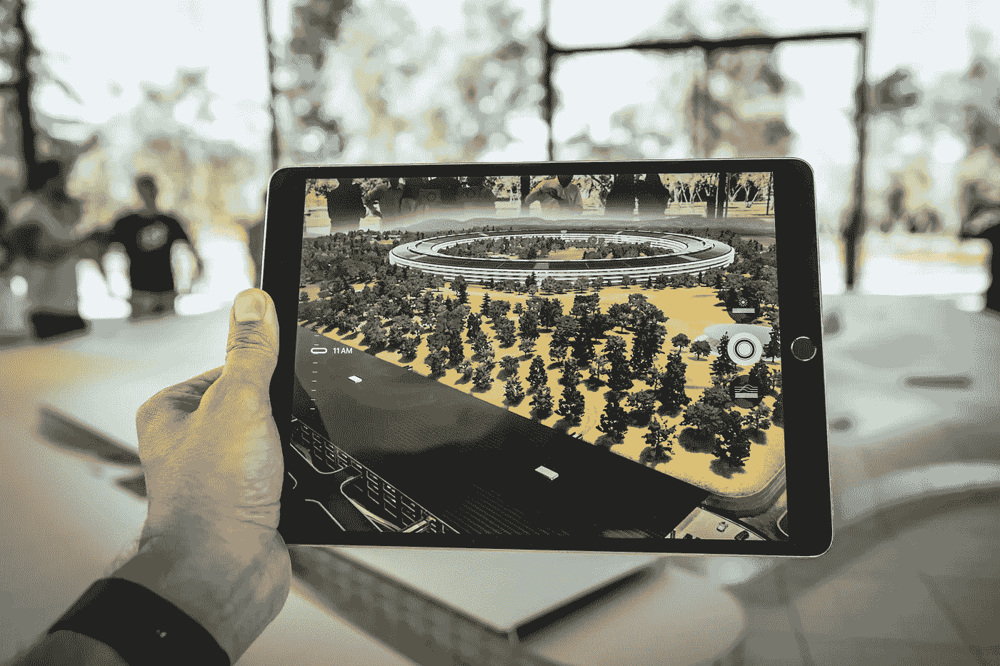
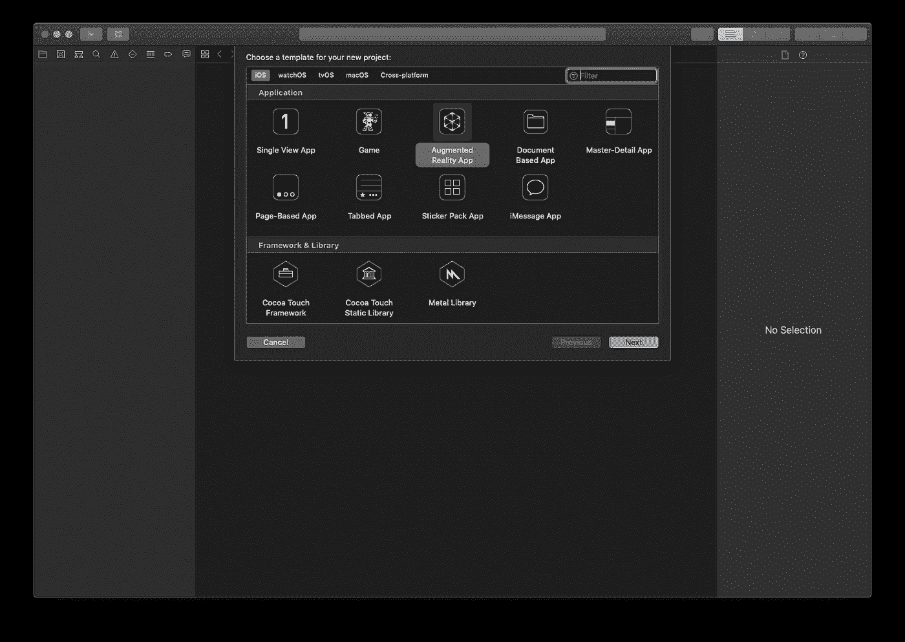
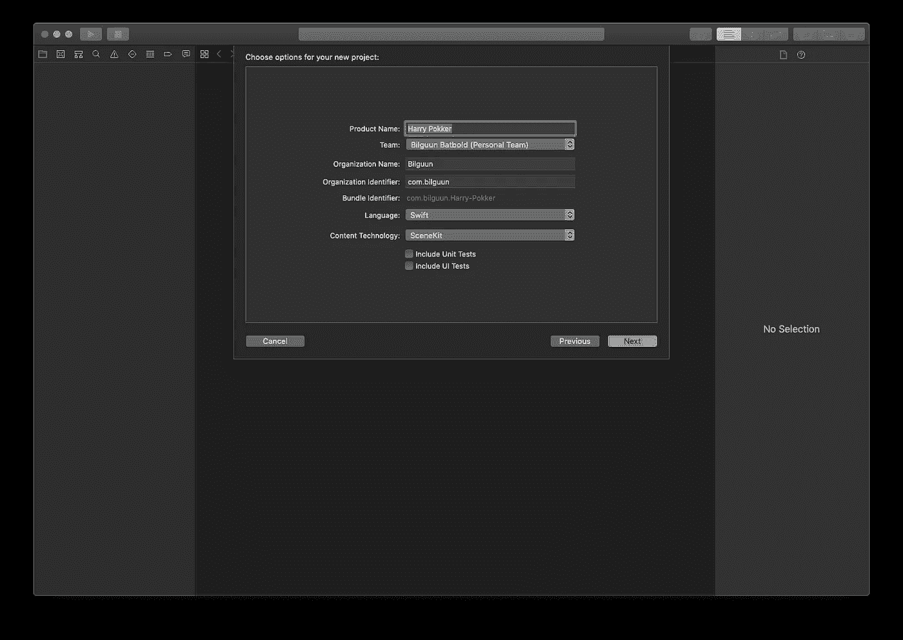
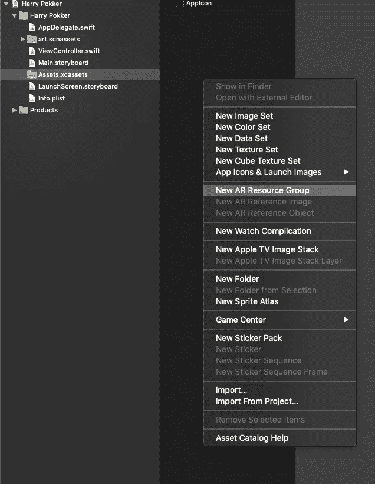
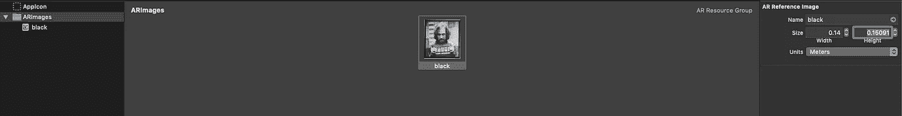
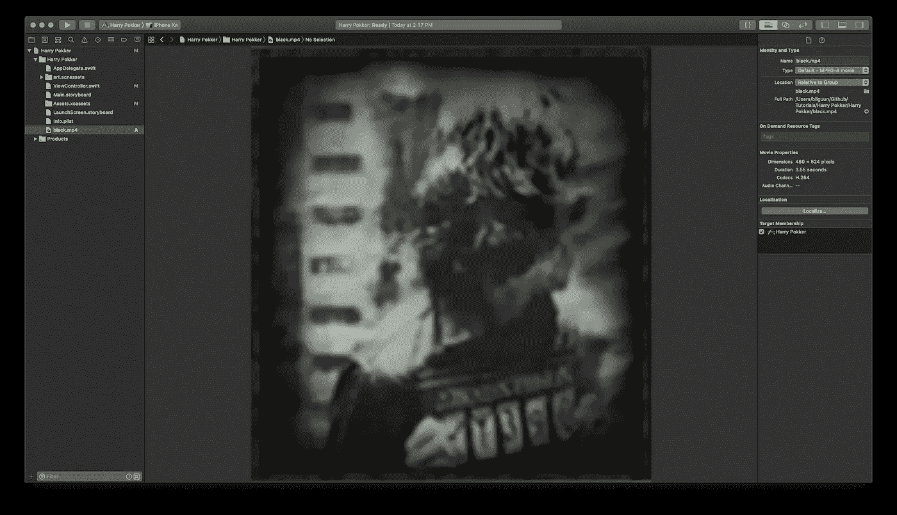
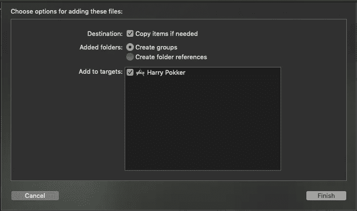

# 使用 ARKit 在增强现实中显示视频

> 原文：<https://medium.com/quick-code/using-arkit-to-display-video-in-augmented-reality-3a2e4c1418ad?source=collection_archive---------0----------------------->

Image taken from [Unsplash](https://unsplash.com/photos/87oz2SoV9Ug)

# 我们将要做什么

作为一个成长中的孩子，我对《哈利波特》系列中的动画 ***【预言家日报】*** 非常着迷。如果你以前看过，新闻文章会出现' ***'直播*** '就像你在下面看到的一样。

在本教程中，我们将使用 ARKit 重新创建它。我们将首先检测天狼星布莱克的图像，然后在图像上叠加一个要播放的视频。我们开始吧！

# 辅导的

在我们开始学习本教程之前，让我们收集一下完成本教程所需的所有材料。

## 收集资源

I will be using this particular photo

首先，我所做的是浏览 Pinterest 来检索这张特定的照片。接下来，我裁剪了 ***图像*** ，我们将检测并覆盖实际视频。

Cropped image

最后，我们将在这张检测到的图像上播放一段视频。

I will be using this particular video.

## 创建新项目

Create a new AR Project

Language: Swift, Content Tech: SceneKit

现在您已经创建了一个项目，让我们在 Assets 文件夹中创建一个新的 AR 资源组，`Assets.xcassets`

添加我们的裁剪图像(我的名为`black`)并给它一个尺寸。尺寸是我们 ***实际*** 在我们打印的照片上裁剪出的图像尺寸。根据我的测量，我打印的照片大约是 14x15cm 厘米。一旦我们键入 0.14 米的宽度，Xcode 会自动生成高度。

接下来，拖放我们将用来播放检测到的图像的视频文件。

Video file black.mp4 added

确保当我们添加视频时，我们将它添加到我们的项目目标。

## 添加代码

删除`ViewController.swift`中的所有代码，替换成上面的代码。我们在这里所做的是设置 AR 配置来跟踪图像，并设置我们的应用程序应该跟踪哪些图像。

接下来，我们将使用一个委托方法在检测到的图像上添加我们的视频。delegate 方法通知我们它将要添加一个节点到场景中。这个节点将是空的，我们可以相应地定制。

但是在我们输入新代码之前，逻辑流程是这样的:

1.  首先检测我们的应用程序何时在锚中添加了一个新节点
2.  检查我们的锚是否匹配`ARImageAnchor`，如果匹配，则意味着我们的图像被检测到
3.  创建一个包含视频文件的视频节点，并将其添加到视频场景中。调整所有必要的位置
4.  创建一个与我们检测到的图像具有相同方向和大小的新平面
5.  将我们的视频节点添加到平面
6.  创建包含该平面的新节点
7.  将这个新节点添加为子节点

这就是我们最终会得到的结果。让我们运行应用程序，看看结果！

不错！我们的 AR 应用程序工作正常！然而，有一个小问题。原始的`Daily Prophet`新闻，有循环效果，所以让我们在图像上循环我们的视频。 **ARKit** 让你开发出世界上最大的 AR 平台。所以，从[最佳 ARKit 教程](https://blog.coursesity.com/best-arkit-tutorials/)中学习 ARKit 是有益的。

## 循环播放视频

编辑我们的代码，如上所示。我们改变的是:

1.  我们使用`AVPlayer`来播放物品
2.  使用`AVPlayer`初始化我们的`video node`
3.  添加一个观察者，以便当玩家完成当前项目时，重置视频并再次播放

继续运行应用程序吧！最终的结果应该与我们设定的目标非常相似！

# 结论

在本教程中，您已经看到了开始使用***ARKit****是多么容易，它确实使开始使用 AR 成为一个有趣的过程！使用 ***ARKit*** 还可以做更多的事情，例如在跟踪的图像上添加 3D 模型/网络视图，或者在检测到的平面/特征点上添加新的对象/模型等。但是现在，我们只用几行代码就完成了一些非常酷的事情！*

*像往常一样，可以在下面的 my repo 中找到这个项目的源代码:*

* [## 比尔古恩 132/哈利-波克

### AR 工具包教程，帮助您开始使用图像检测和视频叠加

github.com](https://github.com/Bilguun132/Harry-Pokker)* 

*如果有人觉得这些有用，请随意分享或者让我知道是否有错误/不好的实践/实现。*

*祝编码愉快！*