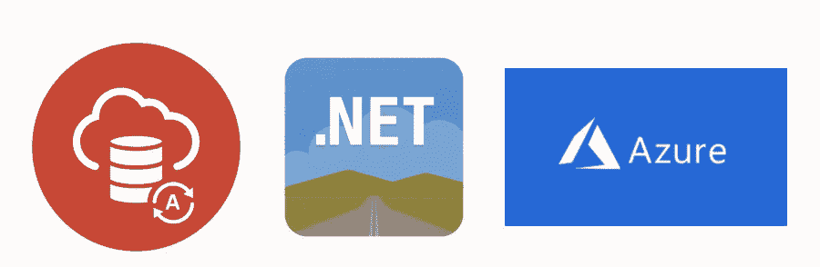
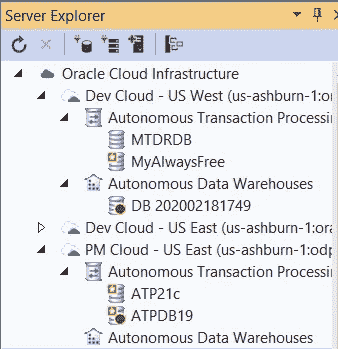
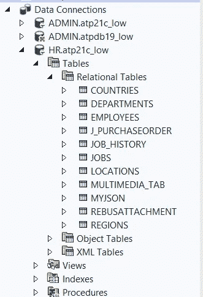

# 通过 Oracle 自治数据库使用 Azure Web Apps

> 原文：<https://medium.com/oracledevs/using-azure-web-apps-with-oracle-autonomous-database-1d7002bdd20e?source=collection_archive---------3----------------------->



几年前，我写了一篇关于如何使用。NET 框架和托管 ODP.NET。从那时起，。NET(核心)和 ODP.NET 核心变得越来越受欢迎，发展速度超过。NET 框架和托管 ODP.NET。事实上，NuGet Gallery ODP.NET 核心总下载量最近已经超过了托管 ODP.NET 下载量，尽管后者领先了几年。我认为这个结果是不可避免的。NET 框架处于维护模式，所有新的创新都发生在。网(核心)。

随着开发人员转向。NET(核心)，我创建了一个新的视频教程，演示如何将. NET 5 和 ODP.NET 核心应用程序部署到连接到 Oracle 自治数据库的 Azure。

Azure ASP.NET Core 5 and ODP.NET Core 21c and Oracle Autonomous Database tutorial

基本的配置步骤与两年前编写的旧教程非常相似。最大的不同和明显变得更容易的是 Oracle ADB 管理使用了[Oracle Developer Tools for Visual Studio](https://www.oracle.com/database/technologies/developer-tools/visual-studio/)。这些工具现在有一个 Oracle 云基础架构节点，用于执行自治数据库管理任务。



Oracle Cloud Infrastructure node showing ADB instances in Visual Studio

在“数据连接”节点上，开发人员可以管理他们所有的 ADB 架构对象，类似于 Visual Studio 中的内部数据库管理体验。



ADB data connections in Visual Studio

如果你想了解更多，我的甲骨文同事 Christian Shay 写了一篇关于 [Oracle 自治数据库与 Visual Studio](/oracledevs/visual-studio-integration-with-oracle-autonomous-database-7c6243eca329) 集成的博客，提供了更多细节。

让我们回到手头的主题。

您可以创建自己的 Azure web 应用程序，通过几个简单的步骤连接到 ADB。无论是[ODP.NET 核心](https://www.nuget.org/packages/Oracle.ManagedDataAccess.Core/)还是[甲骨文亚行](https://docs.oracle.com/en-us/iaas/Content/Database/Concepts/adbfreeoverview.htm)都是免费的。创建 ADB 实例后，使用 Visual Studio 按照以下步骤部署 ASP.NET 核心应用程序:

1.  创建一个新的空 ASP.NET 核心应用程序项目。
2.  从 NuGet 画廊添加 ODP.NET 核心。
3.  用来自 [Oracle 的示例代码替换 Startup.cs 的内容。NET GitHub 站点](https://github.com/oracle/dotnet-db-samples/blob/master/session-demos/2021/odpcore-adb-azure/Startup.cs)。
4.  提供应用程序的名称空间、用户密码、网络服务名称、TNS 管理目录和钱包目录的值。这些目录应该位于您的本地计算机上，以便对 web 应用程序与 ADB 的连接进行初始测试。如果您没有使用 ADB 实例的标准管理帐户，请修改用户 id。
5.  从 Visual Studio 中运行 web 应用程序。此步骤提供了一个检查点，以确保应用程序和 ADB 配置正确。
6.  将 **TnsAdmin** (对于 tnsnames.ora 和 sqlnet.ora)和 **WalletLocation** (对于 cwallet.sso)目录值修改为这些文件将上传到的 Azure web app 目录(即 D:\ home \ site \ wwwroot \<TNS admin 和 wallet 子目录>)。
7.  将应用程序部署到 Azure web 应用程序服务。选择天蓝色**基本**或更高的定价级别。**共享**和**自由**等级不能使用本教程使用的基于文件的钱包。
8.  默认情况下，tnsnames.ora、sqlnet.ora 和 wallet 文件不会作为整个项目的一部分部署到 Azure。您可以手动部署这些文件，也可以修改。NET 项目文件(即。csproj 文件)，以便它们将与其他项目文件一起部署。例如，如果目录“DB”是您的项目本地存储这些 Oracle 文件的位置，请执行以下操作。NET 项目文件添加:

```
<ItemGroup>
    **<None Include="DB\**" CopyToPublishDirectory="Always">**
</ItemGroup>
```

9.部署完成后，转到 Azure 门户来管理刚刚创建的 web 应用程序。点击**配置。**然后，点击**新应用设置**。添加值为“1”的“网站 _ 加载 _ 用户 _ 配置文件”设置。点击**确定**然后点击**保存**应用新设置。此步骤允许 web 服务器使用基于文件的钱包。

10.一旦 Azure 重启 web 服务器，点击**浏览**链接。

您的 Azure web 应用程序现在将连接到 ADB 并检索销售历史(SH)架构数据。SH 模式对于任何连接用户的所有共享 ADB 实例都是只读的。如果您使用专用 ADB，您将需要为实例上的表提供您自己的查询。虽然该应用程序使用 ODP.NET Core 21c 和 ASP.NET Core 5 进行了测试，但预计它可以在新旧 ODP.NET 和。NET(核心)版本。