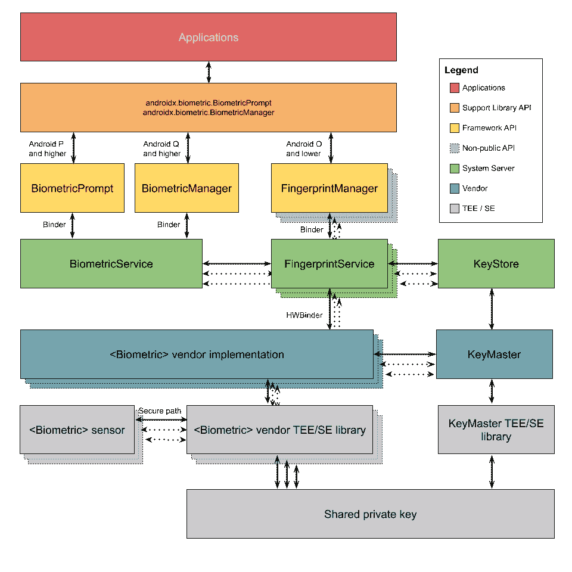

# 将 BiometricPrompt 与 CryptoObject 结合使用:方式和原因

> 原文：<https://medium.com/androiddevelopers/using-biometricprompt-with-cryptoobject-how-and-why-aace500ccdb7?source=collection_archive---------0----------------------->

Illustration by [Virginia Poltrack](https://twitter.com/VPoltrack?ref_src=twsrc%5Egoogle%7Ctwcamp%5Eserp%7Ctwgr%5Eauthor)

*生物识别*和*密码学*不是一回事。它们实际上是完全相互独立的:

*   *密码术*是对对手隐藏信息并验证信息的真实性。在密码学中，没有密钥，对手无法读取加密的数据。此外，大多数加密技术都有防篡改机制。
*   *另一方面，生物识别*是利用身体测量来验证个人身份。在生物识别技术中，指纹、面部或其他身份信息可用于身份认证。

Android 上有许多系统协同工作来保护数据。从 Android 4.4 开始，用户数据分区的内容默认加密。一般来说 [Jetpack Security](https://developer.android.com/topic/security/data) 是一个足够开发人员友好的选项，它在 AndroidKeyStore 中处理密钥生成的繁重工作，并为加密[文件和共享引用](/p/e4cb0b2d2a9)提供抽象。

尽管加密技术不依赖于生物识别技术，但在某些情况下，使用生物识别技术来保护您的加密密钥以提供额外的安全层是有意义的。这些用例包括:企业、政府、金融和医疗保健。这篇文章探索了*生物识别* *库*的`[CryptoObject](https://developer.android.com/reference/androidx/biometric/BiometricPrompt.CryptoObject.html)`在这些用例中派上用场的几个地方。Android 的生物识别 API 支持以下加密操作——密码、MAC 和签名。在本帖中，我们将重点讨论密码。

为了理解这两个系统是如何结合在一起的，让我们先深入了解一下加密技术在 Android 上是如何工作的。然后，我们将展示如何将生物识别技术用于额外的安全层，使您的应用程序更能抵御潜在的攻击者。

# Android 上的加密和密钥管理

Java Crypto API 的核心是一个`[Cipher](https://developer.android.com/reference/javax/crypto/Cipher)`，一个可以用来执行数据加密和解密的对象。要应用密码，您需要一个引用底层加密密钥的`[SecretKey](https://developer.android.com/reference/javax/crypto/SecretKey)`对象。只有拥有这个密钥的人才能使用这个密码来解密你的数据。在 Android 上，密钥应该保存在一个名为[*Android Keystore*](https://developer.android.com/training/articles/keystore.html)的安全系统中。 *Android 密钥库*的目的是将密钥材料完全保存在 Android 操作系统之外，并保存在一个安全的位置，该位置有时被称为*可信执行环境* (TEE)或*保险箱*。无论密钥材料存在于何处，攻击者都有可能获得它。因此, *Android Keystore* 尽可能严格地限制密钥材料，确保应用程序、Android 用户空间甚至 Linux 内核都无法访问这些材料。

假设你希望在 Android 上加密你的应用数据。当你的应用程序请求 [Android 密钥库](https://developer.android.com/reference/java/security/KeyStore.html)创建一个秘密密钥时，密钥库实际上从来不会给你的应用程序这个秘密密钥的值。那是因为秘钥永远不允许离开安全区域。实际过程是这样的:

1.  你的应用程序向安卓`KeyStore`请求一个`SecretKey`
2.  Android 密钥库在安全的位置(Strongbox 或 TEE)创建密钥。
3.  密钥库向您的应用程序返回一个别名。只有密钥库知道如何将这个别名映射到您新创建的`SecretKey`。
4.  当您的应用程序想要执行加密时，它会要求密钥库系统执行加密。
5.  密钥库系统接收明文和别名，并返回加密的数据，称为密文。(注意`Cipher`只是一个例子。其他工件包括`[Signature](https://developer.android.com/reference/java/security/Signature)`、`[Mac](https://developer.android.com/reference/javax/crypto/Mac)`和`IdentityCredential`。)
6.  当您的应用程序想要执行解密时，密钥库系统接收密文和别名，并返回解密的数据或明文。

# 添加生物特征以要求用户在场

默认情况下，Android 已经使用 PIN/模式/密码进行了全磁盘加密。您在应用程序中添加了生物认证，要求系统使用*认证绑定*来进一步保护您的密钥。即使设备遭到破坏，攻击者发出请求，Android 密钥库仍然会拒绝解密数据——除非攻击者能够以某种方式让用户使用他们的生物特征凭证进行身份验证。生物特征认证增加了额外的安全层，即使在受损的设备上也是如此，因为除非用户在场，否则无法访问由密钥库管理的硬件。

使用生物识别技术来锁定您的密钥的好处在于，与 Android 上的所有其他加密解决方案一样，生物识别系统和 Android 密钥库系统之间的所有敏感操作都发生在安全空间(TEE/SE)中，远离窥探的目光。为了理解这一点的重要性，让我们先来看看生物识别技术是如何工作的，以及这两个系统是如何交互的。

# 在安卓生物识别系统的掩护下

Android 需要一个强大的信任链。在添加生物特征之前，用户必须验证他们是他们所说的那个人。这个决定是当场作出的。在此过程中，生物识别凭据不会与您的应用程序共享，也不允许离开设备上的安全空间。

一般来说，Android 生物识别系统在两个地方使用，注册期间(又名帐户设置)和认证期间(在应用程序或键盘守卫中使用)。

当用户在其设备上设置新帐户时，会发生以下情况:

1.  他们可以选择登记他们的指纹(或面部或虹膜)。
2.  如果用户决定注册生物特征凭证，相关联的传感器在 TEE 中生成模板(也称为嵌入)。

稍后，您的应用程序允许用户使用生物特征进行身份验证。该框架与 TEE/SE 中的 Android 生物识别系统一起处理实际的身份验证。该过程包括以下步骤:

1.  用户在传感器上出示他们的生物特征凭证，例如指纹。
2.  系统安全地在 TEE 中生成嵌入，并将其与设置期间创建的嵌入进行比较。也就是说，生物识别系统检查凭证是否与设备中注册的凭证相匹配。
3.  框架将结果传递给你的应用程序:要么是，凭证匹配一个注册的模板，要么不是，凭证未被识别。
4.  如果使用了`CryptoObject`,则会生成一个额外的证明，该证明稍后可以由 TEE 确认该生物特征是真实的。这是用来解锁`CryptoObject`的。

简而言之，这就是生物识别系统在 Android 上的工作方式。

# 合作:安全空间中的私人数据检索

正如你所看到的，Android 上的密钥库系统和生物识别系统都自行提供了安全措施，尤其是因为它们将自己的资料和敏感操作保存在安全空间(TEE/SE)中。但是，当你需要生物认证来解锁与你的应用相关的`SecretKey`时，数据变得更加安全。这是因为整个交易发生在安全空间(TEE/SE)。不过，重要的是要注意，生物认证只是加密数据过程的一部分；它仅仅确定用户存在。

下面是生物识别系统和密钥库系统如何协同工作来保护您的用户数据:

1.  作为开发人员，您请求通过设置`[setUserAuthenticationRequired(true)](https://developer.android.com/reference/android/security/keystore/KeyGenParameterSpec.Builder.html#setUserAuthenticationRequired(boolean))`来访问您的密钥。
2.  当您的应用程序请求与`SecretKey`相关联的数据时，用户会收到提供有效生物特征凭证的提示。
3.  回想一下，生物传感器安全地与 TEE 通信，因此框架和第三方应用程序都不参与交易。因此，当用户轻触指纹传感器时，材料被 TEE 直接读取。
4.  如果生物特征凭证与注册的凭证相匹配，TEE 中的生物特征组件将生成一个硬件认证令牌(hat)。HATs 包含一个 HMAC，可以用来验证消息的完整性和真实性。
5.  TEE/SE 和 Keymaster 中的生物识别组件(也在 TEE/SE 中)共享一个密钥。因此，当框架将这个 HAT 转发给密钥库系统时，Keymaster 能够验证 HAT 的真实性和完整性，并解锁适当的密钥。
6.  生物识别框架调用你的应用程序的`onAuthenticated()`回调。

注意，因为系统试图将生物特征凭证与现有模板进行匹配，所以默认情况下，如果登记了新的生物特征凭证，则系统将使与生物特征认证相关联的所有现有密钥无效。这样一来，对手就无法注册他们的指纹或面部，并利用这些来访问您的私人数据。密钥将简单地停止工作，并且依赖于它的数据基本上丢失了。因此，如果您的应用程序处理高价值交易，如银行应用程序，请监视回调，该回调指示用户何时添加新的生物识别凭据。在那次回调中，在允许用户在你的应用中重新注册他们的生物特征凭证之前，通知用户并询问他们是否是故意的。

Figure 1

# 神秘物体

生物统计学和密码学是如此的独立，以至于在你自己的项目中，处理生物统计学认证的代码和处理加密/解密的代码甚至不需要在同一个类中。在您的项目中，这两个系统唯一应该交叉的地方是您对`CryptoObject`的定义。

此外，`CryptoObject`只是一个包装器，可以方便地将密码带到您可能需要的地方。当你的应用程序调用`[biometricPrompt.authenticate(CryptoObject)](https://developer.android.com/reference/androidx/biometric/BiometricPrompt.html#authenticate(androidx.biometric.BiometricPrompt.PromptInfo,%20androidx.biometric.BiometricPrompt.CryptoObject))`时，它会传入`CryptoObject`，`BiometricPrompt`会将完全相同的`CryptoObject`返回给你的应用程序的`[onAuthenticationSucceeded()](https://developer.android.com/reference/androidx/biometric/BiometricPrompt.AuthenticationCallback.html#onAuthenticationSucceeded(androidx.biometric.BiometricPrompt.AuthenticationResult))`回调函数。

不可否认的是，这个故事还有更多的内容。API 还使用`CryptoObject`参数来指示您需要一个 [**强生物识别**](https://source.android.com/compatibility/android-cdd#7_3_10_biometric_sensors) 传感器来进行身份验证；所以，如果你不传入参数，你的 app 的`SecretKey`在用户提供生物认证后是不会解锁的。此外，`CryptoObject`专用于特定的加密操作，并且`CryptoObject`被传递到的生物认证仅解锁该操作。这允许开发人员确保每次使用密钥都必须经过身份验证/批准。

# 现在来看一些代码

这里我们将保持加密部分简单。我们将演示如何使用一个`Cipher`和一个`SecretKey`来对称地加密/解密数据。你可以通过阅读 DAC 上的页面来了解更多关于 Android 上的[密码术。](https://developer.android.com/guide/topics/security/cryptography)

为了避免混淆和分离问题，您可以将所有的加密代码放在一个文件中，并将该文件命名为`CryptographyManager`。该文件可能如下所示。

为了进一步表明关注点的分离确实是真实的，将`CryptographyManagerImpl`声明为私有的，这样客户端代码只能看到接口及其方法签名。

在导入生物特征梯度依赖项后，构建您的`PromptInfo`对象和您的`BiometricPrompt`实例，而无需考虑加密。在显示认证对话框的代码中，比如`MainActivity`，像往常一样设置`BiometricPrompt`，如下所示。

# 1.导入 Gradle 依赖项

始终使用库的最新版本。截至本文发布之日，最新版本是 1.0.1。

# 2.创建 BiometricPrompt 的实例

# 3.生成 PromptInfo 对象

# 4.特定于业务的 OnClickListener

现在你已经有了你的`BiometricPrompt`和`PromptInfo`，接下来你要做什么取决于你的应用程序的业务逻辑。在我们的例子中，用户输入一个`[EditText](https://developer.android.com/reference/android/support/v7/widget/AppCompatEditText)`对象，然后点击一个`[Button](https://developer.android.com/reference/android/support/v7/widget/AppCompatButton)`来加密文本，或者点击另一个`Button`来解密任何已经加密的文本。

因此，对我们来说，有两个点击监听器:一个调用用户进行认证，以便*加密*数据；另一个调用用户认证，以便*解密*数据。因为这些`onClick`方法在调用`biometricPrompt.authenticate()`时都必须传入一个`CryptoObject`的实例，所以最终需要`Cipher`。

# 把所有的放在一起

对我们来说，`MainActivity`类最终看起来如下:

# 摘要

在这篇文章中，你学到了以下内容:

*   Android 上的加密(密钥库)系统和生物识别系统的区别。
*   如何通过将数据与生物特征相关联来保护特定于应用的安全数据。
*   如何使用`CryptoObject`将两个系统结合起来，实现更高程度的安全性。
*   如何在定义您的`SecretKey`时使用`setUserAuthenticationRequired(true)`，以便使用认证绑定锁定密钥。
*   如何在认证时将您的加密密码传递给`CryptoObject`以解锁密钥。

展示这些概念的完整 Android 应用程序样本在 https://github.com/isaidamier/blogs.biometrics.cryptoBlog 的[展出。](https://github.com/isaidamier/blogs.biometrics.cryptoBlog)

编码快乐！