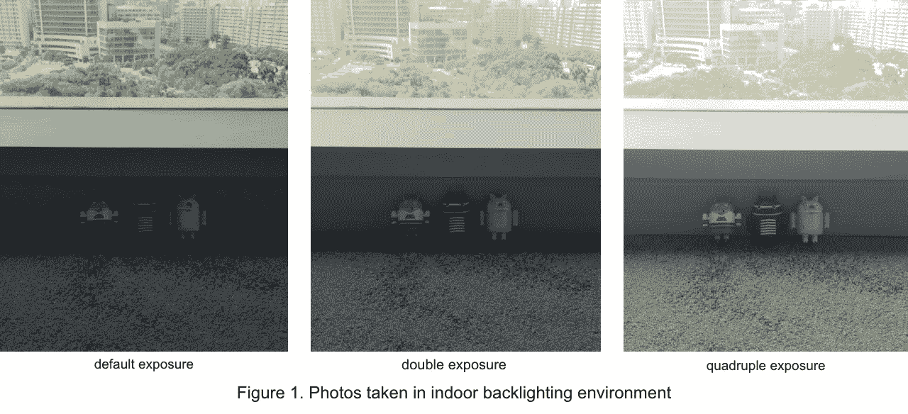

# 使用 CameraX 曝光补偿 API

> 原文：<https://medium.com/androiddevelopers/using-camerax-exposure-compensation-api-11fd75785bf?source=collection_archive---------3----------------------->

相机设备在推动移动设备创新方面至关重要，相机曝光是获得高质量相机图像的关键因素。在这篇博客中，我将讨论应用程序开发人员在处理相机曝光时面临的挑战。然后，我将介绍新的 CameraX 曝光补偿 API 如何帮助解决这些挑战，使快速拍摄高质量图像变得更加简单。最后，我将向您展示如何将 API 集成到您自己的应用程序中。

# 背景

在摄影中，曝光是决定相机最终图像的最重要因素之一，大多数摄影师都努力做到正确。自动曝光(AE)模式非常适合大多数常见场景，例如在旅途中快速拍摄图像。但是，在某些情况下，AE 模式会做出一些权衡来补偿整体图像质量，有时这些权衡可能不是您想要的。一个例子是逆光，例如，当从室内向窗户或其他明亮的光源拍摄时，或者当在室外拍摄时，太阳在对象的背面。在这些情况下，AE 模式会创建一张对明亮背景(照片的高光区域)进行适当曝光的照片，但黑暗前景中的主体可能会太暗或成为剪影。图 1 显示了三张在室内背光环境下拍摄的照片，条件相同，曝光不同:

AE 在整体照片质量方面做得很好，但更高的曝光确实给了可收藏的 Android 小雕像更好的关注。

传统上，摄影师调整 3 个控制以达到满意的曝光:

*   光圈:镜头的开口，控制进入相机的光量
*   快门速度:图像曝光的持续时间
*   ISO(国际标准化组织):相机表面收集光线的灵敏度

每个控制对图像都有独特的影响:改变光圈可能会修改景深，快门速度可能会模糊或冻结动作，较高的 ISO 可能会显著增加图像噪点。精确的数学是非常复杂的，但是这些设置有各种组合来获得相同的整体曝光，并且获得完美曝光值的过程可能会很苛刻。为了帮助补偿，CameraX 实现了曝光补偿 API。

# 曝光补偿 API 实现

曝光补偿 API 根据生成的自动曝光值，使用曝光补偿指数调整曝光补偿。曝光补偿指数可以是正值(使图像变亮)或负值(使图像变暗)。它将总曝光跨度映射到补偿指数范围，并将曝光量映射到步长。相机设备根据曝光指数在内部改变曝光，减少了控制其他设置以获得相同效果所需的努力。

以上面显示的图 1 为例，相机的默认设置不允许足够的光线照射到我们想要聚焦的对象上，所以我们可以用正指数调整曝光补偿，以获得双/四倍曝光，使对象突出。通过改变曝光补偿指数，相机内部控制快门速度、光圈和 ISO 以获得适当的曝光。

为了访问薪酬指数，CameraX 实现了以下功能:

1.  [camera control::setExposureCompensationIndex](https://developer.android.com/reference/kotlin/androidx/camera/core/CameraControl#setexposurecompensationindex)设置新的曝光补偿指数
2.  [曝光状态](https://developer.android.com/reference/kotlin/androidx/camera/core/ExposureState)曝光补偿能力和当前设置，包括:

*   薪酬调整支持性
*   支持的补偿范围
*   支持的补偿步长
*   当前薪酬指数值
*   支持的补偿步长
*   当前薪酬指数值

让我们看看如何在 CameraX 应用程序中使用 API 来创建正确曝光的图像。

# 使用曝光补偿 API

要在应用程序中使用曝光补偿 API，您需要执行以下操作:

*   查询曝光补偿能力
*   设置新的曝光补偿指数
*   在 CameraX 确认后，继续跟进行动

# 查询曝光补偿指数的范围

曝光补偿值的范围取决于[相机设备设置和硬件水平](https://developer.android.com/reference/android/hardware/camera2/CameraCharacteristics#INFO_SUPPORTED_HARDWARE_LEVEL)；应用程序可以使用 ExposureState 接口查询支持的范围:

# 设置新的曝光补偿指数

如果图像看起来很暗，设置一个正的曝光补偿指数来增加相机确定的正确曝光的亮度。同样，如果图像看起来过于明亮，请设置一个负数。这可以通过 setExposureCompensationIndex()来完成:

默认情况下，曝光补偿指数的值从“0”开始，新的指数值必须在相机设备支持的范围内。否则 CameraX 会引发一个`IllegalArgument`错误。请注意，如果相机设备不支持补偿调整，CameraX 会报告支持的范围为[0，0]。

例如，以下代码在用户按下 UI 中的按钮时增加曝光补偿指数，并在曝光指数达到支持的最大值时停止:

`setExposureCompensationIndex()`是一个`async`函数，每个摄像机只允许一个未完成的请求。如果应用程序在前一个调用被服务之前再次调用`setExposureCompensationIndex()`，新的请求将替换前一个请求，而前一个请求将通过`OperationCanceledException`被取消。通常，新的索引值被快速应用，并且输出流的暴露被相应地改变用于任何[绑定用例](https://developer.android.com/training/camerax/architecture#combine-use-cases)。如果应用程序需要知道特定请求的确切执行时间和结果，它可以向函数返回的[ListenableFuture<Int>](https://developer.android.com/reference/androidx/camera/core/CameraControl#setExposureCompensationIndex(int))注册一个监听器。

# 补偿指数和曝光值(EV)之间的映射

曝光值(EV)是一个定量单位，表示曝光补偿的光差量。+1 EV 对应的是光的两倍，+2 EV 是光的四倍，以此类推。应用程序可以将相同的*曝光值*应用于各种相机，甚至在不同的设备上，以获得相似的曝光，但是应用程序不应该出于相同的目的直接应用相同的*索引*值，因为索引是相机特定的值。

使用补偿 API，通过以下方式计算风险值:

曝光值(EV) =曝光 _ 补偿 _ 指数*补偿 _ 步长

上面提到的 compensation_step 是曝光值(EV)可以改变的最小单位。请注意，compensation_step 也依赖于相机设备。应用程序可以从`ExposureState`查询相机的补偿步长，并计算曝光值，如下例所示:

以曝光补偿指数 6 和⅓补偿步长为例，曝光补偿计算为+2 EV，这导致默认曝光值的**加倍**。

通常，补偿步长的步长通常以⅓或的分数单位获得；不太常见的是，一些设备可能提供 1 甚至更多的增量。在任一方向上支持的最大曝光值(EV)通常为 2 EV 或 3 EV。

# CameraX 曝光补偿 API 可用性

曝光补偿 API 在`android.camera:camera-core:1.0.0-beta09`首次实验性发布。

该 API 在版本`android.camera:camera-core:1.1.0-alpha06`中作为正式 CameraX API 的一部分离开了实验阶段。

最新发布版本请参考【CameraX 官方发布说明。

# 摘要

GitHub 上的[提供了 CameraX 曝光补偿的示例代码。与 CameraX API 的其余部分一起，曝光补偿 API 帮助开发人员创建创新的 Android 相机应用程序，这些应用程序在竞争激烈的移动应用程序世界中大放异彩。要了解更多关于 CameraX 的信息，请参考](https://github.com/wenhungwww/android-camerax-ev-sample)[官方文档](https://developer.android.com/training/camerax)；为了跟上 CameraX 的最新发展，请加入 CameraX 讨论组[。反馈非常有价值，也非常受欢迎:请在这里留下您的回复，在](https://groups.google.com/a/android.com/g/camerax-developers)[CameraX 讨论组](https://groups.google.com/a/android.com/g/camerax-developers)上与我们交流，或者通过官方问题跟踪器创建 [CameraX 问题](https://issuetracker.google.com/issues/new?component=618491&template=1257717)。

# 参考:

*   [setExposureCompensationIndex API](https://developer.android.com/reference/androidx/camera/core/CameraControl#setExposureCompensationIndex(int))， [ExposureState API](https://developer.android.com/reference/androidx/camera/core/ExposureState)
*   [发行说明](https://developer.android.com/jetpack/androidx/releases/camera)
*   [CameraX 入门](https://developer.android.com/codelabs/camerax-getting-started)
*   [GitHub 样本](https://github.com/android/camera-samples)