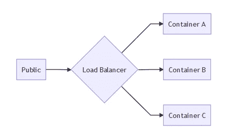
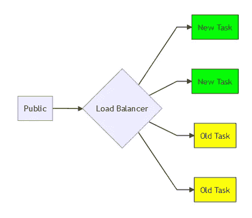
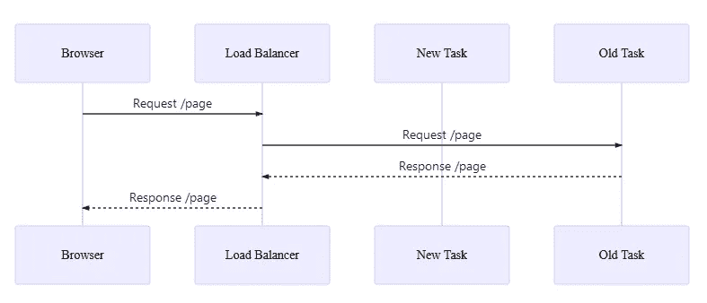
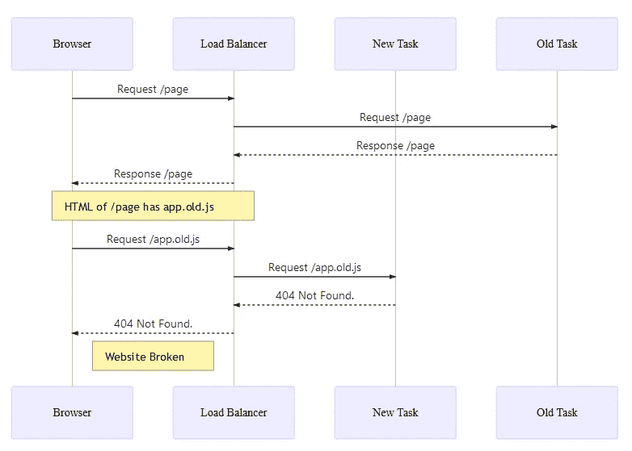

# 使用 CDN 防止部署期间网站崩溃

> 原文：<https://medium.com/quick-code/using-cdn-to-prevent-broken-website-during-deployment-78253642069a?source=collection_archive---------3----------------------->


Photo by [chuttersnap](https://unsplash.com/@chuttersnap?utm_source=medium&utm_medium=referral) on [Unsplash](https://unsplash.com?utm_source=medium&utm_medium=referral)

我们最近推出了我们的新网站🍻在这个新网站的发展过程中，我学到了很多东西。其中之一是 CDN 如何帮助我们在持续集成(CI)的部署阶段防止中断。作为背景，我们刚刚在我们的服务上实现了 CI，我有一个在我们的网站上使用 CDN 的计划，但是直到这个问题发生之前，我一直没有时间去实现它。

我们正在使用 Gitlab CI 和 AWS 弹性集装箱服务(ECS)的组合，用于我们所有的 docker 集装箱。目前，我们所有的系统环境中运行着大约 10 项服务。其中一项服务是我们使用 Express.js 和 Nuxt.js 构建的新前端网站。这个新的前端网站大量使用 javascript 并具有服务器端呈现(SSR)功能。最初，我们希望有完全单页应用程序(SPA)，但这种应用程序将使搜索引擎机器人难以抓取我们的网站(除了谷歌机器人)，这就是我们在我们的新网站上有 SSR 功能的原因。



Architecture Setup

在部署过程中，ECS 将根据服务配置中设置的所需数量启动新的容器(或称之为任务)。如果所需的任务编号为 2，则 ECS 将根据新任务定义启动 2 个新任务。这两个新任务将与之前部署的两个旧任务一起添加到服务中。



Architecture Setup with new task

然后，如果所有的新任务都已达到运行状态，ECS 将在关闭任务之前耗尽与每个旧任务的连接。这个过程通常需要几分钟才能删除所有旧任务。在此转换过程中，如果服务是一个前端网站服务，它提供到用户浏览器的 HTTP 连接，则此转换将有可能使网站对用户中断。

# 为什么？

在我们进入部署流程之前，我们在配置项上有一个“构建”流程。在构建过程中，我们将所有的 Vue 模板(因为我们使用的是 Nuxt.js)构建成 javascript 包，并将 Typescripts 文件编译成普通的 javascript(我们将 Typescript 用于 Express.js 应用程序)。这个过程将生成新的生产就绪的 javascript 包，它在文件名中包含散列版本控制。例子:`app.072413282a677463d5a9.js`。然后，这些文件被注册到内部清单应用程序，以便以后当用户访问网站时，它可以为用户提供正确的文件版本。所有编译后的文件都保存在本地容器中，问题来了。

让我们开始一些说明。正如我之前解释的那样，在部署期间，ECS 将在删除旧任务之前启动新任务。因此有一个新旧任务同时服务于负载均衡器的时刻。



Initial HTML Request by Browser

然后，用户 A 在部署过程中访问站点，负载均衡器将 HTTP 连接重定向到一个容器(让我们忽略负载均衡器此时用来确定目标容器的算法)。在这种情况下，接收 HTTP 请求的容器是任务 A，它是旧的容器。任务 A 生成对用户浏览器的 HTML 响应，该 HTML 响应包含脚本或样式标签，该脚本或样式标签加载本地存储在任务 A 的清单文件上的旧版本，即`app.old.js`。



app.old.js is not found in new task

HTML 响应加载到用户浏览器后，浏览器会尝试加载已经在 HTML 上定义的脚本`app.old.js`。这个请求然后被传递到负载平衡器，负载平衡器决定将流量发送到任务 B，这是一个新的容器。因为所有的静态资源都存储在本地，所以任务 b 上没有`app.old.js`，只有`app.new.js`。浏览器无法加载资源，最终网站崩溃。

这个问题看起来很简单，因为这只发生在持续几分钟的部署过程中。但是假如有这个问题的用户是第一次来网站的新用户呢。用户在结帐过程中看到破损的页面或功能，然后决定不再继续付款。

当然，有一个乐于助人的用户试图联系客户服务，以确保他们能够付款，但这种类型的用户非常少见。大多数情况下，如果用户看到页面被破坏，他们就会离开网站，再也不会回来。这个问题对业务不利，我们需要解决这个问题。

# 怎么会？

解决办法很简单。我们需要做的就是将所有静态资源转移到第三方存储服务。由于我们使用亚马逊网络服务，我们可以使用他们的 S3 服务来存储文件。然后我想，为什么只用 S3，为什么不用 CloudFront (CDN)坐在 S3·巴特的前面。

老实说，我从来没有建立 CDN 的经验。所以这对我来说很有趣。由于技术非常具体，我将解释我们如何在 c I 构建过程中创建自动化 CDN 部署的技术细节。作为背景，我们使用 Nuxt.js 作为 Vue.js 的包装器，以允许我们轻松配置服务器端呈现，然后我们再次将 Nuxt.js 包装在 Express.js 内，这样我们可以在同一个应用程序中提供 Nuxt.js SSR 页面和网站 API。

在我们能够在 CloudFront 上提供静态文件之前，我们需要将所有文件上传到 S3 作为原始资源。你可以在 CloudFront 上找到很多关于如何制作 S3 水桶的资源。在我们的新站点中，有两种类型的资源，静态和动态资源。

动态资源是我们的用户上传的照片或视频等文件。这些资源已经存储在 S3 上，所以我们并没有做太多工作来让这些资源可以通过 CloudFront 提供服务。这只是一个将网址从 S3 网址改为 CloudFront 网址的问题。例如，我们将`DYNAMIC_PUBLIC_RESOURCE_PREFIX`从`https://s3-us-west-2.amazonaws.com/bucket-name/static`设置为`[https://random-subdomain.cloudfront.net/static](https://random-subdomain.cloudfront.net/static.)`到[。](https://random-subdomain.cloudfront.net/static.)

静态资源是在构建过程中生成的文件，它通常是 javascript 文件、CSS 文件和小图像文件，如图标或背景图像。构建静态资源时，所有 url(如图片或字体)都将引用本地资源，因此我们需要在`nuxt.config.js`上设置额外的配置，以确保在 CI 构建过程中编译资源时，URL 被转换为 CloudFront 端点。

在我搜索了代码库之后，有 3 种情况，静态资源 url 用于应用程序，`background-image` CSS 属性和字体资产用于我们的 SCSS 文件(我们使用 SCSS 作为我们的 CSS 预处理程序)，`background-image` CSS 属性用于 Vue 模板，图片`src`属性用于 Vue 模板。

# SCSS 文件上的资产 URL

更改 SCSS 文件上的资产 URL 很简单。你所需要做的就是将 CloudFront CDN URL 放在`nuxt.config.js`构建配置的`publicPath`上。因为我们在构建期间将 URL 存储在环境变量中，所以我们可以只使用`CLOUDFRONT_ENDPOINT`环境变量来检索 URL。此外，我们必须确保这仅适用于生产或暂存构建，因此我们依赖于`NODE_ENV`，以确保我们仅在开发中使用默认的`/build/`目录。但是我们必须确保它已经被导入到 Nuxt.js 环境变量中，因为如果不是这样，你就不能在配置中使用`CLOUDFRONT_ENDPOINT`和`NODE_ENV`。

如果我们总结所有这些配置，结果差不多是这样的:

```
module.exports = {
  env: {
    NODE_ENV: process.env.CLOUDFRONT_ENDPOINT,
    CLOUDFRONT_ENDPOINT: process.env.CLOUDFRONT_ENDPOINT
  },
  build: {
    publicPath:
      process.env.NODE_ENV !== "development"
        ? process.env.CLOUDFRONT_ENDPOINT
        : "/build/",
  }
}
```

# Vue 模板上的背景图像 CSS 属性

接下来是如何将包含`url()`的`background-image` CSS 属性转换为使用 CloudFront 端点，而不是使用本地端点。在 Vue 模板中，我们有包含组件 CSS 属性的`<style>`部分。在我们的网站上，我们只有一个普通的 CSS 文件，格式为 SCSS 文件，然后所有的样式应该放在 Vue 组件中，因为这使我们更容易组织代码。通过设置公共路径配置似乎不会自动改变这个`background-image`属性的 URL。找到这个问题的解决方案是相当具有挑战性的，因为我们还没有在互联网上找到任何合适的例子。

我们发现 Nuxt.js 默认使用 Post CSS，我们可以在`nuxt.config.js`中更改 Post CSS 的配置。所以我们需要做的就是改变`postcss-url`插件配置，将资产 url 从本地转换到 CloudFront 端点。所以我们最终有了这样的配置。

```
module.exports = {
  env: {
    NODE_ENV: process.env.CLOUDFRONT_ENDPOINT,
    CLOUDFRONT_ENDPOINT: process.env.CLOUDFRONT_ENDPOINT
  },
  build: {
    publicPath:
      process.env.NODE_ENV !== "development"
        ? process.env.CLOUDFRONT_ENDPOINT
        : "/build/",
    postcss: {
      plugins: {
        "postcss-import": {},
        "postcss-url": {
          url: asset => {
            // Exclude development mode
            if (process.env.NODE_ENV === "development") {
              return asset.url;
            }

            // Exclude data-url resources
            if (asset.url.substr(0, 4) === "data") {
              return asset.url;
            }

            // Exclude non image asset
            if (asset.url.substr(0, 8) !== "/img/") {
              return asset.url;
            }

            // Return cdn url
            return process.env.CLOUDFRONT_ENDPOINT + asset.url;
          }
        }
      }
  }
}
```

该配置基本上说，我们仍然在开发环境中使用本地 url，如果它是`data-url`格式，则保留资产 url，跳过所有非图像资产 URL，如果我们在样式上找到图像资产 URL，则在 URL 上做一些格式化。

# `Vue`模板上的图像`src`属性 HTML

最后一个是改变 Vue 模板上的静态图像 URL。在 Vue 文件中有一个叫做`<template>`的部分，我们把 HTML 代码放在那里，并且总是有机会在上面使用静态文件图像。像这样:

```
<template>
  <div id="header">
    
  </div>
</template>
```

我们如何将这段代码的 url 从本地 url 更改为 CloudFront 端点？在尝试了各种方法后，我们最终在 Nuxt.js 应用程序中使用自定义插件，通过使用注入模块来交换这个 URL。

```
export default ({ store }, inject) => {
  inject("image", path => {
    if (process.env.NODE_ENV === "development") {
      return `/img/${path}`;
    }

    return `${process.env.CLOUDFRONT_ENDPOINT}/img/${path}`;
  });
};
```

然后我们将这个插件附加到`nuxt.config.js`上。

```
module.exports = {
  plugins: [
    { src: "~/plugins/image.js" }
  ]
}
```

之后，我们能够像这样在 Vue 组件上使用`$image`模块:

```
<template>
  <div id="header">
    
  </div>
</template>
```

通过使用这个简单的插件，我们能够根据机器的环境交换静态图像 url。当然，我必须找到并替换所有的 url，这导致我们的 git 提交发生了巨大的变化。

好了，我们可以改变静态和动态资源的 URL 了。然后，我们还需要更改配置项配置，以确保所有这些文件。幸运的是，我们可以在 [Nuxt.js 文档](https://nuxtjs.org/faq/deployment-aws-s3-cloudfront#overview)中找到那个配置。在该文档中，我们可以上传所有编译好的脚本到`dist`文件夹中，我们需要改变配置，使我们所有的静态图像也上传到 AWS S3。这个改动非常简单，我们只需要把`gulp.src('./' + config.distDir + '/**');`改成`gulp.src(['./' + config.distDir + '/**', './static']);`。

我们还需要通过 npm 脚本将这个 gulp 任务包含到我们的 order 文件中，以便在 CI 到达构建流程时被触发。在我们的 package.json 中，我们添加了这个 gulp 脚本。

```
{
  ...
  "scripts": {
    "cdn:deploy": "gulp deploy"
  },
  ...
}
```

然后，我们将 npm 任务添加到 Dockerfile。

```
# Install application
RUN npm install \
    && npm run build \
    && npm run cdn:deploy
```

在所有这些变化之后，现在我们可以放松了，因为在 CI 部署期间，用户不会再看到我们的网站被破坏。尽管这个过程似乎已经完成，我们仍然没有实现从 S3 桶中清除旧文件的功能。因此，我们仍然需要偶尔手动清理旧文件。如果我以某种方式找到如何自动做到这一点，我会更新这个职位，以反映这一功能。

就这些了，如果你目前有使用 Nuxt.js 部署 CDN 的问题，我希望这篇文章可以帮助你。下次见。

更新:

嘿，我找到了移除 Nuxt.js 生成的旧文件的方法，你可以在这个帖子里看到:[https://medium . com/@ alfianeffendy/how-we-manage-to-remove-unused-compiled-nuxt-js-files-on-AWS-S3-ab 3b 6 cfe 2993](/@alfianeffendy/how-we-manage-to-remove-unused-compiled-nuxt-js-files-on-aws-s3-ab3b6cfe2993)