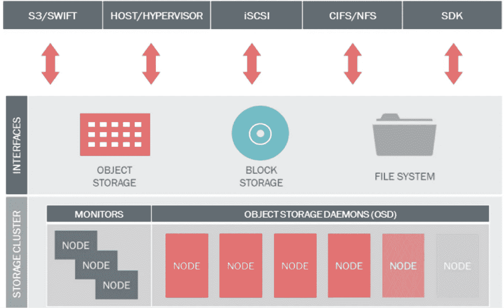
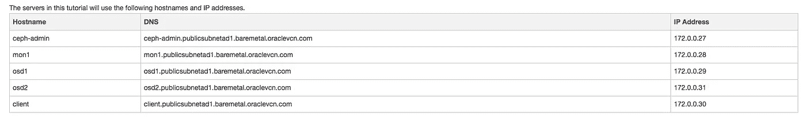
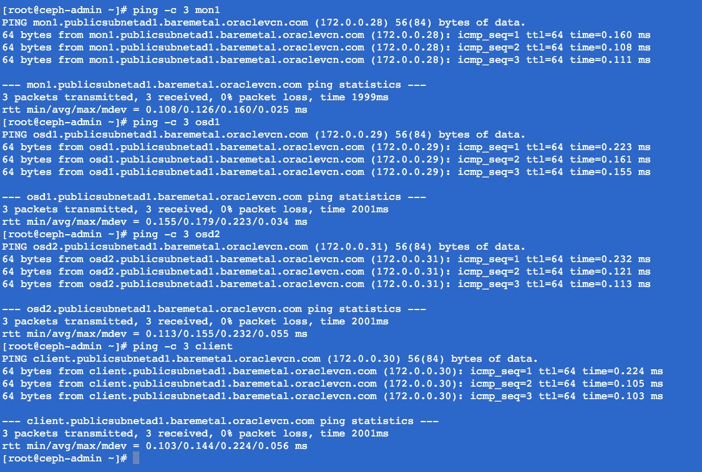
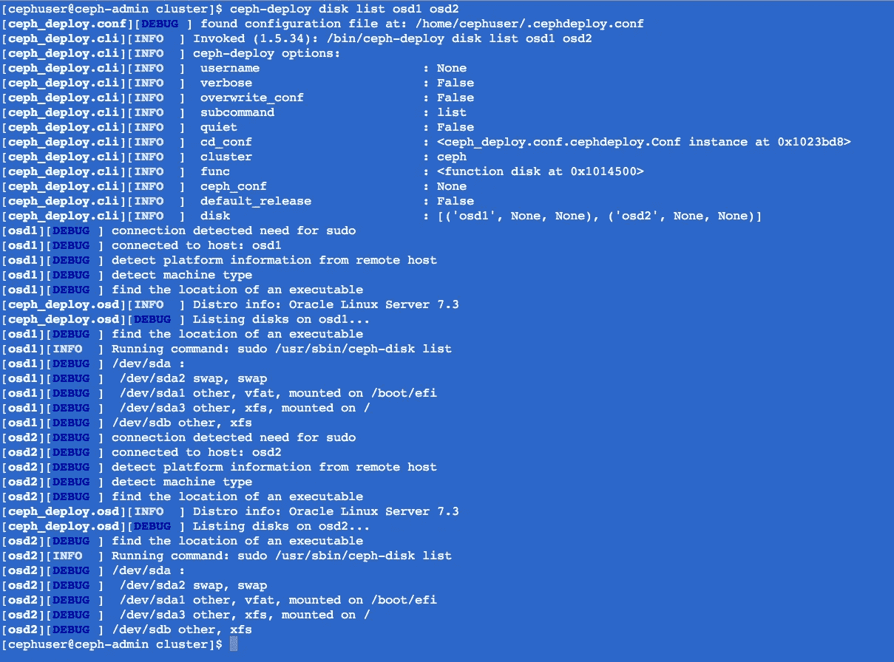
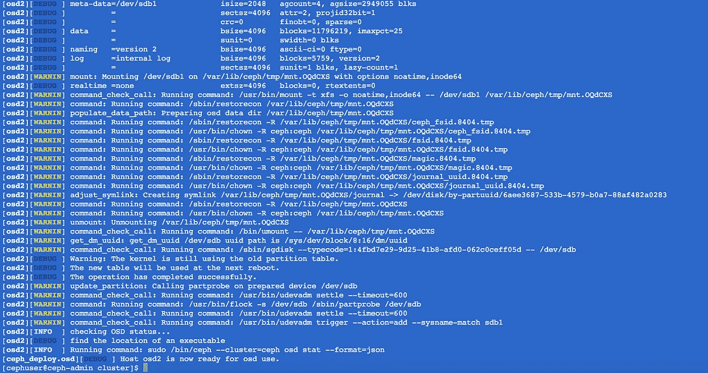
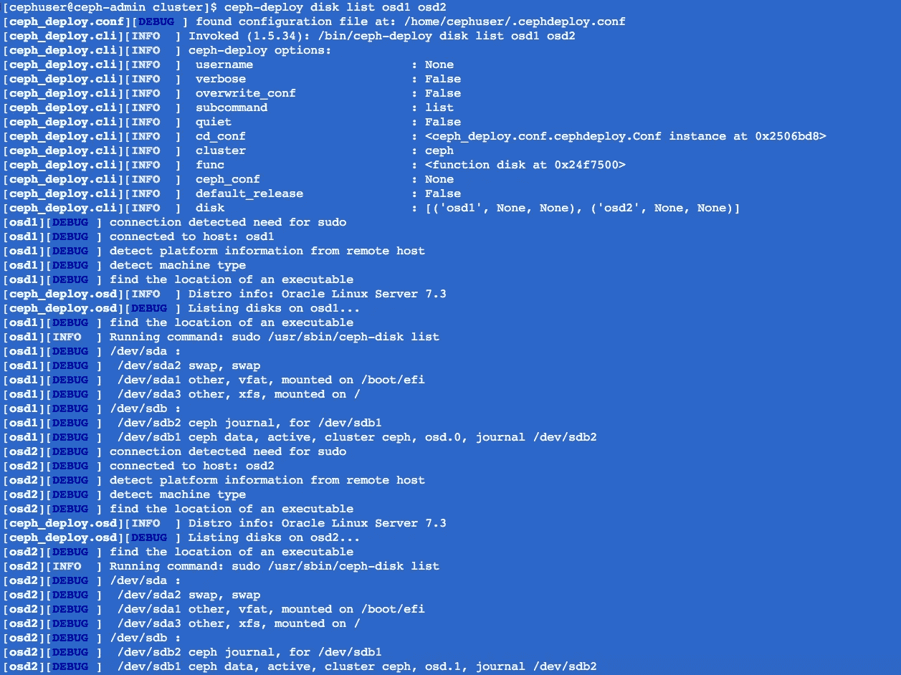

# 在 Oracle 云基础设施上使用 Ceph 分布式存储集群

> 原文：<https://medium.com/oracledevs/using-ceph-distributed-storage-cluster-on-bare-metal-cloud-services-8738b9070410?source=collection_archive---------1----------------------->

本教程描述了使用 Oracle Linux 操作系统在 Oracle 云基础架构(OCI)上部署 Ceph 分布式存储集群环境的步骤。

如[公共文档](https://docs.oracle.com/cd/E52668_01/E66514/E66514.pdf)中所述，Ceph 在 Oracle Linux 上完全受支持。

作为 OCI 上的一个附加配置选项，您可以将所有 Ceph 资源保存在单个可用性域(AD)中，或者使用所有 AD。根据网络流量利用率，在单个 AD 中获取所有资源或使用跨不同可用性域的分布式选项来实现容错可能更好。

这是一个可以在 OCI 上使用的 Ceph 分布式存储集群架构的示例

# 什么是 Ceph 分布式存储集群？

[Ceph](https://ceph.com/) 是一个广泛使用的开源存储平台，它提供了高性能、可靠性和可伸缩性。Ceph free 分布式存储系统为对象、块和文件级存储提供了一个接口。

在本教程中，您将在 Oracle Linux 7 上安装和构建一个 Ceph 集群。x 具有以下组件:

*   Ceph OSD(Ceph-OSD)—处理数据存储、数据复制和恢复，Ceph 集群需要至少两台基于 Oracle Linux 的 Ceph OSD 服务器
*   Ceph Monitor (ceph-mon) —监控集群状态、OSD 图和 CRUSH 图。
*   ceph 元数据服务器(ceph-mds) —这是将 Ceph 用作文件系统所必需的。

更多细节可以在 Ceph [公共文档](http://docs.ceph.com/docs/master/)中找到，在进行初始配置之前，首先理解它们是很重要的。

# 环境

*   5 个服务器节点，全部采用 Oracle Linux 7。x 已安装。
*   所有节点上的 Root 权限。

# 入门指南

首先，本教程基于“如何在 CentOS 7 上构建 Ceph 分布式存储集群”[文章](https://www.howtoforge.com/tutorial/how-to-build-a-ceph-cluster-on-centos-7/)。其次，对于此设置，您需要按照上面的环境表中的说明配置至少五个 Oracle 裸机实例，以及两个额外的块存储卷，稍后将用作 Ceph 数据存储。确保在每个新实例上连接了所有数据块存储卷，运行 iscsi 命令。查看我们的[裸机公共文档添加块卷会话](https://docs.us-phoenix-1.oraclecloud.com/Content/GSG/Tasks/addingstorage.htm?Highlight=_netdev)以了解更多详细信息，并特别注意“_netdev 和 no fail”fstab 选项，以防您需要使用它们。

# Ceph 配置

在这一步中，您将配置所有五个节点，为安装 Ceph 集群做好准备。您必须在所有节点上遵循并运行以下所有命令。

# 创建一个 Ceph 用户

在所有节点上创建一个名为“cephuser”的新用户。

> $ sudo useradd-d/home/CEP huser-m CEP huser
> $ sudo passwd CEP huser

创建新用户后，您需要为“cephuser”配置 sudo。他必须能够以 root 用户身份运行命令，并且无需密码即可获得 root 用户权限。

运行下面的命令为用户创建一个 sudoers 文件，并用 sed 编辑/etc/sudoers 文件。

> $ sudo visudo

在文件的底部添加以下内容

> ##cephuser sudo 权限
> cephuser ALL =(root)no passwd:ALL

保存并退出 vim。

# 安装和配置 NTP

安装 NTP 以同步所有节点上的日期和时间。运行 ntpdate 命令以通过 NTP 协议设置日期和时间，我们将使用美国池 NTP 服务器。然后启动并使 NTP 服务器在引导时运行。

> $ sudo yum install-y NTP NTP date NTP-doc
> $ sudo NTP date 0.us.pool.ntp.org
> $ sudo HW clock—systohc
> $ sudo system CTL enable ntpd . service
> $ sudo system CTL start ntpd . service

# 禁用 SELinux

通过使用 sed 流编辑器编辑 SELinux 配置文件，在所有节点上禁用 SELinux。

> $ sudo sed-I ' s/SELINUX = enforcing/SELINUX = disabled/g '/etc/SELINUX/config

# DNS 配置

在 OCI 上，内部 DNS 无需任何额外配置即可工作。测试网络连接，确保您的 Ceph 主机可以相互 ping 通，如下所示。

如果失败，请修改您的裸机安全列表以允许内部通信。编辑 VCN 安全列表，或者打开裸机内部网络(非公共网络)的所有端口，如下所示，用于网络 172.0.0.0/16

资料来源:172.0.0.0/16

IP 协议:所有协议

允许:所有端口的所有流量

或者仅在需要时指定特定端口。

# 配置 SSH 服务器

在此步骤中，您将配置 ceph-admin 节点。登录到 ceph-admin 节点，成为“cephuser”。

> $ ssh-I public _ ssh _ key OPC @ ceph-admin-bmcs-public _ IP
> $ sudo su-cephuser

admin 节点用于安装和配置所有集群节点，因此 ceph-admin 节点上的用户必须拥有无需密码即可连接到所有节点的权限。

您必须在“ceph-admin”节点上为“cephuser”配置无密码 SSH 访问。默认情况下，在 OCI 只有 opc 用户包含在所有机器上验证的密钥，所以你需要为 cephuser 帐户生成一个例外。为此，将以下内容添加到/etc/ssh/sshd_config 文件的底部。

> ##将 ssh 密码验证权限添加到 cephuser
> 匹配用户 cephuser
> 密码验证是

保存并退出 vim。重启 ssh 以验证更改。

> $ sudo 服务 sshd 重新启动

现在您已经准备好进行下一步了。为“cephuser”生成 ssh 密钥。

将密码留空。

接下来，为 ssh 配置创建配置文件。

粘贴下面的配置:

> 主机 ceph-admin
> 主机名 ceph-admin
> 用户 cephuser
> 
> 主机 mon1
> 主机名 mon1
> 用户 cephuser
> 
> 主机 osd1
> 主机名 osd1
> 用户 cephuser
> 
> 主机 osd2
> 主机名 osd2
> 用户 cephuser
> 
> 主机客户端
> 主机名客户端
> 用户 cephuser

在 OCI 上使用 Ceph 分布式存储集群

保存文件并更改配置文件的权限。

> $ chmod 644 ~/。ssh/config

现在，使用 ssh-copy-id 命令向所有节点添加 SSH 密钥。

> $ ssh-keyscan OS D1 OS D2 mon 1 client > >~/。ssh/known _ hosts
> $ ssh-copy-id OS D1
> $ ssh-copy-id OS D2
> $ ssh-copy-id mon 1
> $ ssh-copy-id 客户端

完成后，尝试从 ceph-admin 节点访问 osd1 服务器。

# 配置防火墙 d

您将使用防火墙来保护系统。在这一步中，您将打开 ceph-admon、ceph-mon 和 ceph-osd 所需的端口。

连接到 ceph-admin 并打开端口 80、2003 和 4505–4506，然后重新加载防火墙，如下所示

> $ sudo firewall-cmd-zone = public-add-port = 80/TCP-permanent
> $ sudo firewall-cmd-zone = public-add-port = 2003/TCP-permanent
> $ sudo firewall-cmd-zone = public-add-port = 4505–4506/TCP-permanent
> $ sudo firewall-cmd-reload

从 ceph-admin 节点，登录到监控节点“mon1 ”,打开 ceph 监控节点上的新端口，然后重新加载防火墙..

> $ sudo firewall-cmd-zone = public-add-port = 6789/TCP-permanent
> $ sudo firewall-cmd-reload

最后，在每个 osd 节点(osd1 和 osd2)上打开端口 6800–7300。您可以从 ceph-admin 节点登录到每个 osd 节点，或者如果您使用公共 IP 网络，也可以通过裸机实例公共 IP 登录到每个 OSD 节点。

> $ sudo firewall-cmd-zone = public-add-port = 6800–7300/TCP-permanent
> $ sudo firewall-cmd-reload

# 配置 Ceph OSD 节点

在本教程中，我们有两个 OSD 节点，每个节点有两个分区。

*   根分区的/dev/sda。
*   /dev/sdb 是一个空分区— 50GB(附加 iSCSI 块存储卷)。

您将对 Ceph 磁盘使用/dev/sdb。从 ceph-admin 节点，登录到所有 OSD 节点，用 XFS 格式化/dev/sdb 分区。

> $ sudo parted-s/dev/sdb mklabel GPT mkpart primary xfs 0% 100%
> $ sudo mkfs . xfs/dev/sdb-f

现在检查分区，您将得到 xfs /dev/sdb 分区。

> $ sudo bl kid-o value-s TYPE/dev/sdb

# 构建 Ceph 集群

在这一步中，您将从 ceph-admin 节点在所有节点上安装 Ceph。

# 在 ceph-admin 节点上安装 ceph-deploy

登录 ceph-admin 节点。

首先，您需要在 Oracle Linux 上启用 Ceph YUM Repo，这是禁用的。

> $ sudo VI/etc/yum . repos . d/public-yum-ol7 . repo

搜索“ol7_ceph”并启用它(“enabled=1”)

保存并退出 vim。

现在，用 yum 命令安装 ceph-deply，并确保所有节点都已更新。

> $ sudo yum 更新-y && sudo yum 安装 ceph-deploy -y

安装完 ceph-deploy 工具后，为 ceph 集群配置创建一个新目录。

> $ sudo mkdir/cluster
> $ CD/cluster/

接下来，使用“ceph-deploy”命令创建一个新的集群配置，并将监视节点定义为“mon1”。

用 vim 编辑 ceph.conf 文件，并在[global]块下粘贴下面的配置。

> #您的网络地址
> 公共网络= 172.0.0.0/16
> osd 池默认大小= 2

保存文件并退出 vim。

# 在所有节点上安装 Ceph

现在，使用下面的单个命令，从 ceph-admin 节点在所有其他节点上安装 Ceph。

> $ ceph-deploy install ceph-admin mon 1 OS D1 OS D2

该命令将自动在所有节点上安装 Ceph:mon 1、OS D1–3 和 ceph-admin，这需要一些时间。

现在在 mon1 节点上部署 ceph-mon。

> $ ceph-部署 mon 创建-初始

该命令将创建监视器密钥，使用“ceph”命令检查并获取密钥。

> $ ceph-部署 gatherkeys mon1

# 将 OSDS 添加到集群

当所有节点上都安装了 Ceph 后，就可以将 OSD 守护进程添加到集群中。OSD 守护进程将在磁盘/dev/sdb 上创建它们的数据和日志分区

> $ ceph-部署磁盘列表 osd1 osd2

你会看到如上所示的 XFS 格式的/dev/sdb 磁盘。

接下来，用 zap 选项删除所有节点上的/dev/sdb 分区表。该命令将删除 Ceph OSD 节点上/dev/sdb 中的所有数据。

> $ ceph-deploy disk zap OS D1:/dev/sdb OS D2:/dev/sdb

现在准备所有 OSDS 节点，并确保结果中没有错误。

> $ ceph-部署 osd 准备 osd1:/dev/sdb osd2:/dev/sdb

如果您看到 osd 1–2 已准备好使用 OSD 的结果，则部署成功。

使用以下命令激活 OSDs:

> $ ceph-deploy OSD activate OS D1:/dev/SD B1 OS D2:/dev/SD B1

在继续之前，请检查输出是否有错误。现在，您可以使用 list 命令检查 OSD 节点上的 sdb 磁盘。

> $ ceph-部署磁盘列表 osd1 osd2

结果是/dev/sdb 现在有两个分区:

*   /dev/sdb1 — Ceph 数据
*   /dev/sdb2 — Ceph 日志

或者您可以使用 fdisk 在 OSD 节点上直接检查。

> $ ssh OS D1
> $ sudo fdisk-l/dev/sdb

接下来，将管理密钥部署到所有关联的节点。

> $ ceph-部署管理 ceph-管理 mon1 osd1 osd2

通过在所有节点上运行以下命令来更改密钥文件的权限。

> $ sudo chmod 644/etc/ceph/ceph . client . admin . key ring

# 测试您的 Ceph 设置

您已经安装并创建了新的 Ceph 集群，然后向集群添加了 OSDS 节点。现在，您可以测试集群并确保集群设置中没有错误。

从 ceph-admin 节点，登录到 ceph 监控服务器“mon1”。

检查集群运行状况。

> $ sudo ceph 健康

健康状况良好

检查集群状态

> $ sudo ceph-s
> cluster 66 ADB 950–1 fc 4–447 b-9898–6b 6 CD 7 c 45 a 40
> HEALTH HEALTH _ OK
> monmap E1:1 mons at { mon 1 = 172 . 0 . 0 . 28:6789/0 }
> 选举时期 3，quorum 0 mon 1
> OSD map E10:2 osds:2 up，2 in
> 标志按位排序
> pgmap v21: 64

确保 Ceph 运行状况良好，如上所示，并且有一个 IP 地址为“172.0.0.28”的监控节点“mon1”。应该有 2 个 OSD 服务器，并且都应该启动并运行，应该有一个大约 100GB — 2x50GB Ceph 数据分区的可用磁盘。

您的新 Ceph 集群设置已经完成。现在，你准备好使用你的新 Ceph 块设备。

# 配置 Ceph 客户端节点

在本节中，您将把我们的 Oracle Linux 7.x 服务器配置为 Ceph 客户机，并将 Ceph 客户机配置为其他 Ceph 节点(mon-osd)。

通过 Ceph 管理节点或使用裸机实例公共 IP 登录到 Ceph 客户端节点。然后添加一个新的“cephuser”帐户，并为该用户设置一个新密码。

> $ sudo useradd-d/home/CEP huser-m CEP huser
> $ sudo passwd CEP huser

重复 visudo 过程，禁用 selinux 并配置 NTP，如上所述。

确保可以像前面对其他节点所做的那样，从 ceph-admin ssh 到客户机实例。

> $ ssh 客户端
> $ [cephuser@client ~]$

# 在客户端节点上安装 Ceph

在这一步中，您将从 ceph-admin 节点在客户机节点(充当客户机节点的节点)上安装 Ceph。

通过 ssh 以 root 用户身份登录到 ceph-admin 节点，并成为 su 的“cephuser”。转到 Ceph 集群目录，你使用了'**集群的**目录。

> $ su — cephuser
> 最后登录:GMT 2017 年 7 月 18 日星期二 21:25:25 pts/0
> $ CD/cluster/

使用 ceph-deploy 在客户机节点上安装 Ceph，然后将配置和管理密钥推送到客户机节点。

> $ ceph-部署安装客户端
> $ ceph-部署管理客户端

Ceph 安装需要一些时间(取决于服务器和网络速度)。任务完成后，连接到客户端节点，并更改管理密钥的权限。

> $ ssh 客户端
> $ sudo chmod 644/etc/ceph/ceph . client . admin . key ring

客户端节点上已经安装了 Ceph。

# 将 Ceph 配置和安装为块设备

Ceph 允许用户将 Ceph 集群用作精简配置的块设备。您可以像在系统上安装普通硬盘一样安装 Ceph 存储器。Ceph 块存储或 Ceph RADOS 块存储(RBD)将块设备映像存储为一个对象，它自动在整个 Ceph 集群中条带化和复制我们的数据。Ceph RBD 已经与 KVM 集成，因此您也可以在各种虚拟化平台上将它用作块存储。

在客户端节点上创建新的数据块设备之前，您必须按上述方式检查群集状态。登录到 Ceph monitor 节点并检查集群状态。

请确保集群运行状况为“运行状况良好”，并且 pgmap 为“活动且干净”。

确认您准备好继续进行客户端配置后。在本教程中，您将使用 Ceph 作为客户机服务器上的块设备或块存储，并使用 Oracle Linux 7 作为客户机节点操作系统。从 ceph-admin 节点，使用 ssh 连接到客户机节点。因为您为该节点配置了无密码登录，所以不需要密码。

Ceph 提供了用于管理 rados 块设备映像的 rbd 命令。您可以使用 rbd 命令创建新的映像、调整大小、创建快照以及导出我们的块设备。

在本教程中，您将创建一个大小为 40GB 的新 rbd 映像，然后检查“disk01”在 rbd 列表中是否可用。

> $ rbd 创建磁盘 01 —大小 40960
> $ rbd ls -l
> 名称大小父 FMT PROT 锁
> 磁盘 01 40960 m2
> [ceph user @ client ~]$

接下来，激活 rbd 内核模块。

> $ sudo modprobe rbd
> $ sudo rbd 特性禁用 disk01 独占锁定对象映射快速差分深度展平

现在，通过 rbd 内核模块将 disk01 映像映射到一个块设备，然后确保 disk01 在映射设备列表中。

> $ sudo rbd map disk 01
> /dev/rbd 0
> $ rbd show mapped
> id 池映像快照设备
> 0 rbd disk01 — /dev/rbd0

您可以看到，disk01 映像已被映射为“/dev/rbd0”设备。在使用它存储数据之前，您必须使用 mkfs 命令格式化 disk01 映像。在本教程中，您将使用 XFS 文件系统

> $ sudo mkfs.xfs /dev/rbd0

现在，将“/dev/rbd0”挂载到 mnt 目录。

> $ sudo mount /dev/rbd0 /mnt

Ceph RBD 或 RADOS Block 设备已配置并安装在系统上。使用 df 命令检查设备是否已正确装载。

> $ df-hT | grep rd0
> /dev/rbd 0 xfs 40G 33M 40G 1%/mnt

# 启动时设置 RBD

完成 Ceph 客户端配置后，您将配置它在引导时将 Ceph 块设备自动挂载到系统。一种方法是在/usr/local/bin 目录下创建一个新文件，用于安装和卸载 RBD 磁盘 01。

> $ CD/usr/local/bin/
> $ sudo vim rbd-mount

粘贴下面的脚本，并根据您的需求随意修改。

> #!/bin/bash
> #脚本作者:[http://bryanapperson.com/](http://bryanapperson.com/)
> #更改您的池名称
> 导出池名称=rbd
> 
> #更改您的磁盘映像名称
> 导出 rbdimage=disk01
> 
> #挂载目录
> 导出挂载点=/mnt/mydisk
> 
> #映像挂载/卸载和池作为参数从系统服务传递
> #确定我们是在挂载还是卸载
> 然后
> modprobe rbd
> rbd 特性禁用$ rbd image exclusive-lock object-map fast-diff deep-flatten
> rbd map $ rbd image—id admin—key ring/etc/ceph/ceph . client . admin . key ring
> mkdir-p $ mount point
> mount/dev/rbd/$ poolname/$ rbd image $ mount point
> fi
> if[" $ 1 " = " u "]；然后
> umount $ mount point
> rbd unmap/dev/rbd/$ poolname/$ rbd image
> fi

保存文件并退出 vim，然后用 chmod 使其可执行。

> $ sudo chmod +x rbd-mount

接下来，转到 systemd 目录并创建服务文件。

> $ CD/etc/systemd/system/
> $ sudo vim rbd-mount . service

在下面粘贴服务配置:

> [Unit]
> Description =池$poolname"
> 中$rbdimage 的 RADOS 块设备映射冲突= shut down . target
> Wants = network-online . target
> After = network manager-wait-online . Service
> 【Service】
> Type = one shot
> RemainAfterExit = yes
> ExecStart =/usr/local/bin/rbd-mount m
> ExecStop =/usr/local/bin/rbd-mount u
> 【Install】【T10

保存文件并退出 vim。

重新加载 systemd 文件，并在引导时启动 rbd-mount 服务。

> $ sudo systemctl 守护进程-重新加载
> $ sudo systemctl 启用 rbd-mount.service

如果您现在重新启动客户端节点，rbd“disk 01”将自动挂载到“/mnt/mydisk”目录。

您的 Ceph 分布式存储集群和客户机配置已经完成！

# 参考

*   [Ceph Ceph 存储— Ceph](http://ceph.com/ceph-storage/)
*   [Ceph Block 装置](http://docs.ceph.com/docs/jewel/rbd/rbd/)
*   [如何在 CentOS 7 上构建 Ceph 分布式存储集群](https://www.howtoforge.com/tutorial/how-to-build-a-ceph-cluster-on-centos-7/)
*   [Ceph —部署并安装块设备](http://blog.programster.org/ceph-deploy-and-mount-a-block-device/)
*   [在 CentOS 7](http://bryanapperson.com/blog/mounting-rbd-at-boot-under-centos-7/) 下的靴子上安装 RBD
*   [适用于 Oracle Linux 版的 Ceph 存储](https://docs.oracle.com/cd/E52668_01/E66514/E66514.pdf)

*原载于 2017 年 7 月 18 日*[*community.oracle.com*](https://community.oracle.com/people/Gilson%20Melo-Oracle/blog/2017/07/18/using-ceph-distributed-storage-cluster-on-bare-metal-cloud-services)*。*