# 使用聊天机器人提供更快的新冠肺炎社区支持

> 原文：<https://medium.com/airbnb-engineering/using-chatbots-to-provide-faster-covid-19-community-support-567c97c5c1c9?source=collection_archive---------0----------------------->

Helpbot 是一个由机器学习支持的客户支持聊天机器人，它取代了试图向 Airbnb 发送支持消息的客人的联系流程。我们使用 Helpbot 提供关于新冠肺炎问题的智能帮助，并为我们的 [*情有可原政策*](https://news.airbnb.com/update-about-our-extenuating-circumstances-policy/) *开发工作流程。超过 50%的用户参与了 COVID specific flow，这使得大量客户能够立即解决他们的问题。*

客人每天都依靠 Airbnb 来帮助他们度过旅行的各个阶段。从找住的地方，一直到退房，平安回家。

与此同时，Airbnb 上的用户可以有各种各样的不同问题，比如改变他们的支付方式，或者找到他们主人的电话号码。这就需要为用户建立一个灵活的界面，方便他们找到我们可用的解决方案，并在必要时从代理那里获得帮助。聊天机器人在这种情况下变得越来越流行。

为此，我们创建了 **Atis** :一个聊天机器人开发平台，为构建聊天机器人提供了直观而强大的 API。

Atis 是 Airbnb 的智能交互和助理平台，是 Airbnb 客户支持聊天机器人的“大脑”: **Helpbot** 。

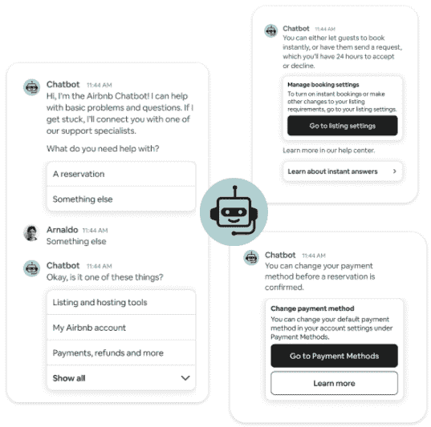

Helpbot 是联系人工客户支持代理的第二步。Helpbot 的目标是快速了解用户的问题，并尝试以自动化的方式解决问题。Helpbot 帮助客人解决许多不同类型的问题:取消列表、更改预订日期、更新通知设置等。

这是一个帮助用户关闭通知的标准 Helpbot 对话的视频。

当我们面对新冠肺炎的疫情时，提供快速、可靠的支持变得更加重要。在疫情高峰期，我们迅速在 Helpbot 中内置了某些功能，以便向联系我们的客人和主人提供即时帮助和支持。这之所以成为可能，是因为:

1.  聊天机器人通过了解用户的背景，更好地理解用户的问题。
2.  改变聊天机器人的行为更容易，因为每次互动都被视为一条消息。

# 新冠肺炎的回应

根据我们的[情有可原政策](https://www.airbnb.com/help/article/2701/extenuating-circumstances-policy-and-the-coronavirus-covid19)，在新冠肺炎疫情期间，Helpbot 在很大程度上依赖于帮助客人取消预订，并提供澄清。这是一个案例研究，说明如何轻松地将新行为添加到聊天机器人中，从而对用户产生重大影响。下面将讨论我们对 Helpbot 所做的一些更改，以支持新冠肺炎的工作。

## 建议的问题

当用户第一次进入帮助机器人线程时，帮助机器人利用 Atis 的 NLU 模型来预测问题。在新冠肺炎危机期间，我们重新训练了该模型，根据以下特征预测用户是否可能有新冠肺炎问题:

*   最近查看的帮助中心文章
*   如果他们有活动预订
*   如果他们是平台上的客人或主人

如果我们的模型确定确实如此，我们会自动将此作为第一个提示。超过 50%的客人对此提示回答“是”。

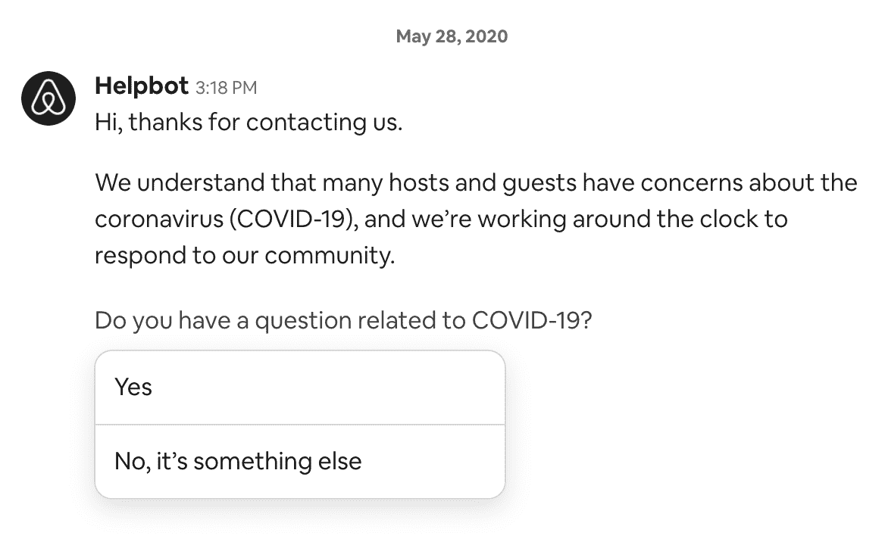

如果用户对这个提示说“是”，那么我们可以立即理解他们的问题，而不需要客人键入任何内容。在此之后，我们为新冠肺炎提供了一个“上下文即时答案”。

## 上下文即时回答

新冠肺炎对 Airbnb 用户的影响是不同的，取决于他们是客人还是主人，他们是否有预订，以及预订的时间。Helpbot 根据用户帐户的状态提供不同的新冠肺炎即时答案。例如:

*   如果用户的预订符合情有可原的条件，则会显示一个取消流程，帮助他们快速取消预订并获得退款。
*   向具有不符合情有可原情况的预订的用户显示标准取消流程，退款遵循列表的取消政策。

## 影响

总体而言，相对于新冠肺炎危机期间的现有联系流程，helpbot 显著降低了票证创建率，并成功支持了数千名主持人和来宾。

# Atis

Atis 是我们内部的聊天机器人平台，Helpbot 就是用它开发的。这篇文章的大部分内容将着眼于 Atis 如何工作的内部。

**开放式 vs 引导式聊天机器人**

学术界的大多数聊天机器人是[开放域聊天机器人](https://arxiv.org/abs/2001.09977)，它允许用户说任何话，机器人将回复语义和语法正确的生成文本。然而，实践中部署的大多数聊天机器人通常是更封闭的领域、多回合、面向目标的聊天机器人。

机器人通过多个问题或对话“回合”对客户的问题进行分类。

# 编程接口

Atis 提供了一个编程接口，允许产品团队快速开发聊天机器人。下面是一个构建类似“hello world”的单圈聊天机器人的简单示例:

这将创建一个简单的机器人，询问您的姓名，等待响应，并回答:“嗨<name>，很高兴见到您！”</name>

Atis 对话管理器知道如何执行任何实现 TaskHandler 类的任务。在这个简单的任务中，对话管理器将:

*   执行`prompt`
*   将消息发回给用户(“嗨，你叫什么名字？”)
*   响应时，用用户发回的消息执行`response`

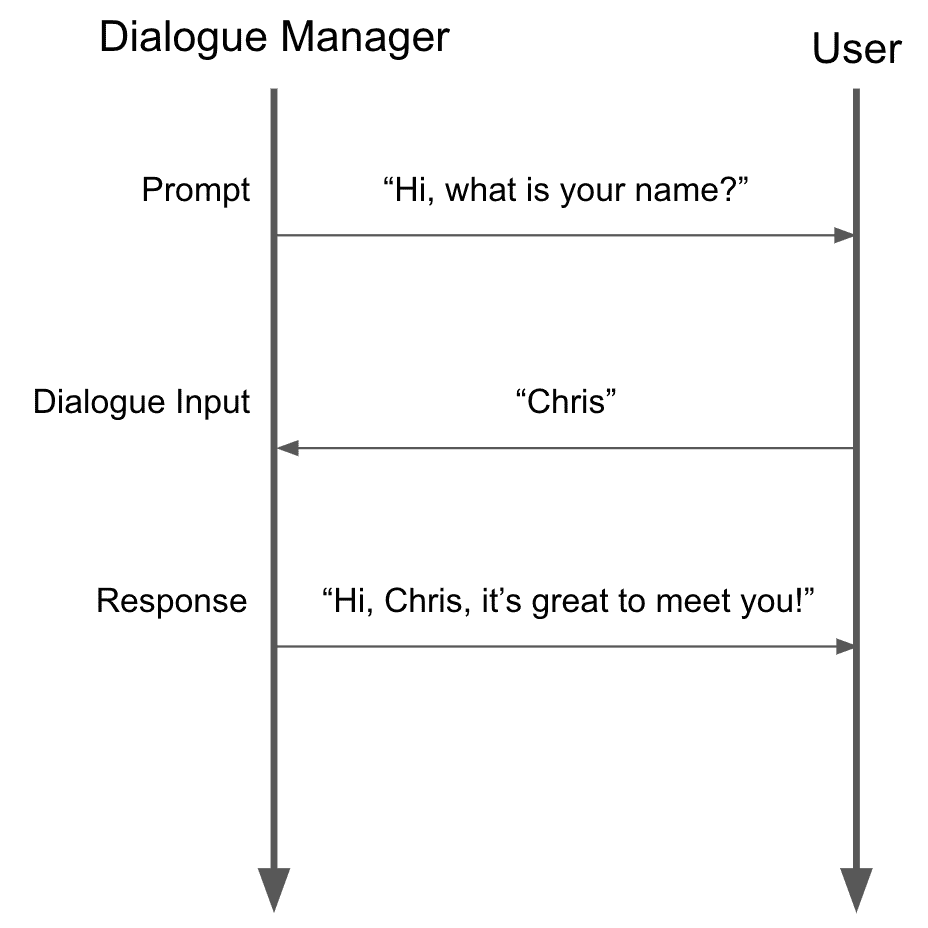

这段代码定义了一个有 3 轮对话的聊天机器人，但是没有指定它们应该以什么顺序执行。为此，ATIS 定义了一个“域定义”文件，它规定了回合的顺序。最终天气任务执行跳过操作。这通知对话管理器该任务不应该等待响应，因为机器人对话已经完成。

这个定义显示了需要执行的 3 个任务:`name_question`、`location_question`和`weather`。`initial_task_name`定义了应该首先执行哪个任务，而`next_states`定义了应该执行的下一个任务。Atis 会根据`multi_turn_domain.json`文件中指定的大小写名称自动加载任务处理程序，并按照指定的顺序执行它们。

# 任务处理程序生命周期

任务处理程序实现了一个生命周期，它代表了典型聊天机器人对话的请求/响应性质。

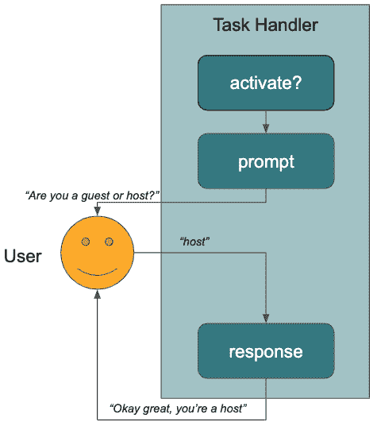

与 Android activity 生命周期或 React 生命周期非常相似，Atis 任务也支持由对话管理器执行任务的生命周期模式。Atis 任务实现的生命周期方法有:

*   `activate?`:根据对话状态决定是否激活任务
*   `prompt`:对用户的提示，例如:显示一条消息或一组选项
*   `response(dialogue_input: UserInputMessage)`:对提示的响应，例如:用户输入的消息，或者用户选择的选项。

# 分支和激活

前面的例子定义了一个线性对话结构，以姓名问题开始，以天气结束。Atis 还可以用**激活**和**边缘处理程序**定义树形或图形结构的对话。

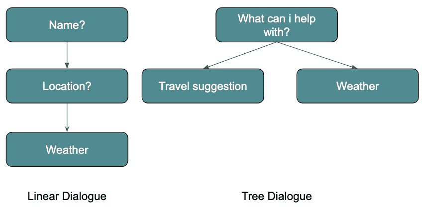

## 线性对话 vs 树形结构对话

下面是一个使用任务激活来构建树形结构对话的示例:

分支中的任务需要实现一个`activate?` 方法。对话管理器将调用`TravelSuggestionAnswer#activate?`和`WeatherAnswer#activate?`来确定接下来将调用哪个任务。

虽然上面的例子有些做作，但这是一个表达复杂行为的强大框架。

## 边缘处理器

在指定的示例中，`activate?`方法是在`TaksHandler`上定义的。Atis 还提供了一个接口来声明`EdgeHandler`，它只实现了`activate?`方法，当转换太复杂而不能挤进一个`activate?`方法时使用。例如，在上面的示例中，任务也可以用边缘处理程序编写，如下所示:

像任务处理程序一样，通过查找 edge 中任务的大小写名称，edge 处理程序将被自动加载和评估。

# 消息和操作

Atis 支持多种多样的信息，例如:

*   简单消息

*   选择

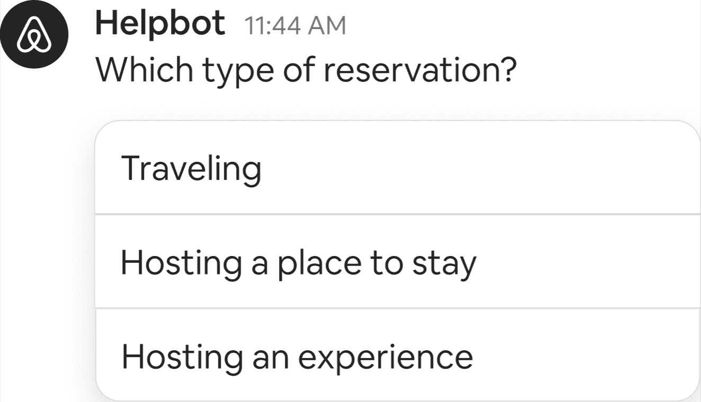

*   预订卡

*   预订提货人

*   帮助文章

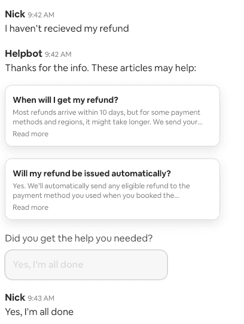

*   …以及更多

这些可以在任务处理程序中调用，然后发送回消息客户端。Atis API 还支持一组“动作”,这些动作实质上充当对话管理器的控制流方向。例如:

*   `skip`:跳过任务的响应块。
*   `goto(next_task_name: String)`:跳转到工作流中的一个任务。
*   `transfer(next_workflow_name: String)`:转移到不同的工作流程。

*注意:为了简洁起见，本文不涉及工作流。在高层次上，它们是将一组任务组合在一起的一种方式。例如，取消工作流将涉及两个任务(选择预订→您确定吗？* → *确认)。*

# 钩住

Atis 为类似于 Rails 的`prompt`、`response`和`activate`等生命周期方法提供了前后挂钩。

# 上下文开关程序

我们可以将钩子与面向对象的编程原则结合起来，构建高度智能的上下文切换功能。当客人表达带外意图时，上下文切换是必要的。例如，如果对话如下进行:

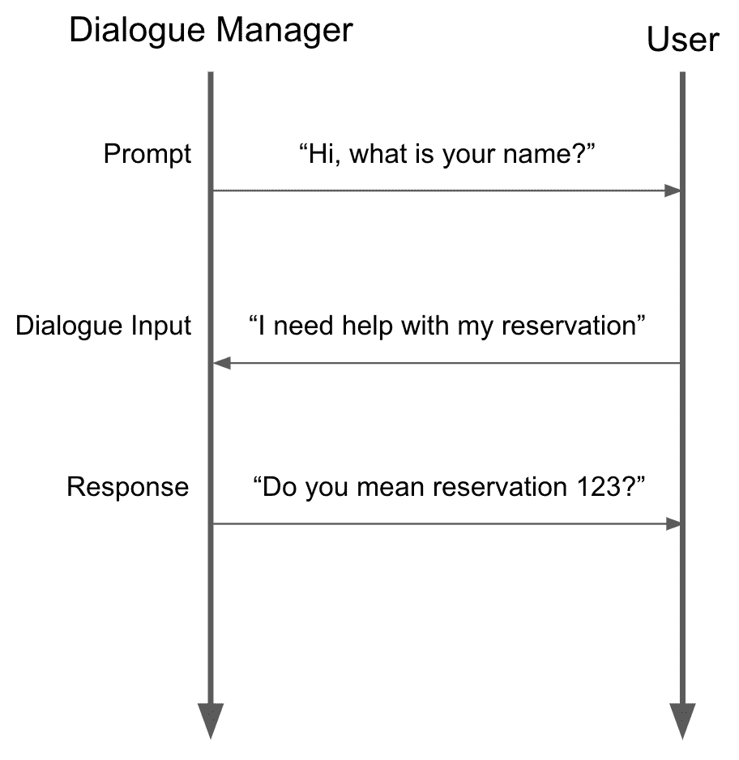

在这个例子中，客人用一个请求而不是他们的名字来响应，我们的框架能够改变它的行为，用一个预订提示来响应，而不是标准的响应*“你好{name}，很高兴见到你！”*。这被称为**上下文切换。**

这可以通过构建一个简单的抽象任务处理器来实现:

如果在信息输入中发现术语*“预订”*，这将自动执行`GreetingTask`。

# 对话管理器

对话机器人中的对话管理器负责遍历对话图。对话管理器将通过调用任务处理程序和边缘处理程序上的`activate?`方法来决定执行哪些任务。这允许我们定义极其复杂的对话，就像我们目前在 Helpbot 中使用的那样。使用上述 API，我们能够构建复杂的流程，引导客人或主人发现问题的解决方案，或将他们带到正确的客户支持代理处。

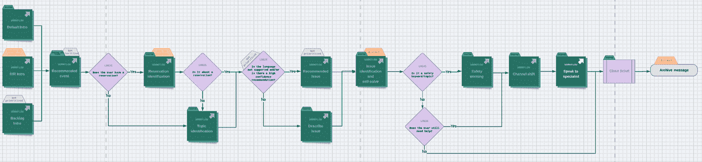

# 了解客户意图

ATIS 默认带有一个强大的文本分类器，叫做 WideText:一个低延迟的基于 CNN 的文本分类器。

为了激发对这种模型的需求，假设您想要构建一个聊天机器人，它能够理解用户所说的话*“我想取消我的预订”*或*“我的列表不是很干净”*，并智能地做出响应。实现这一点的一种方法是构建一个问题分类并在其中进行预测。

*“我想取消预订”* → `reservation.guest.cancellation`

*“我的房源不太干净”* → `reservation.guest.cleanliness`

典型地，文本分类问题被构造为如下:

然而，你会意识到其他特征对于理解用户也很重要。例如，如果用户是客人，则*“这个房子不干净”*可以是`reservation.guest.cleanliness`，如果用户是主人，则可以是`reservation.host.cleanliness`。

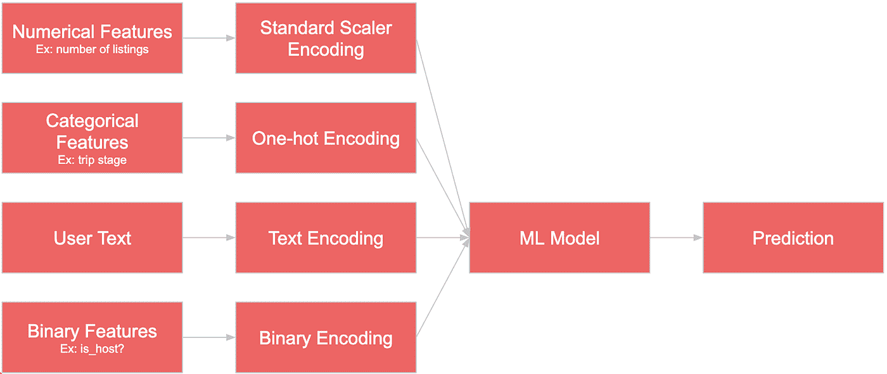

WideText 是一个 PyTorch 库，可以轻松训练和部署多模态文本分类模型。

这个分类器的具体细节将在以后的博客文章中单独讨论。WideText 是我们聊天机器人智能的支柱。

回到`WhatCanIHelpWith`任务，这里有一个如何使用 WideText 进行预测的例子:

在这个例子中，我们依靠一个训练有素的 WideText 模型来理解用户意图。如何训练和部署这个模型的细节将单独讨论。

# 帮助机器人

Helpbot 是建立在 at is 平台上的“旗舰”聊天机器人。到目前为止，它处理的消息最多。在撰写本文时，Helpbot 目前每天处理超过 10 万条消息。

Helpbot 的核心目的是交付 ***上下文自我解决内容*** 。当客人试图联系 Helpbot 时，我们通过向客人提出一系列问题并利用 WideText 预测话题来识别他们的问题。然后，我们向用户呈现可以立即解决用户问题的自我解决内容。

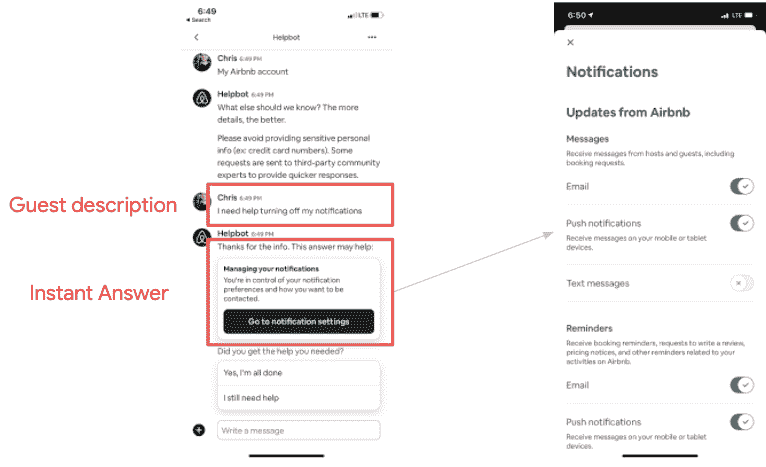

将用户问题映射到一组固定的票证主题使我们可以轻松地快速添加新类型的自我解决内容，如帮助文章。

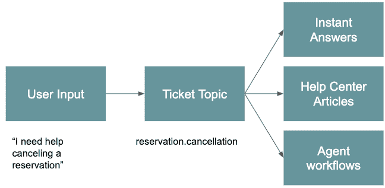

# 结论

Airbnb 努力为需要帮助的客人和主人提供即时帮助，尤其是在 COVID 这样的活动期间。我们利用 Helpbot 的能力快速了解客户问题，并提供自我解决方案来帮助那些受 COVID 疫情影响的人。

# 贡献者

构建 Atis 并将其集成到 Helpbot 中是一项多团队的工作。感谢所有让这一切成为可能的人:

卡特·阿普尔顿
斯蒂芬妮·庞
成龙
李海涛
乔希·布莱尼
米歇尔·瓜里诺
考特尼·木本
玛丽埃尔·扬
赵振宇
布莱恩·王
沙哈夫·阿比利亚
张大大
杰里米·王
克里斯·朱
爱丽丝·郑
乔伊·张