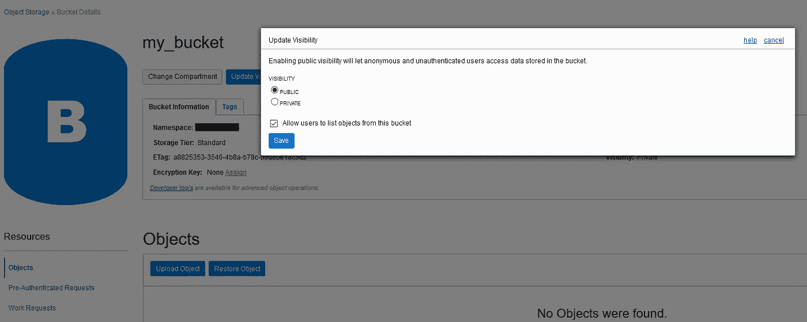

# 使用 CloudBerry 访问 OCI 对象存储

> 原文：<https://medium.com/oracledevs/using-cloudberry-to-access-oci-object-storage-586a14c6b823?source=collection_archive---------0----------------------->

**Oracle 云基础设施对象存储**是一种用于在云中存储文件的解决方案。访问和上传文件最简单的方法是通过 CloudBerry 和 Cyberduck 这样的存储管理器。

在这篇博文中，您将了解如何使用 CloudBerry 访问 Oracle 云基础架构对象存储。

首先，下载并安装**适用于亚马逊 S3** 的 CloudBerry Explorer。我知道这很奇怪，但 S3 API 被认为是存储标准，许多解决方案都在使用这一标准，CloudBerry 就是其中之一。

转到您的 Oracle 云帐户并创建一个新用户。
在 OCI 控制台转到*“身份>用户”*，点击*创建用户*按钮。

将其命名为 **cloudberry.user** 并点击*创建*按钮。

您需要为新用户设置 S3 API 身份验证凭据。
转到*客户密钥*并点击*生成密钥*按钮。

将其命名为 **cloudberry** 并点击*生成密钥*按钮。

把钥匙复制到一个安全的地方，因为你会用到它。请记住，该键不会再次显示。

复制这个*访问键*，因为您也会用到它。

将新用户添加到*管理员*组。
转到*组*并点击*将用户添加到组*按钮。

选择*管理员*并点击*添加*按钮。

用户创建完成！让我们创建一个新文件夹。转到*“对象存储>对象存储”*并点击*创建存储桶*按钮。

将其命名为 **my_bucket** ，点击*创建 Bucket* 按钮。

上传一些文件到新的*桶*。

将新铲斗的可见性更新为**公共**。

打开用户菜单，点击**租赁**。

复制**对象存储名称空间**。

转到 CloudBerry 并创建一个新帐户 **S3 兼容**。

输入:

*   **显示名称:** OCI 存储
*   **服务点:** <对象存储命名空间> .compat.objectstorage. <区域> .oraclecloud.com
*   **访问键:**上面生成的访问键
*   **密钥:**上面生成的密钥
*   **签名版本:** 4

点击*测试连接*按钮。

现在你可以看到水桶了…

…以及使用 CloudBerry 的 **OCI 对象存储**中的文件。

玩得开心！

*原载于 2019 年 1 月 21 日*[*【https://waslleysouza.com.br】*](https://waslleysouza.com.br/en/2019/01/using-cloudberry-to-access-oci-object-storage/)*。*