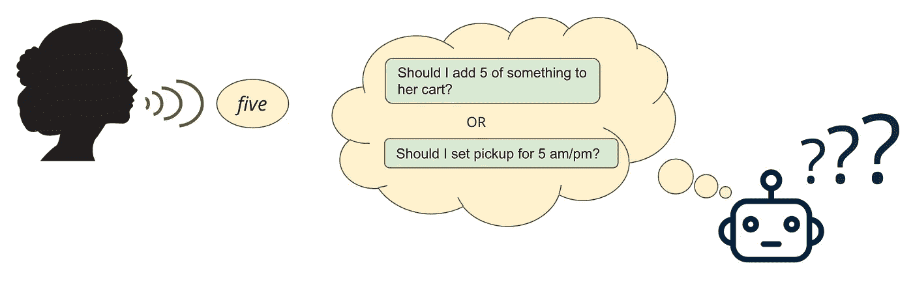
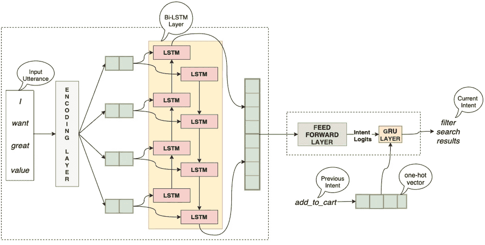
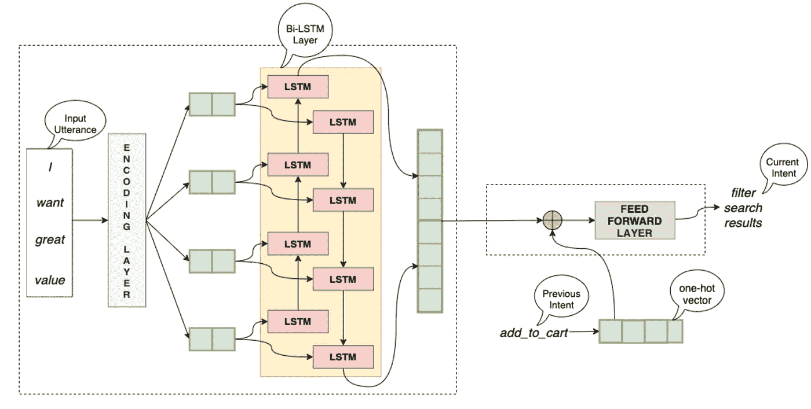
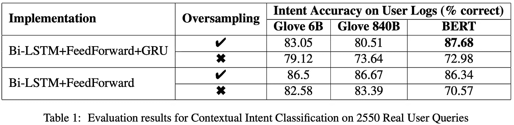

# 使用上下文改进沃尔玛购物助手中的意图分类

> 原文：<https://medium.com/walmartglobaltech/using-context-to-improve-intent-classification-in-walmarts-shopping-assistant-28f62d40fd17?source=collection_archive---------4----------------------->

最近，语音助手领域有了显著的[进步。因此，2019 年，我们在](https://voicebot.ai/2019/02/14/juniper-estimates-3-25-billion-voice-assistants-are-in-use-today-google-has-about-30-of-them/)[谷歌助手](https://www.walmart.com/ideas/discover-online-grocery/google-assistant-voice-ordering-for-walmart-grocery-pickup-delivery/354497)和[苹果 Siri](https://corporate.walmart.com/newsroom/2019/11/11/hey-siri-add-to-walmart-introducing-a-new-shortcut-for-online-grocery) 上为沃尔玛顾客推出了我们的语音购物助手。在沃尔玛，我们的使命是打造世界上最好的购物助手，帮助顾客节省时间和金钱。我们的愿景是通过访问商店和网站来帮助客户完成购买物品的繁琐任务。在当今快节奏的生活中，实现愿景变得更加重要。

建立一个基于语音的助手是具有挑战性的。在零售/购物等领域，产品分类既广泛(有各种不同的产品类别)又深入(在一个类别中有各种不同类型的产品)，这尤其困难。构建基于语音的购物助手的另一个主要挑战是在不提供太多上下文的情况下准确理解对话中的话语。举个例子，

> 如果用户说 **'** **添加香蕉'**，接着说**'五个'**，那么她打算将**五个香蕉**添加到她的购物车中。
> 
> 如果用户在与购物助理的对话开始时说**‘five’**，那么她的意图是**未知的**(即，在对话开始时它不代表任何电子商务动作)。
> 
> 如果用户说**'**'**设置收件时间段'**，然后说**'五'**，那么她打算设置上午 5 点或下午 5 点的收件时间段，这可能是最接近请求时间的时间段。

处理这样的场景需要助手中的自然语言理解(NLU)组件在预测与话语相关联的意图时利用上下文(*先前在对话中发生了什么*)。在这项工作中，我们在沃尔玛的语音购物助手的 NLU 组件中集成了话语间上下文特征，以改进其意图分类。

# 语音助手的基本组成和 NLU 的作用

语音助手有四个主要方面，即语音到文本、NLU、对话管理(DM)和文本到语音。 [NLU 组件](/walmartglobaltech/joint-intent-classification-and-entity-recognition-for-conversational-commerce-35bf69195176)识别用户话语中的意图和实体。对话管理器使用 NLU 组件的输出为用户准备合适的响应。

当前可用的支持语音的购物助手中的 NLU 系统不关注话语间的上下文，因此上下文消歧的责任落在对话管理器身上。尽管可以在对话管理器中捕获少量这样的情况，但是对于大量依赖于上下文的话语来说，它变得难以扩展。例如，让我们再次考虑用户话语**‘五’**，在话语**之后添加东西到购物车**。那么对话管理器可以通过使用以下规则来预测其意图:

> **如果**先前的意图是“**添加到购物车”并且**当前查询是一个**整数**
> 
> **然后**当前意图是**‘添加到购物车’**
> 
> **否则**当前意图为**‘未知’**

但是，如果不过度适应对话中使用的实际单词，就不能为许多其他查询创建这样的一般规则。举个例子，

> “有机请”(其中**先前意图**是**“添加到购物车”**，而**当前意图**是**“过滤搜索结果”**)以及
> 
> 请停止’(其中**先前意图**为**‘加入购物车’**，而**当前意图**为**‘停止对话’**)。

在这项工作中，我们处理了 NLU 组件中的上下文，减少了对话管理器的上下文歧义消除负担。

# 我们如何使用上下文？

我们使用两种不同的基于深度神经网络的架构来实现我们的方法。以下是体系结构的详细信息。

## 双 LSTM 和 GRU

第一个架构的灵感来自于[基于 RNN 的多回合 QA 方法](http://giusepperizzo.github.io/publications/Mensio_Rizzo-HQA2018.pdf)中的工作。它有两个主要组成部分。首先，[双 LSTM](/@raghavaggarwal0089/bi-lstm-bc3d68da8bd0) 编码器，其生成输入话语的矢量编码。向量表示用户话语的概括版本。它是从话语中单词的嵌入中产生的。第二个组件是一个 [GRU](https://towardsdatascience.com/understanding-gru-networks-2ef37df6c9be) 层，其输入由一个[前馈层](/@b.terryjack/introduction-to-deep-learning-feed-forward-neural-networks-ffnns-a-k-a-c688d83a309d)关于由双 LSTM 编码器生成的嵌入的输出组成，连同先前话语意图的[独热编码](/@michaeldelsole/what-is-one-hot-encoding-and-how-to-do-it-f0ae272f1179)。这一层的输出(在最后还包括一个 [Softmax](https://towardsdatascience.com/softmax-function-simplified-714068bf8156) 步骤)是当前输入话语的意图。下面的图 1 用图解法展示了该架构。

Figure 1: Deep Learning Architectures of Bi-LSTM and GRU Approach

上面图 1 中的编码层是生成输入用户话语中单词的矢量表示的模块。有各种现成的选项可用于插入该层，包括 [Word2Vec](/@zafaralibagh6/a-simple-word2vec-tutorial-61e64e38a6a1) 、 [Glove](/analytics-vidhya/word-vectorization-using-glove-76919685ee0b) 、 [Elmo](https://allennlp.org/elmo) 和 [BERT](https://towardsdatascience.com/bert-explained-state-of-the-art-language-model-for-nlp-f8b21a9b6270) 。在这项工作中，我们实验了 BERT 和 Glove 来检索最初的单词嵌入。

## **双 LSTM 和前馈层**

类似于上面提到的双 LSTM 和 GRU 架构，第二种架构也有两个组件，双 LSTM 层，后面是前馈层。双 LSTM 层的输出与用户辅助对话中先前用户话语的*意图*的一键编码连接，并作为输入输入到前馈层，该前馈层在末端包括 [Softmax 层](https://towardsdatascience.com/softmax-function-simplified-714068bf8156)。前馈层的输出是输入话语最可能的意图。

Deep Learning Architectures of Bi-LSTM and Feed-Forward Layer Approach

与第一种架构一样，在这项工作中，我们使用 BERT 和 Glove 来检索嵌入编码层的初始单词。

# 效果如何？

这项工作的主要目标是通过使用话语间上下文来改进沃尔玛购物助手的 NLU 组件中的意图分类。因此，我们在沃尔玛的语音购物助手的真实用户日志上测试了我们的方法。我们发现大约 **40%的用户助理交互需要上下文意图分类**。我们还发现， ***添加商品到购物车*** 和 ***在沃尔玛搜索商品*** 是两种最流行的用户辅助交互方式。大约 98%的上下文交互都与这些意图有关。我们观察到**在**添加到购物车**和**搜索**相关用户查询上，我们的性能最佳的上下文意图分类方法(基于双 LSTM 和 GRU 的实现，使用 BERT 语言模型)表现出色(上下文 90%和总体 87.68%)。**

> 在这项工作中，我们提高了语音助手对 ***添加到购物车*** 查询的理解。它导致了一个改进的 [***添加到购物车*** **成功率**](https://databox.com/improve-add-to-cart-conversion-rate#head1) ，一个决定一个电子商务应用程序性能的重要标准。

下面的表 1 给出了我们的方法的两个实现的实验结果(插入了不同的语言模型)。关于实验和结果的更多细节可以在我们的标题为 [***的文章***](https://www.aclweb.org/anthology/2020.ecnlp-1.6/) ***[ECNLP 3](https://sites.google.com/view/ecnlp/past-workshops/acl-2020?authuser=0) 中获得***

# 我们得出什么结论？

正如假设的那样，实验结果表明

> NLU 模块中的上下文更新改进了意向分类。

它还减轻了对话管理器基于意图的上下文歧义消除的负担。我们实验了我们方法的两种不同的实现，并通过使用真实的用户日志来比较它们。

# 下一步是什么？

尽管在这项工作中，我们的主要焦点是意图的上下文消歧，但是实体也是依赖于上下文的。举个例子，

> 在“添加香蕉”之后说出的“五”可以指数量五，而如果在“选择交货时间”之后说出，则可以指第五天的时间(上午/下午)。

我们目前正致力于使用上下文特征来消除实体之间的歧义，并改善实体标记。

# 参考资料和进一步阅读

我们的工作发表在第三届电子商务和自然语言处理研讨会(ECNLP) 的 [*会议录上。2020*](https://www.aclweb.org/anthology/2020.ecnlp-1.6.pdf) 标题 ***利用跨话语语境*** 改进电子商务语音助手中的意图分类

[我们之前在联合意向-实体培训方面的工作](/walmartglobaltech/joint-intent-classification-and-entity-recognition-for-conversational-commerce-35bf69195176)

[我们购物助手之旅的开始](/walmartglobaltech/building-a-conversational-assistant-platform-for-voice-enabled-shopping-6d174cdc4131)

[多轮问答:面向目标系统意图分类的 RNN 上下文方法](http://giusepperizzo.github.io/publications/Mensio_Rizzo-HQA2018.pdf)