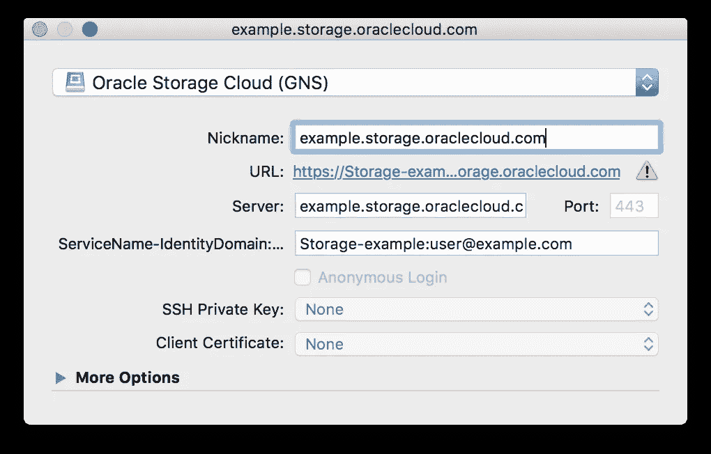

# 使用 Cyberduck 和 duck CLI 访问 Oracle 云基础架构经典存储

> 原文：<https://medium.com/oracledevs/using-cyberduck-and-duck-cli-to-access-oracle-cloud-infrastructure-classic-storage-edfeb04c82c4?source=collection_archive---------0----------------------->

Cyberduck 是一个免费的(支持捐赠)远程文件和对象存储管理客户端，可用于 Windows 和 MacOS。本文简要介绍了如何将 **Cyberduck** 和关联的 **duck** CLI 与 **Oracle 云基础设施** [**存储经典**](https://cloud.oracle.com/storage-classic) 对象存储服务结合使用

首先从 [https://cyberduck.io](https://cyberduck.io) 和[https://duck.sh/](https://duck.sh/)下载并安装 **Cyberduck** 和 **duck** ，或者使用支持的软件包安装程序之一，例如 Windows 上的虫火谷，或者 MacOS 上的 Homebrew

```
$ brew cask install **cyberduck**
$ brew install **duck**
```

# 赛博鸭

要在 Oracle Cloud infra structure Storage Classic 帐户中使用 Cyberduck UI，首先下载并导入[Oracle Storage Cloud . cyber duck profile](https://trac.cyberduck.io/attachment/wiki/help/en/howto/oraclecloud/Oracle%20Storage%20Cloud.cyberduckprofile)以设置 Oracle Cloud 特定的 Swift 配置文件。

```
$ wget "[https://trac.cyberduck.io/raw-attachment/wiki/help/en/howto/oraclecloud/Oracle Storage Cloud.cyberduckprofile](https://trac.cyberduck.io/raw-attachment/wiki/help/en/howto/oraclecloud/Oracle%20Storage%20Cloud.cyberduckprofile)"
$ open "./[Oracle Storage Cloud.cyberduckprofile](https://trac.cyberduck.io/raw-attachment/wiki/help/en/howto/oraclecloud/Oracle%20Storage%20Cloud.cyberduckprofile)"
```

导入配置文件后,“Oracle Storage Cloud”选项将作为新的连接类型出现

要连接到存储帐户，请设置所需的帐户凭据

**服务器-** 租赁特定存储 URL，以身份域或服务 id 开始，例如

```
**example**.storage.oraclecloud.com
```

**service name-identity domain:Username**-格式为“存储-<*identity domain*>:<*Username*>的存储帐户用户名，例如

```
Storage-**example**:**user@example.com**
```



# 鸭子 CLI

**duck** 命令行界面使用与上面在 Cyberduck GUI 中配置的相同的 Oracle Storage cloud . cyber duck profile。在 the 之后。cyberduckprofile 已导入到 UI 中。duck 命令行工具将显示对附加的 **oracle://** 连接协议的支持

和前面一样，**用户名**必须是“存储- < *身份域* > : < *用户名* >”格式。容器路径必须包括带有身份域或服务 ID 前缀的完整存储云 URL，例如

```
$ duck --username Storage-**example**:**user@example.com** \ 
       --password **PASSWORD** \
       --list oracle://**example**.storage.oraclecloud.com/**mycontainer**/
```

duck CLI 可以提供一种简单的方法来自动执行文件上传、下载和同步任务。

## 用法示例

将计算云虚拟机映像上传到 **compute_images** 容器

```
$ duck --username Storage-**example**:**user@example.com** \
       --password **PASSWORD** \
       --parallel 5 \
       --upload oracle://**example**.storage.oraclecloud.com/compute_images/ **myimage.tar.gz**
```

下载对象

```
$ duck --username Storage-**example**:**user@example.com** \
       --password **PASSWORD** \
       --parallel 5 \
       --download oracle://**example**.storage.oraclecloud.com/**source.dat** ./**target.dat**
```

将本地目录与远程容器同步

```
$ duck --username Storage-**example**:**user@example.com** \
       --password **PASSWORD** \
       --synchronize oracle://**example**.storage.oraclecloud.com/**target**/ ./**source**
```