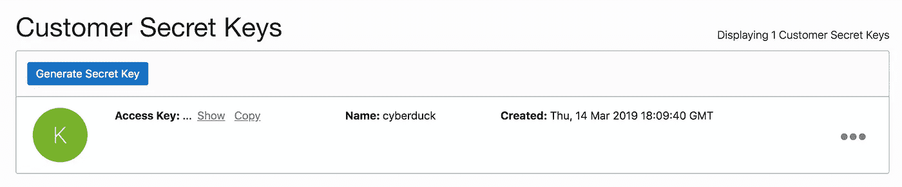
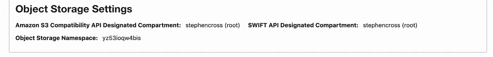
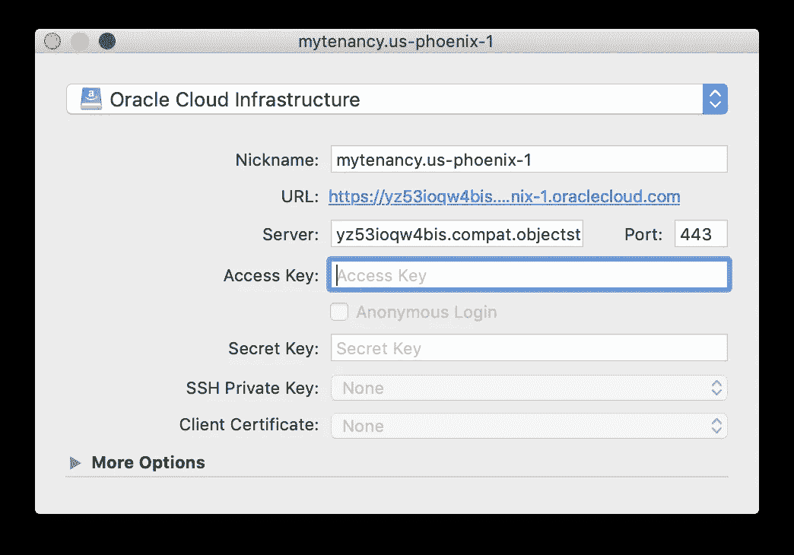

# 使用 Cyberduck 访问 Oracle 云基础架构存储

> 原文：<https://medium.com/oracledevs/using-cyberduck-to-access-oracle-cloud-infrastructure-storage-94af9b547848?source=collection_archive---------1----------------------->

本文是之前关于“[使用 Cyberduck 和 duck CLI 访问 Oracle 云基础设施**经典**存储](/oracledevs/using-cyberduck-and-duck-cli-to-access-oracle-cloud-infrastructure-classic-storage-edfeb04c82c4)”的帖子的后续。本文简要介绍了如何将 **Cyberduck** 与**Oracle Cloud infra structure**[**对象存储**](https://cloud.oracle.com/infrastructure/storage/object-storage/features) 服务结合使用。

如果你还没有安装 **Cyberduck** ，请访问 [https://cyberduck.io](https://cyberduck.io) 和[https://duck.sh/](https://duck.sh/)，或者使用一个受支持的软件包安装程序，比如 Windows 上的虫火谷，或者 MacOS 上的 Homebrew

```
$ brew cask install **cyberduck**
```

现在从 [Cyberduck wiki](https://docs.cyberduck.io/protocols/s3/oracle_cloud/) 下载 OCI 对象存储配置文件

*   [OCI 物体储存(us-phoenix-1)。赛博达克简介](https://svn.cyberduck.io/trunk/profiles/OCI%20Object%20Storage%20(us-phoenix-1).cyberduckprofile)
*   [OCI 天体存储器(us-ashburn-1)。赛博达克简介](https://svn.cyberduck.io/trunk/profiles/OCI%20Object%20Storage%20(us-ashburn-1).cyberduckprofile)
*   [OCI 对象存储器(eu-frankfurt-1)。赛博达克简介](https://svn.cyberduck.io/trunk/profiles/OCI%20Object%20Storage%20(eu-frankfurt-1).cyberduckprofile)

如果您希望使用的地区没有可用的配置文件，请下载现有文件，并将文件中出现的所有地区标识符替换为所需的地区标识符，例如将`us-ashburn-1`替换为`ca-toronto-1`

Oracle 云基础架构对象存储的 Cyberduck 配置文件使用 S3 兼容的 API，因此首先您需要设置您的 S3 API 身份验证凭据。在 OCI 控制台中，转到“身份>用户>用户详细信息>客户密钥”。详见[管理用户凭证](https://docs.us-phoenix-1.oraclecloud.com/Content/Identity/Tasks/managingcredentials.htm#s3)。

记下生成的**访问密钥**和**秘密密钥**，因为下一步需要用到它们。



OCI console: Identity > Users > User Details > Customer Secret Keys

您还需要您的**对象存储名称空间**用于您的租赁，这显示在 OCI 控制台的“管理>租赁详细信息”页面上。



打开适当的区域`.cyberduckprofile`文件并输入:

*   **昵称**:任何合适的名字，如`**mytenancy.us-phoenix-1**`
*   **服务器** : `**namespace**.compat.objectstorage.**us-phoenix-1**.oraclecloud.com`确保对象存储**名称空间**和**区域**标识符设置正确
*   **访问密钥**:上面生成的**访问密钥**，从 OCI 控制台复制
*   **插入键**:上面生成的从 OCI 控制台复制的**插入键**

