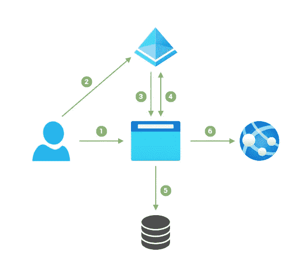
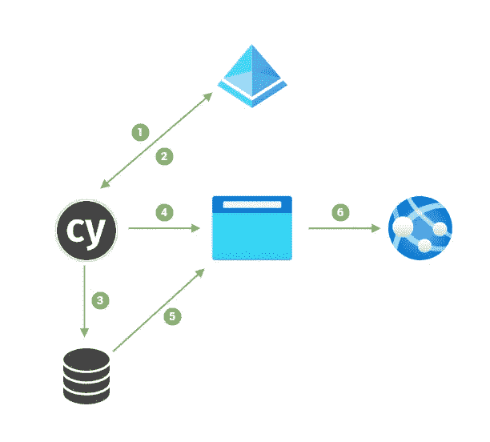
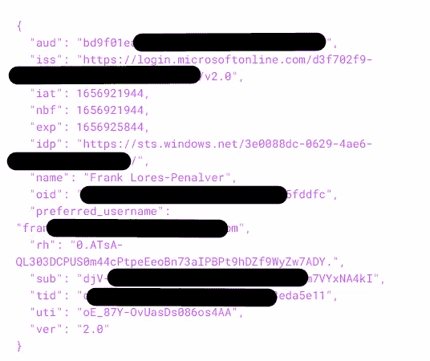
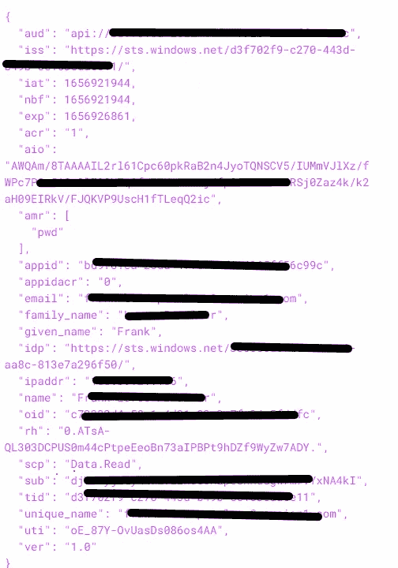

# 使用 Cypress 测试 Azure Active Directory 保护的单页应用程序

> 原文：<https://medium.com/version-1/using-cypress-to-test-azure-active-directory-protected-spas-47d04f5add9?source=collection_archive---------0----------------------->


测试使用 OAuth2 授权代码流的单页应用程序可能很困难，因为用户会从应用程序的主页被重定向到授权服务器。在本文中，我们将讨论如何在使用 Cypress 测试 Azure Active Directory 保护的单页应用程序时克服这一挑战。

**这些是测试场景的组件:**

[**赛普拉斯**](https://www.cypress.io/) 是一个一体化的、端到端的测试框架和断言库，允许您对 web 应用程序的用户界面进行自动化测试。

[**Azure AD**](https://azure.microsoft.com/en-gb/services/active-directory/) 是一项基于云的身份和访问管理服务，实现了 OAuth2 规范。

[**MSAL.js**](https://docs.microsoft.com/en-us/azure/active-directory/develop/msal-js-initializing-client-applications) 是一个由微软编写并维护的 javascript 库，允许 SPAs 使用 Azure AD 对用户进行身份验证。

OAuth2 为 spa 推荐的授权流程是授权代码流程，总结如下:



MSAL.js acquires tokens using Authorisation Code with PKCE flow.

1.  用户导航到单页应用程序。
2.  如果用户未通过身份验证，则将他们重定向到 Azure AD 进行身份验证。
3.  身份验证成功后，Azure AD 会向 SPA 返回一个授权码。
4.  SPA 交换 id 令牌、访问令牌和刷新令牌的授权码。
5.  SPA 会将令牌安全地存储在本地存储中。
6.  SPA 根据请求将访问令牌传递给后端 API，后端 API 也受 Azure AD 保护。

当我们试图为 Azure AD 保护的单页应用程序(SPA)编写 Cypress 自动化测试时，我们需要在没有用户在场的情况下复制获取令牌的过程。然而，这提出了一个挑战……

> ***相关说明:*** [为什么选择版本 1 作为您的微软合作伙伴？](https://www.version1.com/about-us/our-technology-partnerships/microsoft/)

我们最初考虑为登录页面编写测试，但是 [Cypress 不鼓励测试第三方外部网站](https://docs.cypress.io/guides/references/best-practices#Visiting-external-sites) (Azure AD 登录页面)，原因有几个，比如:

1.  我们无法控制所述页面的设计，如果第三方改变页面的布局/元素，我们的测试可能会中断。
2.  第三方网站可能有我们无法控制的问题。

其次，我们考虑尝试用我们的代码替换重定向，在运行测试之前登录并获取访问令牌；有几篇关于如何实现这一目标的文章。尽管如此，这些文章描述了使用 OAuth 隐式或 OAuth 客户端凭证流；两者都不适合我们的场景，原因如下:

*   OAuth 隐式流存在安全问题，不再推荐使用[。](https://datatracker.ietf.org/doc/html/draft-ietf-oauth-security-topics-09#section-2.1.2)
*   OAuth 客户端凭证流没有给我们 API 后端需要的必要声明，特别是范围声明。

最后，我们决定使用资源所有者密码凭证(ROPC)流。这种流程并非没有缺点，[微软不推荐使用](https://docs.microsoft.com/en-us/azure/active-directory/develop/v2-oauth-ropc)，除非对应用程序有高度的信任。然而，我们认为自动 Cypress 测试是安全的，因为没有用户在场。

我们采用的方法是用我们的代码替换 MSAL.js 来获取令牌，并以 MSAL.js 期望的形状/格式将令牌保存到本地存储中，从而欺骗 MSAL.js 库认为用户已经通过了身份验证，而不是将用户重定向到 Microsoft 登录页面。

资源所有者口令身份证明流程的步骤总结如下:



Cypress acquiries tokens using ROPC Flow

1.  Cypress 脚本使用 ROPC 流向 Azure AD 的令牌端点发送身份验证详细信息。
2.  Azure AD 返回一个 id 令牌、一个访问令牌和一个刷新令牌。
3.  Cypress 脚本以 MSAL.js 库期望的格式将令牌存储在本地存储中。
4.  Cypress 在 UI 上运行自动化测试脚本。
5.  UI 使用 MSAL.js 从本地存储中收集令牌。
6.  UI 在发送到后端 API 的请求上传递访问令牌。

## **按照这种方法，你需要以下信息:**

*   禁用了 MFA 的 Azure AD 帐户，此帐户应该只具有测试应用程序所需的最低访问权限。
*   您的 UI 的 Azure AD 应用程序详细信息:目录 Id/租户 Id、应用程序 Id/客户端 Id、客户端机密。
*   您的 API 的 Azure AD 应用程序详细信息:目录 Id/租户 Id、应用程序 Id/客户端 Id、应用程序 ID URI 和范围 Id。

在您的 Cypress 项目中添加 json 配置文件来保存身份验证设置:

接下来，创建一个授权支持模块，该模块将处理身份验证，并将授权详细信息保存到本地存储中:

添加到本地存储的键值对的格式如下:

```
**Id Token key:**
[homeAccountId]-[environment]-idtoken-[clientId]-[tenantId]-**Id Token value:**
clientId: [your app id]
credentialType: "IdToken"
environment: "login.windows.net"
homeAccountId: [oid or sid].[tid] //these values come from the id-token
realm: [tid]--------------------------------------------------------------------**Access Token key:**
[homeAccountId]-[environment]-accesstoken-[clientId]-[tenantId]-[api-scope (lowercase)]**Access Token value:**
cachedAt: [timestamp]
clientId: [your app id]
credentialType: "AccessToken"
environment: "login.windows.net"
expiresOn: [timestamp + expiresIn] //expiresIn is the expire_in from the token response
extendedExpiresOn: [timestamp + extendedExpiresIn] //ext_expires_in from the token response
homeAccountId: [oid or sid].[tid], //these values come from the access_token
realm: [tid]
secret: [access_token] //from token response
target: [api_scope]
tokenType: "Bearer"--------------------------------------------------------------------**Refresh Token key:** [homeAccountId]-[environment]-refreshtoken-[clientId]--**Refresh Token value:** clientId: [your app id]
credentialType: "RefreshToken"
environment: "login.windows.net"
homeAccountId: [oid or sid].[tid], //these values come from the access token or id token
secret: [refresh_token] //from token response--------------------------------------------------------------------**Account key:**
[homeAccountId]-[environment]-[tenantId]**Account value:
authorityType:** "MSSTS"
**clientInfo:** ""
**environment:** "login.windows.net"
**homeAccountId:** [oid or sid].[tid], //these values come from the access token or id token
**idTokenClaims:** map of id_token claims (aud, exp, iat, iss, name, nbf, nonce, oir, preferred_username, rh, sub, tid, uti, ver)
**localAccountId:** [oid or sid]
**name:** name claim from id_token
**realm:** [tid]
**username:** preferred_name claim from id_token
```

从身份验证过程返回的 id_token 和 access_token 中可以找到派生这些值的信息:



id_token



access_token

接下来，我们可以创建一个 cypress 命令来从 cypress 测试中调用我们的登录功能:

最后，编写调用登录命令的测试:

这篇文章的主要灵感来自 Joonas Westlin 的精彩演讲。

全部完成！

**参考文献**

*   [用 Cypress 测试 Azure 广告保护的单页面应用](https://www.youtube.com/watch?v=OZh5RmCztrU)


**关于作者:** Frank Lores-Penalver 是版本 1 的解决方案架构师。