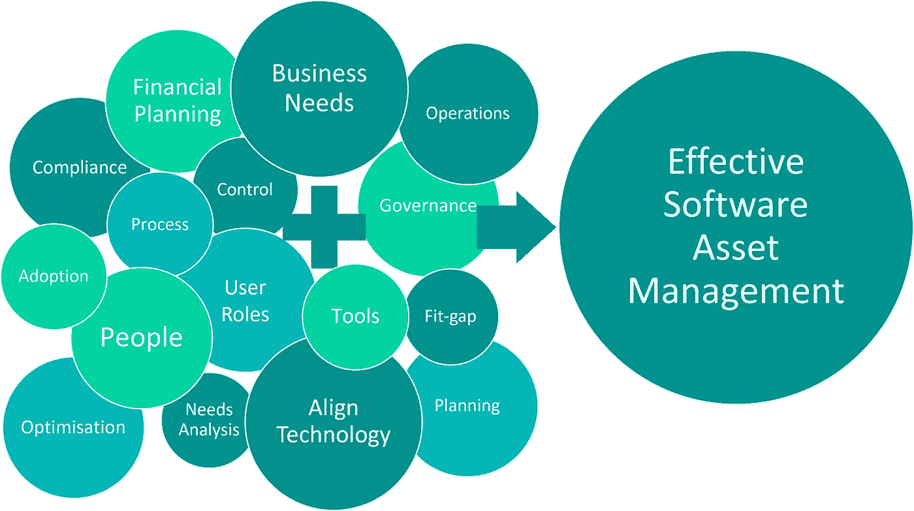

# 使用有效的软件资产管理来管理微软 CSP 价格上涨。

> 原文：<https://medium.com/version-1/using-effective-software-asset-management-to-manage-microsoft-csp-price-increases-1976eea57271?source=collection_archive---------6----------------------->

价格上涨当然是有影响的，但是我认为重点还应该放在现实情况上，以及客户将如何继续从他们的微软投资中获得增加的价值，因为实际上价格相对下降了。所以，这是我对微软最近的声明的看法。

*(*[*)https://www . Microsoft . com/en-GB/Microsoft-365/blog/2021/08/19/new-pricing-for-Microsoft-365/*](https://www.microsoft.com/en-gb/microsoft-365/blog/2021/08/19/new-pricing-for-microsoft-365/)*)*

**Office 365 的演变**

自 10 年前推出 Office 365 以来，微软已经采用了一套基本的基线产品和服务(在线电子邮件、云存储、Office 应用程序)，并不断发展、增强和扩展该产品。

它现在包括 24 个额外的应用程序和服务以及 1400 多个新功能，包括微软团队、PowerApps 和 Azure 虚拟桌面。

这一切都旨在通过运营成本模型提供难以置信的价值，使您能够有效地选择不同的产品集(订阅)并使其与特定的用户角色、角色和业务需求保持一致。

**微软的数字愿景**

微软云解决方案提供商(CSP)经销商渠道由微软建立，旨在通过有效规划、部署和交付合适的技术来满足您的需求，从而帮助组织最大化其订购投资回报，并实现真正的收益。

这是通过专业合格的微软 CSP 合作伙伴和客户之间的直接关系实现的，并朝着实现微软的愿景发展和成熟:

*“通过简化的数字客户协议、整合的管理门户以及增强的发票和成本管理功能，让客户更轻松地购买和管理云服务，从而帮助客户实现数字化转型。”*

[https://www . Microsoft . com/en-GB/licensing/news/MCA _ with _ support _ from _ partners](https://www.microsoft.com/en-gb/licensing/news/mca_with_support_from_partners)

随着微软 10 年来首次公开宣布提高订购价格，微软 CSP 经销商的真正价值和价值现在必须凸显出来，并有证据证明。

一种简单的观点可能是认为价格上涨只是其中一件事，或者更愤世嫉俗地说，是可以预见的不可避免的，现在微软已经安全地建立了订阅模式，作为主要的购买行动。

价格变化对你来说意味着什么？

然而，一个更客观的观点可以通过观察细节和理解变化的背景以及这些变化对你的影响而形成。

从 2022 年 3 月起，新的价格上涨适用于现有的按月滚动 Office 365 和 Microsoft 365 订阅。这是什么意思？

实际上，从 2022 年 3 月起，如果现有客户不希望或无法承诺 12 个月内的固定订购量，将会增加业务成本。

但是，对于固定订购数量的年度承诺，与目前的订购费用相比，并没有增加。

这并没有消除客户保留增加或减少订阅的灵活性的能力，而这正是他们目前所受益的。

你们中的许多人将会有超过 12 个月的波动期；通过以预先增加的定价水平每年承诺业务所需的已知固定数量的订阅，然后按需添加订阅，并在所需的短期内以每月略高的成本添加订阅，仍然可以保持灵活性。这些订阅可以逐月删除，而不会受到惩罚。

2022 年 3 月的价格上涨将仅适用于消费时间少于 12 个月的套餐。

对于将一个、部分或所有 Office 365 和 Microsoft 365 订阅升级到更高的套件，也将保留完全的灵活性。

例如，为其用户订阅 Microsoft 365 E3 的客户可以随时免费将部分或所有用户升级到 Microsoft 365 E5 套件，以利用新增的可用产品和服务(即 Power BI、Microsoft 365 电话系统或增强的安全性和合规性特性和功能)。

**总结**

良好的软件资产管理的基本原则不会改变，但是也许将人的专业知识、有效的操作过程和交付与业务需求相一致的技术的能力相结合的重要性会变得更加重要。

回到微软 CSP 经销商向他们的客户展示价值这一点:交易订阅可能是企业对 CSP 合作伙伴的全部要求，纯粹是作为达到目的的一种手段。

然而，为了让你的企业获得最大的投资回报，你应该有效地计划产品和服务的变化和持续使用。此外，为了通过有效的许可和订阅协调、分配和采用来利用最佳优势，建议与具有理解、经验和专业知识的 Microsoft CSP 合作伙伴合作，帮助规划、交付和部署最有效的订阅和许可解决方案，以满足您当前和未来的业务需求。

作为[微软 CSP](https://www.version1.com/it-service/software-asset-management/microsoft-cloud-solution-provider/) 和[微软许可](https://www.version1.com/it-service/software-asset-management/microsoft-license-optimisation/)的专家，我们可以就 CSP 是否适合您的业务为您提供建议和指导，并提供完整的 CSP 生命周期，以实现最佳的成本管理和许可证合规性。[如果您有任何问题，请联系我们](https://www.version1.com/contact/)或访问我们的[网站](https://www.version1.com)了解更多信息。

**关于作者** 威廉·尼尔森是微软 SAM 第 1 版的销售专员。

