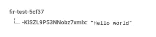

# 使用 Firebase 作为实时系统

> 原文：<https://medium.com/google-developer-experts/using-firebase-as-a-real-time-system-d360265aa678?source=collection_archive---------1----------------------->

I was captivated by exposed pictures since I was a child. Is a unique way to capture movement in a static image.

一年多以来，我一直是 Firebase 的忠实用户。当 Parse.com 宣布它将关闭时，我正在山景城作为导师参加谷歌的发布会。如果你没有听说过[谷歌发射台](https://developers.google.com/startups/)，它们非常棒。不仅是对初创公司，他们从不同领域(UX、科技、营销、货币化和融资……)的人那里获得了大量的建议和指导，对导师本身也是如此！除了了解世界各地顶尖的创业公司在做什么并帮助他们之外，我们还可以相互交谈，直接了解其他人正在经历的事情。它重组了一个摇摆不定的聚会，知识是交换的货币。这一直是那些你早早醒来并兴奋不已的事件之一，只是想到要和你前一天遇到的所有人继续联系。

没关系，我记得在 Parse 关闭后，有很多关于 Firebase 及其未来的讨论。知道 Firebase 能够做什么，我无法想象 Parse(一个旨在占据相同空间的竞争对手)为什么不成功。在我们的小宇宙中，我们总是有偏见，作为开发人员，我们最初的想法是“如果 IT 执行得这么好，为什么他们会有麻烦？”。你与属于其他宇宙的人合作得越深入，你就越意识到你需要在不同的领域取得成功。我不确定 Parse 失败在哪里，但事实是它的失败为 Firebase 的成功铺平了道路。

我每周一都会在我的推特账户上发布一项民意调查。他们的目的不是代表对我的追随者的科学和细致的分析，而是作为一个有趣的活动和对我大脑的锻炼(每周提出一个非无意义的问题比你想象的要难！).我最近写了关于 T4 的文章。无论如何，作为一个 Firebase 爱好者，我认为询问一下投票参与者与 Firebase 的关系是有意义的(我也从我参加的许多社区活动中知道 Firebase 并不那么出名)。我得出了这个结果:

从定义上来说，Twitter 民意调查不能遵循一种科学的方法，但我想知道有多少投票支持最新选项的人确实知道 Firebase，并选择不使用它。在那一刻，我意识到有多少人没有意识到一种工具的潜力，这种工具肯定可以提高他们开发软件的水平。

## Firebase 实时数据库

本文的目的并不是提供 Firebase 所有特性的详细概述，因为已经有大量资源可以帮助您实现这一目标。我可以特别向你推荐他们的 [YouTube 频道](https://www.youtube.com/user/Firebase/playlists)，看起来很酷，比其他选项更具互动性。本文将向您解释如何使用 Firebase 来开发使用实时数据库的实时系统。

当您开始使用 Firebase 时，您很快就会在浏览器中看到这个图表:

Firebase 有一系列产品可以在三个领域帮助你:**成长**、**盈利**和**发展**。在这个最新的小组中，有一个叫做实时数据库的工具。这个数据库存储了 NoSQL 的信息(为了简单起见，把它想象成一个巨大的 JSON 文件)，托管在 Google Cloud 中。实时数据库的伟大之处主要由三点构成:

1.  它是实时的:在发送之前，没有对数据进行批处理和分组。当信息发生变化时，会在几毫秒内立即与云同步。
2.  离线处理:如果你是一个移动开发者，在线数据同步是一件事。谷歌专家 Dan Lew [写了他们如何在 Trello](http://blog.danlew.net/2017/02/14/airplane-mode-enabling-trello-mobile-offline/) 实现这一点，你可以想象这不是一个简单的问题。您不必担心同步或冲突解决，Firebase 会为您做到这一点。
3.  Automagic 同步:设备可以订阅数据库的各个部分，并在数据库被更改时自动检索所需的数据。不再需要拉动和刷新。

Firebase 实现这一点的神奇之处还在于代码的简单性。你不需要花时间编码。这可以在几分钟内实现。

为了简单起见，本教程将提供 Android 的代码。如你所知，Firebase 确实为 iOS 和 web 提供了同样简单的 SDK。让我们看看(撇开应用程序的配置和设置不谈)我们如何在实时数据库中写一个值(RTD 从现在开始)

如果我们在客户端执行这段代码，RTD 将反映其结构的变化:

借助 Firebase，我们还可以将节点推入我们的 RTD。这样，RTD 会生成一个唯一的密钥:

这也在 RTD 创建了结果，这次使用一个惟一的键作为 ID:

我之前提到过，无论 RTD 中的数据发生了什么变化，应用程序都会收到通知。使用下面的代码，我们将订阅指定节点(在本例中是节点“message”)中更改的任何值:

正如您在以下视频中看到的，当值发生变化时，应用程序会自动收到通知:

我们现在有一些代码片段和一些基本的基础知识。RTD 的第一个方法是“酷，一个我可以存储数据并与其他设备共享的数据库”。但是还有更多事情可以做。

您可能会从这里得到一些关于如何节省时间和资源的想法，以便用 Firebase 实现一个实时系统。我们如何创造性地利用这一点？

## 使用 Firebase 进行实时聊天

实施聊天可能会很困难。我记得我的第一次尝试是在大学里实现一个 Jabber 客户端，当时在我看来这是一个非常复杂的任务。随着时间的推移，不同的协议出现了。XMPP 始终是一个可以使用的明确候选，在探索它的过程中，我一直认为它过于复杂，并且随着研究的深入，它有一些局限性。无论选择哪种方案，这都是一项需要付出巨大努力的任务。

如果你一直在读这篇文章，你可能已经得出了自己的结论:用 Firebase 实现这一点可能很容易！幸运的是，事情会变得更加容易。Firechat 是一个基于 Firebase 的开放实现。它可能不完全是你正在寻找的，但如果你想快速原型化一些东西来检查你的商业想法的假设，它绝对是一个很好的选择。

## 带有实时位置的地图

在我以前的公司，我不得不面对的任务之一是实现一个实时地图来显示两个设备的位置，这两个设备不断更新对方(想想类似优步的东西)。当时的任务也很乏味。我们当时采用的解决方案是一个 MQTT 服务器，它接收来自两个设备的更新，做出一些服务器端的决定，然后根据需要从各自的对应伙伴更新设备的位置。尽管结果很好，但我总是想到采用的解决方案，并希望能有更有效、更简单的方法。我希望我当时能知道 Firebase。

您也可以想象用 Firebase 实现这一点相对容易。几年前，Blablacar 的网络工程师 Matthieu Moquet 写了一篇关于如何做类似于[的文章。虽然 Firebase 可能有一些限制(显然可以实现的服务器逻辑是有限的)，但我认为这是一个非常棒的原型工具，这是软件开发最重要的阶段之一。](https://moquet.net/blog/realtime-geolocation-tracking-firebase/)

此外，Firebase 为此创建了一个名为[地火](https://github.com/firebase/geofire)的库！这个库也是开源的，并且简化了创建你自己的位置感知应用的过程。

## 等级

用过游戏吗？我过去和现在都是这样做的，其中一个基本要素是设计一个排名，可以根据每个玩家的位置或其他特征进行过滤。

有了 Firebase，这也很容易做到。想象一下一个 RTD，其中存储了每个用户玩过的游戏和总积分排名，每次用户得分时都会更新。

**进一步的想法？**

我相信这只是 RTD 在 Firebase 中能为您做的事情的一个小小的介绍，许多其他人也可以从它提供的实时功能中受益。如果你在这个话题上钻研得更深，我绝对推荐你查看下面这个关于 [Firebase Security](https://www.youtube.com/watch?v=PUBnlbjZFAI) 的视频，它将教你如何为用户创建角色和规则，以确定他们可以访问哪些内容。

编码快乐！

我在我的[推特账户](https://twitter.com/eenriquelopez)中写下我对软件工程和生活的想法。如果你喜欢这篇文章或者它确实帮助了你，请分享它，喜欢它和/或留下评论。这是给业余作家加油的货币。