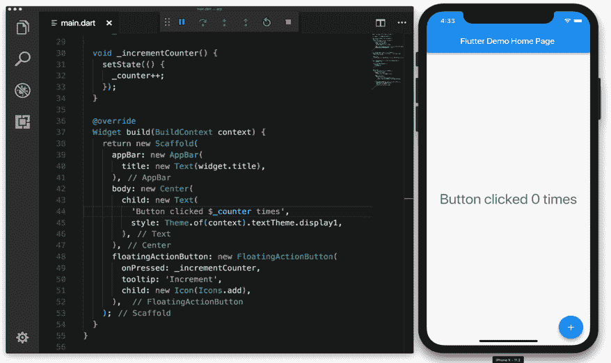

# 在下载量达到 20 万次的真实应用程序中使用 Flutter

> 原文：<https://medium.com/google-developer-experts/using-flutter-in-a-real-life-application-with-100k-downloads-ab64ecd8e03f?source=collection_archive---------0----------------------->

我已经使用 Flutter 运行了 6 个月的真实世界服务，所以我认为这是一个写下我们为什么选择 Flutter 的背景和它的印象的好时机。

*原文在* [*日文*](https://note.mu/najeira/n/n8924408dd07b) *。本文由*[*@ locker 5*](https://twitter.com/locker5)*翻译。感谢翻译！*

# 关于我们的应用

我们公司正在为汽车爱好者提供一项名为 CARTUNE 的服务(仅在日本提供)。下面是该应用程序的一些截图。

带有红色工具栏的截图是 Android 版本，带有底部标签的是 iOS 版本。这里的截图都是在安卓机上拍的(切换标志为 iOS 截图)。

链接到 Techcrunch JP 上的新闻:[创造者的下一个挑战“汽车”社区“CARTUNE”的“MixChannel”筹集了 1.1 亿日元](http://jp.techcrunch.com/2018/01/10/michael-cartune/)

# 讨论要点和选择的理由

我决定使用支持 Android / iOS 的跨平台开发 SDK 进行快速开发。虽然我有同时为 Android / iOS 开发的经验，但对于少数人来说，分别为两个操作系统开发仍然很难。

我当时复习了一下 Flutter / React Native / Xamarin，最终选择了 Flutter，但是有几点我们考虑的如下。

## 语言(Dart)

Flutter 使用 Dart 编写代码。这种语言给人的第一印象就像 Java。它是静态类型，由于支持 *async / await* ，编写异步流程似乎很容易。

就我个人而言，我不想写 JavaScript …所以我认为 Dart 是个不错的选择。

我觉得 Xamarin 用的 C #也是一门不错的语言。

## 表演

至于性能，我没有看到任何 SDK 有任何问题。

Flutter 编译成原生 ARM 代码，适用于 Android / iOS。我也试用了颤振团队的颤振图库，感觉性能上似乎没有问题。

React Native 的 UI 来自原生操作系统，但我有点担心有一部分 JavaScript 正在运行。嗯，就实际应用而言，我没有发现任何性能问题，所以性能似乎不是问题。

Xamarin 在 iOS 上原生编译，但在 Android 上似乎运行在 Mono VM 上(如果是原生编译，我会对它做更多的研究……)。

## 内置部件

Flutter 在框架本身上支持各种各样的 UI 小部件。

React Native 和 Xamarin 使用原生 UI(对吧？).

由于这一点，Flutter 在与 UI 相关的操作系统之间没有区别(在 Android / iOS 中，有一些地方的行为和外观被 Flutter 故意改变了)，我们希望看到我们会因操作系统之间的差异而受到影响的情况会减少。

## 生态系统

当我做研究时(2017 年夏天)，没有很多图书馆等。对于 Flutter 来说，情况是我需要在需要的时候实现自己。然而，Flutter 的窗口小部件非常丰富，实现 UI 似乎没有什么特别的问题，因为它只是将它们组合起来(直到现在这还是真的)。

React Native 有很多开发人员在使用它，拥有大量的库是非常有吸引力的。

对于 Xamarin，我有一段回忆，很久以前当我试图用它做一个小应用程序时，我在 NuGet 努力奋斗过，但我不知道细节。

## 连接到本机代码

我考虑过那些需要一个不能用 Flutter 来编写的特性的情况，以及是否可以通过编写 OS 本地代码来解决。

在 Flutter 上，需要从平台端调用平台特定的函数(如摄像机和位置信息)。在这些情况下，可以通过平台本地语言(Android 的 Java，iOS 的 ObjC / Swift)实现该特性。对于这些情况，这与在平台标准上开发是一样的，因此您可以使用世界上任何可用的库。

还有，从平台原生的角度来看，Flutter 本身只是一个全屏显示的单视图(Flutter UI 是 GPU 通过这个视图绘制的)。我试着安装并确认是否可以使用 Flutter 和 platform 原生 UI one screen，就像一个混血儿。我了解到最好不要使用这种混合方法，我们没有在我们的产品中使用它。我刚刚确认它确实有效。

当这变得不可避免时，对我们来说很重要的一点是，总有一种方法可以通过以类似 RPC 的方式从平台端调用代码来实现任何东西。

# 我的印象

## 构建用户界面

Flutter 通过在 Dart 中创建一个小部件树来定义 UI。这很舒服。既然是写成代码，就很容易根据条件切换 UI。

由于 Flutter 完全控制了用户界面，我没有任何与操作系统差异相关的问题。一些用户界面在 Android / iOS 上有不同的默认值(即工具栏居中(iOS)、左对齐(Android)、屏幕过渡的过渡等)。)以便它将接近每个平台标准的外观和行为，但是您可以通过显式指定选项来统一它们。

Flutter 提供了各种各样的小部件，UI 可以通过它们的组合来创建，因此不需要第三方 UI 库来实现这个目的。

## 热重装

官方声明的“快速热装”是真实的，没有任何夸张。你可以在不到 1 秒的时间内重新加载。

From the Flutter official page

该应用程序可以在不到 1 秒的时间内重新加载，不仅适用于小样本，也适用于尺寸体面的实际产品。除了布局，您还可以在编辑逻辑时重新加载，同时保持状态。在某些情况下，需要完全重新加载，状态将被清除，但在我们的应用程序中，完全重新加载只需 2 秒左右。

在版面和风格上做一点小调整后再装就很方便了。这有助于调整设计，一点一点地构建 UI。因为一开始很难想象小部件树的输出，所以我相当频繁地重复重新加载。

# 开发效率

这取决于您计划构建的应用程序，但我认为您可以使用 Dart 为 iOS 和 Android 共享 50–80%的代码。

在 CARTUNE 中，图片编辑功能在平台端实现(Android 是意图，iOS 是照片，OpenCV 中检测车牌)。再比如 Twitter 等 SDK 联动也是通过插件机制在平台端实现的。其他部分使用 Dart 在 Android / iOS 版本之间共享。由于我们的代码中有相当大的一部分与图像编辑有关，所以大约 70%的代码都在 Dart 中，并在操作系统之间共享。

我认为在单一代码库中编写 UI 和逻辑的能力是一个很大的优势。

这取决于个人的技能，可能我的观点不是很有帮助…但我有个印象，如果分别开发两个 OS 的成本是 100 (Android 35，iOS 65)，那么 Flutter 的成本在 30–50 左右。(这是我根据自己的经历得出的个人印象)。

## 问题

由于 Flutter 还在开发中，所以可以看出一些问题。在撰写本文时，GitHub 中已经注册了 2000 多期。我自己也遇到过几个 bug，发了拉请求。

当然，由于开发是活跃的，问题会被修复，特性会被改进，所以你可以期待随着时间的推移会变得更好。

由于它仍处于测试阶段，我认为当你的项目发展到一定规模时，你会遇到某种错误。稳定性方面，我觉得离平台原生开发的水平还是有点远(其他跨平台 SDK 我没对比过)。

缺乏信息也是一个问题。官方网站和文档非常丰富，官方示例应用程序也是一个很好的例子。即便如此，仍有部分缺失。

就我而言，当我在使用 Flutter 时遇到麻烦时，我通读了 Flutter 内部的代码。Flutter 的 UI 框架也是用 Dart 编写的，所以很容易通读。当我不确定小部件的用法或对特定行为有疑问时，我会阅读 Flutter 中的实际代码。

当你在 [StackOverflow](https://stackoverflow.com/questions/tagged/flutter) 上写下这个问题时，你也可以期待谷歌员工的回应。我也通读了那里的问题。Flutter 团队还运营着[谷歌集团](https://groups.google.com/forum/#!forum/flutter-dev)和 [Gitter](https://gitter.im/flutter/flutter) ，但我并没有积极关注它(因为我并不关注流动系统的太多信息)。

## 谁看到了好处，谁没有

那些 UI 构建占了大部分工作的应用程序，将会看到 Flutter 带来的巨大好处。那些需要大量面向设备的功能(例如，相机)的应用将会减少。

不适合将框架合并到现有的应用程序中。Flutter 允许您转换到平台原生屏幕。不过好像还是以 Flutter 屏幕为核心比较好，把平台原生屏幕/功能一气呵成就行了(拿相机拍照，在 WebView 上显示通知屏)。

它也不是用于游戏的(它首先不是一个游戏引擎)。

在以下情况下，它似乎适合与颤振。

## 样机研究

*   通过热重新加载，可以很容易地迭代微调行为和外观。
*   由于小部件树的概念类似于 HTML DOM，所以设计者更容易加入讨论。

## 从头开始开发新应用

*   可以从一开始就应用 Flutter(不建议在现有 app 的小部分使用 Flutter。)
*   你可以很快开始考虑避免 Flutter 错误的解决方法。
    —我们构建该功能时不支持视频(现在已存在)，我们使用平台原生屏幕并播放视频。
    —换行时文字形式有点不稳定，我们选择了使用平台原生屏。

## 关于建立用户界面的应用程序

*   像新闻或 Twitter 这样的应用程序喜欢内容。

# 结论

由于 Flutter，我们的团队能够快速开发支持 Android 和 iOS 的应用程序。开发效率高，我很满意。稳定性仍然是一个问题，但社区非常活跃，我希望每天都能看到改善。(当然我也会有所贡献)