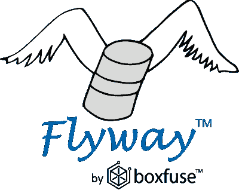
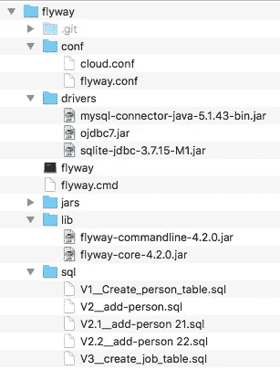

# 使用 Flyway 管理云中的 Oracle 数据库版本

> 原文：<https://medium.com/oracledevs/using-flyway-to-manage-oracle-db-versions-in-the-cloud-86e3173080ad?source=collection_archive---------1----------------------->

这是我关于作为敏捷开发的一部分管理数据库脚本/模式的系列文章中的另一篇。在过去，我展示了如何使用简单的 SQL(T1)和 liqui base(T3)来管理模式创建/填充脚本，今天我将展示如何使用 Flyway。

[Flyway](https://flywaydb.org/) 是一个免费的[开源](https://github.com/flyway/)解决方案，用于管理“数据库迁移”——或者基本上通过跟踪和应用对模式结构和数据的更改来帮助你保持多个数据库同步。

Flyway 使用简单的 SQL 脚本——这意味着您可以使用特定于数据库的语法——并通过它维护的表跟踪它们在数据库中的执行。它很容易上手，只有 6 个命令需要你熟悉。

主命令是“ **migrate** ”，它将检查您的数据库状态，然后运行尚未在该实例上运行的所有较新的脚本。

Flyway 使用一个目录结构，其中包含一个 sql 文件夹，您可以在其中存放所有的 SQL 脚本。它使用一种命名约定(可以调整),即以版本号(V1，V1.1，V2.1)开始文件名，然后是两个“_”，后跟一个描述，因此当您发出“ **info** ”命令来查找数据库的状态以及哪些脚本已经运行时，类似于 V1__Create_Emp_Table 的内容将显示为“创建 Emp 表”。顺便说一句，info 命令还将显示哪些新脚本将在特定的数据库实例上运行。

在下面的视频中，我将展示如何配置和使用 Flyway，以及如何利用 [Oracle 开发者云服务](https://cloud.oracle.com/developer_service)将其集成到自动开发运维流程中。(包括任务跟踪、源代码的 Git 版本管理和脚本的构建执行)。

Flyway 可以与各种构建框架(ant、maven、gradle 等)集成，但是由于许多 DB 人员不熟悉这些框架，所以我选择在我的演示中使用简单的命令行来调用 Flyway。在我的笔记本电脑和本地 MySQL 数据库上，我只使用了 Flyway 命令行实用程序。因为默认情况下，Flyway 没有安装在 DevCS 服务器中，所以我做了一点小技巧:

flyway 是一个 Java 程序，所以在我的 DevCS Git 存储库中，我上传了 Flyway 目录以及 Flyway 和 JDBC 驱动程序所需的 jar。然后，我查看了调用命令行的脚本，找到了他们使用的 Java 命令，并将其复制到我的构建中的常规 shell 命令中:

**Java-CP lib/flyway-command line-4 . 2 . 0 . jar:lib/flyway-core-4 . 2 . 0 . jar org . flyway db . command line . main info-user = fw-Password = $ Password-URL = JDBC:Oracle:thin:@ IP address:1521/service name**

$Password 引用一个加密的构建参数。

我的 Git 中的目录结构和文件如下图所示:

*原载于 2017 年 10 月 19 日*[*【blogs.oracle.com*](https://blogs.oracle.com/shay/using-flyway-to-manage-oracle-db-versions-in-the-cloud)*。*