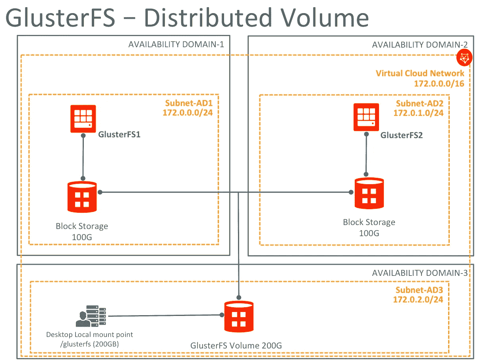
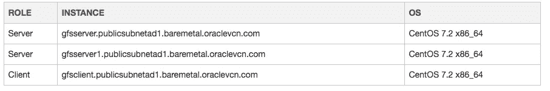
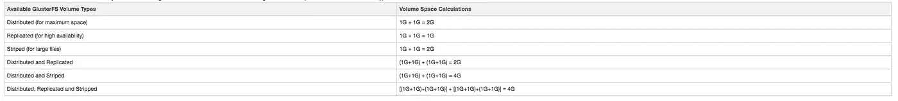
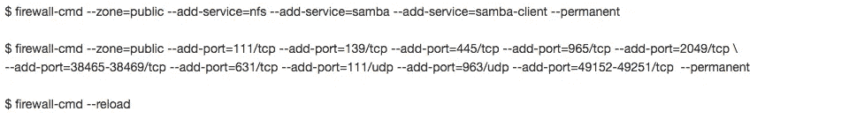

# 在 Oracle 云基础设施上使用 GlusterFS

> 原文：<https://medium.com/oracledevs/using-glusterfs-on-bare-metal-cloud-services-ee34e90458cf?source=collection_archive---------0----------------------->

本教程描述了使用分布式 Glusterfs 卷在 Oracle 裸机实例上部署高可用性 GlusterFS 存储环境的步骤。

正如在 [GlusterFS 公共文档](https://gluster.readthedocs.io/en/latest/Quick-Start-Guide/Architecture/)中所解释的，您可以使用不同类型的 GlusterFS 卷，在进行初始配置之前，首先了解它们是很重要的。本教程演示了如何在一个 CentOS 7 客户端访问的两个裸机实例上使用分布式 GlusterFS 卷。

至于 Oracle Cloud Infrastructure (OCI)上的配置选项，您可以将所有 GlusterFS 资源保存在单个可用性域(AD)中，或者使用所有 AD，如下所示。根据网络流量利用率，您应该考虑将所有 GlusterFS 资源放在一个 AD 中，或者使用跨所有可用性域的分布式选项来实现容错。确保在您的设置中添加了 Gluster 复制卷选项，这是为避免数据丢失和生产环境而建议的。除了使用复制的 GlusterFS 卷进行容错(分布式和复制卷)，您还应该启用 [GlusterFS 垃圾转换器](http://gluster.readthedocs.io/en/latest/Administrator%20Guide/Trash/)和[快照](http://gluster.readthedocs.io/en/latest/Administrator%20Guide/Managing%20Snapshots/)来帮助您恢复文件(如果需要的话)。

这是一个可以在 OCI 上使用的 GlusterFS 架构的例子

# 什么是 GlusterFS？

Gluster 是一个分布式横向扩展文件系统，允许根据您的存储消耗需求快速配置额外的存储。它将自动故障转移作为一项主要功能。所有这些都是在没有集中式元数据服务器的情况下完成的。

# 入门指南

首先，本教程基于 CentOS 7 文章上的 [GlusterFS 存储集群。其次，对于此设置，您需要创建至少三个 Oracle 裸机实例；两个实例将用于保存分布式 GlusterFS 卷，第三个实例作为 GlusterFS 客户端，具有指向 GlusterFS 卷的本地挂载点。作为本教程的一个可选步骤，您可以创建两个 100GB 块卷，并将它们连接到每个 GlusterFS 服务器(两个 GlusterFS 服务器，两个 100GB 块卷)，稍后将使用它们来创建一个 200GB GlusterFS 卷，如上图所示。](https://wiki.centos.org/HowTos/GlusterFSonCentOS)

# 环境

# GlusterFS 服务器安装

选择软件包来源:CentOS Storage SIG 或 Gluster.org。本文介绍了如何使用 CentOS Storage SIG 软件包

$ sudo yum 搜索中心-发布-gluster

$ sudo yum install centos-release-gluster 310 . no arch

在两个存储集群节点上安装 GlusterFS 服务器和 Samba 包。

$ sudo yum install glusterfs-server samba–y

# XFS 砖

如果您的环境已经准备好了 XFS 砖(分区)，请跳过这些可选步骤。对于本文，您将使用/dev/sdb 设备，这是您之前创建的 100GB 附加块卷，如上所述。根据当前配置，如有必要，请更改设备名称。现在，为两个集群节点上的 XFS 砖块创建砖块 1 逻辑卷，如下所示

$ sudo pvcreate /dev/sdb

$ sudo vgcreate VG _ g luster/dev/sdb

$ sudo LV create-L 100000m-n brick 1 VG _ g luster

设置 XFS 文件系统:

$ sudo mkfs . xfs/dev/VG _ g luster/brick 1

创建一个挂载点并挂载 XFS 砖块:

$ sudo mkdir -p /bricks/brick1

$ sudo mount/dev/VG _ g luster/brick 1/bricks/brick 1

插入下面一行，扩展/etc/fstab

/dev/VG _ g luster/brick 1/bricks/brick 1 xfs 默认值，_netdev，nofail 0 0

重要注意事项:正如在 [Oracle Bare Metal 公共文档](https://docs.us-phoenix-1.oraclecloud.com/Content/GSG/Tasks/addingstorage.htm?Highlight=_netdev)中所述，当在 linux 实例块卷上连接 iSCSI 时，在/etc/fstab 中的每个非根块卷上包括“_netdev”和“nofail”选项是很重要的，否则实例可能无法启动，因为操作系统会在 iSCSI 启动器启动之前尝试挂载卷。

例如,/etc/fstab 中的单个卷可能如下所示:

/dev/sdb /data1 ext4 默认值，noatime，_netdev，nofail 0 2

如果在 fstab 中没有这些选项的情况下重新启动，实例将在下次重新启动后无法启动。处于这种状态的实例是不可恢复的。

# 可信池(存储群集)

在两个节点上启用并启动 glusterfsd.service:

$ sudo systemctl 启用 glusterd.service

$ sudo system CTL start glusterd . service

端口 TCP:24007–24008 是 GlusterFS 节点之间通信所必需的，每个模块都需要另一个始于 24009 的 TCP 端口。

在防火墙上启用所需的端口:

您还需要在 BMCS 仪表板上打开端口 24007–24008。您需要编辑 VCN 安全列表，或者打开裸机内部网络(非公共网络)的所有端口，如下所示

网络 172.0.0.0/16

资料来源:172.0.0.0/16

IP 协议:所有协议

允许:所有端口的所有流量

或者只打开内部网络所需的 24007–24008 端口。这里有一个例子:

资料来源:172.0.0.0/16

IP 协议:TCP

源端口范围:所有

目标端口范围:24007–24008

允许:端口的 TCP 流量:24007–24008

现在，使用 gluster 命令连接第二个 GlusterFS 节点，并创建一个可信池(存储集群)。

$ sudo gluster 对等探测器 gfsserver1

同行调查:成功

验证集群对等:

$ sudo gluster 同级状态

对等方数量:1

主机名:gfsserver1

uuid:955326 ef-fb6f-4d 51–8c2a-9166 B7 D3 b5 f 8

状态:集群中的对等方(已连接)

# 高可用性 GlusterFS 卷

GlusterFS 卷与 Gluster 文件系统一起工作，Gluster 文件系统是 XFS 砖块的逻辑集合。下表显示了卷类型和大小之间的依赖关系:

注意:对于生产环境，出于安全原因，建议使用分布式 GlusterFS 卷和复制选项。

现在，打开防火墙上所需的端口。请记住，GlusterFS 卷中的每个砖块都需要一个始于 24009:

$ sudo firewall-cmd-zone = public-add-port = 24009/TCP-\-permanent

$ sudo 防火墙-cmd -重新加载

注意:如果您没有打开内部网络的所有端口，也需要在 BMCS 仪表板上打开相同的端口。

在两个节点上使用/bricks/brick1 XFS 分区创建一个高度可用的复制卷。首先在/bricks/brick1 挂载点中创建一个子目录。这对 GlusterFS 是必要的。

$ sudo mkdir /bricks/brick1/brick

创建一个分布式 GlusterFS 卷，仅在第一个节点(gfsserver)上运行这些命令

$ sudo gluster volume create glustervol 1 transport TCP GFS server:/bricks/brick 1/brick GFS server 1:/bricks/brick 1/brick

$ sudo gluster 音量开始 glustervol1

验证 GlusterFS 的音量

$ sudo gluster 音量信息全部

卷名:glustervol1

类型:分发

卷号:c 660712 f-29ea-4288–96b 6–2c 0a 0 c 85 a 82 a

状态:已开始

快照计数:0

砖块数量:1

传输类型:tcp

砖块:

brick 1:GFS server 1:/bricks/brick 1/brick

重新配置的选项:

运输.地址-家庭:inet

nfs.disable:开

# GlusterFS 客户

可以使用 GlusterFS Native Client(CentOS/red hat/Oracle Linux 6.5 或更高版本)、NFS v3(其他 Linux 客户端)或 CIFS (Windows 客户端)来访问 GlusterFS 卷。

为 Glusterfs/NFS/CIFS 客户端打开防火墙

注意:如上所述，相同的端口需要在 BMCS 仪表板上打开。

# 通过 GlusterFS Native Client 从另一台 CentOS 7 机器访问

默认情况下，所有必需的软件包都可以在 CentOS 7 基本存储库中找到。

安装 GlusterFS 客户端软件包:

$ sudo yum 安装 glusterfs glusterfs-保险丝附件

在客户机上挂载 GlusterFS 卷:

$ sudo mkdir /glusterfs

$ sudo mount-t glusterfs GFS server:/glustervol 1/glusterfs

$ sudo mount |grep -i glusterfs

GFS server:/glustervol 1 on/glusterfs type fuse . glusterfs(rw，relatime，user_id=0，group_id=0，default_permissions，allow_other，max_read=131072)

$ df -kh |grep glusterfs

GFS server:/glustervol 1 196g 65M 98G 1%/glusterfs

要使它在重启后永久存在，您需要在所有 GlusterFS Linux 客户机上的/etc/fstab 中添加下面一行

GFS server:/glustervol 1/glusterfs glusterfs defaults，_netdev，nofail 0 0

查看 [GlusterFS 公共文档](https://wiki.centos.org/HowTos/GlusterFSonCentOS)了解更多详情:

*   故障排除步骤
*   如何设置 Windows/Linux 机器通过 CIFS 访问 GlusterFS 卷

*原载于 2017 年 6 月 28 日*[*【community.oracle.com】*](https://community.oracle.com/people/Gilson+Melo-Oracle/blog/2017/06/28/glusterfs-on-bare-metal-cloud-services)*。*