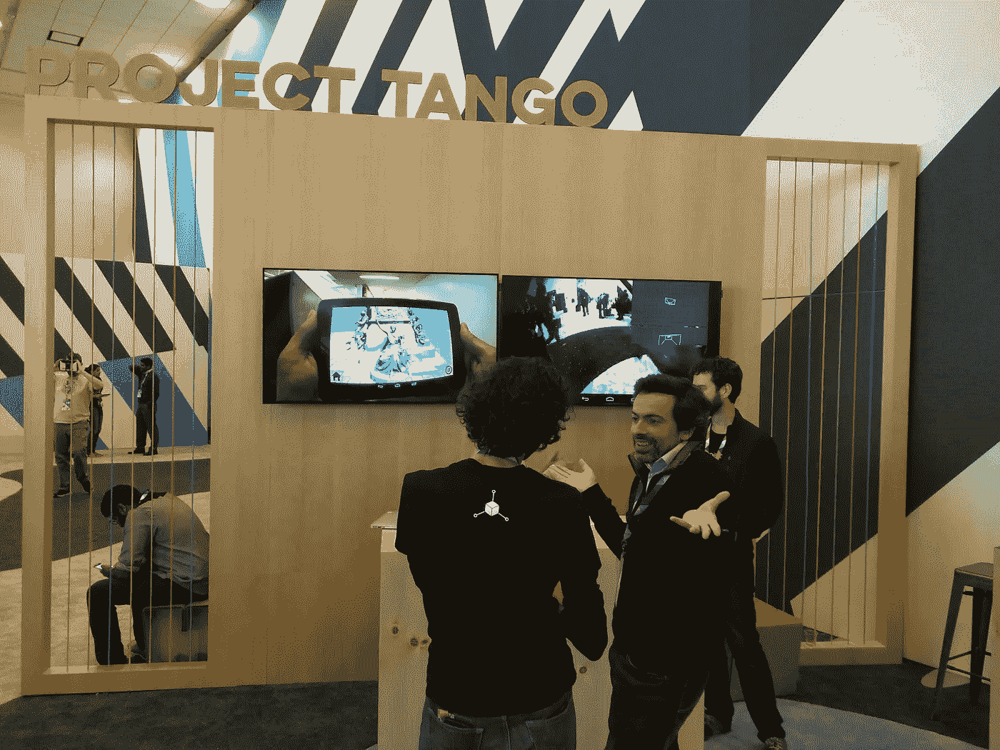
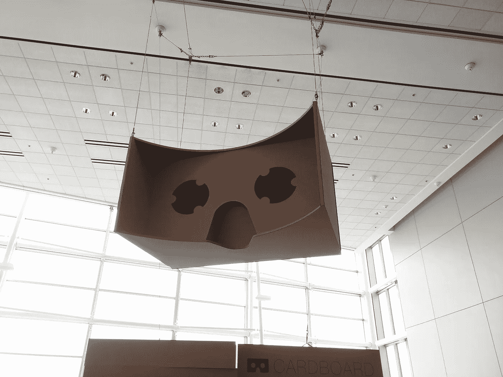
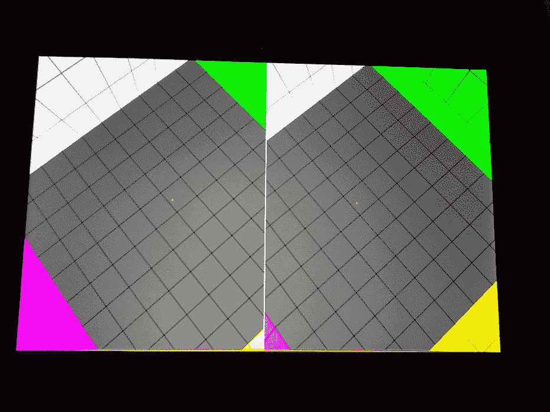
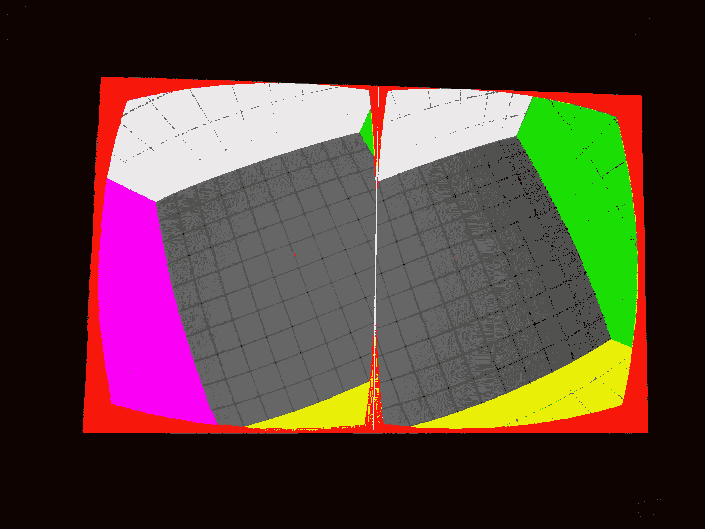
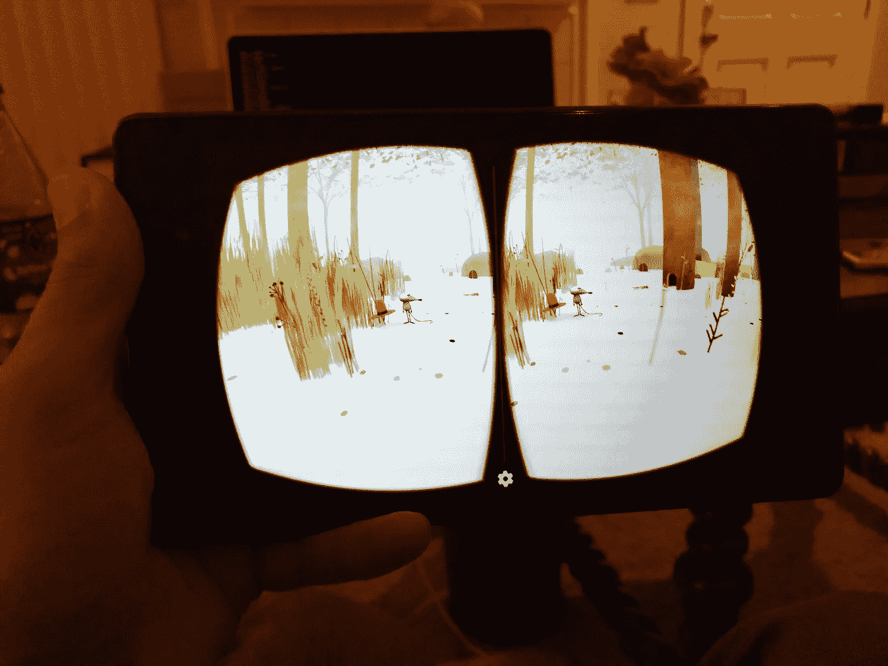

# 在不支持的虚拟现实浏览器上使用 Google Cardboard

> 原文：<https://medium.com/google-developer-experts/using-google-cardboard-with-unsupported-vr-viewers-95c17e65bc1?source=collection_archive---------0----------------------->

The Project Tango booth at Google I/O 2015

周六，我和一些朋友在 SFVR 项目 Tango Hackathon 虚拟现实博览会上闲逛。探戈舞团队已经分发了探戈舞设备和[杜罗维斯潜水 7](https://www.durovis.com/product.html?id=5) 虚拟现实面具供开发使用。我对谷歌输入输出和周围的聚会感到非常失望，但是[艾蒂安·卡隆](https://plus.google.com/u/0/+EtienneCaron/posts)和[达里奥·拉维尔德](https://plus.google.com/u/0/+DarioLaverde/posts)正忙着尽最大努力使用 Cardboard SDK 在 [Tango](https://www.google.com/atap/project-tango/) 上构建一些东西。他们都启动了演示，并立即发现了一个问题。设备或查看器的屏幕配置不正确。

Giant Cardboard hanging at Google I/O 2015

事实证明，Cardboard 需要一个通常由查看器制造商提供的配置，但是 Dive 没有提供。Etienne 注意到 Cardboard API 中没有任何与屏幕或查看器配置相关的文档。他和我开始调试调试器，试图找出我们是否能找到设置这些值的地方。我们追溯到 sdcard 上的一个文件，但当我们查看它时，我们意识到它是序列化的 protobuf 格式。我最初的想法是复制读取 protobuf 的文件并解码该文件，但是我们意识到有一种更简单的方法，即 [Cardboard 视图概要生成器](https://www.google.com/get/cardboard/viewerprofilegenerator/)。

艾蒂安和我生成配置文件，达里奥帮助我们测试。达里奥也在研究其他一些与纸板相关的问题。我们是这样做的:

1.  在您试图配置的平板电脑之外的电脑上访问 Chrome 的[视图配置文件生成器](https://www.google.com/get/cardboard/viewerprofilegenerator/)。
2.  在平板电脑上，在 Chrome 浏览器中，访问主页上显示的快捷链接。
3.  在平板电脑上，如果你的实例没有完全全屏(如果你能看到导航条)，从 Play Store 安装 [GMD 全屏沉浸式模式](https://play.google.com/store/apps/details?id=com.gmd.immersive)。
4.  在查看器中安装手机/平板电脑。
5.  回到电脑上，点击“继续”。
6.  使用该工具，您可以动态配置视图设置。平板电脑屏幕与工具同步，因此更改应该会实时显示在平板电脑上。(它用的是 Firebase！)
7.  遵循每个字段上的说明，并观察屏幕上的变化。你可以调整它们，直到你有一些看起来不错的东西。这是我生成的的[配置。](http://google.com/cardboard/cfg?p=CghHREVzUm9jaxIJVGFuZ29EaXZlHRKDQD0lpptEPSoQAABsQgAA8EEAAFxCAABYQlgBNSlcDz06CHsULj4K1yM-UABgAg)
8.  接下来，您应该能够生成您的个人资料。
9.  在你的 Cardboard 应用中，你应该可以在 Cardboard 的设置步骤中扫描二维码，或者进入设置。
10.  如果你在探戈上，你将需要通过一个额外的步骤，试图扫描二维码的相机不能正常工作，所以你将需要使用第二个设备。
11.  从第二台设备扫描后，插入安装了 adbinstalled 的电脑，运行以下命令:*ADB pull/SD card/Cardboard/current _ device _ params。/*
12.  然后，插入您的平板电脑，并推送您生成的配置:*ADB push current _ device _ params/SD card/Cardboard/current _ device _ params*
13.  启动平板电脑上的 Cardboard 应用程序，查看一下吧！
14.  如果需要调整，只需重复步骤 6-12。

Resizing appears in real time

Final config in profile generator

Same config running on Nexus 7

这是我生成的最终配置文件。