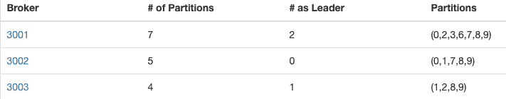
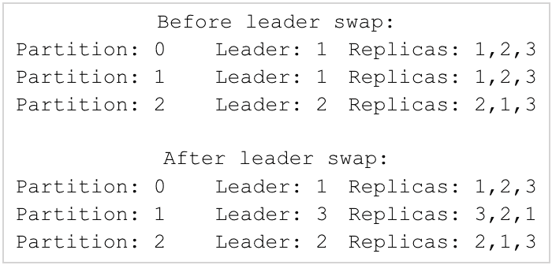
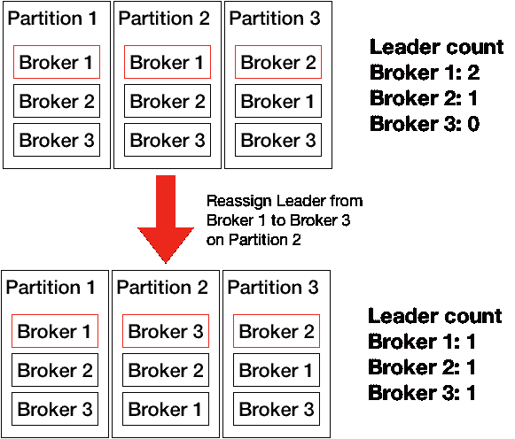
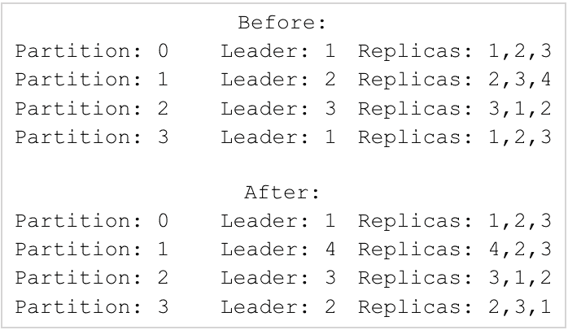
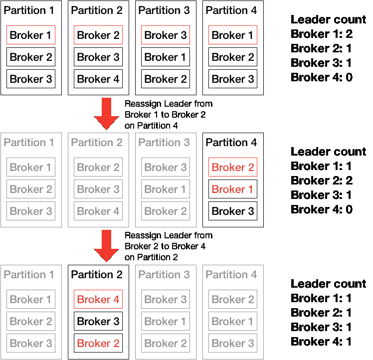
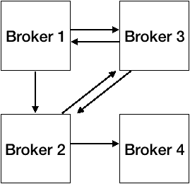
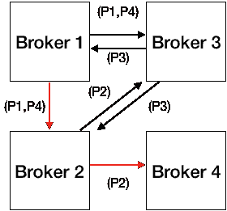

# 使用图算法优化 Kafka 操作，第 1 部分

> 原文：<https://medium.com/pinterest-engineering/using-graph-algorithms-to-optimize-kafka-operations-part-1-abbabd606a25?source=collection_archive---------2----------------------->

平-林敏|软件工程师，测井平台

Pinterest 全面使用 [Kafka](/pinterest-engineering/how-pinterest-runs-kafka-at-scale-ff9c6f735be) 进行数据移动。仅日志平台团队就管理着 3，000 多名 Kafka 经纪人，每天传输数万亿条消息，帮助超过 3.2 亿名每月活跃的 Pinners 获得创造他们热爱的生活的灵感。

测井平台团队开发了多种工具，以在如此规模的部署中保持操作顺畅。在本帖中，我们将分享我们如何利用图算法来有效地解决日常运营中的问题。这篇由两部分组成的文章涉及一些图论和流网络概念，你可以在这里和阅读更多关于[的内容。](https://en.wikipedia.org/wiki/Graph_theory#Definitions)

## **快速回顾一些卡夫卡的概念**

*   *在多个主题和分区上进行重新分配*，以改变副本代理的元素和顺序。仅改变同步副本的排序的重新分配不会导致额外的复制(即数据移动)，但是改变元素的重新分配需要在重新分配完成之前完整复制现有数据。
*   一个*优选副本领导选举* (PLE)操作将每个分区的领导设置为副本列表的第一个代理。如果所涉及的分区是完全复制和同步的，这将不会导致任何额外的数据移动。

查看阿帕奇卡夫卡的官方介绍。

## **不平衡的领导问题**

对于 Kafka 集群中的每个主题，每个代理的领导者的数量可能由于各种原因而随时间改变(例如，当增加主题的分区计数时，Kafka 将一些代理分配为多个分区的领导者，而其他代理根本没有领导者副本)。如果一个代理死亡，随叫随到的工程师可能会将副本移动到其他代理以恢复复制因子，这也可能会扭曲领导者的分布。如果过载的领导者由于提供比其他代理多得多的数据而达到网络或 CPU 极限，这种不对称可能会导致新的问题。

一个例子，经纪人之间的倾斜领导后，增加了一个主题的分区。

为了解决这个问题，我们提出了两种不同的图论方法，给出了以下假设:

1.  一个主题中每个分区的负载是一致的(也就是说，它没有偏斜)。在我们的用例中，这通常是正确的，但是如果使用了键控分区并且在主题中存在热键，这种情况偶尔会被违反。
2.  我们希望避免复制，只使用领导者交换，因为复制是一种昂贵的操作，会给已经超负荷的代理带来额外的负载。
3.  每个分区中的副本已经分布在不同的机架上，因此我们不需要考虑机架分布。

## **将领导者从过载的代理卸载到负载不足的代理**

解决代理过载问题的一个简单方法是(I)识别比平均负载更多的分区的领导者的代理，以及(ii)将一些过载领导者分区的领导交换给领导负载低于平均负载的追随者代理。这里有一个简单的例子:

如果过载的代理是带有负载不足的代理追随者的分区的领导者，这将会起作用。然而，通常情况并非如此，我们不希望将领导者从一个超载的代理换成一个平均负载的代理或另一个超载的代理。

假设一个主题的所有分区都具有相同的负载，因此只要平均负载代理的净领导者计数不变，我们就可以通过应用一系列领导者交换操作来移动领导者(将领导者从过载代理移动到中间代理，然后中间代理将另一个领导者交换到其他中间代理，最后到达负载不足的代理)。虽然这个过程看起来是一个连续的操作链，但在 Kafka 中只需一个重新分配和一个 PLE 就可以完成，这大大降低了操作开销。

那么我们如何应用这个“链交换”的概念呢？这就是图论可以帮助我们的地方。我们创建一个有向图，其中节点代表 Kafka 主题的代理，边从每个分区的领导者代理指向分区的追随者代理。对于上面的例子，我们有一个这样的有向图:

假设我们知道代理 1 有两个领导者，而代理 4 没有，我们想在有向图中找到一条从代理 1 到代理 4 的路径；这样的路径代表一系列交换操作。我们还希望最大限度地减少要执行的交换次数，因为领导者交换仍可能导致集群中出现峰值，因此我们正在寻找最短的路径。通过从代理 1 的节点应用[广度优先搜索](https://en.wikipedia.org/wiki/Breadth-first_search) (BFS)，我们可以找到到代理 4 的最短路径。

我们需要两次领导者互换:(I)从经纪人 1 到经纪人 2，以及(ii)从经纪人 2 到经纪人 4。我们应该在哪个分区内执行交换？在创建图形时，我们可以在边的属性中保留分区集(或使用多边)。然后，我们为路径中的每条边选择一个分区，并将该分区中的领导者从该边的源交换到目的地。在这种情况下，对于(I)我们可以选择交换分区 1 或分区 4，对于(ii)我们交换分区 2 的领导者。

这种链交换方法允许我们在不移动数据的情况下缓解主题内的偏斜，如果我们寻求标准的重新分配路线，这是不可避免的(如果主代理已经被抑制，情况可能会变得更糟)。然而，在实践中出现了一些问题。因为当我们执行操作时图形会改变，所以每次交换引线时我们都需要重新开始。我们一次只能带走一个领导者；当有多个不平衡的领导者时，我们必须找出哪些代理超载，哪些代理负载不足，然后遍历每一对源和目的地。当紧急需要重新平衡的事件发生时，这种试错过程仍然会给随叫随到的工程师带来开销，并且这种开销的最大根本原因是一次移动一个领导者的限制。有了 BFS，我们根本无法在同一张图表上同时协调多个领导者的互换。我们仍然需要一个更可行的再平衡方法。

在这篇文章中，我们描述了我们在运营工作中面临的 Kafka leader 平衡问题，并且我们推导出了一种基于图的方法来解决带有某些约束的问题。在下一篇文章中，我们将描述我们如何将问题转化为不同类型的图，即流网络，这使我们能够通过利用几十年来开发的强大优化算法，更好地解决多个经纪人的领导者平衡挑战。

> 请关注下周的第 2 部分！